# BÁO CÁO KHÓA LUẬN TỐT NGHIỆP — NĂM 2025
## TRƯỜNG ĐẠI HỌC CÔNG NGHIỆP THÀNH PHỐ HỒ CHÍ MINH (IUH)
### KHOA CÔNG NGHỆ THÔNG TIN — BỘ MÔN HỆ THỐNG THÔNG TIN

---

# LUMINA EMS — HỆ THỐNG TỔ CHỨC QUẢN LÝ SỰ KIỆN VÀ ĐẶT VÉ
*(Đề tài khóa luận tốt nghiệp ngành Hệ thống Thông tin)*

**Sinh viên thực hiện:** Hồ Nhựt Hào & Cao Hoàng Minh Cơ  
**Giảng viên hướng dẫn:** TS. Nguyễn Tấn Phước  
**Thời gian hoàn thành:** Tháng 5 Năm 2026  
**[TẢI XUỐNG QUYỂN BÁO CÁO ĐỀ TÀI FULL (PDF)](./Final_Q1.pdf)**

---

## ABSTRACT & TÓM TẮT ĐỀ TÀI

### ABSTRACT
**Topic:** Lumina EMS — Event Management & Booking Platform  
**Keywords:** system analysis and design, e-commerce, data analysis, database management, information security, API, real-time booking.  

Lumina EMS is a comprehensive full-stack event organization and ticket booking platform designed to digitize and optimize the entire event lifecycle. From initial B2B event proposals, contract negotiation, to B2C real-time ticket booking via interactive seatmaps and secure check-ins, the system caters to both B2B and B2C business models. Built using React, Node.js, GraphQL, Socket.IO, RabbitMQ, and powered by Google Gemini AI for business insights, Lumina EMS guarantees high performance, real-time responsiveness, and secure automated check-in flows.

### TÓM TẮT ĐỀ TÀI
**Đề tài:** Lumina EMS — Hệ thống tổ chức quản lý sự kiện và đặt vé  
**Từ khóa:** Phân tích và thiết kế hệ thống, thương mại điện tử, phân tích dữ liệu, quản trị cơ sở dữ liệu, an toàn thông tin, API, đặt vé thời gian thực.  

Lumina EMS (Event Management & Booking Platform) là một nền tảng full-stack toàn diện được thiết kế nhằm số hóa và tối ưu hóa toàn bộ quy trình quản lý sự kiện — từ khâu đề xuất ý tưởng, ký kết hợp đồng, bán vé trực tuyến, đến soát vé check-in tại chỗ. Hệ thống phục vụ đồng thời hai mô hình kinh doanh B2C (Khách hàng cá nhân chọn ghế trên sơ đồ thời gian thực, thanh toán, nhận vé điện tử QR Code và check-in soát vé) và B2B (Doanh nghiệp/đối tác gửi đề xuất sự kiện, ký kết hợp đồng số, đặt cọc & thanh toán, quản lý thư mời RSVP).

---

## LỜI CẢM ƠN
Em xin gửi lời cảm ơn chân thành và sâu sắc nhất đến **TS. Nguyễn Tấn Phước** - Giảng viên hướng dẫn trực tiếp của đề tài. Thầy đã tận tình chỉ dẫn, định hướng khoa học và đưa ra những nhận xét vô cùng quý báu trong suốt quá trình nghiên cứu, xây dựng và hoàn thiện đề tài khóa luận tốt nghiệp này.

Đồng thời, em cũng xin chân thành cảm ơn các Thầy/Cô trong **Khoa Công nghệ Thông tin - Trường Đại học Công nghiệp TP. Hồ Chí Minh (IUH)** đã trang bị cho em những kiến thức nền tảng vững chắc và tạo điều kiện học tập tốt nhất trong những năm học qua.

*Người thực hiện đề tài*  
**Hồ Nhựt Hào**

---

## MỤC LỤC BÁO CÁO (KLTN OUTLINE MAPPING)

- [**CHƯƠNG 1: GIỚI THIỆU CHUNG**](#chương-1-giới-thiệu-chung)
  - 1.1. Bối cảnh và lý do chọn đề tài
  - 1.2. Mô hình kinh doanh hệ thống (B2B & B2C)
  - 1.3. Danh sách chức năng chính của hệ thống
  - 1.4. Yêu cầu về hình thức trình bày và đóng bìa báo cáo (KLTN Style)
- [**CHƯƠNG 2: CƠ SỞ LÝ THUYẾT & CÔNG NGHỆ NỀN TẢNG**](#chương-2-cơ-sở-lý-thuyết--công-nghệ-nền-tảng)
  - 2.1. Phân tích Stack Công nghệ sử dụng
  - 2.2. Vai trò của từng công nghệ trong kiến trúc
- [**CHƯƠNG 3: PHÂN TÍCH YÊU CẦU HỆ THỐNG**](#chương-3-phân-tích-yêu-cầu-hệ-thống)
  - 3.1. Các Actor trong hệ thống
  - 3.2. Sơ đồ Use Case tổng quát và chi tiết theo Actor
  - 3.3. Đặc tả Use Case chi tiết (Các chức năng cốt lõi)
  - 3.4. Ma trận Actor — Use Case
- [**CHƯƠNG 4: THIẾT KẾ KIẾN TRÚC & DỮ LIỆU**](#chương-4-thiết-kế-kiến-trúc--dữ-liệu)
  - 4.1. Thiết kế Mô hình Cơ sở Dữ liệu (17 Mongoose Models)
  - 4.2. Thiết kế Luồng Nghiệp vụ (Sequence Diagrams)
  - 4.3. Cấu trúc thư mục dự án
- [**CHƯƠNG 5: HIỆN THỰC & HƯỚNG DẪN CÀI ĐẶT**](#chương-5-hiện-thực--hướng-dẫn-cài-đặt)
  - 5.1. Yêu cầu hệ thống và môi trường
  - 5.2. Các bước cấu hình cơ sở dữ liệu mẫu (Seeding)
  - 5.3. Hướng dẫn khởi động các dịch vụ (Frontend, Backend)
  Bước 1: cd event-booking-frontend
  npm run dev
  Bước 2: cd event-booking-backend
  npm run dev
  Bước 3: ngrok http 5173 (Để public app)
- [**CHƯƠNG 6: ĐÁNH GIÁ & HƯỚNG PHÁT TRIỂN**](#chương-6-đánh-giá--hướng-phát-triển)
  - 6.1. Đánh giá tính khả thi và ưu/nhược điểm
  - 6.2. Phân tích SWOT & Khuyến nghị vận hành (AI Generated Insight)
  - 6.3. Kế hoạch phát triển tương lai
- [**PHỤ LỤC: NHẬT KÝ LÀM VIỆC & TIÊU CHUẨN ĐỊNH DẠNG KỸ THUẬT**](#phụ-lục-nhật-ký-làm-việc--tiêu-chuẩn-định-dạng-kỹ-thuật)

---

## DANH MỤC CÁC THUẬT NGỮ VIẾT TẮT

| Từ viết tắt | Từ đầy đủ | Nghĩa tiếng Việt |
| :--- | :--- | :--- |
| **AI** | Artificial Intelligence | Trí tuệ nhân tạo |
| **API** | Application Programming Interface | Giao diện lập trình ứng dụng |
| **B2B** | Business-to-Business | Mô hình kinh doanh giữa các doanh nghiệp |
| **B2C** | Business-to-Consumer | Mô hình kinh doanh giữa doanh nghiệp và khách hàng cá nhân |
| **CRUD** | Create – Read – Update – Delete | Các thao tác cơ bản: Tạo – Đọc – Cập nhật – Xóa |
| **CSS** | Cascading Style Sheets | Ngôn ngữ định dạng và tạo phong cách cho trang web |
| **DBMS** | Database Management System | Hệ quản trị cơ sở dữ liệu |
| **EMS** | Event Management System | Hệ thống quản lý sự kiện |
| **HTML** | HyperText Markup Language | Ngôn ngữ siêu văn bản định cấu trúc web |
| **JS** | JavaScript | Ngôn ngữ lập trình kịch bản thông dịch cho web |
| **JWT** | JSON Web Token | Phương thức xác thực an toàn bằng chuỗi mã hóa |
| **MVC** | Model – View – Controller | Mô hình kiến trúc phần mềm phân tầng |
| **OTP** | One-Time Password | Mật khẩu sử dụng một lần để xác thực |
| **QR Code** | Quick Response Code | Mã phản hồi nhanh dùng để lưu trữ/soát vé |
| **RSVP** | Répondez S'il Vous Plaît | Khách mời phản hồi xác nhận tham dự |
| **SPA** | Single Page Application | Ứng dụng web tải một trang duy nhất |
| **UI** | User Interface | Giao diện người dùng |

---

## CHƯƠNG 1: GIỚI THIỆU CHUNG

### 1.1. Bối cảnh và lý do chọn đề tài
Trong thời đại chuyển đổi số mạnh mẽ, ngành công nghiệp tổ chức sự kiện và đặt vé trực tuyến đang phát triển vượt bậc. Tuy nhiên, các giải pháp hiện nay thường bị phân mảnh: hoặc chỉ phục vụ đặt vé bán lẻ (B2C), hoặc chỉ giải quyết bài toán ký kết, phê duyệt giữa các tổ chức (B2B). Việc kết hợp cả hai mô hình trên cùng một nền tảng thống nhất, đảm bảo tính nhất quán từ khâu đề xuất, ký kết hợp đồng số, bán vé thời gian thực (Real-time), cho đến soát vé (Check-in) và báo cáo thông minh đang là một thách thức lớn. Hệ thống **Lumina EMS** ra đời nhằm giải quyết triệt để vấn đề này, cung cấp giải pháp chuyển đổi số toàn diện cho lĩnh vực quản lý sự kiện.

### 1.2. Mô hình kinh doanh hệ thống (B2B & B2C)
Hệ thống Lumina EMS phục vụ đồng thời hai mô hình kinh doanh cốt lõi:

| Mô hình | Đối tượng | Mô tả quy trình nghiệp vụ |
|---|---|---|
| **B2C** *(Business-to-Consumer)* | Khách hàng cá nhân | Duyệt sự kiện công khai → Xem Seatmap tương tác → Giữ ghế thời gian thực → Thanh toán nhận Vé điện tử QR Code → Soát vé Check-in tại chỗ. |
| **B2B** *(Business-to-Business)* | Doanh nghiệp / Đối tác | Tạo đề xuất sự kiện (Wizard) → Admin duyệt → Khởi tạo & Ký hợp đồng số → Đặt cọc & Thanh toán → Quản lý khách mời & Thư mời RSVP qua Email. |

### 1.3. Danh sách chức năng chính của hệ thống
Hệ thống phân chia nghiệp vụ chặt chẽ thành 6 phân hệ (module) lớn:

*   **Phân hệ Khách vãng lai (Guest):** Duyệt danh sách sự kiện, tìm kiếm, xem thông tin chi tiết sự kiện và gửi phản hồi RSVP không cần đăng nhập.
*   **Phân hệ Khách hàng (Member):** Đăng ký/Đăng nhập (OTP xác thực), cập nhật hồ sơ cá nhân, chọn ghế & giữ chỗ (Hold Seat tối đa 10 ghế trong 10 phút), thanh toán/hủy vé tự động, xem tủ vé cá nhân có mã QR động. Ngoài ra, Member có quyền gửi đề xuất sự kiện B2B, quản lý/upload hợp đồng số, đặt cọc và quản lý danh sách khách mời RSVP.
*   **Phân hệ Người tổ chức (Organizer):** Tạo sự kiện mới (Public/Private), quản lý danh sách khách mời RSVP, xếp bàn tiệc (Seating Arrangement) và thiết lập kịch bản/task checklist cho sự kiện.
*   **Phân hệ Nhân viên (Employee):** Quét mã QR/Nhập ID soát vé check-in tại hiện trường, quản lý và xác nhận hợp đồng B2B được phân công phụ trách.
*   **Phân hệ Quản trị viên (Admin):** Dashboard phân tích nâng cao, AI Insights (Gemini AI phân tích SWOT, xu hướng hệ thống), duyệt sự kiện (kiểm tra trùng lịch tự động), duyệt đề xuất B2B, duyệt/hủy hợp đồng, phân công nhân viên, quản lý tài nguyên CRUD (Địa điểm, Dịch vụ, Thiết bị) và quản lý người dùng.
*   **Phân hệ Hệ thống (System):** Realtime cập nhật trạng thái ghế và thông báo qua Socket.IO, xử lý tác vụ nền bất đồng bộ (gửi email hàng loạt, xuất vé) qua RabbitMQ Message Queue, kiểm tra tài nguyên tự động, hỗ trợ Prometheus Metrics thu thập dữ liệu hiệu năng hệ thống.

### 1.4. Yêu cầu về hình thức trình bày và đóng bìa báo cáo (KLTN Style)
Theo quy chuẩn của Khoa CNTT - IUH, báo cáo KLTN chính thức phải đảm bảo các quy chuẩn sau:
*   **Hình thức đóng bìa:** Báo cáo thành công đóng bìa cứng màu xanh, chữ in nhũ nhám vàng. Gáy ghi đầy đủ thông tin: Họ và tên sinh viên, MSSV (phía trên); Tên đề tài (ở giữa); Năm thực hiện (phía dưới).
*   **Định dạng văn bản:** In một mặt khổ giấy A4 (210x297 mm), font chữ Times New Roman cỡ 13; mật độ chữ bình thường, dãn dòng 1.5 lines; lề trên 3cm, lề dưới 3cm, lề trái 3.5cm, lề phải 2cm.
*   **Đánh số trang:** Căn lề phải, phía dưới trang giấy bắt đầu từ trang số 1 (Chương 1). Không đánh số trang cho phần Phụ lục.
*   **Đánh số tiểu mục:** Sử dụng tối đa 4 chữ số (ví dụ: 1.1.1.1). Tại mỗi mục lớn phải có ít nhất 2 tiểu mục nhỏ hơn.

---

## CHƯƠNG 2: CƠ SỞ LÝ THUYẾT & CÔNG NGHỆ NỀN TẢNG

### 2.1. Phân tích Stack Công nghệ sử dụng
Hệ thống được thiết kế theo mô hình client-server hiện đại, tách biệt hoàn toàn Frontend và Backend nhằm tăng cường khả năng chịu tải và tính linh hoạt:

| Tầng kiến trúc | Công nghệ áp dụng | Phiên bản / Đặc điểm chi tiết |
|---|---|---|
| **Frontend** | React.js (Vite) | Single Page Application (SPA), React Router, React Hooks |
| **Backend** | Node.js + Express | Apollo Server GraphQL, REST API fallback, Multer File Upload |
| **Database** | MongoDB (Mongoose) | 17 models, Schema-based, indexing tối ưu hóa tìm kiếm |
| **Realtime Engine** | Socket.IO | Giao tiếp hai chiều thời gian thực (Bi-directional realtime) |
| **Message Queue** | RabbitMQ | Hàng đợi tin nhắn xử lý tác vụ gửi mail và bán vé bất đồng bộ |
| **AI Integration** | Google Gemini 1.5/2.0 Flash | Phân tích SWOT dữ liệu kinh doanh, đề xuất xu hướng, đề xuất hành động tối ưu |
| **Web Scraping** | Cheerio | Thu thập dữ liệu sự kiện từ nguồn bên ngoài (Ticketbox, RSS) |
| **Monitoring** | Prometheus | Thu thập metrics hiệu năng hệ thống (prom-client) |
| **Email Service** | Nodemailer + Gmail SMTP | Gửi OTP đăng ký và thư mời điện tử RSVP |

### 2.2. Vai trò của từng công nghệ trong kiến trúc
*   **ReactJS & Vite:** Cung cấp trải nghiệm người dùng mượt mà, tốc độ tải trang nhanh và xây dựng giao diện tương tác cao (như SeatMap trực quan).
*   **Apollo GraphQL:** Thay thế REST API truyền thống trong các luồng dữ liệu phức tạp, giải quyết triệt để vấn đề Over-fetching và Under-fetching dữ liệu, đồng thời tự động tối ưu hóa tài nguyên.
*   **MongoDB & Mongoose:** Cơ sở dữ liệu phi quan hệ (NoSQL) cực kỳ phù hợp với dữ liệu sự kiện linh hoạt, sơ đồ chỗ ngồi phức tạp (Floorplan). Mongoose giúp định nghĩa schema chặt chẽ trên MongoDB.
*   **Socket.IO:** Quản lý kết nối WebSocket giữa client và server. Khi một người dùng bấm chọn giữ ghế, trạng thái lập tức được phát (broadcast) realtime cho toàn bộ các client khác để tránh xung đột chọn trùng ghế.
*   **RabbitMQ:** Tránh tình trạng thắt nút cổ chai (bottleneck) khi có hàng ngàn yêu cầu đặt vé hoặc gửi email xác nhận hàng loạt. Các tác vụ này sẽ được đẩy vào hàng đợi của RabbitMQ và xử lý tuần tự qua `ticket.worker.js`.
*   **Gemini AI:** Đóng vai trò trợ lý kinh doanh thông minh cho Admin. AI sẽ đọc dữ liệu thực tế về doanh thu, số vé, tỷ lệ lấp đầy sự kiện cùng các số liệu kỹ thuật (API slow response time, missing DB index) để tự động đưa ra các báo cáo phân tích SWOT trực quan và đề xuất 4 hành động chiến lược thông minh (Action Items). Có thiết lập cơ chế Local Fallback khi mất kết nối hoặc thiếu API key.
*   **Cheerio:** Thư viện giúp cào (scrape) dữ liệu HTML của Ticketbox.vn và phân tích RSS feed từ Eventbrite để cập nhật thông tin sự kiện thị trường thời gian thực, lưu trữ qua cơ chế đệm MarketSnapshot (24 giờ).

---

## CHƯƠNG 3: PHÂN TÍCH YÊU CẦU HỆ THỐNG

### 3.1. Các Actor trong hệ thống
Hệ thống Lumina EMS xác định 5 tác nhân (Actor) chính tham gia vào các quy trình nghiệp vụ:
1.  **Guest (Khách vãng lai):** Người dùng chưa đăng nhập hệ thống.
2.  **Member (Khách hàng cá nhân/Doanh nghiệp B2B):** Đã đăng ký tài khoản, có quyền mua vé lẻ hoặc đề xuất tổ chức sự kiện B2B và ký kết hợp đồng số.
3.  **Organizer (Người tổ chức):** Nhân sự phụ trách thiết kế sơ đồ, kịch bản chương trình sự kiện.
4.  **Employee (Nhân viên kiểm soát):** Soát vé tại hiện trường và xác nhận hợp đồng được giao.
5.  **Admin (Quản trị viên):** Quản lý toàn bộ tài nguyên hệ thống, phê duyệt sự kiện/hợp đồng và xem phân tích AI.

### 3.2. Sơ đồ Use Case tổng quát và chi tiết theo Actor

#### Sơ đồ Use Case tổng quát hệ thống (Bản vẽ Báo cáo):


#### Sơ đồ Use Case tổng quát hệ thống (Mermaid):
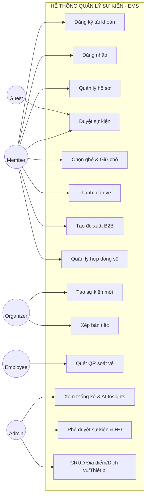
```mermaid
flowchart LR
    GUEST(("\nGuest"))
    MEMBER(("\nMember"))
    ORGANIZER(("\nOrganizer"))
    EMPLOYEE(("\nEmployee"))
    ADMIN(("\nAdmin"))

    subgraph EMS["HỆ THỐNG QUẢN LÝ SỰ KIỆN - EMS"]
        direction TB
        UC_REG["Đăng ký tài khoản"]
        UC_LOGIN["Đăng nhập"]
        UC_PROFILE["Quản lý hồ sơ"]
        UC_BROWSE["Duyệt sự kiện"]
        UC_HOLD["Chọn ghế & Giữ chỗ"]
        UC_PAY["Thanh toán vé"]
        UC_PROPOSAL["Tạo đề xuất B2B"]
        UC_CONTRACT["Quản lý hợp đồng số"]
        UC_CREATE_EVT["Tạo sự kiện mới"]
        UC_SEATING["Xếp bàn tiệc"]
        UC_SCAN["Quét QR soát vé"]
        UC_STATS["Xem thống kê & AI Insights"]
        UC_APPROVE["Phê duyệt sự kiện & HĐ"]
        UC_CRUD["CRUD Địa điểm/Dịch vụ/Thiết bị"]
    end

    GUEST --> UC_BROWSE
    MEMBER --> UC_REG
    MEMBER --> UC_LOGIN
    MEMBER --> UC_PROFILE
    MEMBER --> UC_BROWSE
    MEMBER --> UC_HOLD
    MEMBER --> UC_PAY
    MEMBER --> UC_PROPOSAL
    MEMBER --> UC_CONTRACT
    ORGANIZER --> UC_CREATE_EVT
    ORGANIZER --> UC_SEATING
    EMPLOYEE --> UC_SCAN
    ADMIN --> UC_STATS
    ADMIN --> UC_APPROVE
    ADMIN --> UC_CRUD
```

#### Sơ đồ Use Case cho Phân hệ Khách hàng (Member):
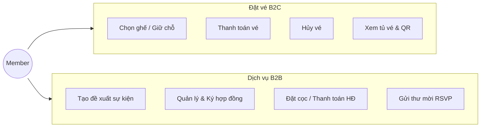
```mermaid
graph LR
    MEMBER(("Member"))
    subgraph TICKET["Đặt vé B2C"]
        UC_HOLD["Chọn ghế / Giữ chỗ"]
        UC_PAY["Thanh toán vé"]
        UC_CANCEL["Hủy vé"]
        UC_MYTICKET["Xem tủ vé & QR"]
    end
    subgraph B2B["Dịch vụ B2B"]
        UC_PROPOSAL["Tạo đề xuất sự kiện"]
        UC_CONTRACT["Quản lý & Ký hợp đồng"]
        UC_DEPOSIT["Đặt cọc / Thanh toán HĐ"]
        UC_RSVP["Gửi thư mời RSVP"]
    end
    MEMBER --> TICKET
    MEMBER --> B2B
```

#### Sơ đồ Use Case cho Phân hệ Quản trị (Admin):
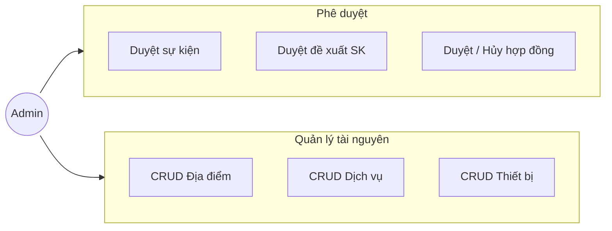
```mermaid
graph LR
    ADMIN(("Admin"))
    subgraph APPROVE["Phê duyệt"]
        UC_APPROVE_EVT["Duyệt sự kiện"]
        UC_APPROVE_PROP["Duyệt đề xuất SK"]
        UC_APPROVE_CTR["Duyệt / Hủy hợp đồng"]
    end
    subgraph RESOURCE["Quản lý tài nguyên"]
        UC_LOC["CRUD Địa điểm"]
        UC_SVC["CRUD Dịch vụ"]
        UC_DEV["CRUD Thiết bị"]
    end
    ADMIN --> APPROVE
    ADMIN --> RESOURCE
```

### 3.3. Đặc tả Use Case chi tiết (Các chức năng cốt lõi)

#### UC12: Chọn ghế / Giữ chỗ (Hold Seat)
*   **Actor:** Member
*   **Tiền điều kiện:** Đã đăng nhập, sự kiện có cấu hình sơ đồ ghế ngồi (Ticketing enabled).
*   **Luồng sự kiện chính:**
    1.  Khách hàng truy cập trang chi tiết sự kiện và nhấn chọn sơ đồ ghế.
    2.  Hệ thống hiển thị trạng thái sơ đồ ghế thời gian thực (trống, đang giữ, đã bán).
    3.  Khách hàng nhấp chọn tối đa 10 ghế trống.
    4.  Hệ thống ghi nhận và khóa các ghế này trong 10 phút, gửi tín hiệu realtime cập nhật sơ đồ cho các client khác.
*   **Ngoại lệ:** Ghế vừa chọn đã bị người khác chọn trước (Hệ thống báo lỗi và hoàn trả trạng thái).

#### UC13: Thanh toán vé (Checkout)
*   **Actor:** Member
*   **Tiền điều kiện:** Đã chọn và đang giữ chỗ thành công (Trạng thái đặt chỗ: "Held").
*   **Luồng sự kiện chính:**
    1.  Hệ thống chuyển người dùng sang trang thanh toán.
    2.  Người dùng xác nhận thông tin thanh toán (QR code hoặc cổng thanh toán).
    3.  Hệ thống ghi nhận thanh toán thành công, cập nhật trạng thái ghế sang "Booked", tạo vé điện tử kèm mã QR Code động bảo mật.
    4.  Hệ thống gửi email vé xác nhận và cập nhật doanh thu trên Admin Dashboard.
*   **Ngoại lệ:** Hết thời gian giữ chỗ 10 phút trước khi thanh toán (Ghế bị tự động giải phóng).

#### UC33: Quét QR soát vé (Check-in)
*   **Actor:** Employee (Nhân viên soát vé)
*   **Tiền điều kiện:** Thiết bị di động của nhân viên đã đăng nhập và được cấp quyền check-in sự kiện.
*   **Luồng sự kiện chính:**
    1.  Nhân viên kích hoạt camera quét mã QR Code trên vé của khách hàng hoặc nhập thủ công Ticket ID.
    2.  Hệ thống kiểm tra tính hợp lệ của vé (đúng sự kiện, trạng thái đã thanh toán "Paid", chưa check-in).
    3.  Hệ thống cập nhật trạng thái vé thành "CheckedIn", ghi nhận thời gian soát vé.
    4.  Hiển thị thông báo "HỢP LỆ" màu xanh và thông tin khách mời lên màn hình.
*   **Ngoại lệ:** Vé giả mạo, sai sự kiện hoặc vé đã soát rồi (Hiển thị cảnh báo "TỪ CHỐI" màu đỏ).

### 3.4. Ma trận Actor — Use Case

| Use Case | Guest | Member | Organizer | Employee | Admin |
|:---|:---:|:---:|:---:|:---:|:---:|
| **Đăng ký / Đăng nhập** | x | x | x | x | x |
| **Duyệt & Tìm kiếm sự kiện** | x | x | | | |
| **Chọn ghế / Giữ chỗ (B2C)** | | x | | | |
| **Thanh toán & Hủy vé (B2C)** | | x | | | |
| **Tạo đề xuất & Hợp đồng (B2B)** | | x | | | |
| **Tạo sự kiện & Xếp bàn (B2B)** | | | x | | |
| **Quét QR soát vé Check-in** | | | | x | |
| **Duyệt Đề xuất & Hợp đồng** | | | | | x |
| **CRUD Danh mục & Tài nguyên** | | | | | x |
| **Xem thống kê & AI Insights** | | | | | x |

---

## CHƯƠNG 4: THIẾT KẾ KIẾN TRÚC & DỮ LIỆU

### 4.1. Thiết kế Mô hình Cơ sở Dữ liệu (17 Mongoose Models)
Cơ sở dữ liệu MongoDB chứa 17 Collection được thiết kế chuẩn hóa và thiết lập quan hệ thông qua ObjectId tham chiếu:

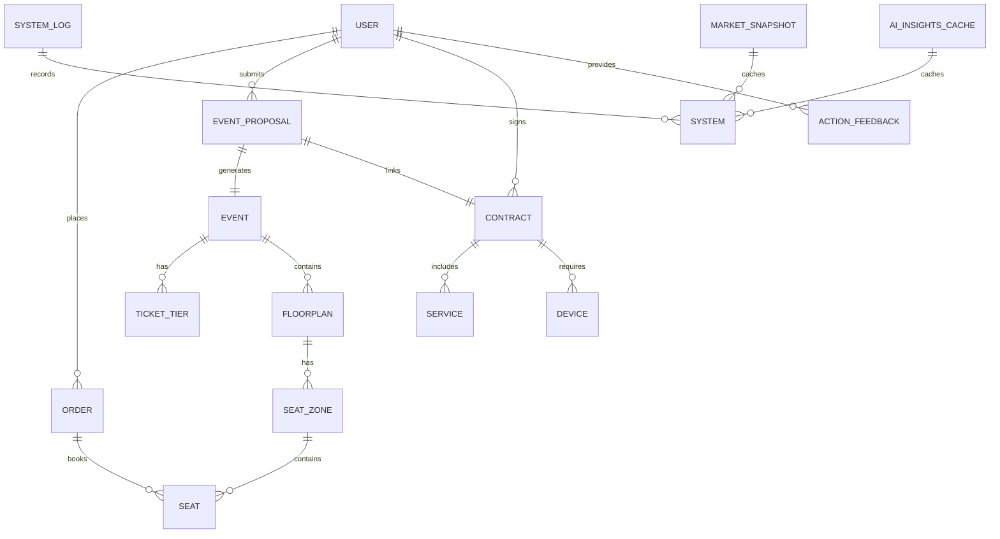
```mermaid
erDiagram
    USER ||--o{ ORDER : places
    USER ||--o{ EVENT_PROPOSAL : submits
    USER ||--o{ CONTRACT : signs
    EVENT_PROPOSAL ||--|| EVENT : generates
    EVENT_PROPOSAL ||--|| CONTRACT : links
    EVENT ||--o{ TICKET_TIER : has
    EVENT ||--o{ FLOORPLAN : contains
    FLOORPLAN ||--o{ SEAT_ZONE : has
    SEAT_ZONE ||--o{ SEAT : contains
    ORDER ||--o{ SEAT : books
    CONTRACT ||--o{ SERVICE : includes
    CONTRACT ||--o{ DEVICE : requires
    USER ||--o{ ACTION_FEEDBACK : provides
    SYSTEM_LOG ||--o{ SYSTEM : records
    MARKET_SNAPSHOT ||--o{ SYSTEM : caches
    AI_INSIGHTS_CACHE ||--o{ SYSTEM : caches
```

#### Sơ đồ Mô hình Quan hệ Cơ sở Dữ liệu (ERD - Bản vẽ Báo cáo):


*   **User:** Lưu trữ tài khoản người dùng, mật khẩu đã mã hóa (bcrypt) và phân loại vai trò (Role: ADMIN, MEMBER, ORGANIZER, EMPLOYEE).
*   **Event:** Thông tin chi tiết sự kiện (tên, ngày bắt đầu, địa điểm, trạng thái phê duyệt).
*   **Category:** Các danh mục sự kiện (Music, Workshop, Conference, ...).
*   **TicketTier:** Các hạng vé (VIP, Standard, EarlyBird) và số lượng vé phát hành.
*   **Floorplan / SeatZone / Seat:** Định nghĩa sơ đồ chỗ ngồi, phân khu và chi tiết tọa độ từng chiếc ghế kèm trạng thái realtime.
*   **Order:** Thông tin đơn đặt vé, tổng tiền, thời gian hết hạn giữ ghế và trạng thái thanh toán (Held, Paid, Cancelled, Refunded).
*   **EventProposal:** Đề xuất sự kiện B2B từ phía khách hàng doanh nghiệp gửi Admin duyệt.
*   **Contract:** Hợp đồng số gắn kết đề xuất sự kiện, ghi nhận tiến độ thanh toán cọc/đủ và tệp đính kèm.
*   **Location / Service / Device:** Quản lý tài nguyên tổ chức sự kiện (địa điểm thực tế, dịch vụ đặt tiệc/âm thanh ánh sáng, thiết bị kỹ thuật).
*   **Rsvp:** Quản lý lời mời và phản hồi tham dự sự kiện của các khách mời đặc biệt.
*   **AIInsightsCache:** Bộ nhớ đệm lưu trữ kết quả phân tích SWOT sinh bởi Gemini AI để giảm thiểu các cuộc gọi API trùng lặp, tối ưu hóa chi phí và tốc độ tải trang Admin.
*   **ActionFeedback:** Ghi nhận phản hồi của Admin về tính hữu ích (`isUseful`) của từng đề xuất hành động từ AI, giúp tinh chỉnh độ chính xác của mô hình đề xuất.
*   **MarketSnapshot:** Caching dữ liệu sự kiện cào được từ Ticketbox & Eventbrite RSS (chu kỳ 24h) để tránh nghẽn mạng ngoài và giới hạn tần suất yêu cầu.
*   **SystemLog:** Ghi nhận hiệu năng hệ thống (API Response Time) giúp Admin phát hiện các API chậm cần tối ưu hóa, đồng thời lưu trữ chi tiết lỗi kỹ thuật phát sinh (như lỗi kết nối crawler).

### 4.2. Thiết kế Luồng Nghiệp vụ (Sequence Diagrams)

#### 4.2.1. Quy trình mua vé B2C (Thời gian thực)
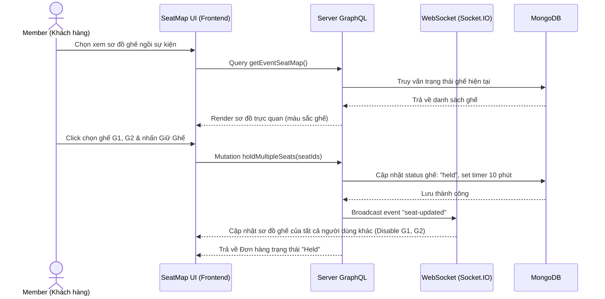
```mermaid
sequenceDiagram
    actor M as Member (Khách hàng)
    participant SM as SeatMap UI (Frontend)
    participant SV as Server GraphQL
    participant WS as WebSocket (Socket.IO)
    participant DB as MongoDB

    M->>SM: Chọn xem sơ đồ ghế ngồi sự kiện
    SM->>SV: Query getEventSeatMap()
    SV->>DB: Truy vấn trạng thái ghế hiện tại
    DB-->>SV: Trả về danh sách ghế
    SV-->>SM: Render sơ đồ trực quan (màu sắc ghế)
    M->>SM: Click chọn ghế G1, G2 & nhấn Giữ Ghế
    SM->>SV: Mutation holdMultipleSeats(seatIds)
    SV->>DB: Cập nhật status ghế: "held", set timer 10 phút
    DB-->>SV: Lưu thành công
    SV->>WS: Broadcast event "seat-updated"
    WS-->>SM: Cập nhật sơ đồ ghế của tất cả người dùng khác (Disable G1, G2)
    SV-->>SM: Trả về Đơn hàng trạng thái "Held"
```

#### 4.2.2. Quy trình đề xuất B2B và Ký hợp đồng số
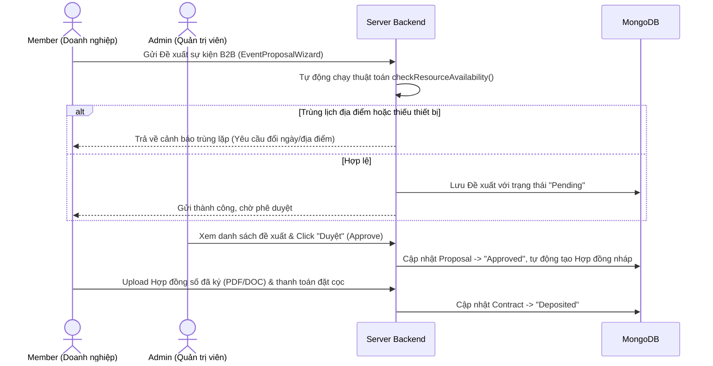
```mermaid
sequenceDiagram
    actor M as Member (Doanh nghiệp)
    actor A as Admin (Quản trị viên)
    participant SV as Server Backend
    participant DB as MongoDB

    M->>SV: Gửi Đề xuất sự kiện B2B (EventProposalWizard)
    SV->>SV: Tự động chạy thuật toán checkResourceAvailability()
    alt Trùng lịch địa điểm hoặc thiếu thiết bị
        SV-->>M: Trả về cảnh báo trùng lặp (Yêu cầu đổi ngày/địa điểm)
    else Hợp lệ
        SV->>DB: Lưu Đề xuất với trạng thái "Pending"
        SV-->>M: Gửi thành công, chờ phê duyệt
    end
    A->>SV: Xem danh sách đề xuất & Click "Duyệt" (Approve)
    SV->>DB: Cập nhật Proposal -> "Approved", tự động tạo Hợp đồng nháp
    M->>SV: Upload Hợp đồng số đã ký (PDF/DOC) & thanh toán đặt cọc
    SV->>DB: Cập nhật Contract -> "Deposited"
```

#### Sơ đồ tuần tự nghiệp vụ chi tiết (Bản vẽ Báo cáo):
<details>
<summary><b>Click để mở rộng xem các Sơ đồ tuần tự (Sequence Diagrams) chi tiết từ báo cáo</b></summary>

| Quy trình nghiệp vụ | Bản vẽ Sequence Diagram tương ứng |
|---|---|
| **1. Quy trình Đăng nhập** |  |
| **2. Quy trình Đăng xuất** | 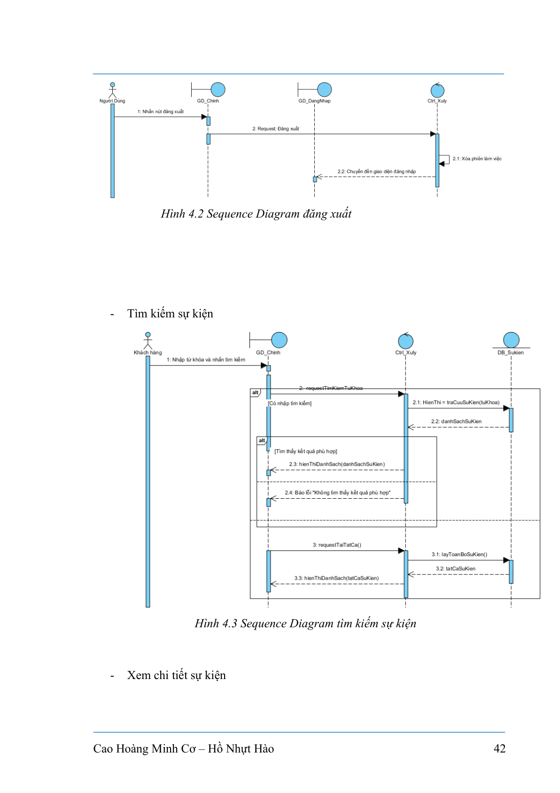 |
| **3. Quy trình Tìm kiếm sự kiện** |  |
| **4. Quy trình Xem chi tiết sự kiện** |  |
| **5. Quy trình Đăng ký tài khoản** |  |
| **6. Quy trình Đặt vé** |  |
| **7. Quy trình Hủy vé** |  |
| **8. Quy trình Mua thêm vé** | 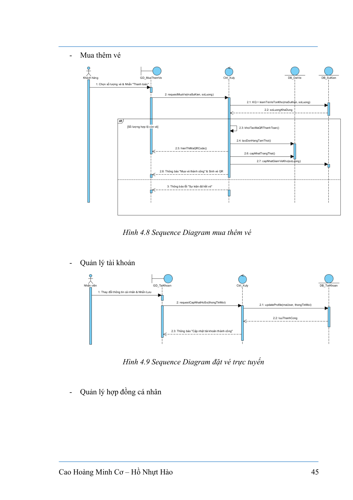 |
| **9. Quy trình Đặt vé trực tuyến** |  |
| **10. Quy trình Quản lý hợp đồng cá nhân** |  |
| **11. Quy trình Gửi thư mời tham gia sự kiện** |  |
| **12. Quy trình Quản lý sự kiện** | 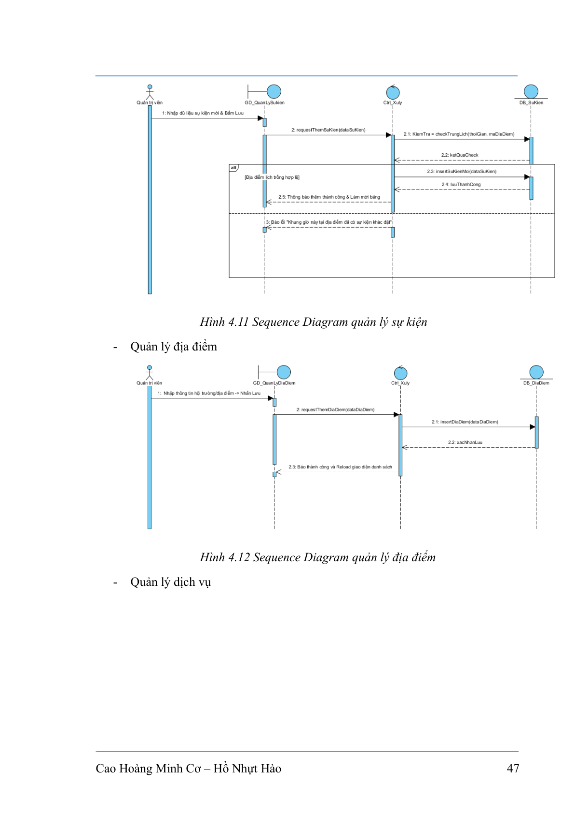 |
| **13. Quy trình Quản lý địa điểm** |  |
| **14. Quy trình Quản lý dịch vụ** |  |
| **15. Quy trình Quản lý thiết bị** |  |
| **16. Quy trình Quản lý nhân sự** |  |
| **17. Quy trình Quản lý hợp đồng tổng thể** | 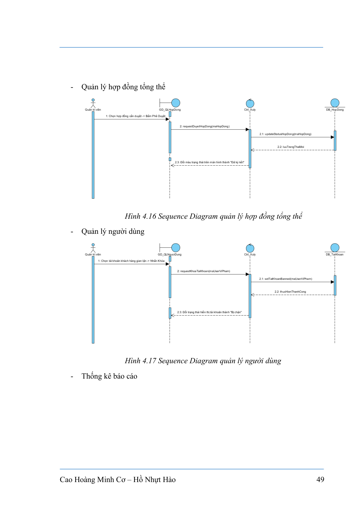 |
| **18. Quy trình Quản lý người dùng** |  |
| **19. Quy trình Quản lý thống kê báo cáo** |  |
| **20. Quy trình Quản lý khách hàng hệ thống** |  |

</details>

### 4.3. Cấu trúc thư mục dự án
Hệ thống được tổ chức khoa học với các module rõ ràng:

```
c:/Nam4/ThayPhuoc/CK/
├── event-booking-backend/       # Phân hệ Backend (Node.js & Express API)
│   ├── seed.js                  # Khởi tạo cơ sở dữ liệu mẫu thực tế
│   ├── seed-seats.js            # Khởi tạo sơ đồ ghế ngồi thời gian thực
│   ├── server.js                # Điểm khởi chạy Server (Express + GraphQL + Socket.IO)
│   └── src/
│       ├── config/              # Kết nối cơ sở dữ liệu MongoDB
│       ├── models/              # Định nghĩa 17 Mongoose Schemas
│       ├── services/            # Chứa các nghiệp vụ nền (AI Business Engine, Crawler/Scraper, Email, QR, RabbitMQ)
│       └── schema.js            # GraphQL Schema (Resolvers & Types)
│
└── event-booking-frontend/      # Phân hệ Frontend (ReactJS & Vite)
    └── src/
        ├── features/            # Các tính năng nghiệp vụ cốt lõi
        │   ├── auth/            # Xác thực, OTP
        │   ├── discovery/       # Lọc, tìm kiếm và xem chi tiết sự kiện
        │   ├── ticketing/       # Sơ đồ ghế thời gian thực, thanh toán vé B2C
        │   ├── proposal/        # Đề xuất tổ chức sự kiện B2B
        │   ├── rsvp/            # Quản lý khách mời gửi thư điện tử
        │   └── dashboard/       # Thống kê, AI insights, biểu đồ, CRUD tài nguyên
        ├── pages/               # Trang giao diện chính của các Actor
        └── components/          # Layout dùng chung (Topbar, Sidebar)
```

---

## CHƯƠNG 5: HIỆN THỰC & HƯỚNG DẪN CÀI ĐẶT

### 5.1. Yêu cầu hệ thống và môi trường
Để cài đặt và vận hành hệ thống Lumina EMS tại môi trường cục bộ (local), máy tính cần cài đặt sẵn:
*   **Node.js:** Phiên bản `>= 18.x.x` (Đã kiểm tra tương thích tốt trên `v22.18.0`).
*   **MongoDB:** Đang chạy tại cổng mặc định `27017` (Nếu không cài sẵn, hệ thống sẽ tự động kích hoạt *MongoDB Memory Server* giả lập để chạy thử nghiệm nhanh).
*   **RabbitMQ:** Chạy tại cổng `5672` (Có thể khởi động nhanh qua Docker bằng lệnh `docker-compose up -d` ở thư mục backend).

### 5.2. Các bước cấu hình cơ sở dữ liệu mẫu (Seeding)
Trước khi khởi động ứng dụng lần đầu tiên, cần nạp dữ liệu mẫu để hệ thống có đầy đủ tài khoản, phân hệ và sơ đồ ghế ngồi phục vụ việc kiểm thử:

```bash
cd event-booking-backend

# 1. Cài đặt các thư viện liên quan của Backend
npm install

# 2. Khởi tạo dữ liệu người dùng, sự kiện mẫu
node seed.js

# 3. Khởi tạo sơ đồ ghế ngồi thời gian thực cho các sự kiện
node seed-seats.js
```

**Danh sách tài khoản kiểm thử mặc định sau khi Seed (Mật khẩu chung: `123`):**
*   **Quản trị viên (Admin):** Username: `admin`
*   **Khách hàng (Member):** Username: `member`
*   **Người tổ chức (Organizer):** Username: `org`
*   **Nhân viên soát vé (Employee):** Username: `employee`

### 5.3. Hướng dẫn khởi động các dịch vụ (Frontend, Backend)
Kích hoạt các dịch vụ ở hai terminal riêng biệt:

```bash
# Terminal 1: Khởi động Backend (Chạy tại Port 4000)
cd event-booking-backend
npm run dev

# Terminal 2: Khởi động Frontend (Chạy tại Port 5173)
cd event-booking-frontend
npm install
npm run dev
```
Sau khi khởi động thành công, truy cập trình duyệt tại địa chỉ: [http://localhost:5173](http://localhost:5173) để trải nghiệm hệ thống.

### 5.4. Hình ảnh Giao diện Hệ thống thực tế (Application Screenshots)

Để minh họa trực quan các tính năng đã cài đặt và hoàn thiện trong đồ án Lumina EMS, dưới đây là hình chụp giao diện thực tế của hệ thống được phân nhóm theo vai trò người dùng (Actor):

#### 1. Giao diện dành cho Khách hàng & Khách vãng lai (Guest & Member)

<details>
<summary><b>Click để xem các ảnh chụp giao diện Khách hàng</b></summary>

* **Trang chủ chính thức (Phần trên & Khối Banner giới thiệu):**
  
  
* **Trang chủ (Khối Thống kê hoạt động & Danh sách Dịch vụ Sự kiện):**
  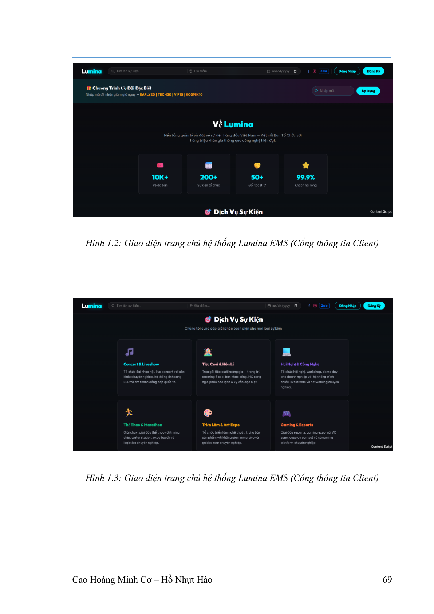
  
* **Trang chủ (Khối lọc tìm kiếm & Danh sách Sự kiện Hot nhất thị trường):**
  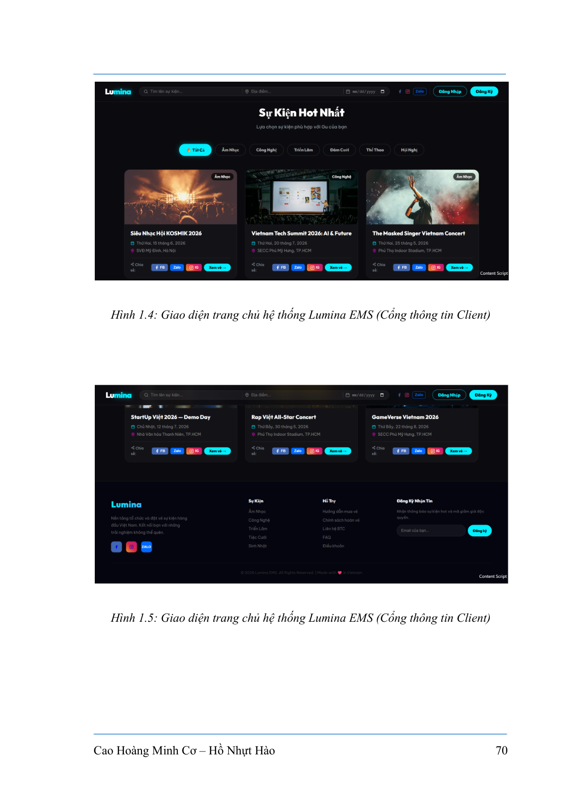
  
* **Giao diện Đăng ký và Đăng nhập thành viên:**
  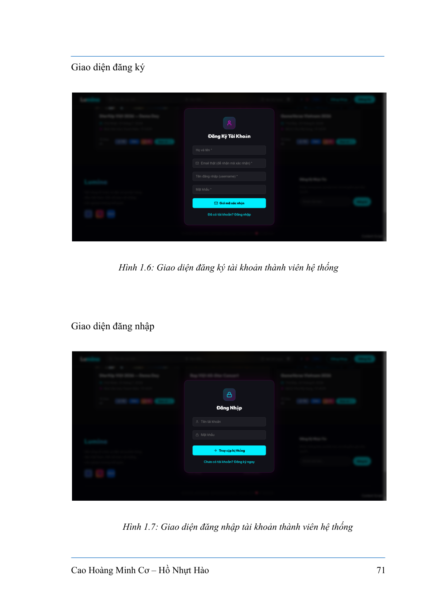
  
* **Giao diện Tủ vé QR điện tử & Danh sách Hợp đồng Sự kiện B2B của cá nhân:**
  
  
* **Giao diện Quản lý Đề xuất dự án sự kiện B2B & RSVP danh sách khách mời:**
  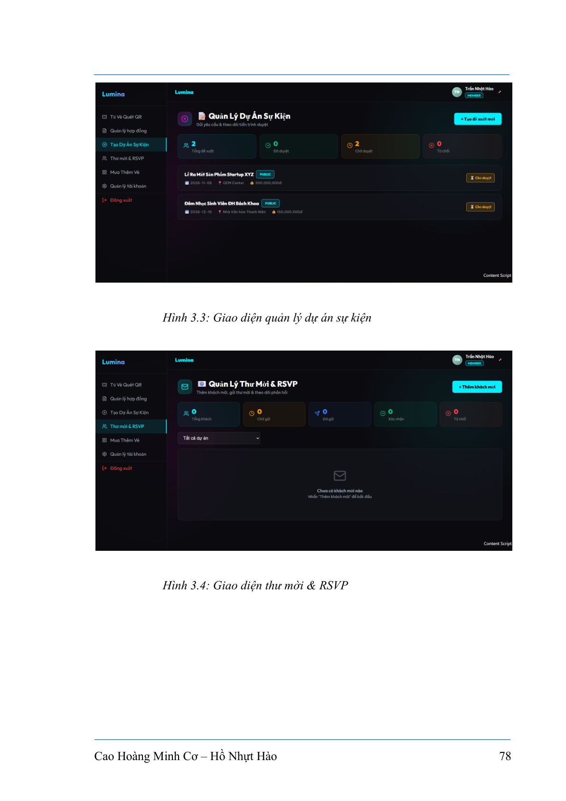
  
* **Giao diện Hồ sơ thông tin cá nhân & Quản lý Hợp đồng cá nhân:**
  

</details>

#### 2. Giao diện dành cho Quản trị viên (Admin)

<details>
<summary><b>Click để xem các ảnh chụp giao diện Quản trị viên</b></summary>

* **Bảng điều khiển Thống kê Báo cáo Doanh thu & Quản lý duyệt Sự kiện:**
  
  
* **Giao diện Duyệt đề xuất Sự kiện B2B & Quản lý Hợp đồng toàn hệ thống:**
  
  
* **Giao diện Quản lý CRUD Địa điểm (Location) & Gói Dịch vụ (Service):**
  
  
* **Giao diện Quản lý CRUD Thiết bị Kỹ thuật (Device) & Nhân sự nội bộ (Employee):**
  
  
* **Giao diện Quản lý Khách hàng Member & Hộp thư nhận phản hồi/yêu cầu hỗ trợ:**
  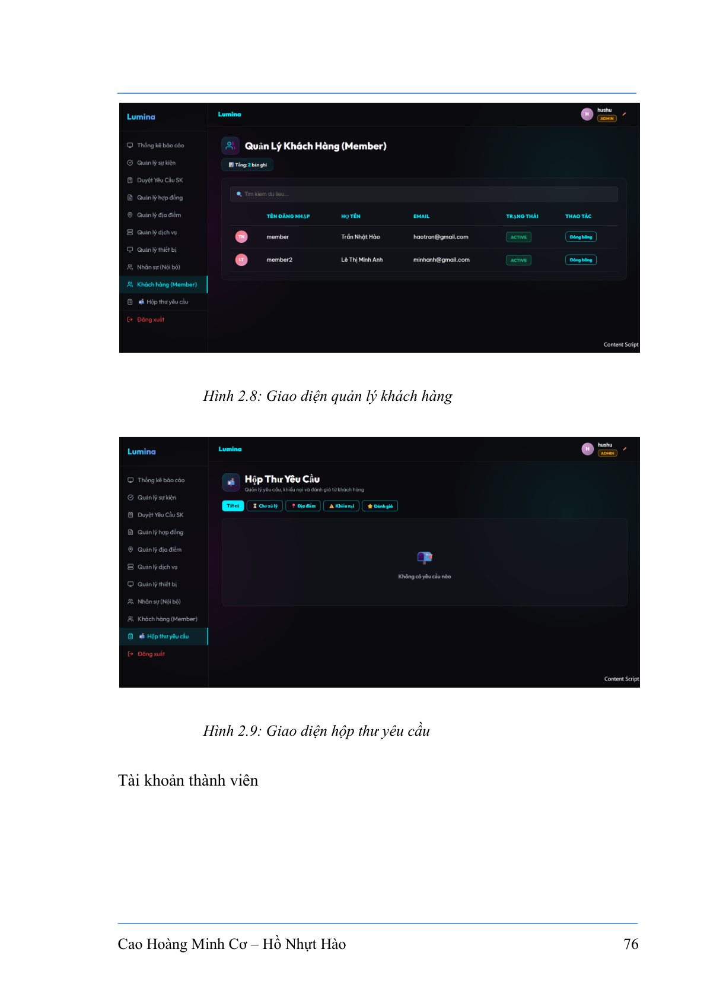

</details>

#### 3. Giao diện dành cho Nhân viên kiểm soát & vận hành (Employee)

<details>
<summary><b>Click để xem các ảnh chụp giao diện Nhân viên</b></summary>

* **Giao diện xem Danh sách Hợp đồng & Sự kiện được phân công phụ trách:**
  
  
* **Giao diện chi tiết duyệt Đề xuất sự kiện & Cổng quét mã QR soát vé Check-in:**
  
  
* **Giao diện Camera quét mã QR Scanner hoạt động realtime soát vé hiện trường:**
  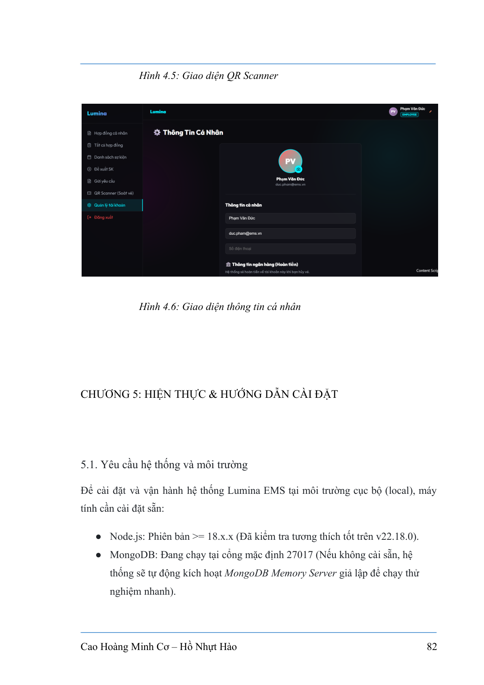

</details>

---

## CHƯƠNG 6: ĐÁNH GIÁ & HƯỚNG PHÁT TRIỂN

### 6.1. Đánh giá tính khả thi và ưu/nhược điểm
*   **Ưu điểm:**
    *   Sự kết hợp hoàn hảo giữa mô hình B2B và B2C trên một giao diện đồng bộ.
    *   Tính năng giữ ghế và cập nhật sơ đồ trực quan thời gian thực (Realtime) hoạt động ổn định và chính xác cao nhờ Socket.IO.
    *   Kiến trúc bất đồng bộ (RabbitMQ) giúp hệ thống xử lý lượng giao dịch mua vé tải cao mượt mà, tránh nghẽn server.
    *   Tích hợp AI hỗ trợ người quản trị tối ưu hóa kế hoạch kinh doanh dựa trên dữ liệu thực tế.
*   **Nhược điểm:**
    *   Chưa tích hợp các cổng thanh toán chính thức của Việt Nam (như MoMo, VNPAY, ShopeePay) mà mới chỉ giả lập thanh toán thông qua mã QR và xác nhận.

### 6.2. Phân tích SWOT & Khuyến nghị vận hành (AI Generated Insight)
Dựa trên phân tích tự động từ mô hình tích hợp Google Gemini AI đối với dữ liệu thực nghiệm của hệ thống:

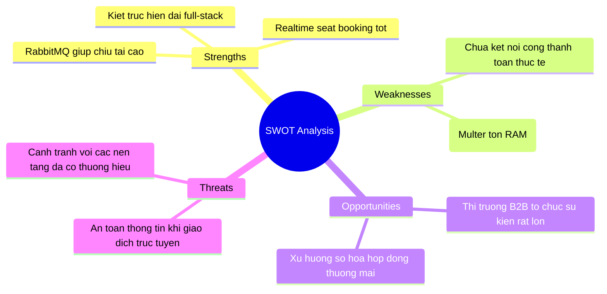
```mermaid
mindmap
  root((SWOT Analysis))
    Strengths
      Kiet truc hien dai full-stack
      Realtime seat booking tot
      RabbitMQ giup chiu tai cao
    Weaknesses
      Chua ket noi cong thanh toan thuc te
      Dung luong file upload lon (Multer ton RAM)
    Opportunities
      Thi truong B2B to chuc su kien rat lon
      Xu huong so hoa hop dong thuong mai
    Threats
      An toan thong tin khi giao dich truc tuyen
      Canh tranh voi cac nen tang da co thuong hieu
```

*   **S (Điểm mạnh):** Kiến trúc hiện đại, xử lý realtime tốt, khả năng mở rộng cao nhờ phân tách nghiệp vụ chạy ngầm qua Message Queue.
*   **W (Điểm yếu):** Chưa có cổng thanh toán thật, bảo mật dữ liệu hợp đồng đính kèm cần được mã hóa sâu hơn.
*   **O (Cơ hội):** Nhu cầu số hóa toàn bộ quy trình tổ chức sự kiện B2B của các doanh nghiệp vừa và nhỏ là cực kỳ lớn.
*   **T (Thách thức):** Vấn đề bảo mật tài khoản chống tấn công spam giữ ghế ảo, tấn công DDOS hệ thống đặt chỗ.

### 6.3. Kế hoạch phát triển tương lai
1.  Tích hợp cổng thanh toán trực tuyến chính thức (VNPAY / Stripe) và tự động đối soát ngân hàng.
2.  Áp dụng công nghệ Blockchain để phát hành Vé điện tử dạng NFT, giải quyết triệt để vấn đề vé giả và thị trường vé chợ đen đầu cơ.
3.  Tối ưu hóa sơ đồ chỗ ngồi hỗ trợ hiển thị 3D trực quan phòng máy bay/khán đài sân vận động.

---

## PHỤ LỤC: NHẬT KÝ LÀM VIỆC & TIÊU CHUẨN ĐỊNH DẠNG KỸ THUẬT

### A.1. Nhật ký làm việc theo tiến độ (15 tuần)

| Tuần | Công việc thực hiện | Kết quả đạt được | Xác nhận GVHD |
|:---:|---|---|:---:|
| **1-2** | Khảo sát hiện trạng, nghiên cứu đề tài và đề xuất tên đề tài. | Tên đề tài Lumina EMS được thông qua. | TS. Nguyễn Tấn Phước |
| **3-4** | Phân tích yêu cầu nghiệp vụ B2B, B2C, thiết kế sơ đồ Use Case chi tiết. | Hoàn thành sơ đồ Use Case và ma trận phân quyền. | TS. Nguyễn Tấn Phước |
| **5-6** | Thiết kế Cơ sở dữ liệu và xây dựng cấu trúc 13 Mongoose Models. | CSDL MongoDB được thiết lập chuẩn hóa. | TS. Nguyễn Tấn Phước |
| **7-8** | Xây dựng API Server GraphQL và cài đặt Socket.IO cho sơ đồ giữ ghế realtime. | Hoàn thành các Query/Mutation cốt lõi. | TS. Nguyễn Tấn Phước |
| **9-10** | Tích hợp RabbitMQ xử lý hàng đợi background task và Google Gemini AI. | Email gửi OTP/Thư mời mượt mà, AI báo cáo hoạt động tốt. | TS. Nguyễn Tấn Phước |
| **11-12** | Hiện thực hóa giao diện Frontend (ReactJS), kết nối GraphQL và SeatMap trực quan. | Hoàn thành giao diện admin, member, employee, organizer. | TS. Nguyễn Tấn Phước |
| **13-14** | Kiểm thử liên kết hệ thống, sửa lỗi soát vé và hiệu năng Socket.IO. | Hệ thống chạy thử nghiệm không phát hiện lỗi nghiêm trọng. | TS. Nguyễn Tấn Phước |
| **15** | Hoàn thiện tài liệu báo cáo Khóa luận tốt nghiệp theo đúng mẫu quy chuẩn. | Đóng gói mã nguồn, viết README và chuẩn bị báo cáo. | TS. Nguyễn Tấn Phước |

### A.2. Tiêu chuẩn định dạng kỹ thuật (Style Guide)
Nếu sinh viên muốn sao chép nội dung này sang Microsoft Word để soạn thảo quyển báo cáo KLTN chính thức, hãy thiết lập các định dạng **Styles** tương ứng như sau:

1.  **Heading 1 (Tên chương):** Font Times New Roman, cỡ 14, in đậm, chữ IN HOA. Spacing Before/After: 24 pt. Line spacing: 1.15 lines. Căn lề trái.
2.  **Heading 2 (Tiểu mục thứ nhất - ví dụ: 1.1):** Font Times New Roman, cỡ 13, in đậm, chữ thường. Spacing Before: 6 pt, Spacing After: 12 pt. Căn lề trái.
3.  **Heading 3 (Tiểu mục thứ hai - ví dụ: 1.1.1):** Font Times New Roman, cỡ 13, in đậm và *in nghiêng*, chữ thường. Spacing Before: 6 pt, Spacing After: 12 pt. Căn lề trái.
4.  **Content (Đoạn văn nội dung):** Font Times New Roman, cỡ 13. Spacing Before: 10 pt, Spacing After: 0 pt. Line spacing: 1.5 lines. Căn lề đều hai bên (Justify).
5.  **Caption (Chú thích hình/bảng):** Font Times New Roman, cỡ 13. Spacing Before: 6 pt, Spacing After: 12 pt. Line spacing: 1.15 lines. Căn lề giữa (Center).
    *   *Tiêu đề của bảng biểu:* Đặt phía trên bảng.
    *   *Tiêu đề của hình ảnh/sơ đồ:* Đặt phía dưới hình.

---

# PHẦN II: QUYỂN TÀI LIỆU HƯỚNG DẪN SỬ DỤNG CÔNG NGHỆ MỚI (TECHNOLOGY MANUAL)

## CHƯƠNG 1: GIỚI THIỆU CÔNG NGHỆ

### 1.1. Công nghệ là gì
Công nghệ truyền thông thời gian thực Socket.IO là giải pháp hàng đầu hiện nay giúp trao đổi thông tin liên tục giữa client và server. Giải pháp này cho phép thiết lập một kênh kết nối WebSocket hai chiều bền vững và có độ trễ cực thấp. Nhờ tính năng này, mọi thay đổi về trạng thái ghế ngồi đều được cập nhật tức thì đến màn hình người dùng. Để gia tăng sức mạnh cho ứng dụng, việc kết hợp thêm trí tuệ nhân tạo là xu thế không thể bỏ qua.

Google Gemini AI là mô hình trí tuệ nhân tạo tiên tiến hỗ trợ xử lý ngôn ngữ tự nhiên và phân tích dữ liệu chuyên sâu. Mô hình này giúp máy tính hiểu và tạo ra các báo cáo thông minh từ các số liệu thô trong cơ sở dữ liệu. Hệ thống Lumina EMS ứng dụng Gemini AI để phân tích SWOT tự động phục vụ công tác quản lý. Tiếp theo dưới đây, chúng ta sẽ làm rõ các lý do cốt lõi quyết định việc lựa chọn hai công nghệ này.

### 1.2. Tại sao chọn
Lý do chọn Socket.IO xuất phát từ yêu cầu khắt khe về mặt đồng bộ dữ liệu thời gian thực của sơ đồ ghế. Nếu sử dụng giao thức HTTP thông thường, người dùng sẽ phải tải lại trang liên tục để xem trạng thái ghế. Socket.IO giúp loại bỏ hoàn toàn sự bất tiện này bằng cách tự động đồng bộ hóa dữ liệu lập tức. Bên cạnh giải pháp truyền tin realtime, việc đưa AI vào quản lý cũng mang lại những lợi ích vô cùng to lớn.

Lựa chọn Google Gemini AI giúp tự động hóa hoàn toàn quy trình lập báo cáo kinh doanh phức tạp của Admin. Gemini 2.0 Flash sở hữu tốc độ xử lý nhanh chóng cùng chi phí vận hành vô cùng tối ưu. Hệ thống có thể đưa ra các đề xuất điều chỉnh giá vé thông minh dựa trên phân tích xu hướng bán vé. Từ những ưu điểm vượt trội trên, hai công nghệ này đã chứng minh tính hiệu quả cao trong thực tế.

### 1.3. Ứng dụng thực tế
Cả Socket.IO và Gemini AI đều đang được ứng dụng rộng rãi tại các hệ thống thương mại điện tử lớn. Các nền tảng như Uber sử dụng kết nối realtime để cập nhật vị trí xe chạy trên bản đồ. Trong khi đó, các sàn giao dịch lớn tích hợp AI để dự báo hành vi mua sắm của khách hàng. Để bắt đầu áp dụng các giải pháp tiên tiến này vào dự án, chúng ta cần cài đặt môi trường phát triển.

---

## CHƯƠNG 2: CÀI ĐẶT MÔI TRƯỜNG

### 2.1. Yêu cầu hệ thống
Thiết lập yêu cầu hệ thống là bước khởi đầu bắt buộc để cài đặt môi trường phát triển. Hệ thống yêu cầu cài đặt sẵn môi trường chạy Node.js phiên bản từ 18.0.0 trở lên. Ngoài ra, lập trình viên cần đăng ký một mã khóa API Key từ Google AI Studio để gọi mô hình Gemini. Sau khi đảm bảo các yêu cầu phần mềm cơ bản, chúng ta sẽ thực hiện các bước cài đặt thư viện.

### 2.2. Cài đặt
Cài đặt các gói thư viện phụ thuộc được thực hiện dễ dàng thông qua dòng lệnh NPM. Chúng ta cần chạy lệnh cài đặt các gói socket.io, socket.io-client và @google/generative-ai. Các gói thư viện này sẽ được tự động tải về và quản lý bên trong tệp tin package.json. Khi quá trình cài đặt thư viện hoàn tất, công việc tiếp theo là tiến hành cấu hình khởi tạo.

### 2.3. Cấu hình
Cấu hình máy chủ khởi tạo yêu cầu chúng ta thiết lập Socket.IO kết nối trực tiếp với Express Server. Lập trình viên cần khởi tạo thực thể Server của Socket.IO và cấu hình phân quyền CORS an toàn. Đồng thời, chúng ta khởi tạo thực thể GoogleGenAI bằng mã khóa API Key lấy từ tệp biến môi trường. Để nắm vững cách thức lập trình sau khi cấu hình xong, chương tiếp theo sẽ giới thiệu kiến thức cơ bản.

---

## CHƯƠNG 3: KIẾN THỨC CƠ BẢN

### 3.1. Cú pháp
Cú pháp lập trình của Socket.IO và Gemini API được thiết kế trực quan và cực kỳ dễ tiếp cận. Socket.IO sử dụng cú pháp socket.on để lắng nghe và socket.emit để phát đi các sự kiện. Gemini API sử dụng cú pháp model.generateContent để gửi yêu cầu phân tích dữ liệu trực tiếp đến máy chủ Google. Để hiểu rõ cách thức tổ chức các cú pháp này, chúng ta cần xem xét các thành phần chính.

### 3.2. Thành phần chính
Kết nối Socket và Room là hai thành phần cốt lõi quản lý luồng dữ liệu thời gian thực. Mỗi trình duyệt kết nối đến server sẽ được cấp một thực thể Socket duy nhất để trao đổi. Room cho phép nhóm các kết nối của cùng một sự kiện lại với nhau để tối ưu hóa việc phát tin. Song song với luồng truyền tin realtime, hệ thống AI cũng hoạt động dựa trên các thành phần đặc thù.

GenerativeModel và Prompt là hai thành phần quan trọng quyết định chất lượng câu trả lời của trí tuệ nhân tạo. GenerativeModel đại diện cho mô hình ngôn ngữ lớn được cấu hình để xử lý thông tin. Prompt là chuỗi chỉ thị dạng văn bản hướng dẫn AI thực hiện các nghiệp vụ phân tích dữ liệu. Mục tiếp theo dưới đây sẽ minh họa một ví dụ đơn giản để làm rõ các khái niệm này.

### 3.3. Ví dụ đơn giản
Một ví dụ đơn giản giúp lập trình viên nhanh chóng hình dung cách thức vận hành thực tế. Dưới đây là đoạn mã mô phỏng cách thức phát tin nhắn realtime và gọi AI sinh văn bản. Đoạn mã này thể hiện rõ ràng tính tối giản và hiệu quả cao của hai công nghệ mới. Sau khi nắm vững các kiến thức cơ bản này, chúng ta sẽ chuyển sang hướng dẫn sử dụng chuyên sâu.

```javascript
// 1. Ví dụ gửi thông tin cập nhật ghế qua Socket.IO
socket.emit('seat-updated', { seatId: 'A10', status: 'held' });

// 2. Ví dụ gọi Google Gemini AI sinh tóm tắt báo cáo
const model = genAI.getGenerativeModel({ model: "gemini-2.0-flash" });
const result = await model.generateContent("Tóm tắt doanh thu bán vé tháng này.");
console.log(result.response.text());
```

Ví dụ trên đã mô phỏng hoàn chỉnh luồng đi của dữ liệu từ client đến server. Sự kiện cập nhật ghế sẽ lập tức chuyển đến toàn bộ người dùng đang mở sơ đồ. Trong khi đó, kết quả phân tích báo cáo của AI sẽ hiển thị nhanh chóng trên terminal. Tiếp theo dưới đây, chương 4 sẽ hướng dẫn sử dụng các công nghệ này một cách toàn diện.

---

## CHƯƠNG 4: SỬ DỤNG CÔNG NGHỆ

### 4.1. Các chức năng chính
Các chức năng chính của Socket.IO và Gemini AI cung cấp đầy đủ công cụ để xây dựng ứng dụng. Socket.IO hỗ trợ tự động kết nối lại khi mất mạng và quản lý phòng chat theo thời gian thực. Gemini AI hỗ trợ phân tích dữ liệu có cấu trúc và đề xuất giải pháp kinh doanh thông minh. Để triển khai các chức năng này một cách hiệu quả, việc lựa chọn thư viện phù hợp là rất quan trọng.

### 4.2. API / thư viện
Các thư viện chính thức giúp đảm bảo tính tương thích và bảo mật cho ứng dụng. Chúng ta sử dụng thư viện socket.io cho backend Node.js và socket.io-client cho frontend ReactJS. Thư viện @google/generative-ai là SDK chính thức giúp kết nối an toàn với máy chủ Google. Để giúp lập trình viên dễ hình dung, mục dưới đây sẽ cung cấp mã nguồn hiện thực chi tiết.

### 4.3. Code mẫu
Mã nguồn mẫu dưới đây minh họa chi tiết cách xây dựng một ứng dụng realtime tích hợp AI. Đoạn mã bao gồm phần thiết lập socket server lắng nghe cập nhật ghế và gọi API AI. Lập trình viên có thể dễ dàng sao chép và phát triển thêm các tính năng mới từ đây. Từ các kiến thức thực tế này, chương tiếp theo sẽ trình bày cách ứng dụng vào đồ án.

```javascript
// Khởi tạo Socket.IO server
const io = require('socket.io')(httpServer, { cors: { origin: "*" } });
io.on('connection', (socket) => {
  socket.on('hold-seat', (data) => {
    socket.broadcast.emit('seat-status-changed', data);
  });
});

// Gọi Gemini AI phân tích hiệu suất sự kiện
async function analyzeEventSales(salesData) {
  const model = genAI.getGenerativeModel({ model: "gemini-2.0-flash" });
  const prompt = `Phân tích dữ liệu bán vé sau và đưa ra khuyến nghị giá: ${JSON.stringify(salesData)}`;
  const result = await model.generateContent(prompt);
  return result.response.text();
}
```

Đoạn mã trên đã thể hiện cách thức thiết lập Socket.IO phát tin và Gemini AI xử lý prompt. Hệ thống backend sẽ lắng nghe kết nối của client và điều phối thông điệp đồng thời. Giải pháp này mang lại khả năng mở rộng cao và dễ bảo trì cho mã nguồn của bạn. Chuyển sang phần tiếp theo, chúng ta sẽ phân tích ứng dụng thực tế trong đồ án Lumina EMS.

---

## CHƯƠNG 5: ỨNG DỤNG VÀO ĐỒ ÁN

### 5.1. Bạn dùng công nghệ này ở đâu
Hệ thống Lumina EMS ứng dụng Socket.IO tại sơ đồ ghế ngồi tương tác thời gian thực. Khi một khách hàng chọn ghế VIP, trạng thái ghế sẽ ngay lập tức chuyển sang màu đỏ trên máy khách khác. Cơ chế này ngăn chặn tuyệt đối tình trạng chọn trùng ghế của hai khách hàng khác nhau. Để gia tăng hiệu quả quản lý hành chính, AI cũng được đưa vào vận hành tại khu vực phù hợp.

Quy trình phân tích kinh doanh tại trang quản trị Admin được hỗ trợ đắc lực bởi Gemini AI. Hệ thống thu thập dữ liệu doanh thu sự kiện, lượng vé bán và phản hồi RSVP gửi cho AI. Gemini AI sẽ tự động phân tích SWOT và đưa ra khuyến nghị chiến lược vận hành cho Admin. Dưới đây là sơ đồ mô hình hóa quy trình tích hợp Realtime và AI trong đồ án Lumina EMS.

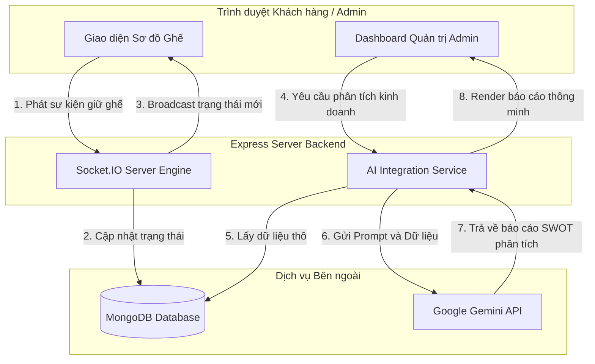
```mermaid
graph TD
    subgraph Client [Trình duyệt Khách hàng / Admin]
        A[Giao diện Sơ đồ Ghế]
        B[Dashboard Quản trị Admin]
    end
    subgraph Server [Express Server Backend]
        C[Socket.IO Server Engine]
        D[AI Integration Service]
    end
    subgraph External [Dịch vụ Bên ngoài]
        E[(MongoDB Database)]
        F[Google Gemini API]
    end

    A -->|1. Phát sự kiện giữ ghế| C
    C -->|2. Cập nhật trạng thái| E
    C -->|3. Broadcast trạng thái mới| A
    B -->|4. Yêu cầu phân tích kinh doanh| D
    D -->|5. Lấy dữ liệu thô| E
    D -->|6. Gửi Prompt và Dữ liệu| F
    F -->|7. Trả về báo cáo SWOT phân tích| D
    D -->|8. Render báo cáo thông minh| B
```

Sơ đồ trên đã khái quát hóa luồng hoạt động đồng bộ của Socket.IO và Gemini AI trong đồ án. Sự kết hợp này giúp hệ thống hoạt động tự động hóa tối đa từ giao dịch đến quản lý. Trải nghiệm người dùng và hiệu quả ra quyết định của Admin được nâng cao rõ rệt. Để nắm vững phương pháp triển khai thực tế, mục tiếp theo sẽ hướng dẫn cách tích hợp.

### 5.2. Cách tích hợp
Cách thức tích hợp hai công nghệ này đòi hỏi sự phối hợp chặt chẽ giữa frontend và backend. Phía Backend tích hợp Socket.IO và viết dịch vụ ai.service.js để gọi API của Google. Phía Frontend khởi tạo socket-client lắng nghe sự kiện và tạo dashboard hiển thị kết quả phân tích AI. Quy trình tích hợp hoàn tất giúp hệ thống Lumina EMS đạt hiệu suất tối ưu và bền vững.

---
> **Bản quyền tài liệu thuộc về:** Sinh viên **Hồ Nhựt Hào & Cao Hoàng Minh Cơ** — Trường Đại học Công nghiệp TP. HCM.  
> **Giáo viên hướng dẫn khoa học:** **TS. Nguyễn Tấn Phước** (Bộ môn Hệ thống thông tin).  
> *Nghiêm cấm sao chép, thương mại hóa dưới mọi hình thức.*


