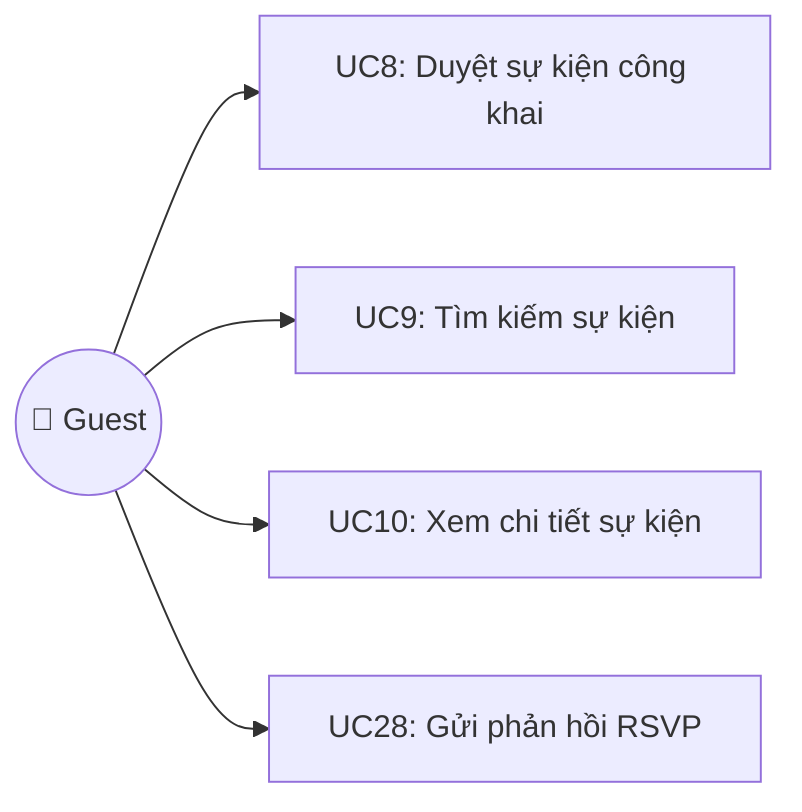
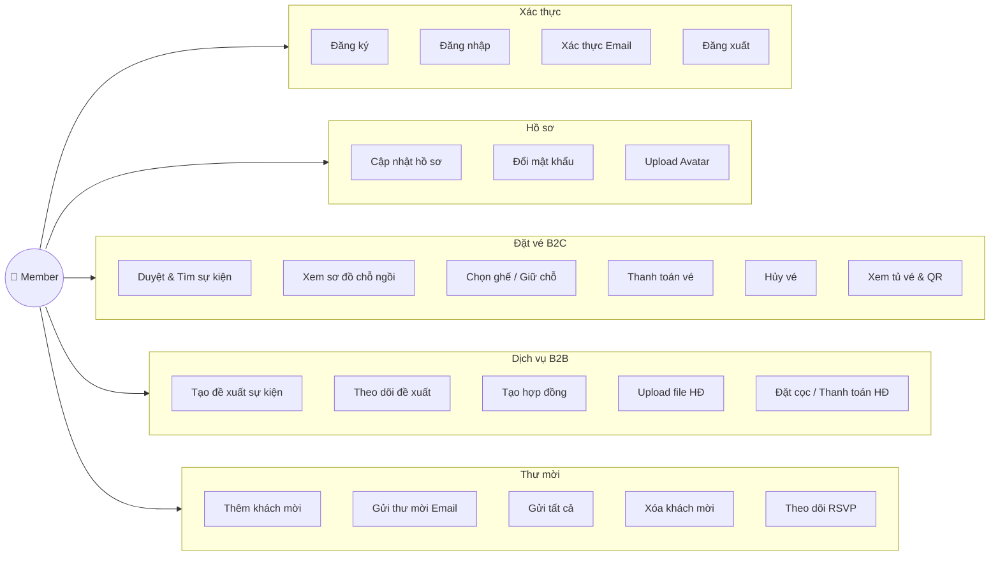
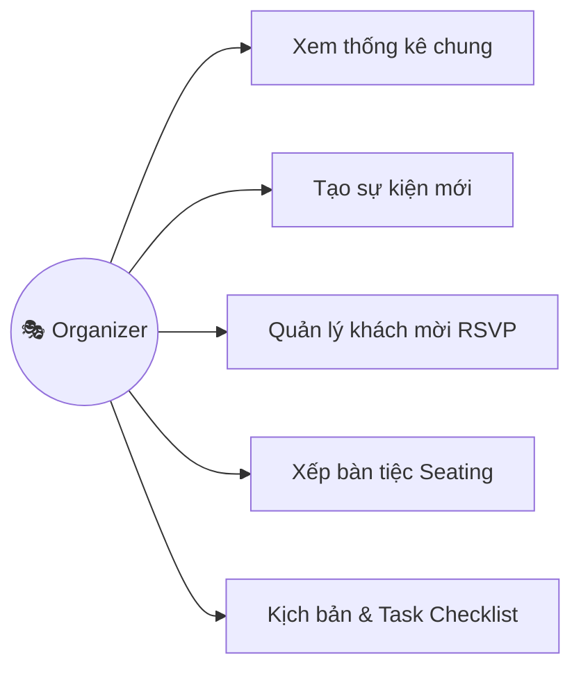
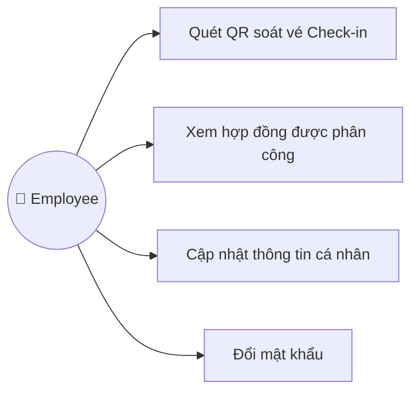
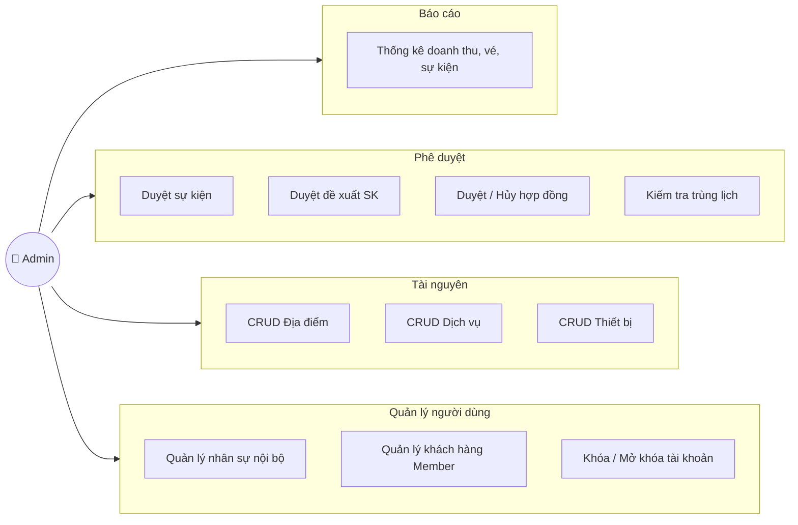
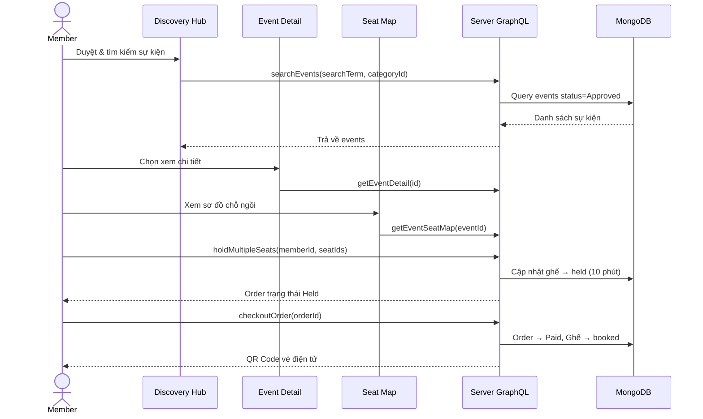
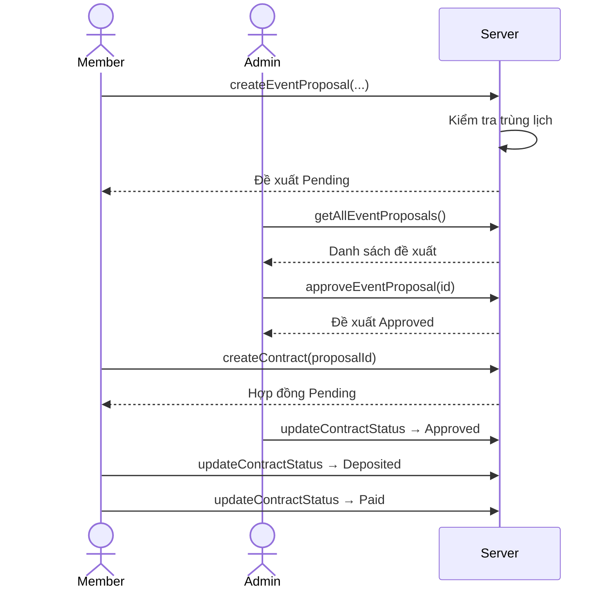
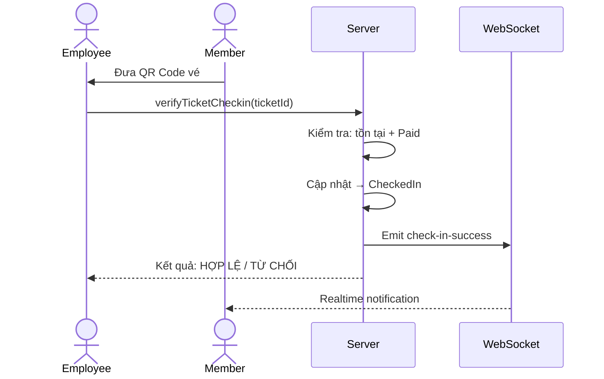

# 🎫 LUMINA EMS — HỆ THỐNG TỔ CHỨC QUẢN LÝ SỰ KIỆN VÀ ĐẶT VÉ

## 1. Giới thiệu tổng quan (System Overview)

**Lumina EMS (Event Management & Booking Platform)** là một nền tảng full-stack toàn diện được thiết kế nhằm số hóa và tối ưu hóa toàn bộ quy trình quản lý sự kiện — từ khâu đề xuất ý tưởng, ký kết hợp đồng, bán vé trực tuyến, đến soát vé check-in tại chỗ. Hệ thống phục vụ đồng thời hai mô hình kinh doanh:

| Mô hình | Đối tượng | Mô tả |
|---------|-----------|-------|
| **B2C** | Khách hàng cá nhân | Duyệt sự kiện → Chọn ghế trên Seatmap tương tác → Thanh toán → Nhận vé điện tử QR Code → Check-in |
| **B2B** | Doanh nghiệp / Cá nhân | Tạo đề xuất sự kiện → Admin duyệt → Ký hợp đồng số → Đặt cọc & thanh toán → Quản lý thư mời RSVP |

---

## 1.1. Danh sách các chức năng chính hiện có

### 👤 Khách vãng lai (Guest)
1. Duyệt danh sách sự kiện công khai
2. Tìm kiếm sự kiện (theo tên, địa điểm, danh mục)
3. Xem chi tiết sự kiện
4. Gửi phản hồi RSVP (không cần đăng nhập)

### 🧑 Khách hàng (Member)
5. Đăng ký tài khoản (xác thực Email OTP)
6. Đăng nhập / Đăng xuất (JWT Token)
7. Cập nhật hồ sơ cá nhân (họ tên, email, SĐT, ngân hàng)
8. Upload ảnh đại diện (Avatar)
9. Đổi mật khẩu
10. Xem sơ đồ chỗ ngồi tương tác (Interactive Seatmap)
11. Chọn ghế & Giữ chỗ (Hold Seat — tối đa 10 ghế, giữ 10 phút)
12. Thanh toán vé & Nhận QR Code
13. Hủy vé & Hoàn tiền tự động
14. Xem tủ vé cá nhân (My Tickets) & QR Code động
15. Tạo đề xuất sự kiện (Event Proposal Wizard)
16. Theo dõi trạng thái đề xuất
17. Tạo hợp đồng (liên kết đề xuất đã duyệt)
18. Upload file hợp đồng (PDF/DOC)
19. Xác nhận / Từ chối hợp đồng (từ phía Member)
20. Đặt cọc & Thanh toán hợp đồng
21. Thêm khách mời vào danh sách
22. Gửi thư mời Email (đơn lẻ hoặc hàng loạt)
23. Xóa khách mời
24. Theo dõi trạng thái RSVP (Pending/Sent/Confirmed/Declined)
25. Gửi yêu cầu hỗ trợ cho Admin (Admin Request)

### 🎭 Người tổ chức (Organizer)
26. Tạo sự kiện mới (PUBLIC / PRIVATE, bật/tắt Ticketing)
27. Quản lý khách mời RSVP
28. Xếp bàn tiệc (Seating Arrangement)
29. Lên kịch bản & Task Checklist

### 🔧 Nhân viên (Employee)
30. Quét QR / Nhập mã soát vé Check-in
31. Xem hợp đồng được phân công
32. Xác nhận hợp đồng (từ phía nhân viên)
33. Cập nhật thông tin cá nhân & Đổi mật khẩu

### 👑 Quản trị viên (Admin)
34. Xem thống kê tổng quan (doanh thu, vé, sự kiện, hoàn tiền)
35. Dashboard Analytics nâng cao (biểu đồ doanh thu, tỷ lệ chuyển đổi)
36. AI Insights — Phân tích SWOT & Xu hướng (Gemini 2.0 Flash)
37. Duyệt / Từ chối sự kiện (kiểm tra trùng lịch tự động)
38. Duyệt / Từ chối đề xuất sự kiện
39. Duyệt / Hủy hợp đồng
40. Phân công nhân viên phụ trách hợp đồng
41. Quản lý Địa điểm (CRUD Location)
42. Quản lý Dịch vụ (CRUD Service)
43. Quản lý Thiết bị (CRUD Device)
44. Quản lý nhân sự nội bộ (Employee)
45. Quản lý khách hàng (Member)
46. Khóa / Mở khóa tài khoản
47. Xử lý yêu cầu hỗ trợ từ Member

### ⚡ Hệ thống (System)
48. Realtime cập nhật ghế ngồi (Socket.IO)
49. Realtime thông báo mua vé, check-in, đề xuất mới
50. Xử lý tác vụ nền qua RabbitMQ (email, ticket worker)
51. Kiểm tra trùng lịch & Tài nguyên tự động
52. Prometheus Metrics cho monitoring hệ thống
53. Upload & lưu trữ file (Avatar, Hợp đồng) — Multer

---

## 1.2. Phân tích chức năng hệ thống

### 🔐 Module 1: Xác thực & Quản lý tài khoản (Authentication)
- **Đăng ký tài khoản** với xác thực Email OTP (gửi mã qua Gmail SMTP thật).
- **Đăng nhập JWT** — Token 8 giờ, phân luồng tự động theo role (Admin/Member/Organizer/Employee).
- **Quản lý hồ sơ:** Cập nhật thông tin cá nhân, upload avatar (Multer, giới hạn 5MB), đổi mật khẩu (bcrypt hash).
- **Khóa/Mở khóa tài khoản** bởi Admin.

### 🔍 Module 2: Khám phá sự kiện (Discovery Hub)
- **Trang chủ DiscoveryHub:** Hiển thị danh sách sự kiện đã duyệt (`status: Approved, eventType: PUBLIC`).
- **Tìm kiếm đa tiêu chí:** Theo từ khóa (tên, địa điểm) và lọc theo danh mục (Category).
- **Xem chi tiết sự kiện (InfoModal):** Mô tả, ngày tổ chức, địa điểm, ảnh bìa, danh sách hạng vé (TicketTier) kèm giá.
- **Gửi phản hồi RSVP:** Khách vãng lai (Guest) có thể RSVP trực tiếp mà không cần đăng nhập.

### 🎟️ Module 3: Đặt vé trực tuyến — B2C Ticketing
- **Sơ đồ chỗ ngồi tương tác (SeatMapUI):** Hiển thị zone màu sắc, trạng thái ghế realtime (`available / held / booked`).
- **Giữ chỗ (Hold Seat):** Chọn 1–10 ghế, hệ thống khóa ghế trong 10 phút. Socket.IO phát sự kiện `seat-updated` cho tất cả người dùng.
- **Thanh toán (Checkout):** Tạo QR Code vé điện tử, ghế chuyển sang `booked`, phát thông báo `ticket-purchased`.
- **Hủy vé & Hoàn tiền:** Tự động tính refund, giải phóng ghế, khôi phục số lượng vé, ghi log hoàn tiền qua tài khoản ngân hàng.
- **Tủ vé cá nhân (My Tickets):** Xem lịch sử đặt vé, trạng thái, QR Code động theo thời gian.

### 📋 Module 4: Đề xuất sự kiện & Hợp đồng — B2B
- **Tạo đề xuất (EventProposalWizard):** Wizard nhiều bước — nhập tên, mô tả, loại sự kiện, ngày, địa điểm, ngân sách. Tự động kiểm tra trùng lịch trước khi gửi.
- **Quản lý hợp đồng (Contract):** Luồng trạng thái 8 bước: `Pending → MemberConfirmed → EmployeeConfirmed → Approved → Deposited → Paid` (hoặc `MemberRejected / Cancelled`).
- **Upload file hợp đồng:** Hỗ trợ PDF/DOC (Multer, giới hạn 20MB), lưu trữ server-side.
- **Phân công nhân viên:** Admin gán Employee phụ trách hợp đồng, Employee xem & xác nhận từ dashboard riêng.
- **Xem chi tiết hợp đồng (ContractFull):** Tổng hợp thông tin member, proposal, event, dịch vụ, thiết bị.

### ✉️ Module 5: Quản lý thư mời & RSVP
- **Tạo danh sách khách mời:** Thêm tên, email, điện thoại, chế độ ăn, số người đi kèm.
- **Gửi thư mời Email:** Gửi từng thư hoặc gửi hàng loạt qua Gmail SMTP, kèm mã QR xác nhận.
- **Theo dõi trạng thái RSVP:** Dashboard thống kê `Pending / Sent / Confirmed / Declined`.

### 👔 Module 6: Nhân viên — Employee Operations
- **Quét QR soát vé (Check-in):** Nhập Ticket ID → hệ thống xác thực trạng thái vé → cập nhật `CheckedIn` → phát sự kiện Socket.IO `check-in-success`.
- **Xem hợp đồng được phân công:** Dashboard riêng hiển thị các hợp đồng đã gán, hỗ trợ xác nhận từ phía nhân viên.
- **Giao diện responsive mobile-first:** Tối ưu cho nhân viên sử dụng điện thoại tại hiện trường.

### 🏢 Module 7: Quản lý tổ chức sự kiện — Organizer
- **Tạo sự kiện mới:** Chọn danh mục, nhập thông tin, upload ảnh bìa, chọn loại (PUBLIC/PRIVATE), bật/tắt ticketing.
- **Quản lý khách mời RSVP:** Xem danh sách, xếp bàn tiệc (Seating).
- **Kịch bản & Task Checklist:** Lên lịch trình chạy sự kiện, phân công công việc.

### 👑 Module 8: Quản trị viên — Admin Dashboard
- **Thống kê tổng quan (Stats):** Doanh thu, số vé bán, người dùng, sự kiện, đề xuất chờ duyệt, hợp đồng, hoàn tiền.
- **Analytics nâng cao (AdvancedDashboard):** Biểu đồ doanh thu theo tháng, phân bố loại sự kiện, trạng thái hợp đồng/đơn hàng, tỷ lệ chuyển đổi.
- **AI Insights (Gemini 2.0 Flash):** Phân tích SWOT, xu hướng thị trường, khuyến nghị chiến lược, roadmap phát triển — dựa trên dữ liệu thực của hệ thống.
- **Phê duyệt:** Duyệt/từ chối sự kiện (kiểm tra trùng lịch tự động), đề xuất sự kiện, hợp đồng.
- **Quản lý tài nguyên (GenericCRUD):** CRUD Địa điểm (Location), Dịch vụ (Service), Thiết bị (Device) — component tái sử dụng.
- **Quản lý người dùng:** Xem danh sách nhân sự, khách hàng, khóa/mở khóa tài khoản.
- **Xử lý yêu cầu (AdminRequest):** Tiếp nhận & giải quyết yêu cầu hỗ trợ từ Member.

### ⚡ Module 9: Realtime & Hệ thống nền
- **Socket.IO:** Cập nhật trạng thái ghế, thông báo mua vé, check-in, đề xuất mới — tất cả realtime.
- **RabbitMQ:** Message queue xử lý tác vụ nặng (gửi email hàng loạt, xử lý vé async) qua `ticket.worker.js`.
- **Prometheus Metrics:** Endpoint `/metrics` cho monitoring hiệu năng hệ thống.
- **Kiểm tra tài nguyên:** API `checkResourceAvailability` kiểm tra trùng địa điểm/ngày và tình trạng thiết bị.

---

## 1.3. Công nghệ sử dụng (Tech Stack)

| Tầng | Công nghệ | Chi tiết |
|------|-----------|----------|
| **Frontend** | React.js (Vite) | SPA với 7 trang chính, 6 feature modules, component tái sử dụng |
| **Backend** | Node.js + Express | Apollo Server GraphQL, Multer file upload, JWT auth |
| **Database** | MongoDB (Mongoose) | 13 models, index tối ưu, quan hệ ObjectId ref |
| **Realtime** | Socket.IO | Bi-directional events cho seat updates, notifications |
| **Message Queue** | RabbitMQ | Async worker cho ticket processing, email queue |
| **AI** | Google Gemini 2.0 Flash | Phân tích kinh doanh SWOT, xu hướng, roadmap |
| **Email** | Nodemailer + Gmail SMTP | OTP xác thực, thư mời RSVP |
| **Monitoring** | Prometheus (prom-client) | Thu thập metrics mặc định + custom |

---

## 2. Các Actor trong hệ thống

| Actor | Mô tả |
|-------|-------|
| **Khách (Guest)** | Người dùng chưa đăng nhập, có thể duyệt sự kiện và RSVP |
| **Member (Khách hàng)** | Người dùng đã đăng ký, mua vé, tạo đề xuất sự kiện, quản lý hợp đồng & thư mời |
| **Organizer (Tổ chức)** | Nhân viên tổ chức sự kiện, quản lý RSVP, sơ đồ chỗ ngồi |
| **Employee (Nhân viên)** | Nhân viên soát vé, quản lý hợp đồng được phân công |
| **Admin (Quản trị)** | Quản trị viên toàn quyền: duyệt sự kiện, hợp đồng, nhân sự, tài nguyên |

---

## 3. Use Case Diagram — Tổng quát hệ thống

```mermaid
flowchart LR
    GUEST(("👤\nGuest"))
    MEMBER(("🧑\nMember"))
    ORGANIZER(("🎭\nOrganizer"))
    EMPLOYEE(("🔧\nEmployee"))
    ADMIN(("👑\nAdmin"))

    subgraph EMS["🎫 HỆ THỐNG QUẢN LÝ SỰ KIỆN - EMS"]
        direction TB

        UC_REG["Đăng ký tài khoản"]
        UC_LOGIN["Đăng nhập"]
        UC_LOGOUT["Đăng xuất"]
        UC_VERIFY["Xác thực Email OTP"]
        UC_PROFILE["Quản lý hồ sơ cá nhân"]

        UC_BROWSE["Duyệt sự kiện"]
        UC_SEARCH["Tìm kiếm sự kiện"]
        UC_DETAIL["Xem chi tiết sự kiện"]
        UC_SEATMAP["Xem sơ đồ chỗ ngồi"]

        UC_HOLD["Chọn ghế & Giữ chỗ"]
        UC_PAY["Thanh toán vé"]
        UC_CANCEL["Hủy vé"]
        UC_MYTICKET["Xem tủ vé & QR Code"]
        UC_RSVP["Gửi phản hồi RSVP"]

        UC_PROPOSAL["Tạo đề xuất sự kiện"]
        UC_TRACK["Theo dõi đề xuất"]
        UC_CONTRACT["Quản lý hợp đồng"]
        UC_DEPOSIT["Đặt cọc / Thanh toán HĐ"]
        UC_INVITE["Quản lý thư mời & RSVP"]

        UC_CREATE_EVT["Tạo sự kiện mới"]
        UC_GUEST_MGR["Quản lý khách mời"]
        UC_SEATING["Xếp bàn tiệc"]
        UC_RUNDOWN["Kịch bản & Task"]

        UC_SCAN["Quét QR soát vé"]
        UC_MY_CONTRACT["Xem HĐ được phân công"]

        UC_STATS["Xem thống kê báo cáo"]
        UC_APPROVE_EVT["Duyệt sự kiện"]
        UC_APPROVE_PROP["Duyệt đề xuất sự kiện"]
        UC_APPROVE_CTR["Duyệt / Hủy hợp đồng"]
        UC_LOC["Quản lý địa điểm"]
        UC_SVC["Quản lý dịch vụ"]
        UC_DEV["Quản lý thiết bị"]
        UC_STAFF["Quản lý nhân sự"]
        UC_MEMBERS["Quản lý khách hàng"]
        UC_LOCK["Khóa / Mở khóa tài khoản"]
    end

    GUEST --> UC_BROWSE
    GUEST --> UC_SEARCH
    GUEST --> UC_DETAIL
    GUEST --> UC_RSVP

    MEMBER --> UC_REG
    MEMBER --> UC_LOGIN
    MEMBER --> UC_LOGOUT
    MEMBER --> UC_VERIFY
    MEMBER --> UC_PROFILE
    MEMBER --> UC_BROWSE
    MEMBER --> UC_SEARCH
    MEMBER --> UC_DETAIL
    MEMBER --> UC_SEATMAP
    MEMBER --> UC_HOLD
    MEMBER --> UC_PAY
    MEMBER --> UC_CANCEL
    MEMBER --> UC_MYTICKET
    MEMBER --> UC_PROPOSAL
    MEMBER --> UC_TRACK
    MEMBER --> UC_CONTRACT
    MEMBER --> UC_DEPOSIT
    MEMBER --> UC_INVITE

    ORGANIZER --> UC_LOGIN
    ORGANIZER --> UC_LOGOUT
    ORGANIZER --> UC_CREATE_EVT
    ORGANIZER --> UC_GUEST_MGR
    ORGANIZER --> UC_SEATING
    ORGANIZER --> UC_RUNDOWN

    EMPLOYEE --> UC_LOGIN
    EMPLOYEE --> UC_LOGOUT
    EMPLOYEE --> UC_PROFILE
    EMPLOYEE --> UC_SCAN
    EMPLOYEE --> UC_MY_CONTRACT

    ADMIN --> UC_LOGIN
    ADMIN --> UC_LOGOUT
    ADMIN --> UC_STATS
    ADMIN --> UC_APPROVE_EVT
    ADMIN --> UC_APPROVE_PROP
    ADMIN --> UC_APPROVE_CTR
    ADMIN --> UC_LOC
    ADMIN --> UC_SVC
    ADMIN --> UC_DEV
    ADMIN --> UC_STAFF
    ADMIN --> UC_MEMBERS
    ADMIN --> UC_LOCK
```



---

## 4. Use Case Diagram — Theo từng Actor

### 4.1. Guest (Khách vãng lai)



### 4.2. Member (Khách hàng đã đăng ký)



### 4.3. Organizer (Người tổ chức)



### 4.4. Employee (Nhân viên)



### 4.5. Admin (Quản trị viên)



---

## 5. Đặc tả Use Case chi tiết

### UC1: Đăng ký tài khoản
| Thuộc tính | Mô tả |
|---|---|
| **Actor** | Guest → Member |
| **Mô tả** | Người dùng tạo tài khoản mới với username, password, email |
| **Tiền điều kiện** | Chưa có tài khoản |
| **Luồng chính** | 1. Nhập thông tin → 2. Xác thực email OTP → 3. Tạo tài khoản thành công |
| **Ngoại lệ** | Username đã tồn tại, Email đã được sử dụng |

### UC2: Đăng nhập
| Thuộc tính | Mô tả |
|---|---|
| **Actor** | Member, Organizer, Employee, Admin |
| **Mô tả** | Xác thực bằng username/password, nhận JWT token |
| **Luồng chính** | 1. Nhập username + password → 2. Hệ thống xác thực → 3. Trả về token + chuyển hướng theo role |
| **Ngoại lệ** | Sai tài khoản hoặc mật khẩu |

### UC8: Duyệt sự kiện công khai
| Thuộc tính | Mô tả |
|---|---|
| **Actor** | Guest, Member |
| **Mô tả** | Xem danh sách sự kiện đã được duyệt trên Discovery Hub |
| **Luồng chính** | 1. Truy cập trang chủ → 2. Xem danh sách sự kiện theo danh mục → 3. Lọc / tìm kiếm |

### UC12: Chọn ghế / Giữ chỗ (Hold Seat)
| Thuộc tính | Mô tả |
|---|---|
| **Actor** | Member |
| **Tiền điều kiện** | Đã đăng nhập, sự kiện có ticketing |
| **Luồng chính** | 1. Chọn sự kiện → 2. Xem sơ đồ zone/ghế → 3. Chọn 1-10 ghế → 4. Hệ thống giữ chỗ 10 phút |
| **Ngoại lệ** | Ghế không khả dụng, vượt quá 10 ghế |
| **Hậu điều kiện** | Order trạng thái "Held", ghế chuyển "held" |

### UC13: Thanh toán vé (Checkout)
| Thuộc tính | Mô tả |
|---|---|
| **Actor** | Member |
| **Tiền điều kiện** | Có order trạng thái "Held" |
| **Luồng chính** | 1. Xem tủ vé → 2. Nhấn "Thanh toán" → 3. Hệ thống tạo QR Code → 4. Ghế chuyển "booked" |
| **Hậu điều kiện** | Order "Paid", QR Code được tạo, realtime notification |

### UC16: Tạo đề xuất sự kiện
| Thuộc tính | Mô tả |
|---|---|
| **Actor** | Member |
| **Mô tả** | Gửi yêu cầu tổ chức sự kiện (B2B) cho Admin duyệt |
| **Luồng chính** | 1. Nhập: tên, mô tả, loại, ngày, địa điểm, ngân sách → 2. Kiểm tra trùng lịch → 3. Gửi cho Admin |
| **Ngoại lệ** | Trùng lịch với sự kiện đã duyệt |

### UC19: Tạo hợp đồng
| Thuộc tính | Mô tả |
|---|---|
| **Actor** | Member |
| **Tiền điều kiện** | Có đề xuất đã được duyệt (tùy chọn) |
| **Luồng chính** | 1. Chọn dự án liên kết → 2. Nhập chi tiết + giá trị → 3. Upload file PDF/DOC → 4. Tạo hợp đồng |

### UC33: Quét QR soát vé
| Thuộc tính | Mô tả |
|---|---|
| **Actor** | Employee |
| **Mô tả** | Xác thực vé bằng mã QR hoặc Ticket ID tại cổng sự kiện |
| **Luồng chính** | 1. Nhập mã vé → 2. Hệ thống kiểm tra trạng thái → 3. Check-in thành công |
| **Ngoại lệ** | Vé không tồn tại, đã sử dụng, chưa thanh toán |

### UC36: Duyệt sự kiện
| Thuộc tính | Mô tả |
|---|---|
| **Actor** | Admin |
| **Mô tả** | Phê duyệt sự kiện do Organizer tạo |
| **Luồng chính** | 1. Xem danh sách sự kiện → 2. Kiểm tra trùng lịch tự động → 3. Duyệt / Từ chối |
| **Ngoại lệ** | Trùng lịch → không cho duyệt |

### UC37: Duyệt đề xuất sự kiện
| Thuộc tính | Mô tả |
|---|---|
| **Actor** | Admin |
| **Luồng chính** | 1. Xem danh sách đề xuất từ Member → 2. Duyệt hoặc Từ chối kèm ghi chú → 3. Realtime notification |

---

## 6. Luồng nghiệp vụ chính

### 6.1. Luồng mua vé B2C



### 6.2. Luồng đề xuất sự kiện B2B



### 6.3. Luồng Check-in tại sự kiện



---

## 7. Ma trận Actor — Use Case

| Use Case | Guest | Member | Organizer | Employee | Admin |
|----------|:-----:|:------:|:---------:|:--------:|:-----:|
| Đăng ký tài khoản | | ✅ | | | |
| Đăng nhập | | ✅ | ✅ | ✅ | ✅ |
| Xác thực Email OTP | | ✅ | | | |
| Cập nhật hồ sơ | | ✅ | | ✅ | |
| Đổi mật khẩu | | ✅ | | ✅ | |
| Upload Avatar | | ✅ | | | |
| Duyệt sự kiện công khai | ✅ | ✅ | | | |
| Tìm kiếm sự kiện | ✅ | ✅ | | | |
| Xem chi tiết sự kiện | ✅ | ✅ | | | |
| Xem sơ đồ chỗ ngồi | | ✅ | | | |
| Chọn ghế / Giữ chỗ | | ✅ | | | |
| Thanh toán vé | | ✅ | | | |
| Hủy vé | | ✅ | | | |
| Xem tủ vé & QR | | ✅ | | | |
| Tạo đề xuất sự kiện | | ✅ | | | |
| Tạo hợp đồng | | ✅ | | | |
| Đặt cọc / Thanh toán HĐ | | ✅ | | | |
| Quản lý thư mời | | ✅ | | | |
| Gửi phản hồi RSVP | ✅ | | | | |
| Tạo sự kiện | | | ✅ | | |
| Quản lý khách mời | | | ✅ | | |
| Xếp bàn tiệc | | | ✅ | | |
| Kịch bản & Task | | | ✅ | | |
| Quét QR soát vé | | | | ✅ | |
| Xem HĐ cá nhân | | | | ✅ | |
| Thống kê báo cáo | | | | | ✅ |
| Duyệt sự kiện | | | | | ✅ |
| Duyệt đề xuất SK | | | | | ✅ |
| Duyệt hợp đồng | | | | | ✅ |
| CRUD Địa điểm | | | | | ✅ |
| CRUD Dịch vụ | | | | | ✅ |
| CRUD Thiết bị | | | | | ✅ |
| Quản lý nhân sự | | | | | ✅ |
| Quản lý khách hàng | | | | | ✅ |
| Khóa/Mở khóa TK | | | | | ✅ |

---

## 8. Cấu trúc dự án

```
event-booking-backend/
├── seed.js              # Script khởi tạo cơ sở dữ liệu thực tế (users, categories, events...)
├── seed-seats.js        # Script khởi tạo sơ đồ ghế ngồi (Seat zones & Seats) cho các sự kiện
├── server.js            # Entry point chạy backend (Express HTTP + GraphQL + Socket.IO)
└── src/
    ├── config/          # Cấu hình kết nối DB (MongoDB local / Memory Server) và môi trường
    ├── models/          # Mongoose schemas (13 models)
    │   ├── User.js, Event.js, Order.js, AdminRequest.js
    │   ├── Contract.js, EventProposal.js, Rsvp.js
    │   ├── Floorplan.js (gồm SeatZone & Seat), Category.js
    │   ├── TicketTier.js, Location.js, Service.js, Device.js
    ├── services/        # Logic nghiệp vụ bổ trợ
    │   ├── ai.service.js      # Trợ lý AI (OpenAI API / Mock fallback)
    │   ├── email.service.js   # Gửi OTP & email thư mời RSVP qua nodemailer (Gmail SMTP)
    │   ├── event.service.js   # Logic nghiệp vụ phụ trợ cho Event
    │   ├── qr.service.js      # Tạo QR Code soát vé & xác thực check-in
    │   ├── rabbitmq.js        # Cấu hình và kết nối Message Queue RabbitMQ
    │   └── ticket.worker.js   # Xử lý hàng đợi mua vé/email không đồng bộ
    └── schema.js        # Định nghĩa GraphQL schema (Queries, Mutations) & Resolvers

event-booking-frontend/
└── src/
    ├── features/        # Các module chức năng của hệ thống
    │   ├── auth/        # Module đăng nhập, đăng ký & xác thực OTP (AuthModal)
    │   ├── discovery/   # Tìm kiếm, lọc danh mục & hiển thị sự kiện (DiscoveryHub, InfoModal)
    │   ├── ticketing/   # Chọn ghế trên sơ đồ realtime & đặt vé (EventDetail, SeatMapUI)
    │   ├── proposal/    # Đề xuất tổ chức sự kiện B2B (EventProposalWizard)
    │   ├── rsvp/        # Quản lý khách mời & phản hồi RSVP
    │   └── dashboard/   # Dashboard quản trị, biểu đồ doanh thu & các form quản lý (GenericCRUD...)
    ├── pages/           # Các trang chính theo vai trò người dùng (Actor Pages)
    │   ├── AdminPage.jsx        # Giao diện của Quản trị viên (thống kê doanh thu, AI insights, duyệt đề xuất, CRUD...)
    │   ├── MemberPage.jsx       # Giao diện của Member (quản lý tủ vé, tạo đề xuất sự kiện, xem hợp đồng...)
    │   ├── OrganizerPage.jsx    # Giao diện của Organizer (tạo sự kiện, quản lý RSVP, xếp bàn tiệc...)
    │   ├── EmployeePage.jsx     # Giao diện di động cho nhân viên soát vé (quét QR, quản lý hợp đồng...)
    │   ├── RsvpPage.jsx         # Trang phản hồi thư mời tham dự sự kiện dành cho khách mời
    │   ├── SettingsPage.jsx     # Cập nhật thông tin cá nhân & đổi mật khẩu tài khoản
    │   └── MemberComponents.jsx # Các components giao diện dùng riêng cho trang Member
    └── components/      # Các component dùng chung
        └── layout/      # Thanh điều hướng ngang (Topbar) và thanh menu dọc (Sidebar)
```

---

## 9. Hướng dẫn chạy

### 9.1. Yêu cầu chuẩn bị
- Node.js cài sẵn trên máy.
- MongoDB chạy local tại port mặc định `27017` (Nếu không có MongoDB local, backend sẽ tự khởi động MongoDB Memory Server giả lập để chạy thử).
- (Tùy chọn) RabbitMQ chạy tại `localhost:5672` (hoặc qua Docker Desktop với `docker-compose up -d` trong thư mục backend để chạy đầy đủ tính năng realtime và message queue).

### 9.2. Khởi tạo dữ liệu (Seeding Database)
Trước khi chạy ứng dụng lần đầu tiên, hãy seed dữ liệu mẫu để hệ thống có đầy đủ tài khoản, sự kiện và sơ đồ ghế ngồi:

```bash
cd event-booking-backend

# 1. Cài đặt các package cần thiết cho backend
npm install

# 2. Tạo dữ liệu người dùng, sự kiện, đề xuất, hợp đồng mẫu
node seed.js

# 3. Tạo sơ đồ chỗ ngồi & ghế ngồi realtime cho các sự kiện
node seed-seats.js
```

Tài khoản demo sau khi seed thành công:
- **Admin**: `admin` / `123`
- **Member (Khách hàng)**: `member` / `123`
- **Organizer (Người tổ chức)**: `org` / `123`
- **Employee (Nhân viên soát vé)**: `employee` / `123`

### 9.3. Chạy các service ứng dụng
```bash
# Chạy Backend (Port 4000)
cd event-booking-backend
npm run dev

# Chạy Frontend (Port 5173)
cd event-booking-frontend
npm install
npm run dev
```

> **Tác giả:** Hồ Nhựt Hào — Sinh viên Năm 4 | Báo cáo cuối kỳ — GV: Nguyễn Tấn Phước
