# BÁO CÁO ĐỀ TÀI CUỐI KỲ CÔNG NGHỆ MỚI NĂM 2026
## TRƯỜNG ĐẠI HỌC CÔNG NGHIỆP THÀNH PHỐ HỒ CHÍ MINH (IUH)
### KHOA CÔNG NGHỆ THÔNG TIN — BỘ MÔN HỆ THỐNG THÔNG TIN

---

# LUMINA EMS — HỆ THỐNG TỔ CHỨC QUẢN LÝ SỰ KIỆN VÀ ĐẶT VÉ
*(Đề tài cuối kỳ ngành Hệ thống Thông tin)*

**Sinh viên thực hiện:** Cao Hoàng Minh Cơ & Hồ Nhựt Hào  
**Giảng viên hướng dẫn:** TS. Võ Ngọc Tấn Phước  
**Thời gian hoàn thành:** Tháng 6 Năm 2026  
**[TẢI XUỐNG QUYỂN BÁO CÁO ĐỀ TÀI FULL (PDF)](./Final_Q1.pdf)**

---

> **Lưu ý:** Toàn bộ nội dung và hình ảnh dưới đây được trích xuất nguyên vẹn từ file báo cáo [Final_Q1.pdf](./Final_Q1.pdf) (112 trang). Mỗi phần đều kèm theo hình ảnh trang PDF gốc tương ứng để đảm bảo tính chính xác tuyệt đối.

---

## TRANG BÌA TIẾNG VIỆT
*Trang bìa chính thức tiếng Việt*

<b>Xem nội dung (1 trang: trang 1 – 1)</b>

### Trang 1:

> BỘ CÔNG THƯƠNG 
> TRƯỜNG ĐẠI HỌC CÔNG NGHIỆP TP. HỒ CHÍ MINH 
> KHOA CÔNG NGHỆ THÔNG TIN 
>  
>  
>  
>  
> CAO HOÀNG MINH CƠ  
> HỒ NHỰT HÀO 
>  
>  BÁO CÁO ĐỀ TÀI CUỐI KỲ CÔNG NGHỆ 
> MỚI NĂM 2026 
>  
>  
>  
> Ngành: Hệ Thống Thông Tin 
>  
>  
> Giảng viên hướng dẫn: TS. VÕ NGỌC TẤN PHƯỚC 
>  
>  
>  
> THÀNH PHỐ HỒ CHÍ MINH, THÁNG 6 NĂM 2026

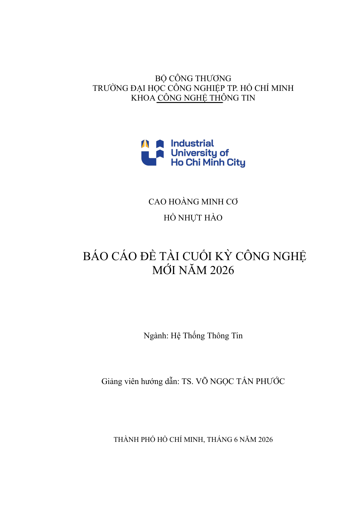

---

## TRANG BÌA TIẾNG ANH
*Trang bìa chính thức tiếng Anh*

<b>Xem nội dung (1 trang: trang 2 – 2)</b>

### Trang 2:

> INDUSTRIAL UNIVERSITY OF HO CHI MINH CITY 
> FACULTY OF INFORMATION TECHNOLOGY 
>  
>  
>  
>  
> CAO HOANG MINH CO 
> HO NHUT HAO 
>  
> FINAL TERM PROJECT REPORT 
> COURSE: EMERGING TECHNOLOGIES (2026) 
>  
>  
> Major: Information Systems 
>  
>  
>  
> Supervisor: Dr. VO NGOC TAN PHUOC 
>  
>  
>  
> HO CHI MINH CITY – JUNE 2026

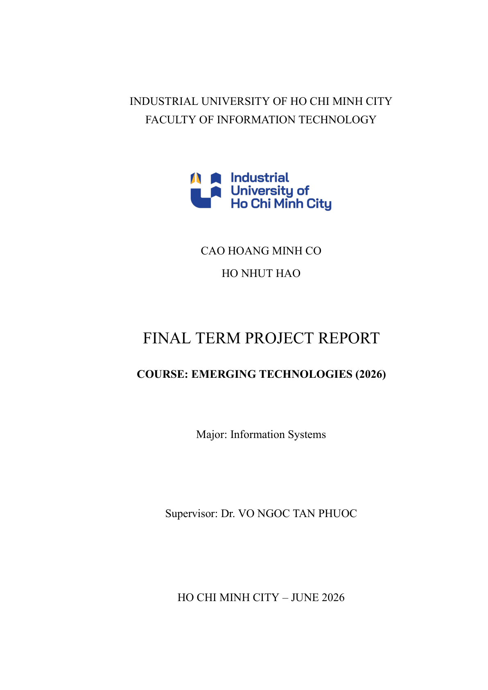

---

## ABSTRACT & TÓM TẮT
*Abstract tiếng Anh và Tóm tắt tiếng Việt*

<b>Xem nội dung (2 trang: trang 3 – 4)</b>

### Trang 3:

> ABSTRACT 
> Thesis Title: Researching Emerging Technologies and Developing an Event 
> Management System 
> In the modern digital era, event organization plays a crucial role in connecting 
> communities and promoting corporate branding. However, traditional event 
> management methods often encounter significant challenges, including complex 
> check-in processes, fragmented communication channels, and inefficient payment 
> handling. To address these issues, this graduation report focuses on researching 
> emerging web technologies and developing an integrated, automated Event 
> Management System. 
> The proposed system is built on a modern MERN stack architecture to ensure 
> scalability and high performance. Specifically, ReactJS is utilized to deliver a 
> dynamic and responsive user interface, while NodeJS and Express drive a robust 
> backend infrastructure. For data persistence, MongoDB is deployed as a flexible 
> NoSQL database solution. Notably, the system integrates WebSocket Realtime 
> technology to enable instant notifications, live attendee updates, and seamless 
> communication. Additionally, an automated Payment QR code gateway is 
> implemented to streamline ticket purchases and secure financial transactions. 
> The final outcome of this project is a fully functional, end-to-end platform that 
> simplifies event creation, attendee registration, ticket distribution, and real-time 
> management. The system successfully enhances operational efficiency, minimizes 
> administrative workloads, and significantly improves the overall user experience. 
> For future development, the platform could be further expanded by integrating data 
> analytics for attendee behavior and AI-driven event recommendations. 
> Keywords: event management system, ReactJS, NodeJS, MongoDB, WebSocket 
> Realtime, Payment QR code.

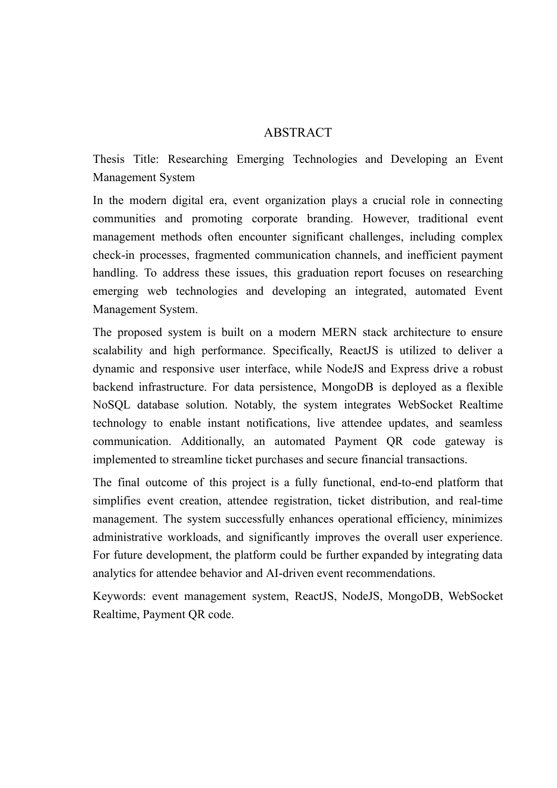

---

### Trang 4:

> TÓM TẮT 
> Tên đề tài: Tìm hiểu các công nghệ mới và Xây dựng hệ thống tổ chức sự kiện 
> Trong kỷ nguyên chuyển đổi số mạnh mẽ, việc tổ chức sự kiện đóng vai trò quan 
> trọng trong kết nối cộng đồng và quảng bá thương hiệu. Tuy nhiên, các phương thức 
> quản lý sự kiện truyền thống hiện nay thường gặp nhiều hạn chế như: quy trình 
> điểm danh (check-in) phức tạp, kênh tương tác giữa ban tổ chức và người tham gia 
> bị phân mảnh, cùng việc xử lý thanh toán vé thiếu sự tự động hóa. Để giải quyết 
> những thách thức này, đề tài tập trung nghiên cứu các công nghệ web mới nhằm xây 
> dựng một Hệ thống tổ chức sự kiện toàn diện và tự động hóa. 
> Hệ thống được thiết kế và triển khai dựa trên kiến trúc MERN stack hiện đại để 
> đảm bảo khả năng mở rộng và hiệu năng cao. Trong đó, công nghệ ReactJS được sử 
> dụng để xây dựng giao diện người dùng động và tương thích mượt mà; NodeJS kết 
> hợp cùng Express đóng vai trò xử lý các nghiệp vụ logic mạnh mẽ ở phía backend; 
> và hệ quản trị cơ sở dữ liệu NoSQL MongoDB được lựa chọn để lưu trữ dữ liệu một 
> cách linh hoạt. Đặc biệt, hệ thống tích hợp công nghệ WebSocket Realtime giúp 
> truyền tải thông báo tức thời, cập nhật số lượng khách tham dự theo thời gian thực. 
> Đồng thời, giải pháp cổng thanh toán tự động qua Mã QR (Payment QR code) cũng 
> được tích hợp nhằm tối ưu hóa quy trình mua vé và đảm bảo tính an toàn cho các 
> giao dịch tài chính. 
> Kết quả thực hiện của đề tài là một nền tảng hoàn chỉnh, hỗ trợ tối đa từ khâu 
> khởi tạo sự kiện, đăng ký tham gia, phân phối vé điện tử cho đến quản lý vận hành 
> trực quan. Hệ thống không chỉ nâng cao hiệu suất hoạt động, giảm thiểu khối lượng 
> công việc hành chính cho ban tổ chức mà còn cải thiện đáng kể trải nghiệm của 
> người dùng. Trong tương lai, hệ thống có thể phát triển mở rộng bằng cách tích hợp 
> thêm các công cụ phân tích dữ liệu hành

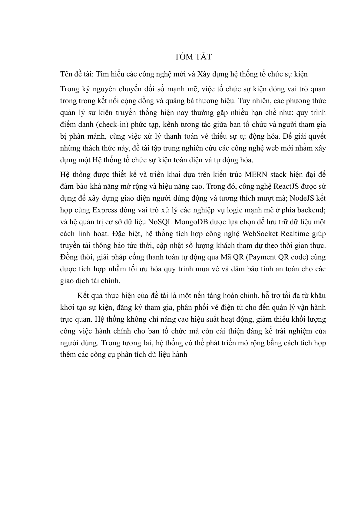

---

## LỜI CẢM ƠN
*Lời cảm ơn*

<b>Xem nội dung (1 trang: trang 5 – 5)</b>

### Trang 5:

> LỜI CẢM ƠN 
> Chúng em xin gửi lời cảm ơn chân thành và sâu sắc đến các thầy cô trong 
> khoa công nghệ thông tin, cũng như các thầy cô trong trường Đại Học Công Nghiệp 
> TP. Hồ Chí Minh đã chỉ dạy, dìu dắt và truyền đạt kiến thức kinh nghiệm cũng như 
> trải nghiệm thực tế quý báu của mình trong cả 4 năm mà chúng em học tập và 
> nghiên cứu ở trường.  
> Chúng em xin bày tỏ lòng biết ơn chân thành đến giảng viên TS. Võ Ngọc Tấn 
> Phước, người từng bước hướng dẫn, khuyên bảo và giúp đỡ tận tình chúng em trong 
> quá trình nghiên cứu và phát triển đề tài. Nhờ đó mà chúng em đã hoàn thành đề tài 
> đúng hạn và tích lũy cho bản thân những kinh nghiệm quý báu và thực tế.  
> Dù chúng em đã nỗ lực để hoàn thành đề tài tốt nhất, Nhưng do hạn chế về 
> thời gian và kiến thức, chúng em không tránh khỏi những thiếu sót. Chúng em rất 
> mong được sự cảm thông và góp ý tận tình của quý thầy cô.  
> Một lần nữa em xin chân thành cảm ơn.            
>  
>  
>  
>  
>  
>  
>  
>  
> Người thực hiện đề tài 
> 
> Cao Hoàng Minh Cơ 
>             Hồ Nhựt Hào

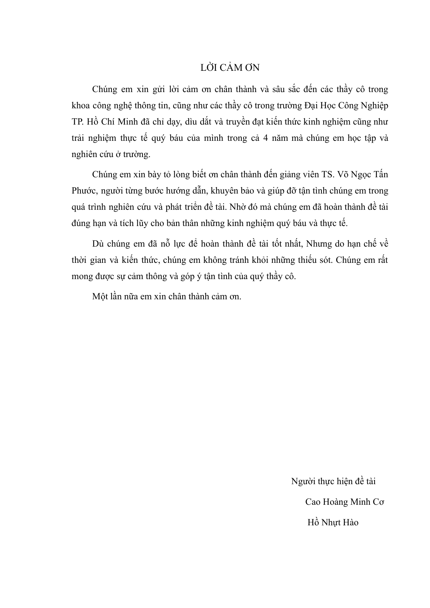

---

## NHẬN XÉT CỦA GIÁO VIÊN
*Nhận xét của Giáo viên hướng dẫn và phản biện*

<b>Xem nội dung (3 trang: trang 6 – 8)</b>

### Trang 6:

> NHẬN XÉT CỦA GIÁO VIÊN HƯỚNG DẪN 
> —-------------------------------------------------------------------------------------------
> ----------------------------------------------------------------------------------------------
> ----------------------------------------------------------------------------------------------
> ----------------------------------------------------------------------------------------------
> ----------------------------------------------------------------------------------------------
> ----------------------------------------------------------------------------------------------
> —-------------------------------------------------------------------------------------------
> ----------------------------------------------------------------------------------------------
> ----------------------------------------------------------------------------------------------
> ----------------------------------------------------------------------------------------------
> ----------------------------------------------------------------------------------------------
> ----------------------------------------------------------------------------------------------
> —-------------------------------------------------------------------------------------------
> ----------------------------------------------------------------------------------------------
> ----------------------------------------------------------------------------------------------
> ----------------------------------------------------------------------------------------------
> ----------------------------------------------------------------------------------------------
> ----------------------------------------------------------------------------------------------
> —-------------------------------------------------------------------------------------------
> ----------------------------------------------------------------------------------------------
> ----------------------------------------------------------------------------------------------
> ----------------------------------------------------------------------------------------------
> ----------------------------------------------------------------------------------------------
> ----------------------------------------------------------------------------------------------
> —-------------------------------------------------------------------------------------------
> ----------------------------------------------------------------------------------------------
> ----------------------------------------------------------------------------------------------
> ----------------------------------------------------------------------------------------------
> --------------------------------------------------------------------------------------------- 
> 
>  
> TP. Hồ Chí Minh, ngày…. Tháng …. năm……. 
>                                                                               CHỮ KÝ CỦA GIẢNG VIÊN

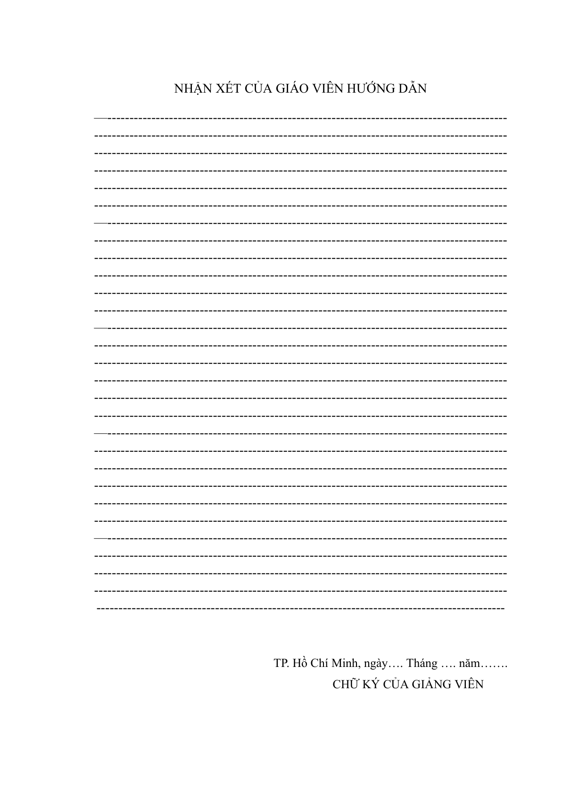

---

### Trang 7:

> NHẬN XÉT CỦA GIÁO VIÊN PHẢN BIỆN 1 
> 
>  
> —-------------------------------------------------------------------------------------------
> ----------------------------------------------------------------------------------------------
> ----------------------------------------------------------------------------------------------
> ----------------------------------------------------------------------------------------------
> ----------------------------------------------------------------------------------------------
> ----------------------------------------------------------------------------------------------
> —-------------------------------------------------------------------------------------------
> ----------------------------------------------------------------------------------------------
> ----------------------------------------------------------------------------------------------
> ----------------------------------------------------------------------------------------------
> ----------------------------------------------------------------------------------------------
> ----------------------------------------------------------------------------------------------
> —-------------------------------------------------------------------------------------------
> ----------------------------------------------------------------------------------------------
> ----------------------------------------------------------------------------------------------
> ----------------------------------------------------------------------------------------------
> ----------------------------------------------------------------------------------------------
> ----------------------------------------------------------------------------------------------
> —-------------------------------------------------------------------------------------------
> ----------------------------------------------------------------------------------------------
> ----------------------------------------------------------------------------------------------
> ----------------------------------------------------------------------------------------------
> ----------------------------------------------------------------------------------------------
> ----------------------------------------------------------------------------------------------
> —-------------------------------------------------------------------------------------------
> ----------------------------------------------------------------------------------------------
> ----------------------------------------------------------------------------------------------
> 
>  
> 
>  
> TP. Hồ Chí Minh, ngày…. Tháng ….  năm……. 
>                                                                               CHỮ KÝ CỦA GIẢNG VIÊN

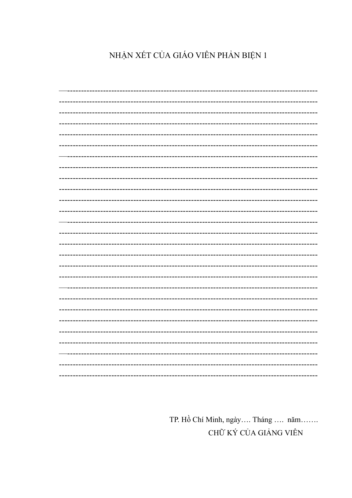

---

### Trang 8:

> NHẬN XÉT CỦA GIÁO VIÊN PHẢN BIỆN 2 
> —-------------------------------------------------------------------------------------------
> ----------------------------------------------------------------------------------------------
> ----------------------------------------------------------------------------------------------
> ----------------------------------------------------------------------------------------------
> ----------------------------------------------------------------------------------------------
> ----------------------------------------------------------------------------------------------
> —-------------------------------------------------------------------------------------------
> ----------------------------------------------------------------------------------------------
> ----------------------------------------------------------------------------------------------
> ----------------------------------------------------------------------------------------------
> ----------------------------------------------------------------------------------------------
> ----------------------------------------------------------------------------------------------
> —-------------------------------------------------------------------------------------------
> ----------------------------------------------------------------------------------------------
> ----------------------------------------------------------------------------------------------
> ----------------------------------------------------------------------------------------------
> ----------------------------------------------------------------------------------------------
> ----------------------------------------------------------------------------------------------
> —-------------------------------------------------------------------------------------------
> ----------------------------------------------------------------------------------------------
> ----------------------------------------------------------------------------------------------
> ----------------------------------------------------------------------------------------------
> ----------------------------------------------------------------------------------------------
> ----------------------------------------------------------------------------------------------
> —-------------------------------------------------------------------------------------------
> ----------------------------------------------------------------------------------------------
> ---------------------------------------------------------------------------------------------- 
> 
>  
> 
>  
> TP. Hồ Chí Minh, ngày…. Tháng ….  năm……. 
>                                                                               CHỮ KÝ CỦA GIẢNG VIÊN

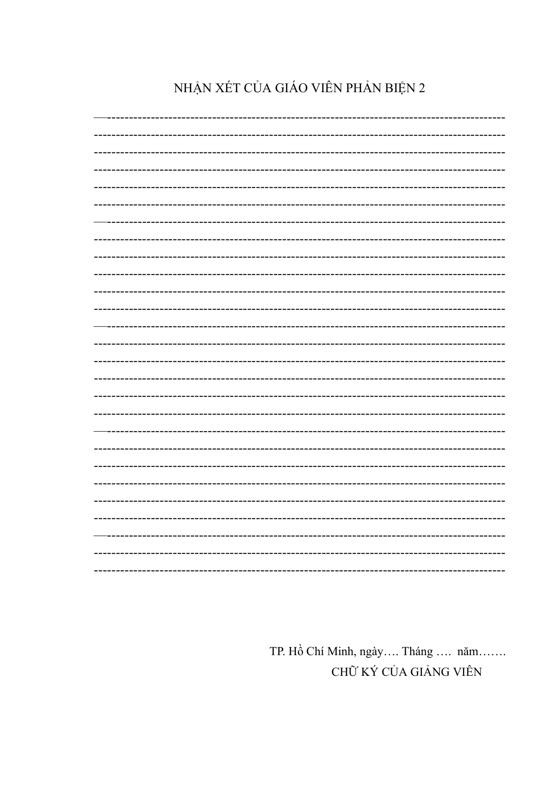

---

## MỤC LỤC
*Mục lục báo cáo*

<b>Xem nội dung (5 trang: trang 9 – 13)</b>

### Trang 9:

> MỤC LỤC 
> CHƯƠNG 1: GIỚI THIỆU.........................................................................................1 
> 1.1. Bối cảnh và lý do chọn đề tài......................................................................... 1 
> 1.2. Mục tiêu của đề tài....................................................................................2 
> 1.2.1. Mục tiêu tổng quát............................................................................2 
> 1.2.2. Mục tiêu cụ thể.................................................................................3 
> 1.3. Đối tượng nghiên cứu..........................................................................4 
> 1.4. Phương pháp thực hiện........................................................................5 
> 1.5. Kết quả đạt được..................................................................................6 
> CHƯƠNG 2: CƠ SỞ LÝ THUYẾT......................................................................7 
> 2.1. Tổng quan về kiến trúc phần mềm và mô hình tích hợp B2B & B2C........... 7 
> 2.1.1. Kiến trúc phân tách Frontend và Backend (Decoupled Architecture)...7 
> 2.1.2. Mô hình phân lớp nghiệp vụ BCE (Boundary - Control - Entity)......... 7 
> 2.1.3. Khái niệm và vòng đời hệ thống lai B2B và B2C (Hybrid Event 
> Lifecycle)......................................................................................................... 8 
> 2.2. Công nghệ tương tác và giao tiếp dữ liệu thời gian thực............................... 8 
> 2.2.1. Giao thức truyền tải dữ liệu hai chiều (WebSocket)..............................8 
> 2.2.2. Giải pháp đồng bộ trạng thái sơ đồ ghế ngồi với Socket.IO..................9 
> 2.3. Hạ tầng dữ liệu phi quan hệ (NoSQL Document-Oriented)...........................9 
> 2.3.1. Hệ quản trị cơ sở dữ liệu hướng tài liệu MongoDB.............................. 9 
> 2.3.2. Cơ chế nhúng tài liệu (Embedded Documents) và cấu trúc liên kết dữ 
> liệu..................................................................................................................10 
> 2.4. Kiến trúc xếp hàng và xử lý tác vụ nền bất đồng bộ.................................... 10 
> 2.4.1. Mô hình môi giới thông điệp Message Broker với RabbitMQ............10 
> 2.4.2. Ứng dụng xử lý tác vụ ngầm (Background Tasks Layer)....................10 
> 2.5. Trí tuệ nhân tạo và phân tích dữ liệu điều hành thông minh........................ 11 
> 2.5.1. Công nghệ xử lý ngôn ngữ tự nhiên và tích hợp Google Gemini AI...11 
> 2.5.2. Giải pháp trích xuất tri thức hỗ trợ quyết định kinh doanh (AI-Driven 
> Insights)..........................................................................................................11 
> CHƯƠNG 3: PHÂN TÍCH YÊU CẦU HỆ THỐNG......................................... 12 
> 3.1. Mục đích của hệ thống................................................................................. 12 
> 3.2. Phạm vi của hệ thống................................................................................... 12 
> 3.3. Mô tả bài toán...............................................................................................12 
> 3.4. Khảo sát hiện trạng và nhu cầu người dùng................................................. 12 
> 3.4.1. Hiện trạng quản lý tổ chức sự kiện...................................................... 12 
> 3.4.2. Những hạn chế của quy trình hiện tại.................................................. 12

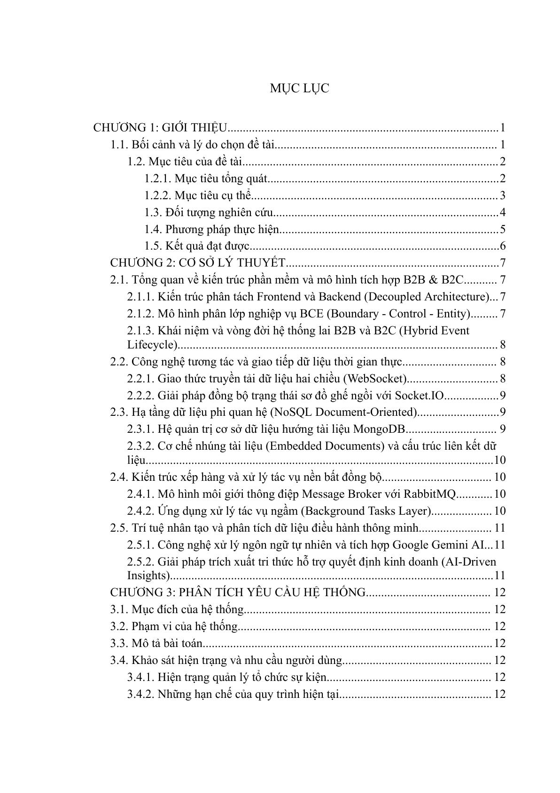

---

### Trang 10:

> 3.4.3. Nhu cầu đối với hệ thống mới..............................................................13 
> 3.5. Xác định các tác nhân của hệ thống (Actors)...............................................13 
> 3.6. Phân tích quy trình nghiệp vụ (Business Workflows)..................................13 
> 3.6.1. Quy trình xem phim/sự kiện và lịch diễn công khai............................13 
> 3.6.2. Quy trình đặt vé và giữ chỗ trực tuyến (B2C)..................................... 14 
> 3.6.3. Quy trình thanh toán và phát hành vé điện tử......................................14 
> 3.6.4. Quy trình đề xuất dự án và quản lý hợp đồng số (B2B)...................... 14 
> 3.6.5. Quy trình kiểm soát an ninh check-in bằng mã QR.............................14 
> 3.6.6. Quy trình trợ lý AI hỗ trợ kinh doanh và vận hành............................. 14 
> 3.7. Yêu cầu chức năng (Functional Requirements)........................................... 15 
> 3.7.1. Yêu cầu chức năng đối với khách hàng (Guest & Member)................15 
> 3.7.2. Yêu cầu chức năng đối với nhân viên (Employee)..............................15 
> 3.7.3. Yêu cầu chức năng đối với quản trị viên (Admin)...............................15 
> 3.8. Yêu cầu phi chức năng (Non-Functional Requirements).............................15 
> 3.9. Quy tắc nghiệp vụ (Business Rules).............................................................16 
> 3.10. Mô hình USE CASE tổng quát...................................................................17 
> Hình 3.1 Sơ đồ Use Case tổng quát..........................................................17 
> 3.11. Đặc tả USE CASE...................................................................................... 17 
> Bảng 3.1 Đặc tả Use Case - Đăng nhập................................................... 17 
> Bảng 3.2 Đặc tả Use Case - Đăng xuất.................................................... 18 
> Bảng 3.3 Đặc tả Use Case - Tìm kiếm sự kiện.........................................19 
> Bảng 3.4 Đặc tả Use Case - Xem chi tiết sự kiện.....................................20 
> Bảng 3.5 Đặc tả Use Case - Đăng ký tài khoản....................................... 21 
> Bảng 3.6 Đặc tả Use Case - Mua thêm vé................................................23 
> Bảng 3.7 Đặc tả Use Case - Tạo dự án sự kiện........................................ 24 
> Bảng 3.8 Đặc tả Use Case - Quản lý hợp đồng sự kiện........................... 25 
> Bảng 3.9 Đặc tả Use Case - Gửi thư mời tham gia sự kiện......................26 
> Bảng 3.10 Đặc tả Use Case - Xem hợp đồng cá nhân..............................27 
> Bảng 3.12 Đặc tả Use Case - Xem danh sách sự kiện..............................29 
> Bảng 3.13 Đặc tả Use Case - Quản lý hợp đồng cá nhân.........................29 
> Bảng 3.14 Đặc tả Use Case - QR Scanner soát vé................................... 30 
> Bảng 3.14 Đặc tả Use Case - Quản lý sự kiện..........................................32 
> Bảng 3.15 Đặc tả Use Case - Quản lý địa điểm....................................... 33 
> Bảng 3.16 Đặc tả Use Case - Quản lý dịch vụ......................................... 34 
> Bảng 3.17 Đặc tả Use Case - Quản lý thiết bị..........................................35 
> Bảng 3.18 Đặc tả Use Case - Quản lý nhân sự.........................................36 
> Bảng 3.19 Đặc tả Use Case - Quản lý hợp đồng tổng thể........................36

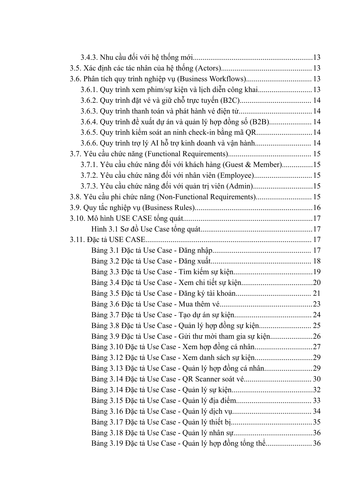

---

### Trang 11:

> Bảng 3.20 Đặc tả Use Case - Quản lý người dùng...................................37 
> Bảng 3.21 Đặc tả Use Case - Thống kê báo cáo...................................... 39 
> Bảng 3.22 Đặc tả Use Case - Duyệt yêu cầu sự kiện............................... 40 
> CHƯƠNG 4: THIẾT KẾ KIẾN TRÚC VÀ DỮ LIỆU............................................ 41 
> 4.1. Thiết kế Luồng Nghiệp vụ (Sequence Diagrams)...................................41 
> Hình 4.1 Sequence Diagram đăng nhập..............................................41 
> Hình 4.2 Sequence Diagram đăng xuất.............................................. 42 
> Hình 4.3 Sequence Diagram tìm kiếm sự kiện................................... 42 
> Hình 4.4 Sequence Diagram xem chi tiết sự kiện...............................43 
> Hình 4.5 Sequence Diagram đặt đăng ký tài khoản............................43 
> Hình 4.6 Sequence Diagram đặt vé.................................................... 44 
> Hình 4.7 Sequence Diagram hủy vé................................................... 44 
> Hình 4.8 Sequence Diagram mua thêm vé......................................... 45 
> Hình 4.9 Sequence Diagram đặt vé trực tuyến................................... 45 
> Hình 4.9 Sequence Diagram quản lý hợp đồng cá nhân.....................46 
> Hình 4.10 Sequence Diagram gửi thư mời tham gia sự kiện..............46 
> Hình 4.11 Sequence Diagram quản lý sự kiện....................................47 
> Hình 4.12 Sequence Diagram quản lý địa điểm................................. 47 
> Hình 4.13 Sequence Diagram quản lý dịch vụ................................... 48 
> Hình 4.14 Sequence Diagram quản lý thiết bị....................................48 
> Hình 4.15 Sequence Diagram quản lý nhân sự...................................48 
> Hình 4.16 Sequence Diagram quản lý hợp đồng tổng thể.................. 49 
> Hình 4.17 Sequence Diagram quản lý người dùng.............................49 
> Hình 4.18 Sequence Diagram quản lý thống kê báo cáo....................50 
> - Quản lý khách hàng toàn hệ thống.............................................................. 50 
> Hình 4.19 Sequence Diagram quản lý khách hàng hệ thống..............50 
> 4.2 Cấu trúc thư mục dự án............................................................................50 
> 4.3 Đánh giá hệ thống.................................................................................... 51 
> Hình 1.1: Giao diện trang chủ hệ thống Lumina EMS (Cổng thông tin 
> Client)................................................................................................. 68 
> Hình 1.2: Giao diện trang chủ hệ thống Lumina EMS (Cổng thông tin 
> Client)................................................................................................. 69 
> Hình 1.3: Giao diện trang chủ hệ thống Lumina EMS (Cổng thông tin 
> Client)................................................................................................. 69 
> Hình 1.4: Giao diện trang chủ hệ thống Lumina EMS (Cổng thông tin 
> Client)................................................................................................. 70 
> Hình 1.5: Giao diện trang chủ hệ thống Lumina EMS (Cổng thông tin 
> Client)................................................................................................. 70

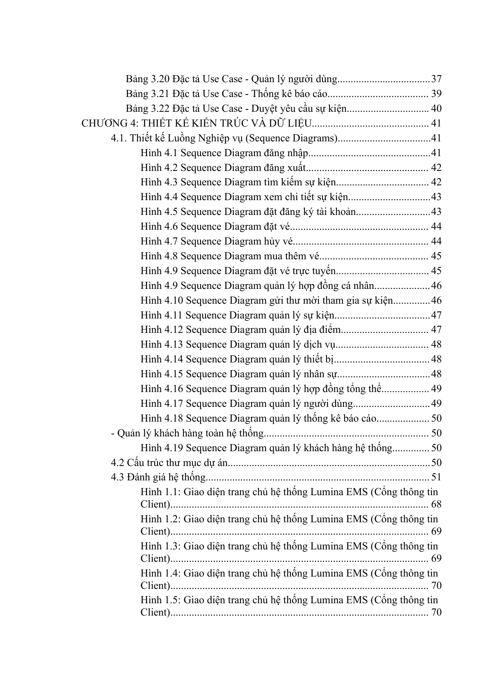

---

### Trang 12:

> Hình 1.6: Giao diện đăng ký tài khoản thành viên hệ thống.............. 71 
> Hình 1.7: Giao diện đăng nhập tài khoản thành viên hệ thống...........71 
> Hình 2.1: Giao diện thống kê và báo cáo............................................72 
> Hình 2.2: Giao diện quản lý sự kiện................................................... 72 
> Hình 2.3: Giao diện duyệt yêu cầu sự kiện.........................................73 
> Hình 2.4: Giao diện quản lý hợp đồng................................................73 
> Hình 2.5: Giao diện quản lý địa điểm.................................................74 
> Hình 2.6: Giao diện quản lý dịch vụ...................................................74 
> Hình 2.7: Giao diện quản lý thiết bị....................................................75 
> Hình 2.7: Giao diện quản lý nhân sự.................................................. 75 
> Hình 2.8: Giao diện quản lý khách hàng............................................ 76 
> Hình 2.9: Giao diện hộp thư yêu cầu..................................................76 
> Hình 3.1: Giao diện tủ quét vé QR..................................................... 77 
> Hình 3.2: Giao diện quản lý hợp đồng................................................77 
> Hình 3.3: Giao diện quản lý dự án sự kiện......................................... 78 
> Hình 3.4: Giao diện thư mời & RSVP................................................78 
> Hình 3.4: Giao diện Quản lý tài khoản............................................... 79 
> Hình 4.1: Giao diện hợp đồng cá nhân............................................... 79 
> Hình 4.2: Giao diện tất cả hợp đồng...................................................80 
> Hình 4.3: Giao diện danh sách sự kiện............................................... 80 
> Hình 4.4: Giao diện đề xuất sự kiện................................................... 81 
> Hình 4.5: Giao diện QR Scanner........................................................ 82 
> Hình 4.6: Giao diện thông tin cá nhân................................................82 
> CHƯƠNG 5: HIỆN THỰC & HƯỚNG DẪN CÀI ĐẶT.................................. 82 
> 5.1. Yêu cầu hệ thống và môi trường.............................................................82 
> 5.2. Các bước cấu hình cơ sở dữ liệu mẫu (Seeding).................................... 83 
> 5.3. Hướng dẫn khởi động các dịch vụ (Frontend, Backend)........................83 
> CHƯƠNG 6: ĐÁNH GIÁ & HƯỚNG PHÁT TRIỂN.......................................84 
> 6.1. Đánh giá kết quả thực nghiệm và ưu/nhược điểm hệ thống.........................84 
> 6.1.1. Ưu điểm nổi bật................................................................................... 85 
> 6.1.2. Nhược điểm và hạn chế tồn tại............................................................ 86 
> 6.2. Phân tích SWOT & Khuyến nghị vận hành (AI Generated Insight)...... 86 
> Khuyến nghị vận hành kỹ thuật:.................................................................... 87 
> 6.3. Kế hoạch phát triển tương lai..................................................................88 
> CHƯƠNG 7: GIẢI PHÁP ĐẢM BẢO AN TOÀN THÔNG TIN VÀ KHẢ 
> NĂNG MỞ RỘNG HỆ THỐNG........................................................................ 89 
> 8.1. Kiến trúc an toàn thông tin và giải pháp phòng thủ hệ thống.......................89

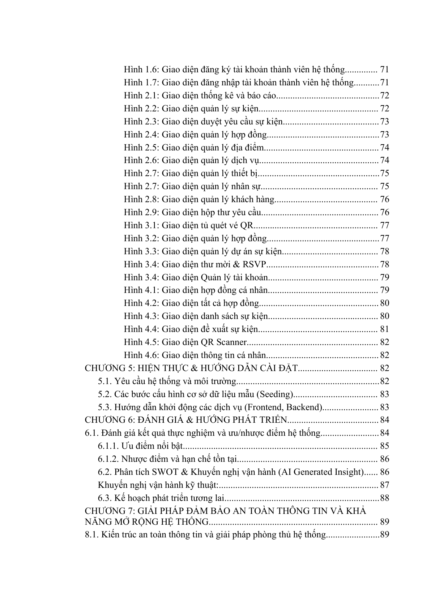

---

### Trang 13:

> 8.1.1. Giải pháp mã hóa dữ liệu tầng lưu trữ và tầng truyền tải.................... 89 
> 8.1.2. Cơ chế kiểm soát truy cập và phòng chống tấn công logic (Rate 
> Limiting)........................................................................................................ 90 
> 8.2. Giải pháp tối ưu hóa hiệu năng và khả năng mở rộng quy mô (Scalability)90 
> 8.2.1. Giải pháp tối ưu hóa truy vấn dữ liệu NoSQL (Database Indexing)... 90 
> 8.2.2. Chiến lược mở rộng quy mô hệ thống theo chiều ngang (Horizontal 
> Scaling).......................................................................................................... 91 
> TÀI LIỆU THAM KHẢO.........................................................................................91

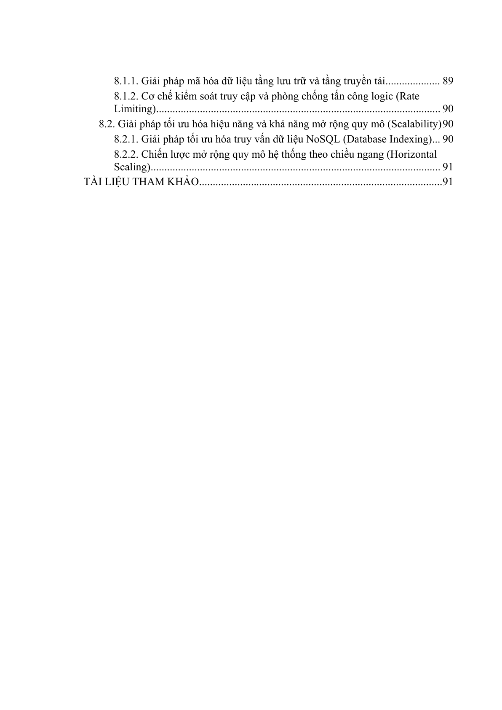

---

## DANH MỤC HÌNH ẢNH
*Danh mục hình ảnh*

<b>Xem nội dung (2 trang: trang 14 – 15)</b>

### Trang 14:

> DANH MỤC HÌNH ẢNH 
> CHƯƠNG 4: THIẾT KẾ KIẾN TRÚC VÀ DỮ LIỆU............................................ 41 
> 4.1. Thiết kế Luồng Nghiệp vụ (Sequence Diagrams).................................. 41 
> Hình 4.1 Sequence Diagram đăng nhập..............................................41 
> Hình 4.2 Sequence Diagram đăng xuất.............................................. 42 
> Hình 4.3 Sequence Diagram tìm kiếm sự kiện................................... 42 
> Hình 4.4 Sequence Diagram xem chi tiết sự kiện...............................43 
> Hình 4.5 Sequence Diagram đặt đăng ký tài khoản............................43 
> Hình 4.6 Sequence Diagram đặt vé.................................................... 44 
> Hình 4.7 Sequence Diagram hủy vé................................................... 44 
> Hình 4.8 Sequence Diagram mua thêm vé......................................... 45 
> Hình 4.9 Sequence Diagram đặt vé trực tuyến................................... 45 
> Hình 4.9 Sequence Diagram quản lý hợp đồng cá nhân.....................46 
> Hình 4.10 Sequence Diagram gửi thư mời tham gia sự kiện..............46 
> Hình 4.11 Sequence Diagram quản lý sự kiện....................................47 
> Hình 4.12 Sequence Diagram quản lý địa điểm................................. 47 
> Hình 4.13 Sequence Diagram quản lý dịch vụ................................... 48 
> Hình 4.14 Sequence Diagram quản lý thiết bị....................................48 
> Hình 4.15 Sequence Diagram quản lý nhân sự...................................48 
> Hình 4.16 Sequence Diagram quản lý hợp đồng tổng thể..................49 
> Hình 4.17 Sequence Diagram quản lý người dùng.............................49 
> Hình 4.18 Sequence Diagram quản lý thống kê báo cáo....................50 
> - Quản lý khách hàng toàn hệ thống.............................................................. 50 
> Hình 4.19 Sequence Diagram quản lý khách hàng hệ thống..............50 
> 4.2 Cấu trúc thư mục dự án............................................................................50 
> 4.3 Đánh giá hệ thống....................................................................................51 
> Hình 1.1: Giao diện trang chủ hệ thống Lumina EMS (Cổng thông tin 
> Client)................................................................................................. 68 
> Hình 1.2: Giao diện trang chủ hệ thống Lumina EMS (Cổng thông tin 
> Client)................................................................................................. 69 
> Hình 1.3: Giao diện trang chủ hệ thống Lumina EMS (Cổng thông tin 
> Client)................................................................................................. 69 
> Hình 1.4: Giao diện trang chủ hệ thống Lumina EMS (Cổng thông tin 
> Client)................................................................................................. 70 
> Hình 1.5: Giao diện trang chủ hệ thống Lumina EMS (Cổng thông tin 
> Client)................................................................................................. 70 
> Hình 1.6: Giao diện đăng ký tài khoản thành viên hệ thống.............. 71

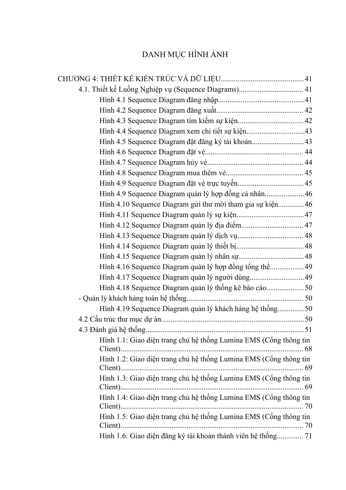

---

### Trang 15:

> Hình 1.7: Giao diện đăng nhập tài khoản thành viên hệ thống...........71 
> Hình 2.1: Giao diện thống kê và báo cáo............................................72 
> Hình 2.2: Giao diện quản lý sự kiện................................................... 72 
> Hình 2.3: Giao diện duyệt yêu cầu sự kiện.........................................73 
> Hình 2.4: Giao diện quản lý hợp đồng................................................73 
> Hình 2.5: Giao diện quản lý địa điểm.................................................74 
> Hình 2.6: Giao diện quản lý dịch vụ...................................................74 
> Hình 2.7: Giao diện quản lý thiết bị................................................... 75 
> Hình 2.7: Giao diện quản lý nhân sự.................................................. 75 
> Hình 2.8: Giao diện quản lý khách hàng............................................ 76 
> Hình 2.9: Giao diện hộp thư yêu cầu..................................................76 
> Hình 3.1: Giao diện tủ quét vé QR..................................................... 77 
> Hình 3.2: Giao diện quản lý hợp đồng................................................77 
> Hình 3.3: Giao diện quản lý dự án sự kiện......................................... 78 
> Hình 3.4: Giao diện thư mời & RSVP................................................78 
> Hình 3.4: Giao diện Quản lý tài khoản...............................................79 
> Hình 4.1: Giao diện hợp đồng cá nhân............................................... 79 
> Hình 4.2: Giao diện tất cả hợp đồng...................................................80 
> Hình 4.3: Giao diện danh sách sự kiện............................................... 80 
> Hình 4.4: Giao diện đề xuất sự kiện................................................... 81 
> Hình 4.5: Giao diện QR Scanner........................................................ 82 
> Hình 4.6: Giao diện thông tin cá nhân................................................82

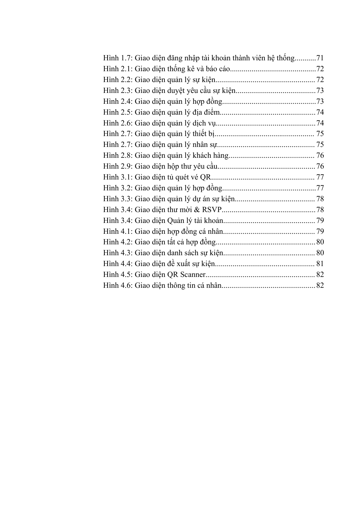

---

## DANH MỤC BẢNG BIỂU
*Danh mục bảng biểu*

<b>Xem nội dung (2 trang: trang 16 – 17)</b>

### Trang 16:

> DANH MỤC BẢNG BIỂU 
> 3.10. Mô hình USE CASE tổng quát...................................................................17 
> Hình 3.1 Sơ đồ Use Case tổng quát..........................................................17 
> 3.11. Đặc tả USE CASE......................................................................................17 
> Bảng 3.1 Đặc tả Use Case - Đăng nhập................................................... 17 
> Bảng 3.2 Đặc tả Use Case - Đăng xuất.................................................... 18 
> Bảng 3.3 Đặc tả Use Case - Tìm kiếm sự kiện.........................................19 
> Bảng 3.4 Đặc tả Use Case - Xem chi tiết sự kiện.................................... 20 
> Bảng 3.5 Đặc tả Use Case - Đăng ký tài khoản....................................... 21 
> Bảng 3.6 Đặc tả Use Case - Mua thêm vé................................................23 
> Bảng 3.7 Đặc tả Use Case - Tạo dự án sự kiện........................................24 
> Bảng 3.8 Đặc tả Use Case - Quản lý hợp đồng sự kiện........................... 25

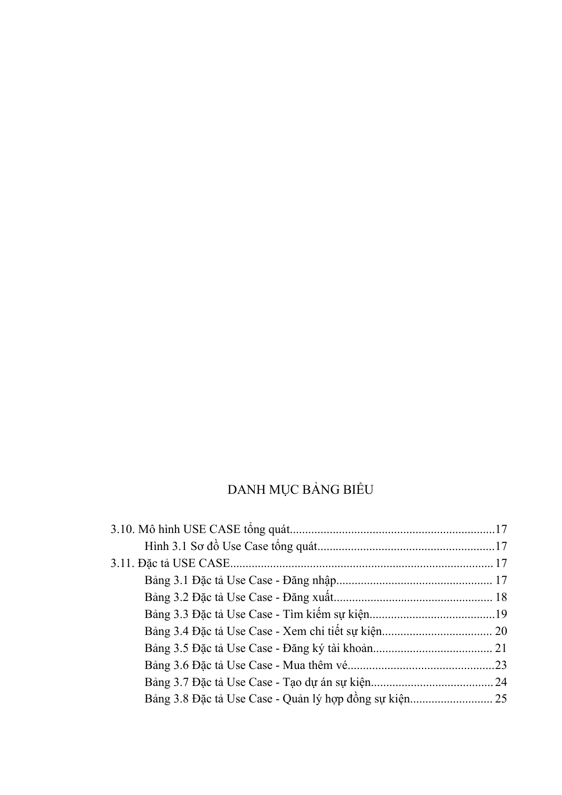

---

### Trang 17:

> Bảng 3.9 Đặc tả Use Case - Gửi thư mời tham gia sự kiện......................26 
> Bảng 3.10 Đặc tả Use Case - Xem hợp đồng cá nhân..............................27 
> Bảng 3.12 Đặc tả Use Case - Xem danh sách sự kiện..............................29 
> Bảng 3.13 Đặc tả Use Case - Quản lý hợp đồng cá nhân.........................29 
> Bảng 3.14 Đặc tả Use Case - QR Scanner soát vé................................... 30 
> Bảng 3.14 Đặc tả Use Case - Quản lý sự kiện......................................... 32 
> Bảng 3.15 Đặc tả Use Case - Quản lý địa điểm....................................... 33 
> Bảng 3.16 Đặc tả Use Case - Quản lý dịch vụ......................................... 34 
> Bảng 3.17 Đặc tả Use Case - Quản lý thiết bị..........................................35 
> Bảng 3.18 Đặc tả Use Case - Quản lý nhân sự.........................................36 
> Bảng 3.19 Đặc tả Use Case - Quản lý hợp đồng tổng thể........................36 
> Bảng 3.20 Đặc tả Use Case - Quản lý người dùng...................................37 
> Bảng 3.21 Đặc tả Use Case - Thống kê báo cáo...................................... 39 
> Bảng 3.22 Đặc tả Use Case - Duyệt yêu cầu sự kiện............................... 40

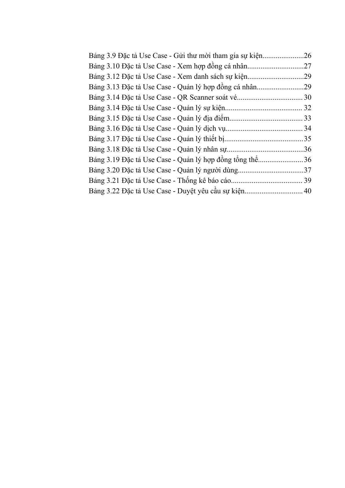

---

## DANH MỤC CÁC THUẬT NGỮ VIẾT TẮT
*Danh mục thuật ngữ viết tắt*

<b>Xem nội dung (2 trang: trang 18 – 19)</b>

### Trang 18:

> DANH MỤC CÁC THUẬT NGỮ VIẾT TẮT 
> Từ viết tắt 
> Từ đầy đủ 
> Nghĩa 
> UI 
> User Interface 
> Giao diện người 
> dùng 
> HTML 
> HyperText Markup Language 
> Ngôn ngữ siêu văn 
> bản 
> CSS 
> Cascading Style Sheets 
> Ngôn ngữ tạo phong 
> cách cho trang web 
> JS 
> JavaScript 
> Là một ngôn ngữ 
> lập trình thông dịch 
> PHP 
> Personal Home Page 
> Ngôn ngữ lập trình 
> kịch bản 
> DBMS 
> Database Management System 
> Hệ quản trị cơ sở dữ 
> liệu 
> CRUD 
> Create – Read – Update – Delete 
> Tạo – Đọc – Cập 
> nhật – Xóa 
> AI 
> Artificial Intelligence 
> Trí tuệ nhân tạo 
> MVC 
> Model – View – Controller 
> Mô hình kiến trúc 
> phần mềm gồm 
> Model – View – 
> Controller 
> API 
> Application Programming Interface 
> Giao diện lập trình 
> ứng dụng

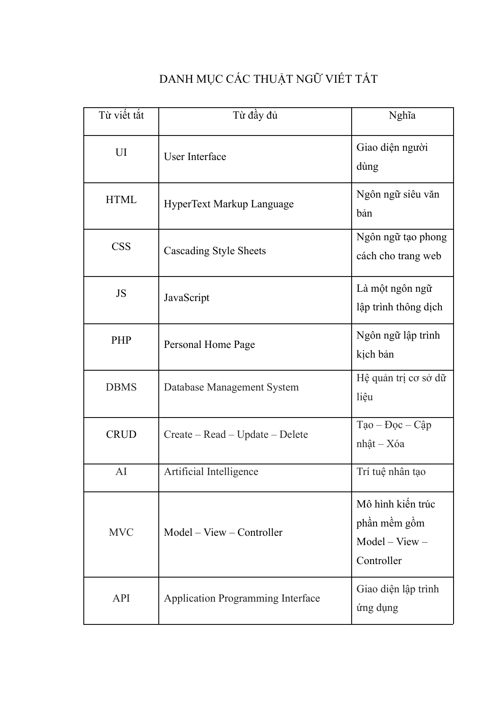

---

### Trang 19:

> B2B  
> Business-to-Business  
> Mô hình kinh doanh 
> giữa các doanh 
> nghiệp 
> B2C  
> Business-to-Consumer  
> Mô hình kinh doanh 
> giữa các doanh 
> nghiệpvà khách 
> hàng các nhân 
> EMS  
> Event Management System  
> Hệ thống quản lý sự 
> kiện  
> JWT  
> JSON Web Token  
> Phương thức xác 
> thực an toàn bằng 
> chuỗi mã hóa  
> OTP  
> One-Time Password  
> Mật khẩu sử dụng 
> một lần để xác thực  
> QR Code  
> Quick Response Code  
> Mã phản hồi nhanh 
> dùng để lưu trữ/soát 
> vé  
> SPA  
> Single Page Application  
> Ứng dụng web tải 
> một trang duy nhất

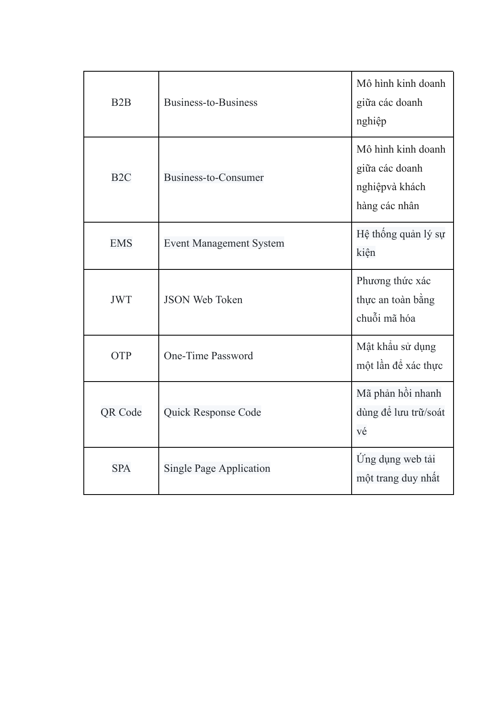

---

## CHƯƠNG 1: GIỚI THIỆU
*Bối cảnh, mục tiêu, đối tượng nghiên cứu, phương pháp thực hiện, kết quả đạt được*

<b>Xem nội dung (6 trang: trang 20 – 25)</b>

### Trang 20:

> CHƯƠNG 1: GIỚI THIỆU 
> 1.1. Bối cảnh và lý do chọn đề tài 
> Trong kỷ nguyên chuyển đổi số toàn diện và sự bùng nổ của nền kinh tế trải 
> nghiệm, ngành công nghiệp tổ chức sự kiện và quản lý vé trực tuyến đang chứng 
> kiến những bước chuyển dịch mang tính bước ngoặt. Các đại nhạc hội quy mô lớn, 
> hội nghị công nghệ đa quốc gia hay các giải đấu thể thao chuyên nghiệp không còn 
> đơn thuần là những buổi tập trung cơ học, mà đã trở thành những hệ sinh thái phức 
> tạp, đòi hỏi quy trình vận hành nghiêm ngặt và giải pháp công nghệ vận hành chuẩn 
> xác. 
> Tuy nhiên, khi đối chiếu với thực trạng hạ tầng ứng dụng hiện nay, các doanh 
> nghiệp và nhà tổ chức sự kiện đang phải đối mặt với một bài toán nan giải về sự 
> phân mảnh hệ thống. Thị trường hiện tại bị chia rẽ thành hai thái cực biệt lập: 
> ● Hệ thống thuần B2C (Business-to-Consumer): Chỉ tập trung vào bề nổi của 
> thị trường là phân phối, bán vé lẻ và tương tác khách hàng, nhưng hoàn toàn 
> bỏ trống khâu quản lý nghiệp vụ thượng nguồn. 
> ● Hệ thống thuần B2B (Business-to-Business): Chỉ giải quyết các bài toán nội 
> bộ như lập kế hoạch, thẩm định ngân sách, phê duyệt địa điểm và ký kết hợp 
> đồng số pháp lý giữa các pháp nhân liên quan, nhưng lại thiếu đi cổng kết 
> nối phân phối trực tiếp đến tay người tiêu dùng cuối cùng. 
> Sự đứt gãy mạch dữ liệu này dẫn đến hệ quả tất yếu: các đơn vị tổ chức phải vận 
> hành thủ công bằng cách chắp vá nhiều phần mềm rời rạc. Việc chuyển tiếp dữ liệu 
> thủ công từ khâu duyệt dự án sang khâu lên sàn bán vé không chỉ gây chậm trễ, lãng 
> phí tài nguyên mà còn tiềm ẩn rủi ro cực kỳ lớn về sai sót số liệu tài chính. Đặc biệt, 
> trong những giai đoạn cao điểm (Peak-time) khi mở bán vé các sự kiện lớn, hiện 
> tượng nghẽn cổ chai (Bottleneck) khi xử lý đồng thời (Concurrency) hàng vạn giao 
> dịch, cùng với bài toán kiểm soát an ninh check-in thời gian thực (Real-time Scan) 
> 
>  1

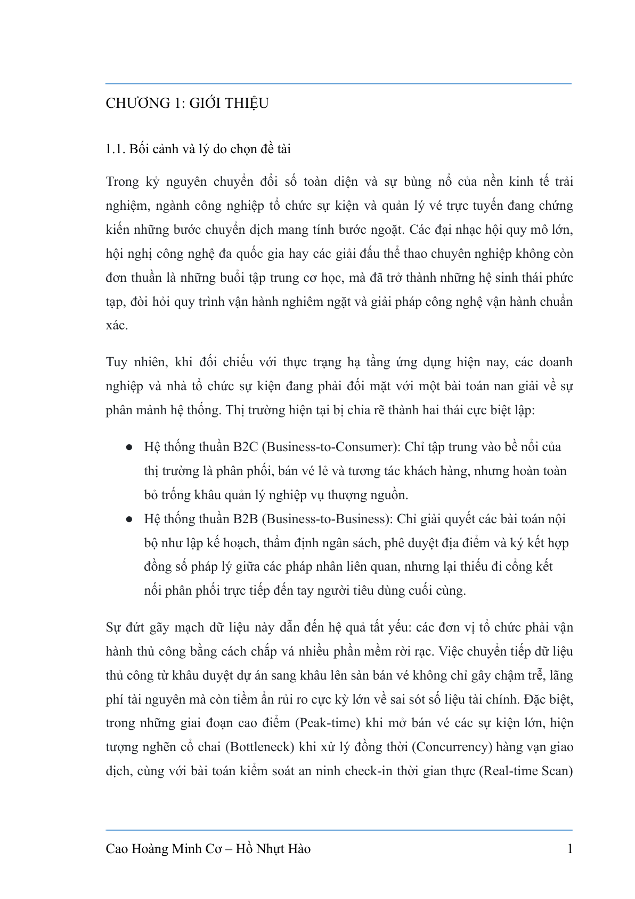

---

### Trang 21:

> tại cổng nhằm ngăn chặn vé giả mạo, đang là những thách thức kỹ thuật cốt lõi chưa 
> có giải pháp nào giải quyết triệt để trên một nền tảng duy nhất. 
> Nhận thức rõ tầm quan trọng của việc xây dựng một hệ thống thông tin nhất quán, 
> tối ưu và xuyên suốt, nhóm nghiên cứu đã tiến hành phát triển đề tài: "Xây dựng hệ 
> thống quản lý và tổ chức sự kiện Lumina EMS". Hệ thống ra đời với sứ mệnh xóa 
> bỏ rào cản phân mảnh bằng cách tiên phong hợp nhất mô hình lai B2B và B2C trên 
> một nền tảng kiến trúc microservices đồng bộ. Lumina EMS số hóa toàn bộ vòng 
> đời của một sự kiện: từ khâu tiếp nhận đề xuất dự án, tự động ràng buộc lịch trình 
> địa điểm, quản trị phê duyệt, tự động sinh hợp đồng kinh tế và dòng tiền pháp lý, 
> cho đến việc phân phối vé qua cơ chế cổng thanh toán QR Code động thời gian 
> thực, quản lý thư mời RSVP và tích hợp hệ thống QR Scanner kiểm soát check-in 
> bảo mật tại thực địa sự kiện. 
> Việc nghiên cứu và triển khai thành công đề tài này không chỉ mang lại giá trị thực 
> tiễn cao cho các nhà tổ chức sự kiện trong việc tối ưu hóa chi phí vận hành và nâng 
> cao trải nghiệm khách hàng, mà còn là một minh chứng khoa học cho việc ứng 
> dụng các công nghệ hiện đại nhằm giải quyết các bài toán hệ thống thông tin quy 
> mô lớn, có độ phức tạp cao trong thời đại số. 
> 1.2. Mục tiêu của đề tài 
> 1.2.1. Mục tiêu tổng quát 
> Mục tiêu tổng quát của đề tài là nghiên cứu, thiết kế và xây dựng thành công hệ 
> thống quản lý và tổ chức sự kiện toàn diện mang tên Lumina EMS trên nền tảng 
> ứng dụng Web hiện đại. Hệ thống hướng tới việc xóa bỏ hoàn toàn sự đứt gãy mạch 
> dữ liệu và phân mảng hệ thống bằng cách tiên phong hợp nhất hai mô hình kinh 
> doanh cốt lõi B2B và B2C trên một kiến trúc đồng bộ. 
> Thông qua Lumina EMS, đề tài đặt mục tiêu số hóa và tự động hóa toàn bộ vòng 
> đời của một sự kiện: từ khâu doanh nghiệp gửi đề xuất kế hoạch, thẩm định ràng 
> buộc tài nguyên địa điểm, quản trị phê duyệt, khởi tạo hợp đồng số (phân hệ B2B); 
> cho đến khâu cấu hình sơ đồ ghế ngồi, phân phối vé lẻ trực tuyến, xử lý dòng tiền 
> qua cổng thanh toán QR Code động, quản lý thư mời RSVP và soát vé thực địa qua 
> mã QR (phân hệ B2C). Sản phẩm hoàn thiện phải đạt được các tiêu chí về khả năng 
> 
>  2

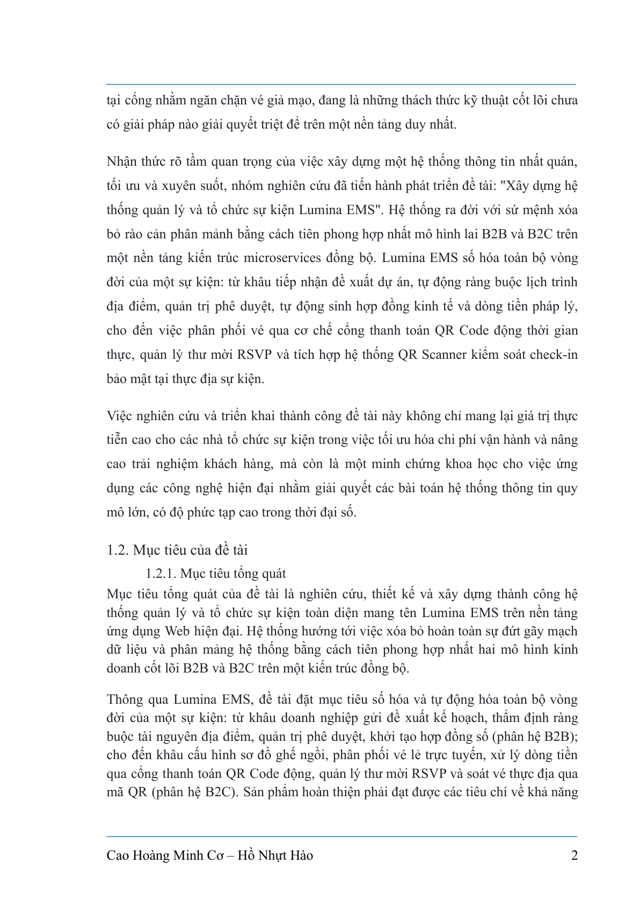

---

### Trang 22:

> chịu tải tốt, tính an toàn thông tin cao, đồng bộ dữ liệu thời gian thực mượt mà và 
> tối ưu hóa tối đa chi phí vận hành cũng như nguồn nhân lực cho các đơn vị tổ chức. 
> 1.2.2. Mục tiêu cụ thể 
> Để đạt được mục tiêu tổng quát nêu trên, nhóm nghiên cứu phân rã thành các mục 
> tiêu cụ thể cần hoàn thiện trong suốt quá trình triển khai đề tài bao gồm: 
> Về mặt phân tích và thiết kế hệ thống: 
> ○ Khảo sát chi tiết quy trình nghiệp vụ tổ chức sự kiện thực tế để xác 
> định đúng hành vi và nhu cầu của 5 tác nhân (Actor) tham gia vào hệ 
> thống bao gồm: Khách vãng lai (Guest), Khách hàng thành 
> viên/Doanh nghiệp (Member), Người tổ chức (Organizer), Nhân viên 
> kiểm soát (Employee) và Quản trị viên (Admin). 
> ○ Mô hình hóa toàn bộ kiến trúc phần mềm bằng ngôn ngữ UML chuẩn 
> chỉnh, hoàn thiện hệ thống sơ đồ Use Case tổng quát, ma trận phân 
> quyền, sơ đồ hoạt động phân làn (Activity Diagram), mô hình miền 
> khái niệm (Domain Model) và sơ đồ tương tác tuần tự (Sequence 
> Diagram) bám sát cấu trúc phân lớp BCE (Boundary - Control - 
> Entity). 
> ○ Thiết kế kiến trúc cơ sở dữ liệu phi quan hệ (NoSQL 
> Document-oriented) linh hoạt trên MongoDB, tối ưu hóa cấu hình 
> index cho 13 Mongoose Schemas để đảm bảo tốc độ truy vấn thông 
> tin nhanh chóng. 
> Về mặt hiện thực chức năng phần mềm: 
> ○ Đối với phân hệ Khách hàng (Member / Organizer): Hiện thực hoàn 
> chỉnh tính năng chọn vị trí và giữ chỗ tương tác (Hold Seat tối đa 10 
> ghế trong 10 phút), tích hợp tự động hóa thanh toán VietQR động, 
> sinh mã QR cho vé điện tử, xây dựng module quản lý/upload hợp 
> đồng số hóa và trung tâm quản lý thư mời gửi mail hàng loạt RSVP. 
> ○ Đối với phân hệ Nhân viên (Employee): Xây dựng công cụ soát vé 
> check-in thời gian thực kết hợp thư viện html5-qrcode để quét mã QR 
> định danh qua camera máy trạm, tự động đối chiếu và cập nhật trạng 
> thái vé sang "Checked-in" trong cơ sở dữ liệu. 
> ○ Đối với phân hệ Quản trị viên (Admin): Thiết lập Dashboard điều 
> hành trực quan, cấu hình thuật toán gán quyền phụ trách và kiểm tra 
> ràng buộc tự động để ngăn chặn tình trạng phê duyệt hai sự kiện trùng 
> lịch scheduled tại cùng một địa điểm. 
> 
>  3

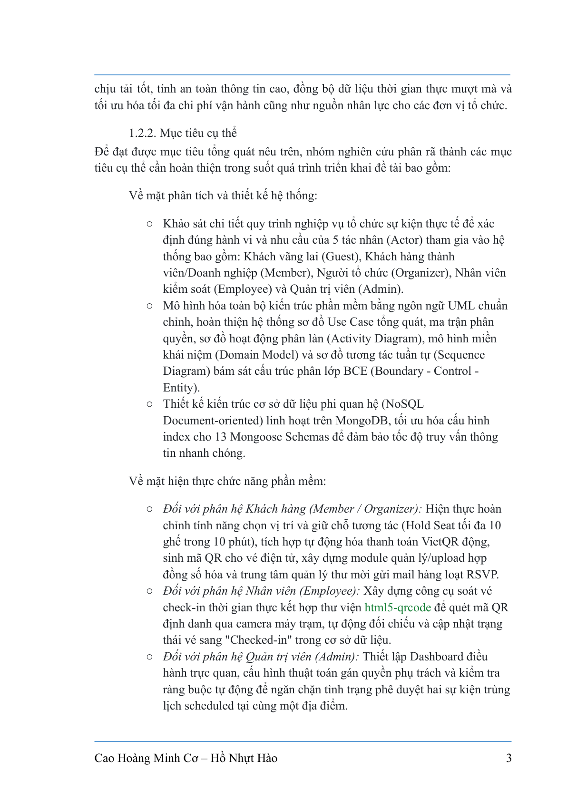

---

### Trang 23:

> Về mặt ứng dụng giải pháp công nghệ mới: 
> ○ Làm chủ công nghệ WebSocket (Socket.IO) để xử lý truyền tải thông 
> điệp hai chiều, đồng bộ tức thời trạng thái sơ đồ ghế ngồi đến tất cả 
> các client đang kết nối nhằm loại bỏ hoàn toàn hiện tượng tranh chấp 
> đặt trùng chỗ (Race Condition). 
> ○ Tích hợp hệ thống hàng đợi tin nhắn RabbitMQ (Message Queue) 
> đóng vai trò bộ đệm xử lý bất đồng bộ (Asynchronous) các tác vụ gửi 
> mail OTP xác thực, mail RSVP và xuất vé điện tử, giúp giảm thiểu độ 
> trễ giao diện và bảo vệ hệ thống không bị nghẽn cổ chai (Bottleneck) 
> khi lượng giao dịch tăng đột biến. 
> ○ Nhúng thành công trí tuệ nhân tạo thông qua Google Gemini AI API 
> để tự động đọc dữ liệu kinh doanh của hệ thống, thực hiện phân tích 
> ma trận SWOT tự động và đưa ra các khuyến nghị, dự báo chiến lược 
> vận hành thông minh cho người quản trị. 
> 1.3. Đối tượng nghiên cứu 
> Đối tượng nghiên cứu trọng tâm của đề tài được tiếp cận toàn diện dựa trên hai 
> phương diện cốt lõi của một hệ thống thông tin quản lý: 
> ● Về quy trình nghiệp vụ và cấu trúc dữ liệu nền tảng (Luồng tích hợp B2B & 
> B2C): 
> ○ Quy trình tiếp nhận, xử lý và phê duyệt tự động các yêu cầu đề xuất 
> kế hoạch tổ chức sự kiện từ khách hàng doanh nghiệp. 
> ○ Quy trình thiết lập, quản lý và thay đổi trạng thái pháp lý, tiến độ 
> dòng tiền của hệ thống hợp đồng kinh tế số hóa. 
> ○ Quy trình kiểm soát, đồng bộ và phân bổ tài nguyên hệ thống bao 
> gồm: địa điểm tổ chức, trang thiết bị kỹ thuật, gói dịch vụ nhà cung 
> ứng và nhân sự điều phối. 
> ○ Quy trình phân phối vé lẻ trực tuyến, cơ chế khóa logic và giữ chỗ 
> tạm thời (Hold Seat) trên sơ đồ ghế ngồi. 
> ○ Quy trình tự động hóa giao dịch tài chính qua cổng thanh toán mã QR 
> động, cơ chế tiếp nhận Webhook xử lý dữ liệu và phát hành vé điện tử 
> (E-Ticket) định danh. 
> ○ Quy trình kiểm soát an ninh, soát vé và xác thực check-in thực địa 
> thông qua giải mã chuỗi ký tự của mã QR-code. 
> ○ Quy trình lưu vết hành vi, ghi nhận hoạt động vận hành và truy vết dữ 
> liệu nhạy cảm thông qua nhật ký hệ thống (Audit Logs). 
> ● Về các tác nhân (Actors) tương tác và các thành phần kỹ thuật: 
> 
>  4

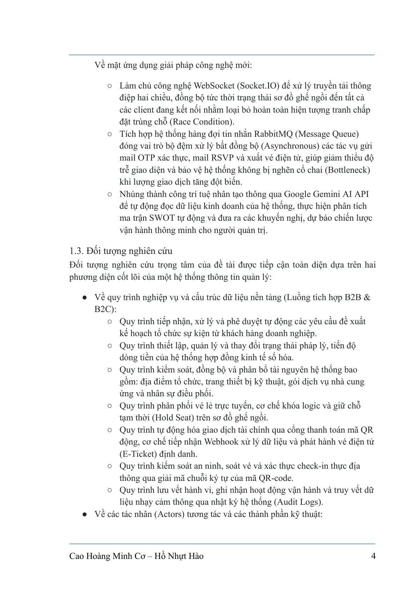

---

### Trang 24:

> ○ Khách vãng lai (Guest): Đối tượng người dùng đại chúng tương tác 
> với cổng thông tin để tìm kiếm, duyệt danh sách sự kiện và gửi phản 
> hồi RSVP. 
> ○ Khách hàng thành viên (Member / Organizer): Đối tượng khách hàng 
> cá nhân hoặc doanh nghiệp sử dụng tài khoản để mua vé, gửi đề xuất 
> dự án B2B, quản lý hợp đồng số và quản lý danh sách khách mời. 
> ○ Nhân viên kiểm soát (Employee): Tác nhân nội bộ thực hiện các 
> nghiệp vụ tại hiện trường như quét mã QR soát vé cổng và theo dõi 
> hợp đồng được phân công phụ trách. 
> ○ Quản trị viên (Admin): Tác nhân có quyền hạn tối cao điều hành toàn 
> bộ tài nguyên, cấu hình dữ liệu nền, kiểm tra trùng lịch và theo dõi 
> báo cáo thống kê qua Dashboard thông minh. 
> ○ Hạ tầng công nghệ và dịch vụ tích hợp: Cơ chế truyền tải dữ liệu hai 
> chiều thời gian thực của Socket.IO; giải pháp điều phối hàng đợi 
> thông điệp bất đồng bộ của RabbitMQ; và mô hình phân tích intent, 
> xử lý ngôn ngữ tự nhiên của Google Gemini AI API. 
> 1.4. Phương pháp thực hiện 
> Để đảm bảo tính khoa học, đúng tiến độ và chất lượng vận hành của hệ thống 
> Lumina EMS, đề tài được triển khai dựa trên sự kết hợp chặt chẽ giữa các phương 
> pháp nghiên cứu lý thuyết, kỹ nghệ hệ thống thông tin và thực nghiệm phần mềm 
> chuyên sâu: 
> ● Phương pháp nghiên cứu lý thuyết và thu thập dữ liệu: Tiến hành khảo sát 
> hiện trạng nghiệp vụ tổ chức sự kiện tại các doanh nghiệp, phân tích các 
> điểm nghẽn của mô hình truyền thống như quy trình soát vé thủ công, đứt 
> gãy mạch dữ liệu giữa khâu xét duyệt B2B và phân phối vé lẻ B2C. Nghiên 
> cứu tài liệu chuyên ngành về kiến trúc phân lớp BCE, mô hình hướng thông 
> điệp (Message Broker) và các giao thức truyền tải dữ liệu thời gian thực. 
> ● Phương pháp phân tích và thiết kế hệ thống thông tin: Áp dụng ngôn ngữ mô 
> hình hóa thống nhất UML để phân rã yêu cầu chức năng và phi chức năng 
> của 5 tác nhân hệ thống. Sử dụng công cụ phần mềm (Visual Paradigm, 
> Eraser.io) để xây dựng hệ thống sơ đồ Use Case, sơ đồ hoạt động phân làn 
> (Activity Diagram), mô hình miền thực thể NoSQL (Domain Model) và sơ 
> đồ tương tác tuần tự (Sequence Diagram) nhằm chuẩn hóa luồng logic phần 
> mềm trước khi tiến hành viết mã nguồn. 
> ● Phương pháp hiện thực và triển khai kỹ thuật phần mềm: Áp dụng mô hình 
> kiến trúc phân lớp tách biệt hoàn toàn Frontend (ReactJS/Vite) và Backend 
> (NodeJS/Express) để tối ưu hóa hiệu năng. Hiện thực hóa cơ sở dữ liệu dựa 
> 
>  5

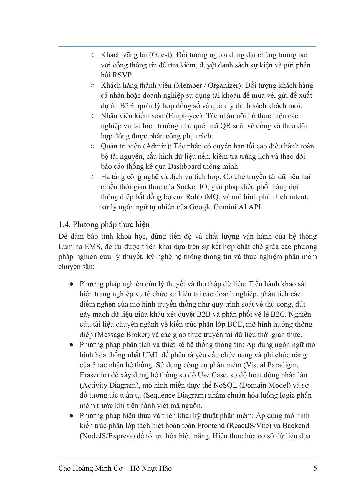

---

### Trang 25:

> trên hệ quản trị NoSQL MongoDB với cấu trúc 13 Mongoose Schemas chặt 
> chẽ. Tích hợp các giải pháp công nghệ nâng cao như Socket.IO xử lý tương 
> tác thời gian thực, RabbitMQ xử lý luồng tác vụ nền bất đồng bộ và Google 
> Gemini AI API phân tích dữ liệu thông minh. 
> ● Phương pháp kiểm thử thực nghiệm và đánh giá hệ thống: Xây dựng dữ liệu 
> mẫu thực tế thông qua các tập tin lập cấu hình tự động (seed.js và 
> seed-seats.js) để mô phỏng bối cảnh vận hành. Thiết lập các kịch bản kiểm 
> thử (Test Cases) thủ công có định hướng để đánh giá toàn diện tính đúng đắn 
> của quy trình giữ ghế, luồng tiếp nhận Webhook thanh toán, tính năng xác 
> thực QR Scanner và năng lực phân tích của mô hình AI. 
> 1.5. Kết quả đạt được 
> Sau lộ trình 15 tuần tập trung nghiên cứu và hiện thực đề tài dưới sự hướng dẫn sát 
> sao của Giảng viên, nhóm nghiên cứu đã hoàn thành toàn bộ các mục tiêu đặt ra và 
> đạt được các kết quả cụ thể bao gồm: 
> ● Về mặt tài liệu phân tích khoa học: Hoàn thiện quyển báo cáo Khóa luận tốt 
> nghiệp đạt chuẩn học thuật với hệ thống lý thuyết nền tảng vững chắc và đặc 
> tả chi tiết các mô hình UML (Use Case, Activity, Domain Model, Sequence 
> Diagram) bám sát theo cấu trúc thiết kế phần mềm hiện đại. 
> ● Về mặt sản phẩm phần mềm thực nghiệm: Xây dựng thành công nền tảng 
> quản lý và tổ chức sự kiện lai Lumina EMS hoạt động ổn định, phân quyền 
> chặt chẽ và nhất quán luồng dữ liệu nghiệp vụ cho cả 5 nhóm đối tượng 
> người dùng. 
> ● Về phân hệ chức năng người dùng: 
> ○ Khách hàng (Member / Organizer): Thực hiện mượt mà các tác vụ 
> tìm kiếm, xem chi tiết, chọn chỗ ngồi và giữ ghế thời gian thực, tự 
> động sinh mã VietQR thanh toán định danh, quản lý ví vé cá nhân, gửi 
> đề xuất dự án B2B, ký kết hợp đồng số và tự động gửi email thư mời 
> RSVP hàng loạt. 
> ○ Nhân viên (Employee): Vận hành tốt công cụ camera QR Scanner soát 
> vé thực địa tại cổng sự kiện, đối chiếu dữ liệu tức thời và đưa ra các 
> cảnh báo lỗi hoặc xác nhận check-in chính xác. 
> ○ Quản trị viên (Admin): Điều hành trực quan toàn bộ tài nguyên thông 
> qua hệ thống bảng biểu CRUD, kiểm tra trùng lịch tự động khi duyệt 
> yêu cầu và khai thác hiệu quả các biểu đồ xu hướng doanh thu tích 
> hợp phân tích thông minh từ Gemini AI. 
> ● Về mặt làm chủ giải pháp công nghệ mới: 
> 
>  6

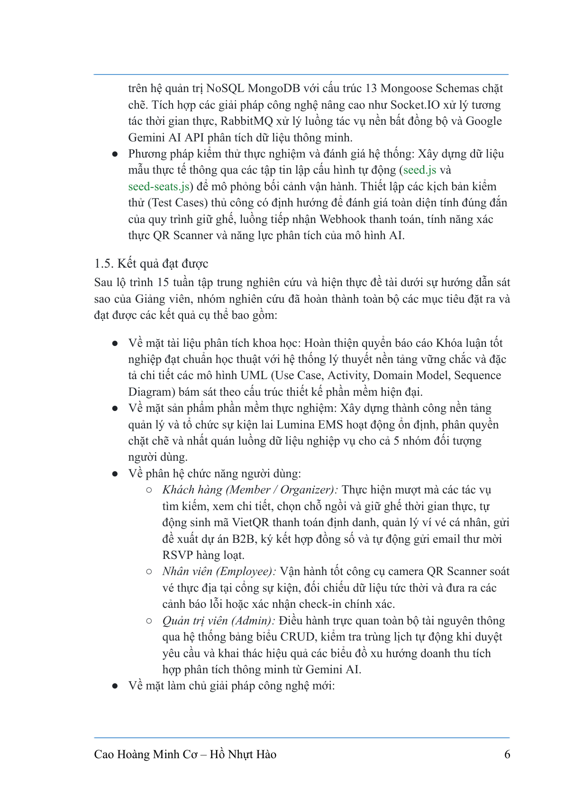

---

## CHƯƠNG 2: CƠ SỞ LÝ THUYẾT
*Kiến trúc phần mềm, Socket.IO, MongoDB, RabbitMQ, Gemini AI*

<b>Xem nội dung (5 trang: trang 26 – 30)</b>

### Trang 26:

> ○ Ứng dụng thành công Socket.IO để truyền tải thông điệp hai chiều, 
> khóa vị trí ghế ngồi đồng bộ thời gian thực, ngăn chặn triệt để hiện 
> tượng tranh chấp đặt trùng vé. 
> ○ Làm chủ hệ thống hàng đợi RabbitMQ, tách biệt các tác vụ gửi email 
> OTP/RSVP ngầm để giảm tải bộ nhớ RAM và bảo vệ hệ thống không 
> bị nghẽn cổ chai trong các khung giờ cao điểm mở bán vé. 
> ○ Tích hợp thành công Google Gemini AI API để tự động hóa khâu 
> phân tích dữ liệu, kết xuất ma trận SWOT kinh doanh trực quan hỗ trợ 
> đắc lực cho nhà quản lý đưa ra chiến lược tối ưu giá vé. 
>  
> CHƯƠNG 2: CƠ SỞ LÝ THUYẾT  
> 2.1. Tổng quan về kiến trúc phần mềm và mô hình tích hợp B2B & B2C 
> Trong kỹ nghệ phần mềm hiện đại, việc lựa chọn kiến trúc đóng vai trò quyết định 
> đến tính ổn định, khả năng mở rộng và hiệu năng vận hành của hệ thống. Đối với 
> một hệ sinh thái quản lý sự kiện phức tạp như Lumina EMS, hệ thống được định 
> hình dựa trên các nền tảng kiến trúc tiên tiến. 
> 2.1.1. Kiến trúc phân tách Frontend và Backend (Decoupled Architecture) 
> Kiến trúc phân tách mã nguồn giữa lớp giao diện (Frontend) và lớp xử lý nghiệp vụ 
> (Backend) là một xu hướng tất yếu trong phát triển ứng dụng Web quy mô lớn. 
> ● Tầng Client (Frontend): Được xây dựng dựa trên các thư viện 
> Component-based (ReactJS/Vite), chịu trách nhiệm hoàn toàn về việc render 
> giao diện, quản lý trạng thái local và tương tác người dùng. Tầng này giao 
> tiếp với máy chủ một cách không trạng thái (Stateless) thông qua các cổng 
> API. 
> ● Tầng Server (Backend): Được hiện thực bằng NodeJS/Express, tập trung xử 
> lý logic nghiệp vụ xử lý dòng tiền, giao việc nhân sự, ràng buộc tài nguyên 
> và tương tác trực tiếp với cơ sở dữ liệu. 
> Sự cô lập này giúp giảm thiểu độ phụ thuộc (Loose Coupling), tối ưu hóa băng 
> thông truyền tải và cho phép hai tầng có thể kiểm thử (Testing), bảo trì hoặc mở 
> rộng quy mô (Scaling) một cách độc lập mà không gây ảnh hưởng đến thành phần 
> còn lại. 
> 
>  7

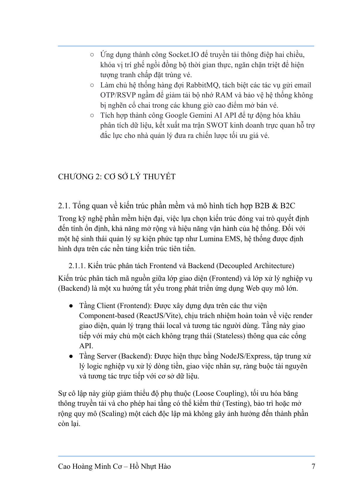

---

### Trang 27:

> 2.1.2. Mô hình phân lớp nghiệp vụ BCE (Boundary - Control - Entity) 
> Mô hình BCE là giải pháp thiết kế giúp hiện thực hóa nguyên lý phân tách các mối 
> quan tâm (Separation of Concerns - SoC) trong kỹ nghệ hệ thống thông tin. Kiến 
> trúc hệ thống được chia thành ba nhóm thành phần rõ rệt: 
> ● Lớp Biên (Boundary - B): Đại diện cho các thành phần giao diện người 
> dùng, cổng tiếp nhận yêu cầu đầu vào từ 5 tác nhân hoặc đầu cuối tiếp nhận 
> Webhook bên thứ ba (Ví dụ: GD_DangNhap, GD_QRScannerSoatVe). Lớp 
> này không chứa logic nghiệp vụ mà chỉ làm nhiệm vụ thu thập thông tin và 
> hiển thị kết quả. 
> ● Lớp Điều khiển (Control - C): Đóng vai trò bộ não điều phối hệ thống. Lớp 
> này tiếp nhận các lệnh thực thi từ lớp Biên, áp dụng các thuật toán kiểm tra 
> ràng buộc (như check trùng lịch, xác thực mã OTP), điều phối thông điệp và 
> ra lệnh cho lớp Thực thể (Ví dụ: CTRL_MuaVe, CTRL_DuyetYeuCauSK). 
> ● Lớp Thực thể (Entity - E): Đại diện cho mô hình dữ liệu bền vững của hệ 
> thống. Lớp này quản lý trực tiếp cấu trúc lưu trữ của các Documents trong 
> MongoDB (SuKien, VeDienTu, HopDong), thực hiện các thao tác CRUD dữ 
> liệu khi có yêu cầu từ lớp Điều khiển. 
> 2.1.3. Khái niệm và vòng đời hệ thống lai B2B và B2C (Hybrid Event Lifecycle) 
> Điểm độc đáo của hệ thống Lumina EMS là sự hợp nhất khép kín hai mô hình 
> Business-to-Business (B2B) và Business-to-Consumer (B2C) vào một trục dữ liệu 
> đồng bộ. Vòng đời dữ liệu của một sự kiện trải qua hai giai đoạn thượng nguồn và 
> hạ nguồn liên tục: 
> ● Giai đoạn thượng nguồn (B2B): Khách hàng doanh nghiệp gửi đề xuất dự án 
> (DeXuatSuKien), hệ thống chạy thuật toán đối chiếu tài nguyên địa điểm. 
> Quản trị viên tiến hành phê duyệt, gán nhân sự phụ trách và tự động khởi tạo 
> văn bản kinh tế (HopDong). 
> ● Giai đoạn hạ nguồn (B2C): Ngay khi dòng tiền hợp đồng được xác nhận, 
> thực thể sự kiện được kích hoạt công khai trên sàn thương mại điện tử. Lúc 
> này, luồng nghiệp vụ chuyển dịch sang B2C, cho phép người dùng đại chúng 
> tiếp cận chọn chỗ ngồi, mua vé trực tuyến, thanh toán VietQR động và nhận 
> vé điện tử chứa mã QR để check-in tại cổng sự kiện thực địa. 
> 2.2. Công nghệ tương tác và giao tiếp dữ liệu thời gian thực 
> Hệ thống đặt chỗ và phân phối vé trực tuyến đòi hỏi tính tức thời cao nhằm đảm bảo 
> trải nghiệm người dùng và ngăn chặn các xung đột dữ liệu. 
> 
>  8

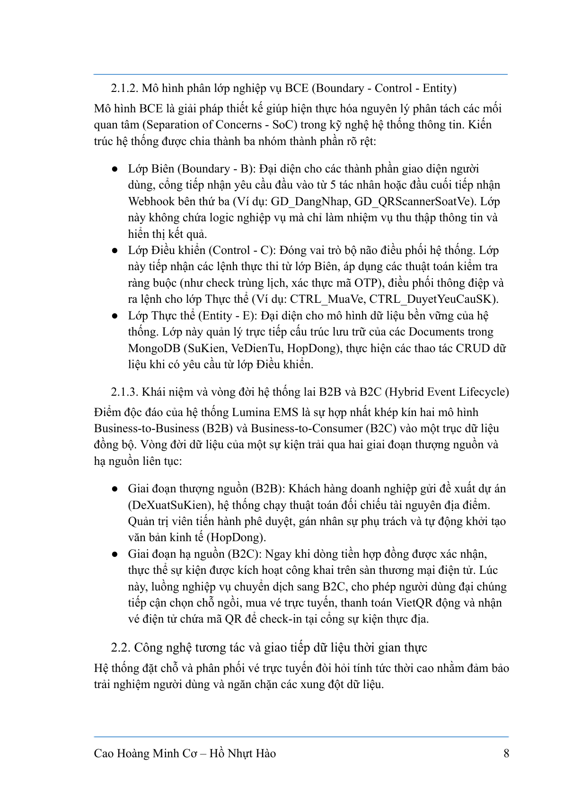

---

### Trang 28:

> 2.2.1. Giao thức truyền tải dữ liệu hai chiều (WebSocket) 
> Giao thức HTTP truyền thống hoạt động theo cơ chế Single Request-Response 
> (Client gửi yêu cầu và Server phản hồi rồi ngắt kết nối). Cơ chế này gây lãng phí tài 
> nguyên và tạo độ trễ lớn khi cần cập nhật dữ liệu liên tục. 
> Giải pháp thay thế là giao thức WebSocket – một giao thức truyền thông cho phép 
> thiết lập kênh liên lạc song công (Full-duplex) toàn phần trên một kết nối TCP duy 
> nhất. Sau khi thực hiện cái bắt tay ban đầu (Handshake), kênh kết nối được duy trì 
> liên tục, cho phép cả Client và Server có thể chủ động đẩy dữ liệu về phía nhau bất 
> kỳ lúc nào với chi phí tiêu hao băng thông tối thiểu. 
> 2.2.2. Giải pháp đồng bộ trạng thái sơ đồ ghế ngồi với Socket.IO 
> Socket.IO là một thư viện mã nguồn mở xây dựng dựa trên giao thức WebSocket, 
> cung cấp khả năng truyền tải dữ liệu thời gian thực (Real-time) mạnh mẽ với khả 
> năng tự động fallback sang HTTP Long Polling nếu môi trường mạng không hỗ trợ 
> WebSocket. 
> Trong hệ thống Lumina EMS, Socket.IO được ứng dụng để xử lý bài toán giữ ghế 
> tương tác (Hold Seat). Khi một khách hàng click chọn một vị trí trên SeatMap, một 
> sự kiện (event) mang theo mã ghế và trạng thái lập tức được phát tán (broadcast) 
> đến tất cả các máy trạm khác đang truy cập vào cùng một phòng (Room) sự kiện. 
> Logic này đảm bảo tính bất biến trạng thái dữ liệu (Data Invariance), cô lập tài 
> nguyên đang giao dịch và loại bỏ hoàn toàn rủi ro tranh chấp đặt trùng chỗ 
> (Double-booking) giữa các khách hàng. 
> 2.3. Hạ tầng dữ liệu phi quan hệ (NoSQL Document-Oriented) 
> Với tính chất đa dạng về thuộc tính của các loại hình sự kiện (ca nhạc, hội thảo, 
> triển lãm), hệ thống sử dụng cơ sở dữ liệu NoSQL để tối ưu hóa hiệu năng và cấu 
> trúc lưu trữ. 
> 2.3.1. Hệ quản trị cơ sở dữ liệu hướng tài liệu MongoDB 
> Khác với hệ quản trị cơ sở dữ liệu quan hệ (RDBMS) lưu trữ dữ liệu dưới dạng các 
> hàng và cột cố định trong bảng, MongoDB lưu trữ dữ liệu dưới dạng các tài liệu 
> (Documents) có cấu trúc tương tự JSON (gọi là BSON - Binary JSON). Kiến trúc 
> này mang lại hai lợi thế lớn: 
> ● Schema-less (Linh hoạt cấu trúc): Các tài liệu trong cùng một bộ sưu tập 
> (Collection) không bắt buộc phải có các trường dữ liệu giống nhau, cho phép 
> dễ dàng mở rộng và tùy biến thuộc tính dữ liệu mà không cần chạy các câu 
> lệnh ALTER TABLE nặng nề. 
> 
>  9

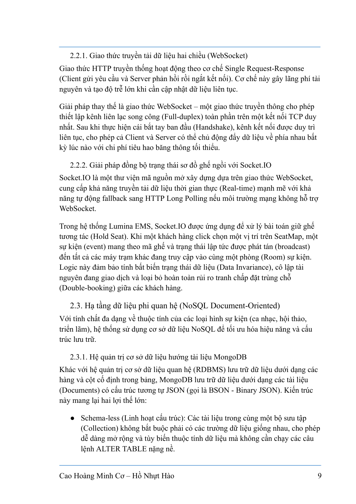

---

### Trang 29:

> ● Tốc độ đọc ghi cao: MongoDB tối ưu hóa việc ghi dữ liệu trực tiếp vào bộ 
> nhớ đệm và hỗ trợ cơ chế đánh chỉ mục (Indexing) mạnh mẽ, giúp tăng tốc 
> các câu lệnh truy vấn tìm kiếm sự kiện theo thời gian thực. 
> 2.3.2. Cơ chế nhúng tài liệu (Embedded Documents) và cấu trúc liên kết dữ liệu 
> Để giải quyết các mối quan hệ giữa các thực thể dữ liệu, thay vì lạm dụng các phép 
> nối (JOIN) phức tạp gây tốn chi phí tài nguyên của hệ thống SQL, MongoDB áp 
> dụng hai chiến lược: 
> ● Embedded Documents (Tài liệu lồng nhau): Nhúng trực tiếp một mảng đối 
> tượng dữ liệu vào bên trong Document cha (Ví dụ: Nhúng danh sách cấu 
> hình chi tiết hàng mục dịch vụ hoặc danh sách thiết bị trực tiếp vào 
> Document SuKien). Giải pháp này giúp lấy toàn bộ dữ liệu cần thiết chỉ qua 
> một truy vấn duy nhất (Single Read Operation). 
> ● DBRefs / Object Reference (Tham chiếu đối tượng): Đối với các thực thể có 
> kích thước biến động lớn và độc lập như VeDienTu hay HopDong, hệ thống 
> sử dụng kiểu dữ liệu ObjectId của Mongoose để tham chiếu liên kết đến 
> maNguoiDung hay maSuKien, đảm bảo cân bằng giữa hiệu năng truy xuất 
> và dung lượng lưu trữ của Database. 
> 2.4. Kiến trúc xếp hàng và xử lý tác vụ nền bất đồng bộ 
> Khi hệ thống đối mặt với lượng giao dịch mua vé tải cao tại các khung giờ mở bán 
> cao điểm, việc xử lý đồng bộ (Synchronous) sẽ dẫn đến nguy cơ quá tải máy chủ. 
> 2.4.1. Mô hình môi giới thông điệp Message Broker với RabbitMQ 
> RabbitMQ là một phần mềm môi giới thông điệp mã nguồn mở chạy trên giao thức 
> AMQP. Mô hình hoạt động dựa trên kiến trúc phân tách bao gồm ba thành phần: 
> Publisher (Thành phần gửi tin nhắn) $\rightarrow$ Exchange & Queue (Thành phần 
> định tuyến và hàng đợi lưu trữ) $\rightarrow$ Consumer (Thành phần tiêu thụ tin 
> nhắn). Tin nhắn trong hàng đợi được lưu trữ bền vững (Durable) cho đến khi thành 
> phần nhận xác nhận (ACK) đã xử lý thành công, đảm bảo không bị mất mát dữ liệu 
> ngay cả khi hệ thống gặp sự cố đột ngột. 
> 2.4.2. Ứng dụng xử lý tác vụ ngầm (Background Tasks Layer) 
> Trong hệ thống Lumina EMS, RabbitMQ đóng vai trò như một bộ đệm giảm chấn 
> (Buffer Layer) trung gian. Khi khách hàng hoàn tất quét mã QR thanh toán thành 
> công, thay vì bắt luồng chính của Web Server xử lý tuần tự hàng loạt hành động 
> nặng, hệ thống đóng gói các yêu cầu và đẩy vào các hàng đợi bất đồng bộ 
> (Asynchronous Queues) riêng biệt: 
> 
>  10

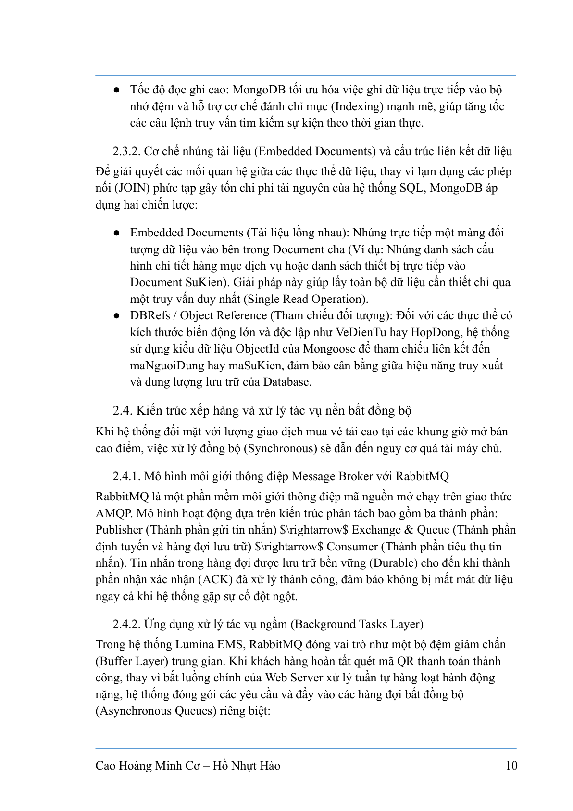

---

### Trang 30:

> ● XuatVeQueue: Chịu trách nhiệm render mã QR định danh bảo mật và lưu 
> trạng thái vé. 
> ● EmailServiceQueue: Chịu trách nhiệm gọi Mail Server gửi hàng loạt thư mời 
> RSVP hoặc mã OTP xác thực. 
> Các Background Workers sẽ lướt ngầm phía sau để tiêu thụ dữ liệu theo năng lực tự 
> nhiên của hệ thống. Cơ chế này giải phóng hoàn toàn luồng chính (Main Thread) 
> của NodeJS, giúp màn hình giao diện người dùng phản hồi ngay lập tức, triệt tiêu 
> hiện tượng nghẽn cổ chai (Bottleneck) hệ thống. 
> 2.5. Trí tuệ nhân tạo và phân tích dữ liệu điều hành thông minh 
> Xu hướng công nghệ hiện đại yêu cầu hệ thống quản lý không chỉ dừng lại ở việc 
> lưu trữ mà phải có khả năng khai phá dữ liệu hỗ trợ ra quyết định. 
> 2.5.1. Công nghệ xử lý ngôn ngữ tự nhiên và tích hợp Google Gemini AI 
> Google Gemini AI là một mô hình ngôn ngữ lớn (LLM) tiên tiến, sở hữu khả năng 
> hiểu ngữ cảnh, phân tích dữ liệu đa phương thức và xử lý ngôn ngữ tự nhiên với độ 
> chính xác cao. Thông qua việc tích hợp hệ thống API bảo mật, Lumina EMS kết nối 
> trực tiếp với mô hình trí tuệ nhân tạo này bằng cách thiết lập các kỹ thuật tối ưu hóa 
> câu lệnh nhắc (Prompt Engineering) chuyên sâu cho bối cảnh quản trị. 
> 2.5.2. Giải pháp trích xuất tri thức hỗ trợ quyết định kinh doanh (AI-Driven 
> Insights) 
> Phân hệ Admin của Lumina EMS ứng dụng Gemini AI làm một trợ lý phân tích 
> chiến lược tự động. AI được cấp quyền đọc các tập hợp dữ liệu tổng hợp (Data 
> Aggregations) phi nhạy cảm từ MongoDB như: doanh thu theo tháng, tốc độ bán vé 
> của từng sự kiện, tỷ lệ phản hồi RSVP của khách mời. 
> Từ các dữ liệu thực nghiệm đó, mô hình AI thực hiện các thuật toán suy luận để tự 
> động kết xuất ra Báo cáo phân tích ma trận SWOT thời gian thực, đồng thời đưa ra 
> các khuyến nghị vận hành trực quan (Ví dụ: Đưa ra chiến lược tăng/giảm giá vé tự 
> động, cảnh báo nguy cơ trùng lịch địa điểm hoặc dự báo xu hướng nhu cầu thị 
> trường). Điều này giúp nâng tầm hệ thống từ một phần mềm quản lý tác nghiệp 
> thông thường trở thành một Hệ thống hỗ trợ ra quyết định (Decision Support 
> System - DSS) thông minh cho các nhà điều hành sự kiện. 
>  
> CHƯƠNG 3: PHÂN TÍCH YÊU CẦU HỆ THỐNG 
> 
>  11

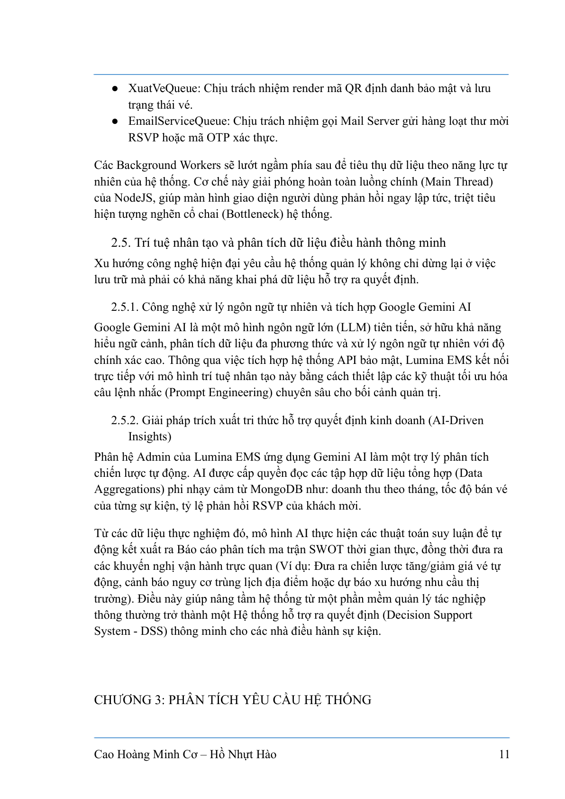

---

## CHƯƠNG 3: PHÂN TÍCH YÊU CẦU HỆ THỐNG
*Mục đích, phạm vi, mô tả bài toán, khảo sát hiện trạng, Actors, Use Case tổng quát, Đặc tả Use Case chi tiết*

<b>Xem nội dung (29 trang: trang 31 – 59)</b>

### Trang 31:

> 3.1. Mục đích của hệ thống 
> Hệ thống Lumina EMS được xây dựng nhằm cung cấp một nền tảng hợp nhất quản 
> lý toàn bộ vòng đời của một sự kiện, kết hợp giải pháp nghiệp vụ thượng nguồn 
> B2B và kênh phân phối thương mại điện tử hạ nguồn B2C. Mục đích cốt lõi là thay 
> thế các quy trình vận hành chắp vá, thủ công truyền thống bằng một hệ thống thông 
> tin nhất quán, tự động hóa khâu xử lý tài chính qua cổng QR Code động, kiểm soát 
> an ninh check-in bằng mã QR và đồng bộ hóa tương tác thực địa thời gian thực. 
> 3.2. Phạm vi của hệ thống 
> Phạm vi hệ thống bao gồm phân hệ ứng dụng giao diện phần mềm dành cho 5 tác 
> nhân tương tác kết nối với máy chủ API nghiệp vụ và cơ sở dữ liệu NoSQL bền 
> vững. Hệ thống hiện thực hóa trọn vẹn luồng dữ liệu từ khâu đề xuất dự án sự kiện, 
> thiết lập và phê duyệt hợp đồng số, quản trị tài nguyên cho đến khâu cấu hình phân 
> bổ vị trí sơ đồ ghế ngồi thời gian thực, mua vé lẻ công khai, gửi thư mời điện tử và 
> soát vé tự động bằng camera di động. 
> 3.3. Mô tả bài toán 
> Bài toán đặt ra cho Lumina EMS là giải quyết sự phân mảnh mạch thông tin dữ liệu 
> nghiệp vụ tổ chức sự kiện. Khi một doanh nghiệp đối tác có nhu cầu tổ chức sự 
> kiện, hệ thống phải tự động tính toán ràng buộc lịch trình địa điểm để tránh xung 
> đột bận hội trường. Khi dự án chuyển sang giai đoạn thương mại hóa B2C, hệ thống 
> phải giải quyết tốt bài toán giữ chỗ tạm thời và đồng bộ sơ đồ ghế thời gian thực 
> nhằm triệt tiêu rủi ro đặt trùng vé, song song với việc xử lý tự động dòng tiền thanh 
> toán và kiểm soát an ninh check-in thực địa một cách chính xác. 
> 3.4. Khảo sát hiện trạng và nhu cầu người dùng 
> 3.4.1. Hiện trạng quản lý tổ chức sự kiện 
> Trong thực tế vận hành, các đơn vị tổ chức sự kiện thường phải sử dụng nhiều công 
> cụ phần mềm rời rạc. Khâu lập dự toán ngân sách và ký hợp đồng với chủ địa điểm, 
> nhà cung ứng dịch vụ được làm thủ công bằng văn bản giấy. Khâu bán vé lẻ lại 
> được đẩy lên một sàn thương mại độc lập khác, trong khi danh sách khách mời 
> RSVP và luồng điểm danh check-in tại cổng vào ngày diễn ra chương trình lại sử 
> dụng file Excel. 
> 3.4.2. Những hạn chế của quy trình hiện tại 
> ● Đứt gãy luồng dữ liệu: Việc chuyển tiếp dữ liệu thủ công giữa ban tổ chức, 
> nhà cung ứng tài nguyên và khách hàng gây chậm trễ, lãng phí thời gian và 
> dễ phát sinh sai sót số liệu tài chính. 
> 
>  12

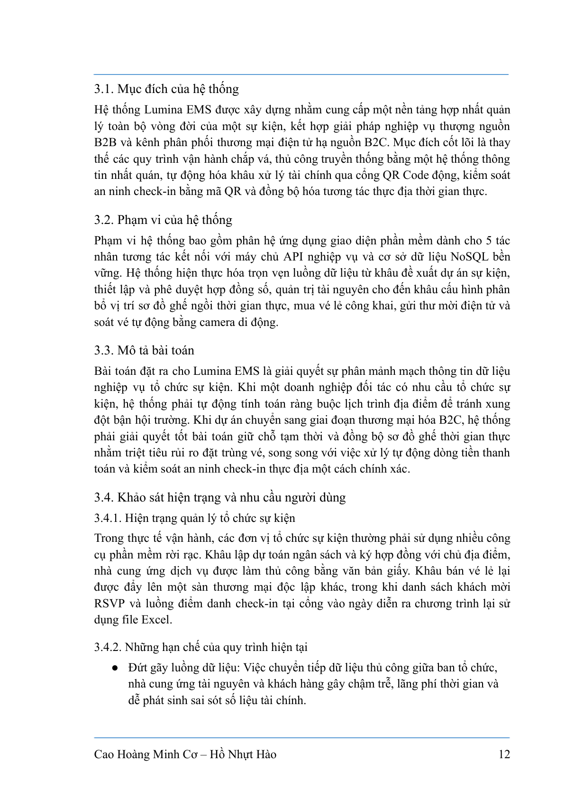

---

### Trang 32:

> ● Tranh chấp ghế ngồi cao điểm: Thiếu cơ chế khóa logic giữ chỗ tức thời, dẫn 
> đến việc nhiều khách hàng trực tuyến chọn trùng một vị trí ghế trong cùng 
> một thời điểm. 
> ● Ùn tắc và gian lận soát vé: Quy trình kiểm tra vé giấy hoặc đối chiếu danh 
> sách thủ công tại cổng sự kiện mất nhiều thời gian, dễ xảy ra tình trạng vé 
> giả hoặc một mã vé bị sử dụng lại nhiều lần. 
> 3.4.3. Nhu cầu đối với hệ thống mới 
> ● Tự động hóa và đồng bộ hóa khép kín quy trình quản lý sự kiện lai B2B và 
> B2C trên một nền tảng duy nhất. 
> ● Đồng bộ trạng thái sơ đồ ghế ngồi thời gian thực mượt mà giữa toàn bộ các 
> client đang kết nối. 
> ● Tích hợp cổng thanh toán mã QR Code động tự động nhận diện giao dịch và 
> phát hành vé điện tử định danh an toàn. 
> ● Cung cấp công cụ quét mã QR kiểm soát check-in thực địa tốc độ cao và 
> dashboard phân tích chỉ số kinh doanh thông minh. 
> 3.5. Xác định các tác nhân của hệ thống (Actors) 
> Hệ thống Lumina EMS xác định 5 tác nhân tham gia trực tiếp vào luồng nghiệp vụ: 
> ● Guest (Khách vãng lai): Người dùng chưa đăng nhập, thực hiện tìm kiếm, 
> xem chi tiết sự kiện công khai và gửi phản hồi RSVP khi nhận được thư mời. 
> ● Member (Khách hàng cá nhân / Đối tác doanh nghiệp B2B): Người dùng có 
> tài khoản, thực hiện các quyền mua vé lẻ, theo dõi ví vé, hoặc lập đề xuất dự 
> án sự kiện và ký hợp đồng số hóa. 
> ● Organizer (Người tổ chức): Nhân sự phụ trách thiết kế sơ đồ vị trí, lập kịch 
> bản chương trình và task checklist vận hành sự kiện. 
> ● Employee (Nhân viên kiểm soát): Nhân sự trực tại hiện trường để quét mã 
> QR soát vé cổng và quản lý tiến độ các hợp đồng tác nghiệp được giao. 
> ● Admin (Quản trị viên): Người điều hành có quyền hạn cao nhất, thực hiện 
> duyệt sự kiện, duyệt yêu cầu B2B, quản lý tài nguyên hệ thống và khai thác 
> số liệu thống kê. 
> 3.6. Phân tích quy trình nghiệp vụ (Business Workflows) 
> 3.6.1. Quy trình xem phim/sự kiện và lịch diễn công khai 
> Khách hàng truy cập vào hệ thống, sử dụng thanh tìm kiếm thông minh để lọc sự 
> kiện theo tên hoặc thể loại. Hệ thống truy vấn cơ sở dữ liệu và render danh sách các 
> khối sự kiện. Khi chọn một sự kiện cụ thể, hệ thống tải chi tiết thông tin gồm 
> banner, thời gian, địa điểm, các gói dịch vụ đi kèm và sơ đồ phân bổ vị trí vé. 
> 
>  13

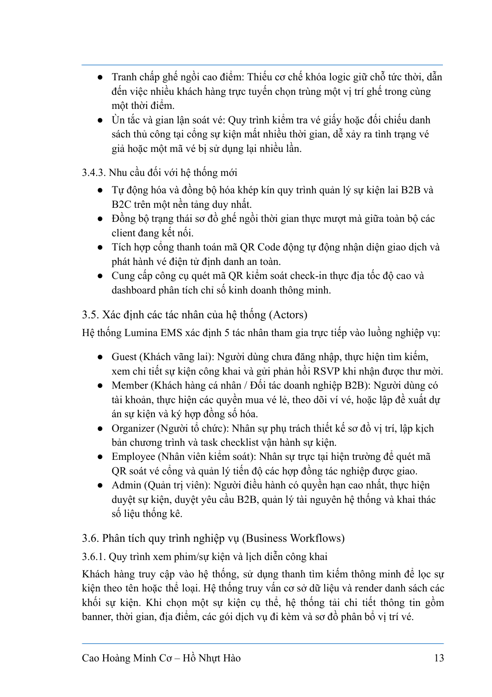

---

### Trang 33:

> 3.6.2. Quy trình đặt vé và giữ chỗ trực tuyến (B2C) 
> Khách hàng chọn sự kiện, hệ thống hiển thị sơ đồ ghế tương tác. Khi người dùng 
> click chọn vị trí, hệ thống gọi API giữ ghế tạm thời, ghi nhận dòng khóa logic vào 
> Database và phát tín hiệu Socket.IO khóa ghế thời gian thực trên màn hình các 
> người dùng khác. Người dùng tiến hành chọn số lượng, áp dụng mã giảm giá và xác 
> nhận tạo đơn hàng trạng thái chờ thanh toán. 
> 3.6.3. Quy trình thanh toán và phát hành vé điện tử 
> Ngay khi đơn đặt vé Pending được khởi tạo, hệ thống hiển thị mã QR Code động 
> chứa số tiền định biên và nội dung chuyển khoản định danh kèm đồng hồ đếm 
> ngược. Khi khách hàng hoàn tất chuyển khoản, Webhook ngân hàng tự động bắn tín 
> hiệu xác thực về API Server, hệ thống cập nhật đơn sang Paid, giải phóng bộ nhớ 
> đệm giữ chỗ, đồng thời kích hoạt hàng đợi ngầm tự động sinh mã vé điện tử QR 
> Code hiển thị tại tủ vé người dùng và gửi email thông báo. 
> 3.6.4. Quy trình đề xuất dự án và quản lý hợp đồng số (B2B) 
> Khách hàng doanh nghiệp điền form kế hoạch gồm tên dự án, ngày dự kiến tổ chức, 
> ngân sách đầu tư và gửi đề xuất. Bản ghi lưu vào hệ thống ở trạng thái Chờ duyệt. 
> Quản trị viên tiến hành thẩm định và bấm Duyệt, hệ thống cập nhật trạng thái, tự 
> động gán nhân viên phụ trách và khởi tạo văn bản hợp đồng số hóa dạng PDF chứa 
> báo giá để hai bên tiến hành ký kết, đặt cọc dòng tiền. 
> 3.6.5. Quy trình kiểm soát an ninh check-in bằng mã QR 
> Vào ngày diễn ra sự kiện, nhân viên túc trực tại cửa cổng mở chức năng QR 
> Scanner. Khi khách hàng trình vé điện tử, nhân viên sử dụng camera máy trạm quét 
> mã QR trên vé. Hệ thống giải mã chuỗi ký tự, đối chiếu với trạng thái thực thể vé 
> trong Database. Nếu vé hợp lệ và chưa từng sử dụng, hệ thống chuyển trạng thái 
> sang Checked-in và hiển thị thông báo thành công; ngược lại sẽ phát tín hiệu cảnh 
> báo màu đỏ từ chối quyền vào cổng. 
> 3.6.6. Quy trình trợ lý AI hỗ trợ kinh doanh và vận hành 
> Quản trị viên truy cập mục thống kê, hệ thống tự động kích hoạt lệnh xử lý tổng hợp 
> dữ liệu thực tế phát sinh. Mô hình Google Gemini AI được tích hợp sẽ phân tích các 
> tập chỉ số tài chính, số lượng vé đã phân phối và tỷ lệ lấp đầy địa điểm để tự động 
> kết xuất ra báo cáo phân tích ma trận SWOT trực quan, đồng thời đưa ra các đề xuất 
> chiến lược giúp nhà quản lý tối ưu hóa giá vé và điều phối tài nguyên hệ thống một 
> cách khoa học. 
> 3.7. Yêu cầu chức năng (Functional Requirements) 
> 
>  14

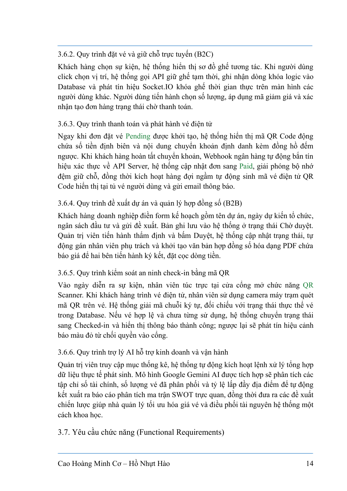

---

### Trang 34:

> 3.7.1. Yêu cầu chức năng đối với khách hàng (Guest & Member) 
> ● R-GUEST-01: Cho phép tìm kiếm sự kiện theo từ khóa gần đúng, thể loại, 
> mốc thời gian và địa điểm tổ chức. 
> ● R-GUEST-02: Cho phép xem chi tiết nội dung chương trình sự kiện công 
> khai và phản hồi thư mời RSVP. 
> ● R-MEMBER-01: Cho phép đăng ký tài khoản mới và đăng nhập xác thực 
> bảo mật hệ thống bằng JWT Token. 
> ● R-MEMBER-02: Cho phép chọn vị trí, giữ ghế tương tác thời gian thực và 
> thực hiện luồng mua vé qua mã QR thanh toán. 
> ● R-MEMBER-03: Cung cấp tủ vé cá nhân lưu trữ các vé điện tử đã mua dưới 
> dạng mã QR-code định danh. 
> ● R-MEMBER-04: Cho phép khởi tạo form đề xuất kế hoạch sự kiện B2B, 
> quản lý văn bản hợp đồng số hóa và gửi thư mời RSVP hàng loạt đến danh 
> sách đối tác. 
> 3.7.2. Yêu cầu chức năng đối với nhân viên (Employee) 
> ● R-STAFF-01: Cho phép xem số liệu tổng quan ca làm việc và danh sách các 
> hợp đồng tác nghiệp được phân công phụ trách. 
> ● R-STAFF-02: Tích hợp công cụ camera quét mã QR hoặc nhập Ticket ID thủ 
> công để thực hiện soát vé check-in thực địa. 
> 3.7.3. Yêu cầu chức năng đối với quản trị viên (Admin) 
> ● R-ADMIN-01: Cung cấp Dashboard toàn cầu cập nhật số liệu doanh thu, số 
> vé, thành viên thời gian thực. 
> ● R-ADMIN-02: Cho phép kiểm duyệt yêu cầu dự án B2B, tự động gán nhân 
> sự phụ trách và kiểm tra trùng lịch địa điểm. 
> ● R-ADMIN-03: Cung cấp các công cụ quản lý CRUD tài nguyên hệ thống 
> (Sự kiện, Địa điểm, Dịch vụ Vendor, Thiết bị kỹ thuật, Nhân sự) và quản lý 
> đóng băng tài khoản người dùng vi phạm. 
> ● R-ADMIN-04: Tích hợp mô hình AI phân tích dữ liệu kinh doanh và tự động 
> xuất báo cáo ma trận SWOT hệ thống. 
> 3.8. Yêu cầu phi chức năng (Non-Functional Requirements) 
> ● Yêu cầu an toàn thông tin (Security): Toàn bộ mật khẩu người dùng phải 
> được mã hóa băm một chiều. Hệ thống API bắt buộc kiểm tra tính hợp lệ của 
> JWT Token và phân quyền nghiêm ngặt theo vai trò của từng tác nhân trước 
> khi xử lý dữ liệu. 
> 
>  15

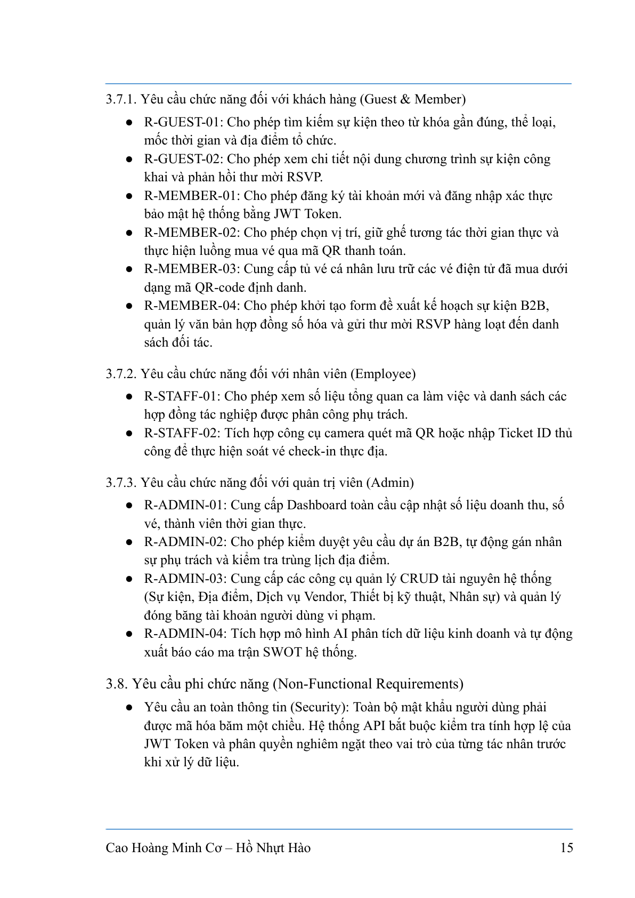

---

### Trang 35:

> ● Yêu cầu hiệu năng xử lý (Performance): Tính năng giữ ghế và cập nhật trạng 
> thái sơ đồ vị trí phải đạt độ trễ dưới 1 giây thông qua kết nối Socket.IO để 
> đảm bảo tính đồng bộ tức thời giữa các client. 
> ● Yêu cầu tính sẵn sàng và khả năng chịu tải (Availability & Scalability): Hệ 
> thống phải duy trì tính ổn định tại lớp giao diện khi xảy ra đợt bùng nổ giao 
> dịch cao điểm bằng cách cô lập các tác vụ nặng chạy ngầm thông qua hàng 
> đợi tin nhắn bất đồng bộ RabbitMQ. 
> 3.9. Quy tắc nghiệp vụ (Business Rules) 
> ● BR-01 (Thời gian giữ ghế lẻ): Một vị trí ghế trên sơ đồ chỉ được phép khóa 
> logic giữ chỗ tạm thời cho một tài khoản Member tối đa trong vòng 10 phút, 
> quá thời hạn quy định hệ thống phải tự động giải phóng vị trí. 
> ● BR-02 (Ràng buộc địa điểm B2B): Hệ thống từ chối phê duyệt dự án sự kiện 
> mới nếu thời gian tổ chức và địa điểm hội trường được chọn trùng khít với 
> lịch trình của một sự kiện khác đã được duyệt trước đó. 
> ● BR-03 (Idempotency Webhook): Một thông báo Webhook chuyển khoản 
> thanh toán từ ngân hàng chỉ được phép xử lý và cập nhật trạng thái đơn hàng 
> sang Paid duy nhất một lần, ngăn chặn tuyệt đối lỗi xử lý trùng lặp dòng tiền. 
> ● BR-04 (Xác thực soát vé độc nhất): Một mã QR trên vé điện tử chỉ có giá trị 
> check-in một lần duy nhất. Nếu trường trạng thái vé đã ghi nhận là 
> Checked-in, mọi thao tác quét lại sau đó tại cổng kiểm soát bắt buộc phải bị 
> hệ thống từ chối và phát cảnh báo lỗi. 
>  
>  
>  
>  
>  
>  
>  
>  
>  
> 3.10. Mô hình USE CASE tổng quát 
> 
>  16

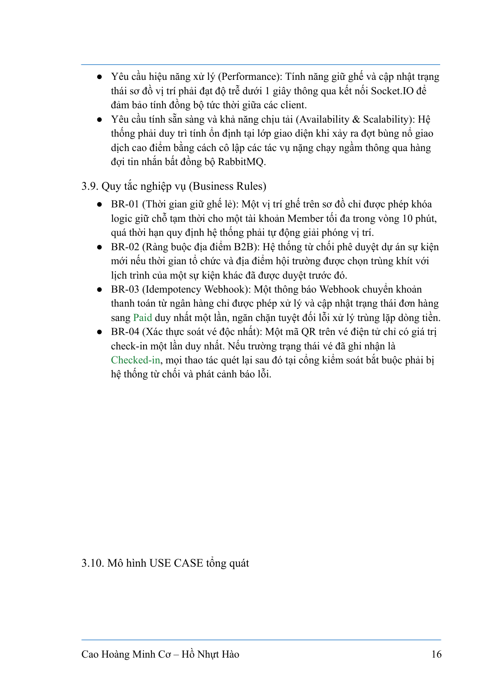

---

### Trang 36:

> Hình 3.1 Sơ đồ Use Case tổng quát 
>  
> 3.11. Đặc tả USE CASE  
> 3.11.1 Đặc tả Use Case: Đăng nhập 
> 
>  
> Bảng 3.1 Đặc tả Use Case - Đăng nhập 
> Đăng nhập 
> Tiền điều kiện 
> Người dùng truy cập vào  
> hệ thống.  
> Hậu điều kiện 
> Người dùng đăng nhập thành  
> công, hệ thống cấp JWT Token  
> và chuyển hướng vào  
> Dashboard.  
> Actor chính 
> Người dùng (Khách hàng / Nhân  
> viên / Quản trị viên)  
> Actor phụ 
> Không  
> 
>  17

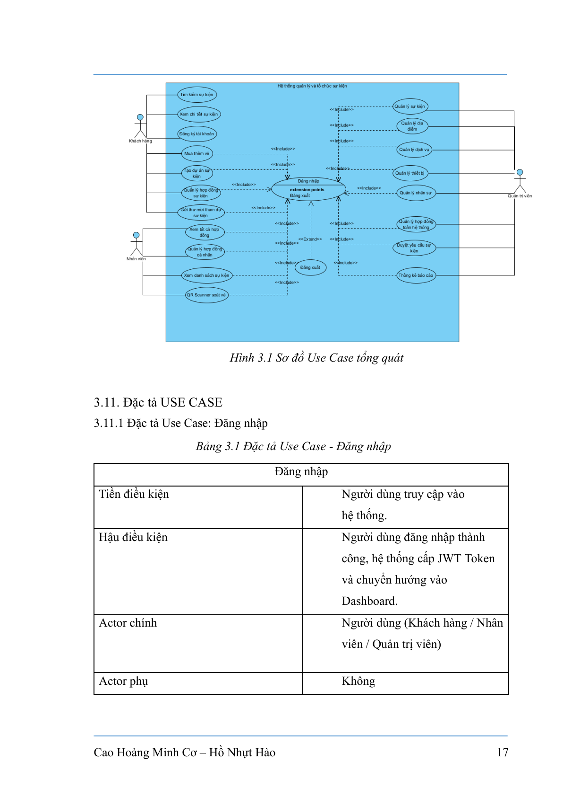

---

### Trang 37:

> Basic flow 
> Người dùng 
> Hệ thống 
> 1. Chọn nút "Đăng nhập" trên giao diện.  2. Hiển thị form đăng nhập  
> (Email/Số điện thoại và Mật khẩu).  
> 3. Nhập đầy đủ thông tin tài khoản và 
> mật khẩu.  
>   
> 4. Nhấn nút "Đăng nhập".  
> 5. Xác thực thông tin tài khoản với cơ 
> sở dữ liệu, cấp quyền truy cập và điều 
> hướng vào trang chủ hệ thống.  
> Alternative flow 
> 3.1 Nhập thiếu thông tin hoặc sai định dạng  
> 1.1.1 Hệ thống hiển thị thông báo nhắc nhở "Vui lòng nhập đầy đủ thông 
> tin tài khoản và mật khẩu" và giữ nguyên tại form.  
> 5.1 Sai tài khoản hoặc mật khẩu  
> 1.1.1 Hệ thống kiểm tra thấy thông tin không chính xác, hiển thị thông báo 
> lỗi "Tài khoản hoặc mật khẩu không đúng. Vui lòng kiểm tra lại".  
>  
> Bảng 3.2 Đặc tả Use Case - Đăng xuất 
> Đăng xuất  
> Tiền điều kiện 
> Người dùng đã đăng nhập thành  
> công vào hệ thống.  
> Hậu điều kiện 
> Phiên làm việc bị hủy bỏ, người  
> dùng quay về trang công khai  
> của hệ thống.   
> Actor chính 
> Người dùng (Khách hàng / Nhân 
> viên / Quản trị viên)  
> Actor phụ 
> Không  
> 
>  18

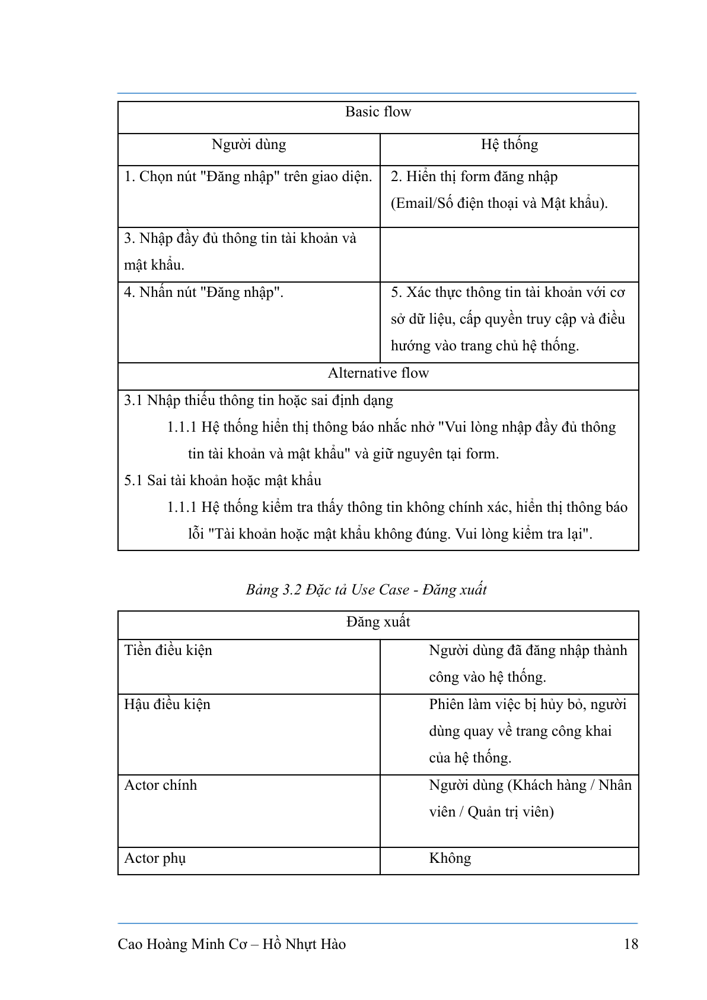

---

### Trang 38:

> Basic flow 
> Người dùng 
> Hệ thống 
> 1. Click vào avatar/tên tài khoản và 
> chọn "Đăng xuất" từ thanh menu điều 
> hướng.   
>  
>  
>  2. Thực hiện xóa token/phiên làm việc 
> hiện tại, đưa trạng thái người dùng về 
> chưa đăng nhập và điều hướng về trang 
> chủ công khai.  
> Alternative flow 
> … 
>  
>  
>  
> Bảng 3.3 Đặc tả Use Case - Tìm kiếm sự kiện 
> Tìm kiếm sự kiện  
> Tiền điều kiện 
> Không yêu cầu (Khách hàng  
> vãng lai hoặc đã đăng nhập đều  
> có thể thực hiện).   
> Hậu điều kiện 
> Danh sách các sự kiện phù hợp  
> với từ khóa/bộ lọc được hiển thị  
> trên màn hình.  
> Actor chính 
> Khách hàng   
> 
>  19

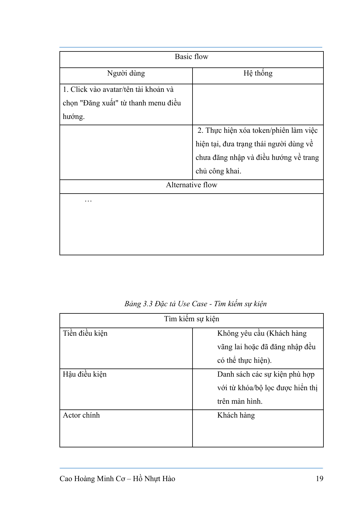

---

### Trang 39:

> Actor phụ 
> Không  
> Basic flow 
> Người dùng 
> Hệ thống 
> 1. Truy cập vào thanh tìm kiếm tại trang 
> chủ hoặc trang "Sự kiện".   
>  
>  
>  2. Hiển thị ô nhập từ khóa và các tiêu 
> chí bộ lọc (thời gian, thể loại, địa 
> điểm).  
> 3. Nhập tên sự kiện cần tìm hoặc chọn 
> các tiêu chí bộ lọc.  
>  
> 4. Nhấn nút "Tìm kiếm".  
> 5. Thực hiện tra cứu trong cơ sở dữ 
> liệu MongoDB và hiển thị kết quả các 
> sự kiện phù hợp lên màn hình.  
> Alternative flow 
> 3.1 Không nhập tiêu chí nào   
> 1.1.1 Hệ thống cho phép tra cứu, hiểu là tìm tất cả; hiển thị toàn bộ danh 
> sách các sự kiện đang diễn ra.  
> 5.1 Không tìm thấy kết quả phù hợp   
> 1.1.1 Hệ thống hiển thị thông báo "Không tìm thấy sự kiện nào phù hợp 
> với từ khóa của bạn" và gợi ý các sự kiện nổi bật khác  
>  
> Bảng 3.4 Đặc tả Use Case - Xem chi tiết sự kiện 
> Xem chi tiết sự kiện  
> Tiền điều kiện 
> Khách hàng nhìn thấy sự kiện  
> trên danh sách hoặc có đường  
> link trực tiếp.   
> Hậu điều kiện 
> Toàn bộ thông tin mô tả chi tiết,  
> thời gian, địa điểm, các dịch vụ  
> 
>  20

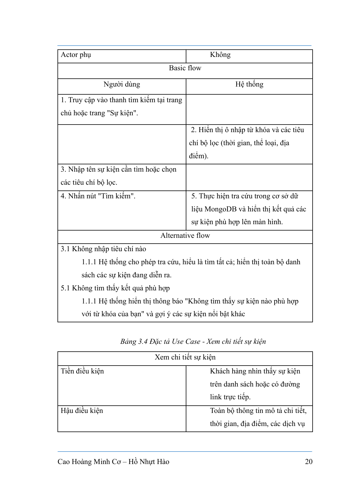

---

### Trang 40:

> đi kèm và nút đặt vé của sự kiện  
> được hiển thị.   
> Actor chính 
> Khách hàng   
> Actor phụ 
> Không  
> Basic flow 
> Người dùng 
> Hệ thống 
> 1. Click chọn vào một sự kiện cụ thể từ 
> danh sách kết quả tìm kiếm hoặc trang 
> chủ.   
>  
>  
> 2. Tải và hiển thị chi tiết sự kiện bao 
> gồm: Tên sự kiện, Banner, Thời gian, 
> Địa điểm tổ chức, Sơ đồ ghế/vị trí, Giá 
> vé, Số lượng vé còn lại và Nội dung 
> chương trình  
> Alternative flow 
>  
> Bảng 3.5 Đặc tả Use Case - Đăng ký tài khoản 
> Đăng ký tài khoản  
> Tiền điều kiện 
> Người dùng chưa có tài khoản  
> trên hệ thống.   
> Hậu điều kiện 
> Một tài khoản Khách hàng mới  
> được khởi tạo thành công trong  
> hệ thống.   
> Actor chính 
> Khách hàng   
> Actor phụ 
> Không  
> 
>  21

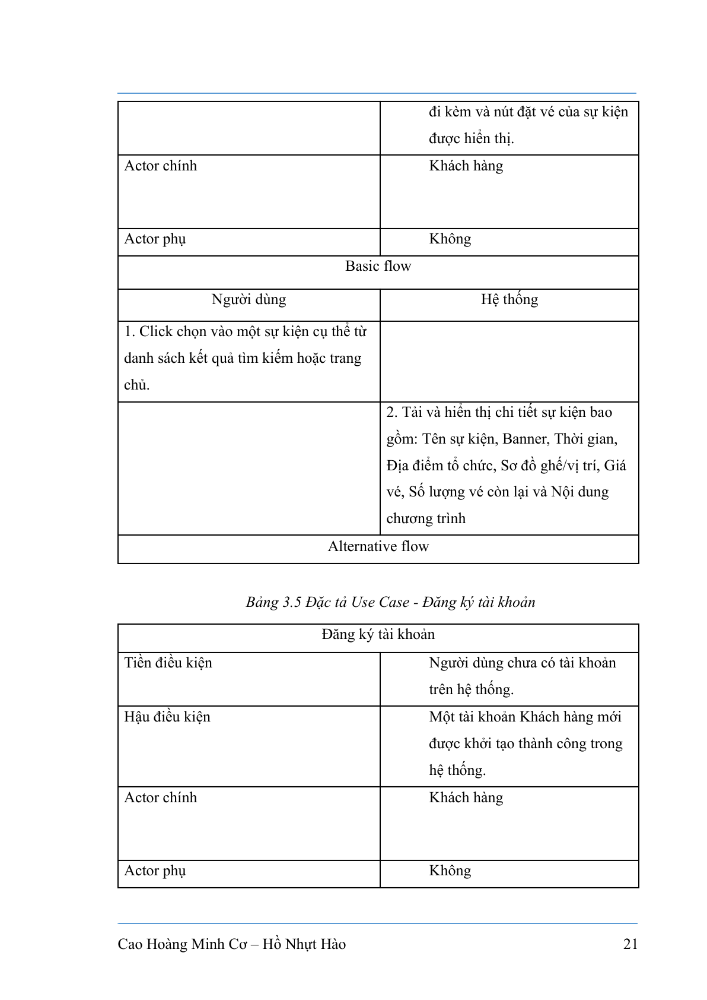

---

### Trang 41:

> Basic flow 
> Người dùng 
> Hệ thống 
> 1. Chọn menu "Đăng ký" từ thanh điều 
> hướng.  
>  
>  
> 2. Hiển thị biểu mẫu nhập thông tin 
> đăng ký (Họ tên, Số điện thoại, Email, 
> Mật khẩu, Nhập lại mật khẩu).  
> 3. Điền đầy đủ thông tin vào các trường 
> bắt buộc.  
>  
> 4. Nhấn nút "Đăng ký".  
> 5. Kiểm tra tính hợp lệ dữ liệu, ghi 
> nhận thông tin vào MongoDB và 
> thông báo "Đăng ký tài khoản thành 
> công", tự động chuyển hướng người 
> dùng sang trang Đăng nhập.   
> Alternative flow 
> 3.1 Nhập thông tin trùng lặp hoặc sai định dạng    
> 1.1.1 Nếu Email hoặc Số điện thoại đã được đăng ký trước đó, hệ thống  
> báo lỗi "Email/Số điện thoại đã tồn tại trên hệ thống".   
> 1.1.2 Nếu mật khẩu nhập lại không khớp, hệ thống báo lỗi "Mật khẩu xác  
> nhận không trùng khớp".  
>  
>  
>  
>  
>  
> Bảng 3.6 Đặc tả Use Case - Mua thêm vé 
> Mua thêm vé  
> 
>  22

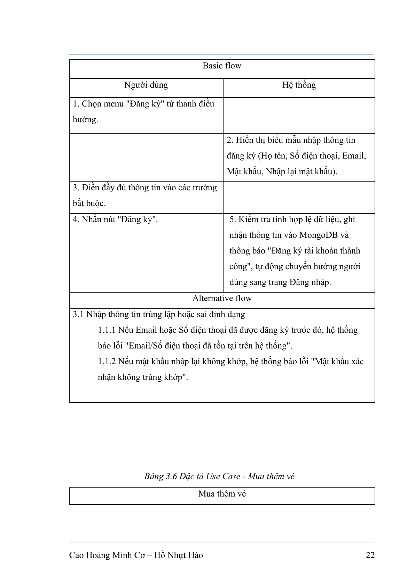

---

### Trang 42:

> Tiền điều kiện 
> Khách hàng đã đăng nhập tài  
> khoản thành công và sự kiện  
> đích còn vé trống.   
> Hậu điều kiện 
> Đơn đặt vé chuyển trạng thái  
> thành "Paid", hệ thống sinh mã  
> vé điện tử QR và trừ số lượng  
> tồn kho.    
> Actor chính 
> Khách hàng   
> Actor phụ 
> Không  
> Basic flow 
> Người dùng 
> Hệ thống 
> 1. Chọn số lượng vé cần mua tại trang 
> chi tiết sự kiện và chọn phương thức 
> thanh toán QR code.  
> 2. Kiểm tra trạng thái đăng nhập hệ 
> thống (Yêu cầu UC Đăng nhập nếu 
> chưa đăng nhập).  
>  
>  
> 3. Nhấn nút "Tiến hành thanh toán".  
> 4. Sinh mã QR động chứa số tiền và 
> nội dung chuyển khoản định danh, 
> hiển thị đồng hồ đếm ngược giao dịch.  
> 5. Mở ứng dụng ngân hàng thực hiện 
> quét mã QR chuyển khoản thành công.  
> 6. Nhận webhook xác thực từ ngân 
> hàng, cập nhật status đơn sang "Paid", 
> đồng bộ số liệu qua WebSocket 
> Realtime và thông báo đặt vé thành 
> công.  
> Alternative flow 
> 
>  23

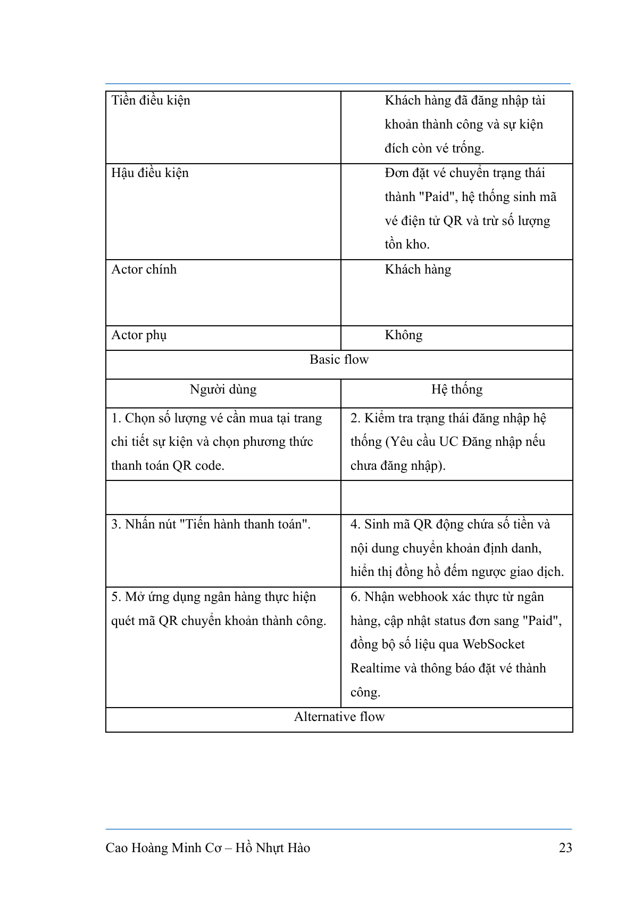

---

### Trang 43:

> 3.1 Số lượng vé yêu cầu vượt quá kho tồn     
> 1.1.1 Hệ thống hiển thị cảnh báo lỗi "Số lượng vé còn lại không đủ" và yêu  
> cầu nhập lại số lượng.    
> 5.1 Hết thời gian chờ thanh toán 
> 1.1.1 Hệ thống tự động hủy phiên giao dịch, giải phóng vị trí vé và thông  
> báo "Giao dịch thất bại do quá thời gian".   
>  
>  
>  
>  
> Bảng 3.7 Đặc tả Use Case - Tạo dự án sự kiện 
> Tạo dự án sự kiện 
> Tiền điều kiện 
> Khách hàng đã đăng nhập tài  
> khoản thành công.     
> Hậu điều kiện 
> Yêu cầu đề xuất dự án sự kiện  
> được lưu vào cơ sở dữ liệu với  
> trạng thái "Chờ duyệt".  
> Actor chính 
> Khách hàng   
> Actor phụ 
> Không  
> Basic flow 
> Người dùng 
> Hệ thống 
> 1. Bấm nút "+ Tạo đề xuất mới" tại giao 
> diện quản lý dự án sự kiện.   
> 2. Hiển thị form nhập dữ liệu đề xuất 
> kế hoạch tổ chức sự kiện.  
> 3. Điền đầy đủ thông tin (Tên dự án, 
> ngày dự kiến, địa điểm, ngân sách) và 
> nhấn gửi.  
> 4. Kiểm tra trạng thái đăng nhập, tiến 
> hành ghi nhận dữ liệu đề xuất vào 
> MongoDB với trạng thái "Chờ duyệt" . 
> 
>  24

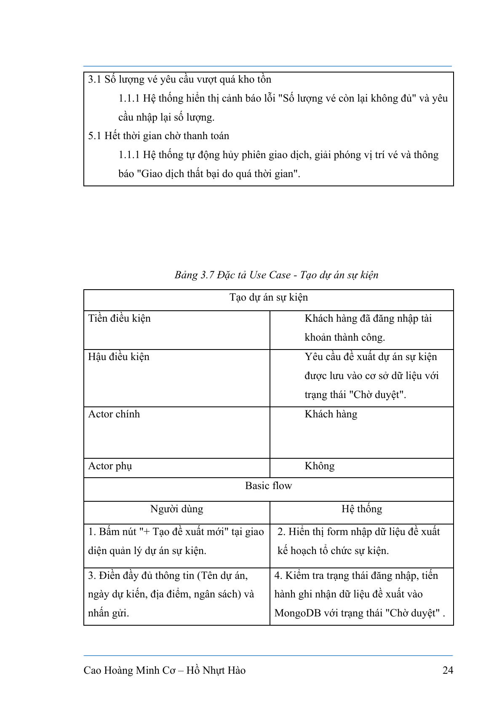

---

### Trang 44:

> Alternative flow 
> 3.1 Để trống trường dữ liệu bắt buộc   
> 1.1.1 Hệ thống từ chối lưu và đưa ra thông báo nhắc nhở "Vui lòng điền 
> đầy đủ các trường thông tin bắt buộc".  
>  
>  
>  
>  
> Bảng 3.8 Đặc tả Use Case - Quản lý hợp đồng sự kiện 
> Quản lý hợp đồng sự kiện 
> Tiền điều kiện 
> Khách hàng đã đăng nhập tài  
> khoản thành công.     
> Hậu điều kiện 
> Thông tin trạng thái pháp lý và  
> văn bản chi tiết của hợp đồng  
> được hiển thị cho khách hàng.  
> Actor chính 
> Khách hàng   
> Actor phụ 
> Không  
> Basic flow 
> Người dùng 
> Hệ thống 
> 1. Chọn chức năng "Quản lý hợp đồng" 
> từ thanh sidebar.   
> 2. Kiểm tra trạng thái đăng nhập, truy 
> vấn MongoDB và render danh sách 
> hợp đồng gắn liền với tài khoản.  
> 3. Click chọn biểu tượng "Mắt xem" tại 
> một hợp đồng cụ thể để kiểm tra chi tiết 
> hạng mục.  
> 4. Truy xuất và hiển thị pop-up chứa 
> nội dung chi tiết văn bản hợp đồng số 
> hóa dạng PDF (Hợp đồng dịch vụ, Phụ 
> lục báo giá...).  
> 
>  25

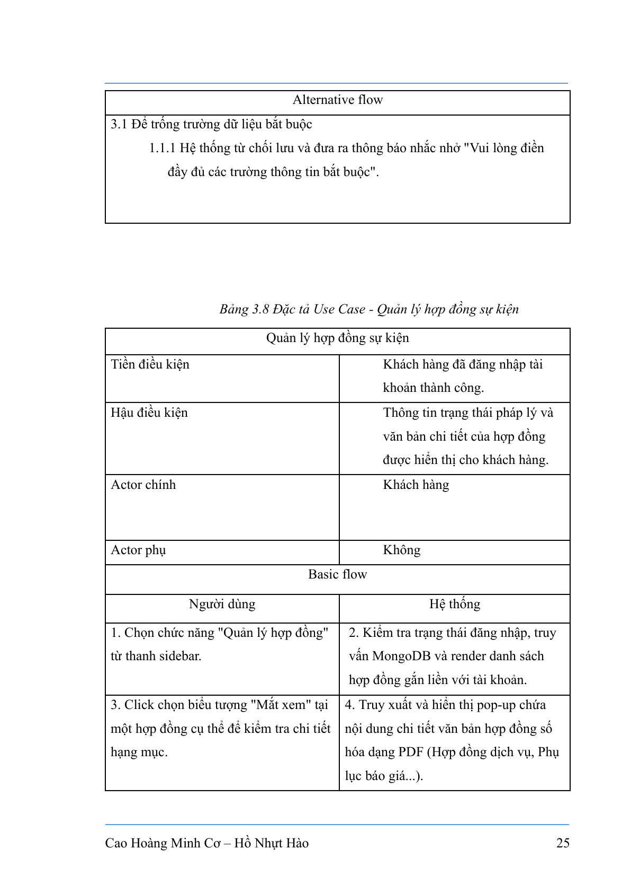

---

### Trang 45:

> Alternative flow 
>  
> Bảng 3.9 Đặc tả Use Case - Gửi thư mời tham gia sự kiện 
>  
> 
>  26 
> Gửi thư mời tham dự sự kiện  
> Tiền điều kiện 
> Khách hàng đã đăng nhập tài  
> khoản thành công; dự án sự kiện  
> liên quan đã được Admin phê  
> duyệt.  
> Hậu điều kiện 
> Hệ thống gửi thư mời đính kèm  
> mã QR-code check-in tự động  
> tới hòm thư của toàn bộ danh  
> sách khách mời.   
> Actor chính 
> Khách hàng   
> Actor phụ 
> Không  
> Basic flow 
> Người dùng 
> Hệ thống 
> 1. Truy cập vào menu "Thư mời " 
> 2. Hiển thị giao diện quản lý gồm các 
> thẻ số liệu tổng quan và nút chức năng 
> gán đối tượng.   
> 3. Nhấn nút "+ Thêm khách mời" để 
> nhập danh sách email đối tác và xác 
> nhận gửi.  
> 4. Kiểm tra quyền đăng nhập, lưu danh 
> sách vào MongoDB, đồng thời kích 
> hoạt Queue Service xử lý tác vụ gửi 
> mail hàng loạt ngầm.  
> Alternative flow 
> 3.1 Tải lên tệp danh sách sai định dạng cấu trúc

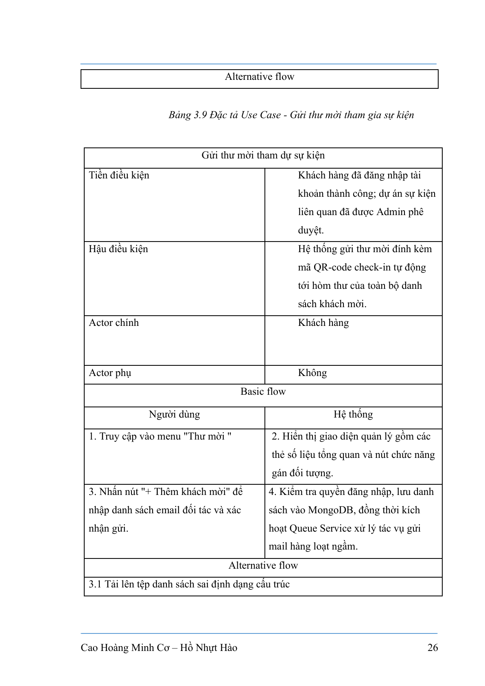

---

### Trang 46:

> Bảng 3.10 Đặc tả Use Case - Xem hợp đồng cá nhân 
> Xem hợp đồng cá nhân  
> Tiền điều kiện 
> Nhân viên đã đăng nhập tài  
> khoản thành công vào hệ thống.    
> Hậu điều kiện 
> Giao diện hiển thị danh sách các  
> hợp đồng tác nghiệp cụ thể được  
> phân công cho nhân viên phụ  
> trách.  
> Actor chính 
> Nhân viên   
> Actor phụ 
> Không  
> Basic flow 
> Người dùng 
> Hệ thống 
> 1. Chọn chức năng "Hợp đồng cá nhân" 
> trên menu điều hướng bên trái.  
> 2. Kiểm tra trạng thái đăng nhập, thực 
> hiện query cơ sở dữ liệu dựa trên mã 
> định danh nhân viên.  
>  
> 3. Tổng hợp số liệu và render giao diện 
> gồm các thẻ card thống kê (Tổng HĐ, 
> Chờ xử lý, Đã duyệt, Tổng giá trị) và 
> danh sách chi tiết.  
> Alternative flow 
>  
>  
> 
>  27 
> 1.1.1 Hệ thống từ chối xử lý, hiển thị cảnh báo lỗi "Cấu trúc file không hợp 
> lệ. Vui lòng kiểm tra lại biểu mẫu định dạng".

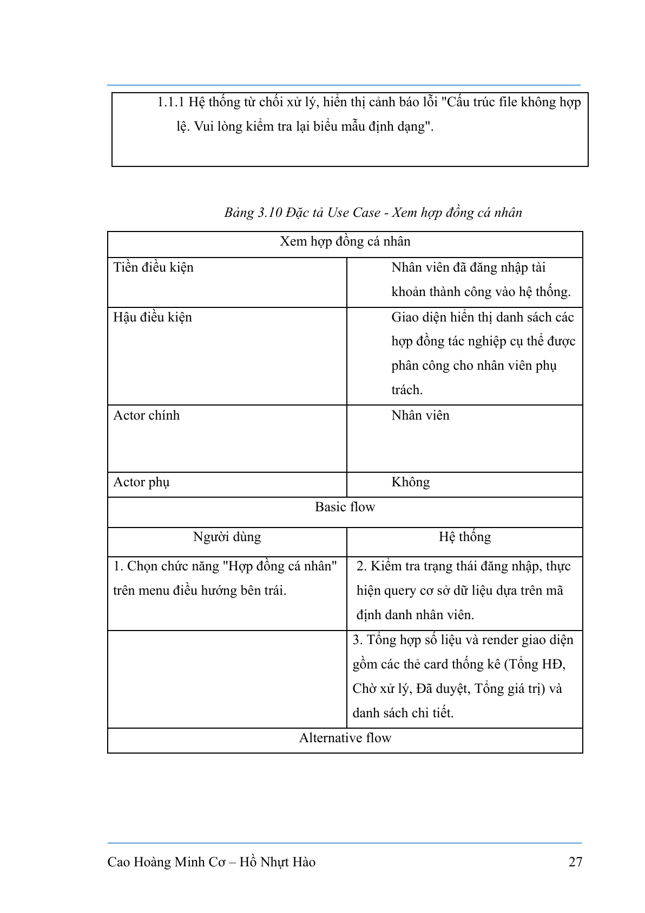

---

### Trang 47:

> Bảng 3.1 Đặc tả Use Case - Xem tất cả hợp đồng  
> Xem tất cả hợp đồng   
> Tiền điều kiện 
> Nhân viên đã đăng nhập tài  
> khoản thành công vào hệ thống.  
> Hậu điều kiện 
> Bảng dữ liệu chứa thông tin toàn  
> bộ hợp đồng trên hệ thống được  
> hiển thị.   
> Actor chính 
> Nhân viên    
> Actor phụ 
> Không  
> Basic flow 
> Người dùng 
> Hệ thống 
> 1. Chọn mục chức năng "Tất cả hợp 
> đồng" trên thanh điều hướng sidebar.  
>  
>  
> 2. Kiểm tra trạng thái đăng nhập, thực 
> hiện quét toàn bộ dữ liệu hợp đồng từ 
> MongoDB và hiển thị lên bảng quản lý 
> (Tên HĐ, Giá trị, Trạng thái, Ngày 
> tạo).  
> 3. Click xem chi tiết nội dung hoặc tiến 
> hành lọc theo trạng thái hợp đồng (Đã 
> ký / Chờ xử lý).  
>  
> Alternative flow 
>  
>  
>  
>  
>  
> 
>  28

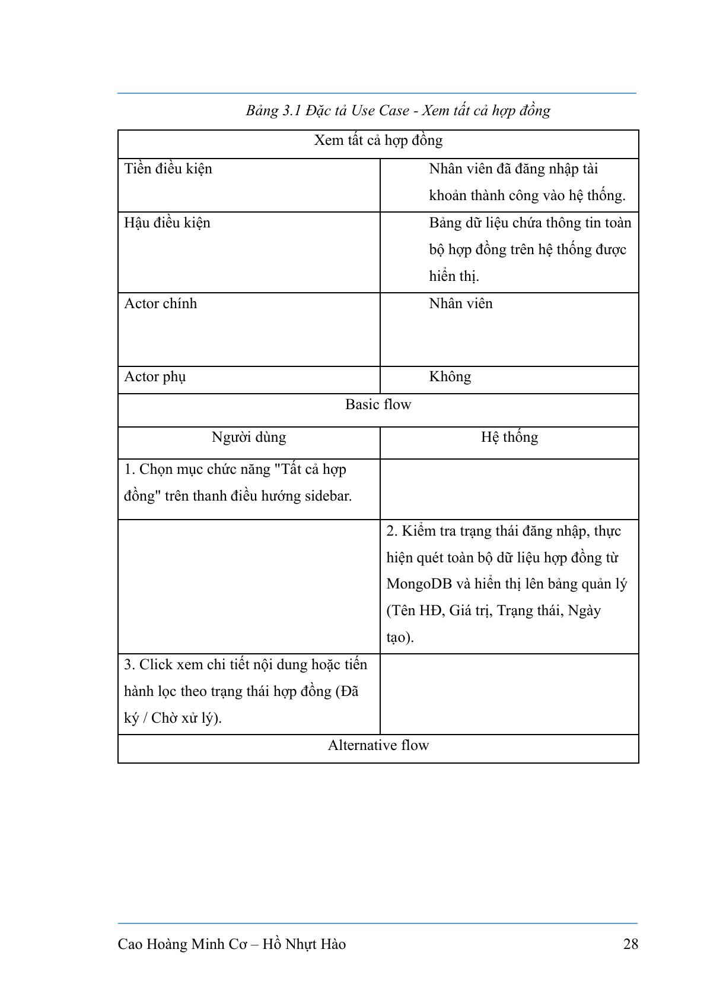

---

### Trang 48:

> Bảng 3.12 Đặc tả Use Case - Xem danh sách sự kiện 
> Xem danh sách sự kiện  
> Tiền điều kiện 
> Nhân viên đã đăng nhập tài  
> khoản thành công vào hệ thống.    
> Hậu điều kiện 
> Hệ thống hiển thị trực quan các  
> sự kiện lớn đang hoạt động dưới  
> dạng các thẻ khối nội dung.    
> Actor chính 
> Nhân viên  
> Actor phụ 
> Không  
> Basic flow 
> Người dùng 
> Hệ thống 
> 1. Chọn menu mục "Danh sách sự 
> kiện".   
>  
>  
> 2. Kiểm tra trạng thái đăng nhập, lấy 
> danh sách dữ liệu sự kiện từ MongoDB 
> và hiển thị dưới dạng khối hình ảnh 
> kèm thông tin nhãn hoạt động  
> Alternative flow 
>  
> Bảng 3.13 Đặc tả Use Case - Quản lý hợp đồng cá nhân 
>  
> 
>  29 
> Quản lý hợp đồng cá nhân  
> Tiền điều kiện 
> Nhân viên đã đăng nhập tài  
> khoản thành công vào hệ thống.  
> Hậu điều kiện 
> Hiển thị danh sách tiến trình xét  
> duyệt và thông tin nhân sự điều

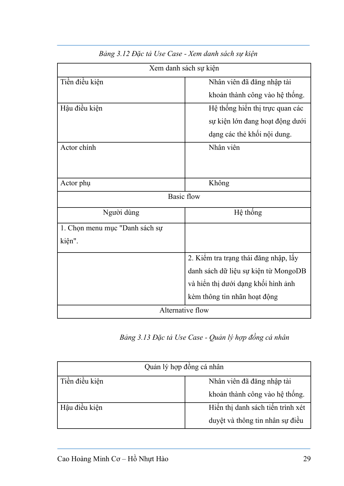

---

### Trang 49:

> Bảng 3.14 Đặc tả Use Case - QR Scanner soát vé 
>  
> 
>  30 
> phối của các đề xuất dự án sự  
> kiện.  
> Actor chính 
> Nhân viên  
> Actor phụ 
> Không  
> Basic flow 
> Người dùng 
> Hệ thống 
> 1. Chọn menu chức năng "Đề xuất SK" 
> trên thanh sidebar.  
>  
>  
> 2. Kiểm tra trạng thái đăng nhập, truy 
> xuất dữ liệu đề xuất từ CSDL và hiển 
> thị rõ ràng ghi chú màu xanh "Đã 
> duyệt, giao cho nhân viên 
> [Tên_Nhân_Vên] phụ trách" đối với dự 
> án được giao đảm nhận.  
> Alternative flow 
>  
>   
> QR Scanner soát vé  
> Tiền điều kiện 
> Nhân viên đã đăng nhập tài  
> khoản thành công và đang túc  
> trực tại cổng soát vé sự kiện.   
> Hậu điều kiện 
> Hệ thống cập nhật trạng thái vé  
> thành "Checked-in" nếu hợp lệ,

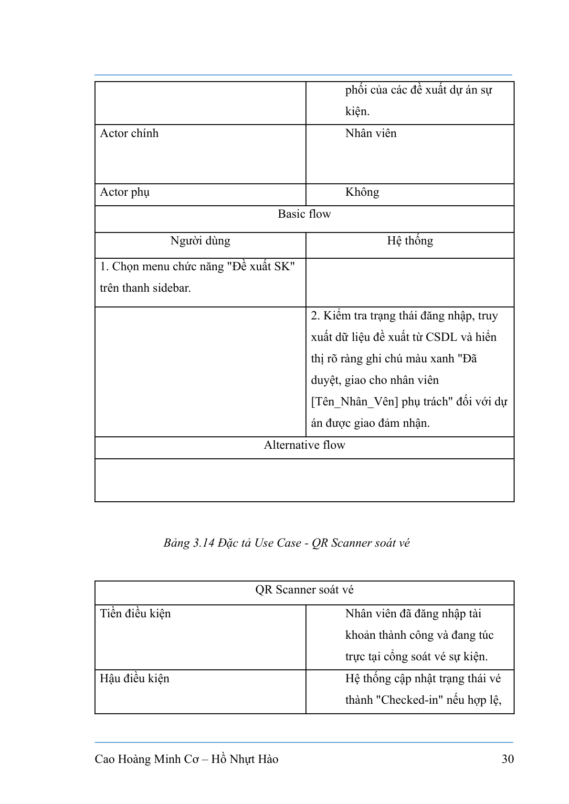

---

### Trang 50:

> 31 
> hoặc đưa ra cảnh báo từ chối  
> truy cập nếu không hợp lệ.  
> Actor chính 
> Nhân viên  
> Actor phụ 
> Không  
> Basic flow 
> Người dùng 
> Hệ thống 
> 1. Chọn menu "QR Scanner (Soát vé)" 
> trên giao diện làm việc.  
> 2. Hiển thị giao diện "Cổng Kiểm Soát 
> Vé" (gồm các tùy chọn: Mở Camera 
> quét trực tiếp / Chọn file ảnh QR / 
> Nhập mã Ticket ID thủ công).  
> 3. Thực hiện quét mã QR trên vé điện tử 
> của khách hàng bằng Camera.  
> 4. Kiểm tra trạng thái đăng nhập, giải 
> mã chuỗi ký tự, đối chiếu thông tin mã 
> định danh vé trong MongoDB.  
>  
> 5. Xác thực thành công dữ liệu vé chưa 
> từng sử dụng, cập nhật trạng thái vé 
> sang "Checked-in" và hiển thị thông 
> báo "Check-in thành công! Vé hợp lệ".  
> Alternative flow 
> 3.1 Quét phải mã vé không hợp lệ hoặc đã qua sử dụng   
> 1.1.1 Hệ thống kiểm tra thấy mã vé sai cấu trúc hoặc trường status đã là  
> checked-in, đưa ra cảnh báo lỗi màu đỏ "Vé không hợp lệ hoặc đã được  
> check-in trước đó!".

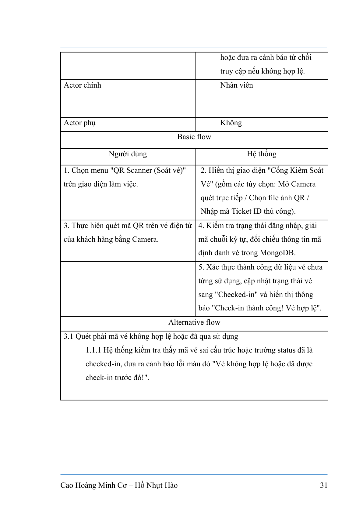

---

### Trang 51:

> Bảng 3.14 Đặc tả Use Case - Quản lý sự kiện 
> Quản lý sự kiện  
> Tiền điều kiện 
> Quản trị viên đã đăng nhập  
> thành công với quyền Admin.     
> Hậu điều kiện 
> Cơ sở dữ liệu sự kiện  
> (MongoDB) được cập nhật dữ  
> liệu mới sau khi thêm/sửa/xóa.    
> Actor chính 
> Quản trị viên   
> Actor phụ 
> Không  
> Basic flow 
> Người dùng 
> Hệ thống 
> 1. Chọn menu "Quản lý sự kiện" trên 
> dashboard.   
> 2. Hiển thị bảng danh sách toàn bộ các 
> sự kiện trong hệ thống kèm bộ lọc 
> trạng thái.  
> 3. Chọn nút "Thêm sự kiện" (hoặc chọn 
> "Sửa"/"Xóa" một sự kiện có sẵn từ danh 
> sách).  
> 4. Hiển thị biểu mẫu thông tin sự kiện 
> tương ứng.  
> 5. Điền thông tin (Tên sự kiện, thời gian 
> bắt đầu/kết thúc, mô tả, chọn địa điểm 
> tổ chức, phân bổ vé) và nhấn "Lưu thay 
> đổi".  
> 6. Hệ thống thực hiện kiểm tra logic 
> (không trùng lịch địa điểm, thời gian 
> hợp lý), cập nhật dữ liệu vào 
> MongoDB và thông báo tác vụ thành 
> công.  
> Alternative flow 
> 
>  32

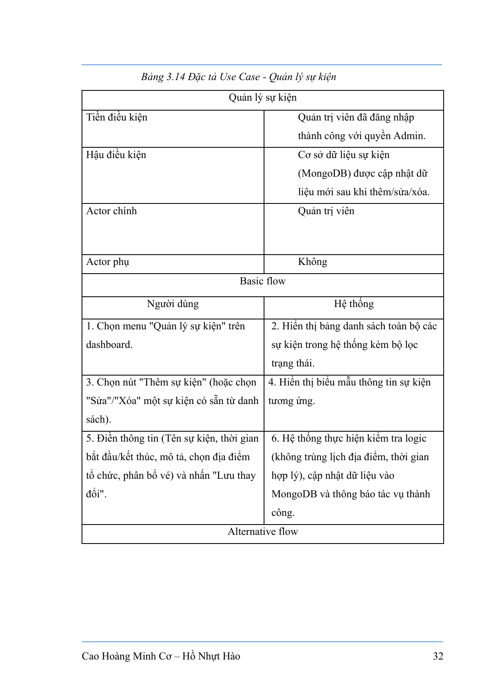

---

### Trang 52:

> 5.1 Điền thông tin ngày tổ chức bị trùng hoặc ở quá khứ      
> 1.1.1 Hệ thống hiển thị cảnh báo lỗi "Thời gian tổ chức sự kiện không hợp  
> lệ hoặc địa điểm đã được đặt trước bởi sự kiện khác". 
> 5.2 Chọn hành động Xóa sự kiện      
> 1.1.1 Hệ thống hiển thị pop-up cảnh báo xác nhận xóa. Nếu Admin bấm  
> đồng ý, hệ thống đổi trạng thái sự kiện thành "Đã hủy" (Soft delete) và gửi  
> thông báo hoàn vé tự động tới những khách hàng đã mua vé.  
>  
>  
>  
>  
>  
>  
>  
>  
> Bảng 3.15 Đặc tả Use Case - Quản lý địa điểm 
> Quản lý địa điểm  
> Tiền điều kiện 
> Quản trị viên đã đăng nhập hệ  
> thống với quyền Admin.      
> Hậu điều kiện 
> Danh mục thông tin các địa 
> điểm, hội trường, trung tâm tổ 
> chức được cập nhật mới.    
> Actor chính 
> Quản trị viên   
> Actor phụ 
> Không  
> Basic flow 
> Người dùng 
> Hệ thống 
> 
>  33

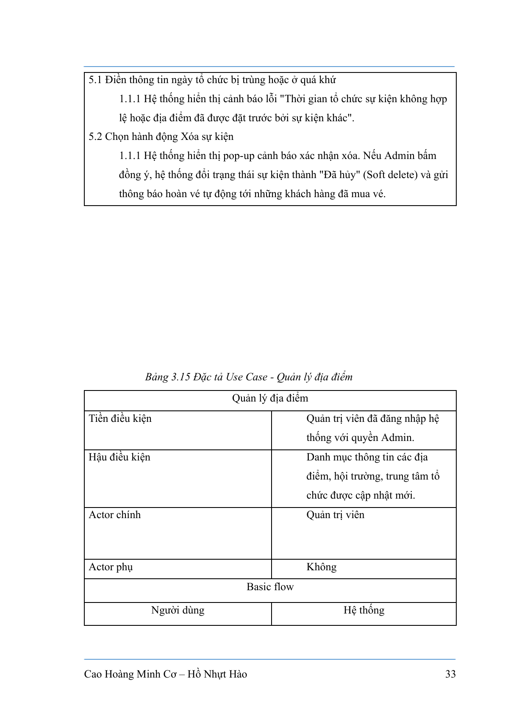

---

### Trang 53:

> 1. Chọn menu "Quản lý địa điểm".  
> 2. Hiển thị danh sách các trung tâm, 
> phòng ban, nhà hát, hội trường có khả 
> năng tổ chức sự kiện.  
> 3. Nhấn "Thêm địa điểm" hoặc bấm 
> chỉnh sửa thông tin một địa điểm có 
> sẵn.  
> 4. Hiển thị form nhập: Tên địa điểm, 
> Địa chỉ, Sức chứa tối đa (tổng số ghế), 
> và Trạng thái (Sẵn sàng / Đang sửa 
> chữa).  
> 5. Nhập các thông số và bấm "Lưu".  
> 6. Lưu thông tin và hiển thị thông báo 
> "Cập nhật danh mục địa điểm thành 
> công".  
> Alternative flow 
>  
> Bảng 3.16 Đặc tả Use Case - Quản lý dịch vụ 
> Quản lý dịch vụ 
> Tiền điều kiện 
> Quản trị viên đã đăng nhập hệ  
> thống với quyền Admin.      
> Hậu điều kiện 
> Danh sách các gói dịch vụ đi 
> kèm sự kiện (âm thanh ánh sáng, 
> tiệc teabreak, trang trí sân khấu) 
> được cập nhật thành công.     
> Actor chính 
> Quản trị viên   
> Actor phụ 
> Không  
> Basic flow 
> Người dùng 
> Hệ thống 
> 1. Chọn menu "Quản lý dịch vụ".   
> 2. Hiển thị danh mục các dịch vụ bên 
> thứ ba hoặc dịch vụ nội bộ dùng cho 
> sự kiện.  
> 
>  34

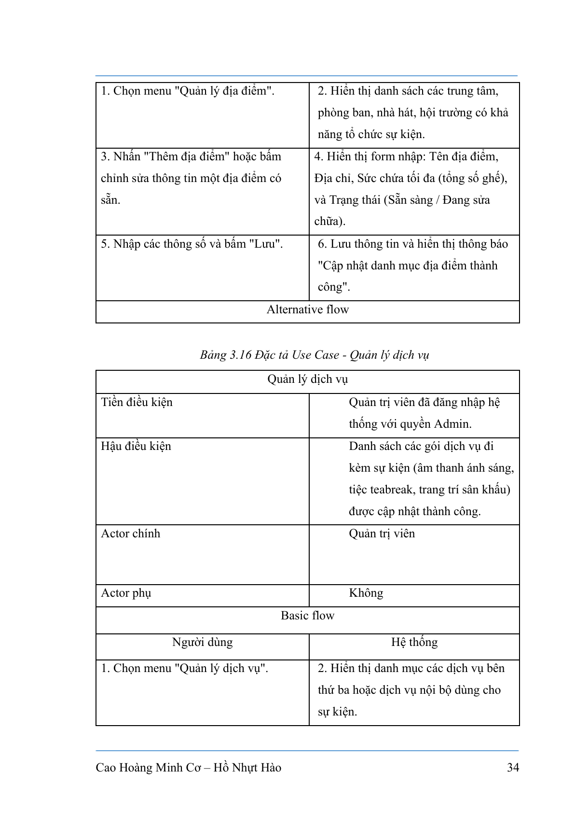

---

### Trang 54:

> 3. Nhấn "Thêm dịch vụ mới", nhập Tên 
> dịch vụ, Đơn giá định biên, Mô tả gói 
> dịch vụ và chọn "Lưu".  
> 4. Hệ thống kiểm tra dữ liệu, cập nhật 
> danh mục dịch vụ phục vụ cho việc lập 
> dự toán sự kiện và thông báo thành 
> công.  
> Alternative flow 
>  
> Bảng 3.17 Đặc tả Use Case - Quản lý thiết bị 
> Quản lý thiết bị 
> Tiền điều kiện 
> Quản trị viên đã đăng nhập hệ  
> thống với quyền Admin.      
> Hậu điều kiện 
> Kho dữ liệu trang thiết bị (bàn 
> ghế, micro, màn hình LED, thiết 
> bị check-in QR) được đồng bộ.    
> Actor chính 
> Quản trị viên   
> Actor phụ 
> Không  
> Basic flow 
> Người dùng 
> Hệ thống 
> 1. Chọn menu "Quản lý thiết bị" từ 
> thanh điều hướng bên.  
> 2. Hiển thị trang chứa bảng danh sách 
> và tình trạng các thiết bị phần cứng.  
> 3. Nhập tiêu chí tìm kiếm hoặc thực 
> hiện cập nhật số lượng thiết bị nhập kho 
> mới/báo hỏng hư hao.  
> 4. Thực hiện cập nhật số liệu tồn kho 
> thiết bị vào cơ sở dữ liệu và hiển thị 
> thông báo "Cập nhật trạng thái thiết bị 
> thành công".  
> Alternative flow 
>  
>  
>  
> 
>  35

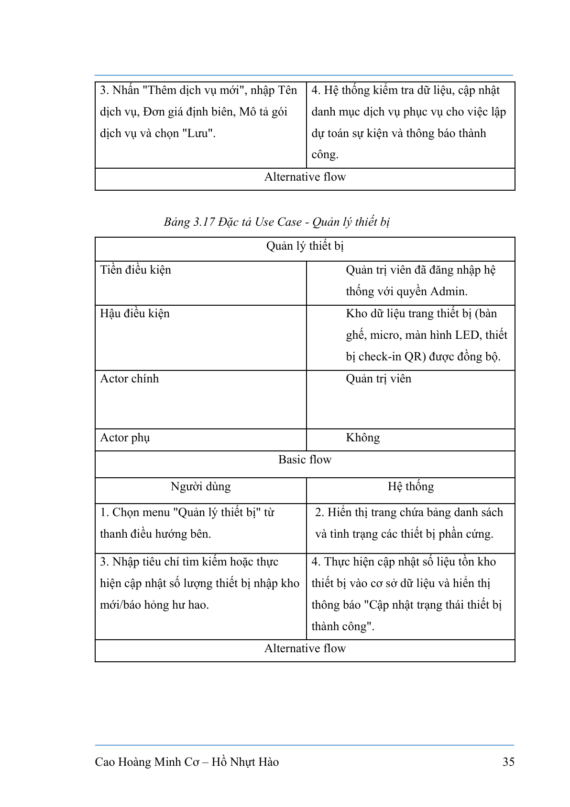

---

### Trang 55:

> Bảng 3.18 Đặc tả Use Case - Quản lý nhân sự 
> Quản lý nhân sự 
> Tiền điều kiện 
> Quản trị viên đã đăng nhập hệ  
> thống với quyền Admin.      
> Hậu điều kiện 
> Thông tin hồ sơ nhân sự và phân 
> công công việc của nhân viên 
> được cập nhật.    
> Actor chính 
> Quản trị viên   
> Actor phụ 
> Không  
> Basic flow 
> Người dùng 
> Hệ thống 
> 1. Chọn menu "Quản lý nhân sự".  
> 2. Hiển thị danh sách toàn bộ cán bộ, 
> nhân viên phụ trách vận hành sự kiện.  
> 3. Thêm hồ sơ nhân viên mới hoặc thực 
> hiện gán quyền điều hành sự kiện cho 
> một nhân viên cụ thể.  
> 4. Hệ thống lưu phân vùng dữ liệu điều 
> phối, cập nhật trạng thái hoạt động của 
> nhân viên và hiển thị thông báo thành 
> công.  
> Alternative flow 
>  
> Bảng 3.19 Đặc tả Use Case - Quản lý hợp đồng tổng thể 
> Quản lý hợp đồng tổng thể 
> Tiền điều kiện 
> Quản trị viên đã đăng nhập hệ  
> thống với quyền Admin.      
> Hậu điều kiện 
> Hợp đồng kinh tế với các đối tác 
> tài trợ, nhà cung ứng địa điểm 
> 
>  36

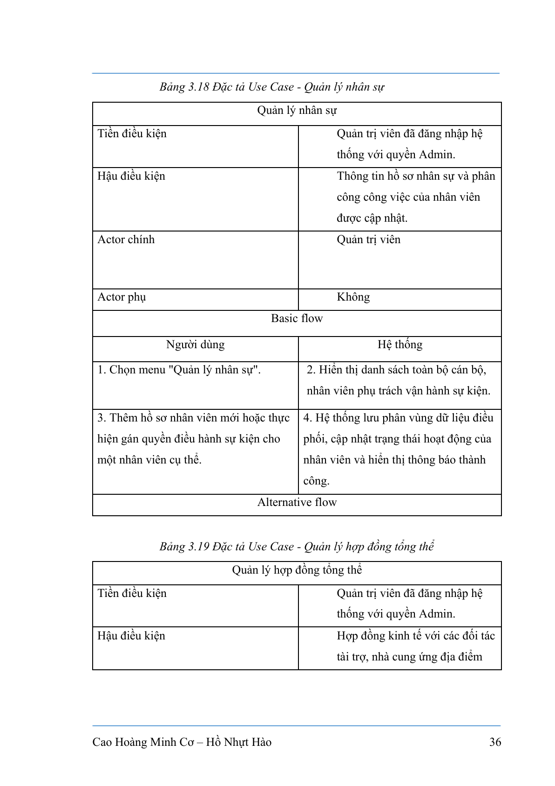

---

### Trang 56:

> hoặc khách hàng mua vé VIP 
> được lưu trữ, phê duyệt.     
> Actor chính 
> Quản trị viên   
> Actor phụ 
> Không  
> Basic flow 
> Người dùng 
> Hệ thống 
> 1. Chọn menu "Quản lý hợp đồng tổng 
> thể".  
> 2. Hiển thị danh sách toàn bộ các loại 
> hợp đồng trong hệ thống.   
> 3. Admin chọn phê duyệt trạng thái hợp 
> đồng, cập nhật giá trị phụ lục hợp đồng 
> phát sinh trong quá trình tổ chức sự kiện 
> và bấm "Lưu".  
> 4. Hệ thống thay đổi trạng thái pháp lý 
> của hợp đồng trên CSDL, đồng thời ghi 
> nhận doanh thu/chi phí tạm tính cho sự 
> kiện đó.  
> Alternative flow 
>  
>  
> Bảng 3.20 Đặc tả Use Case - Quản lý người dùng 
> Quản lý người dùng 
> Tiền điều kiện 
> Quản trị viên đã đăng nhập hệ  
> thống với quyền Admin.      
> Hậu điều kiện 
> Trạng thái hoạt động của tài 
> khoản khách hàng được cập nhật 
> (Kích hoạt / Khóa tài khoản).     
> Actor chính 
> Quản trị viên   
> Actor phụ 
> Không  
> 
>  37

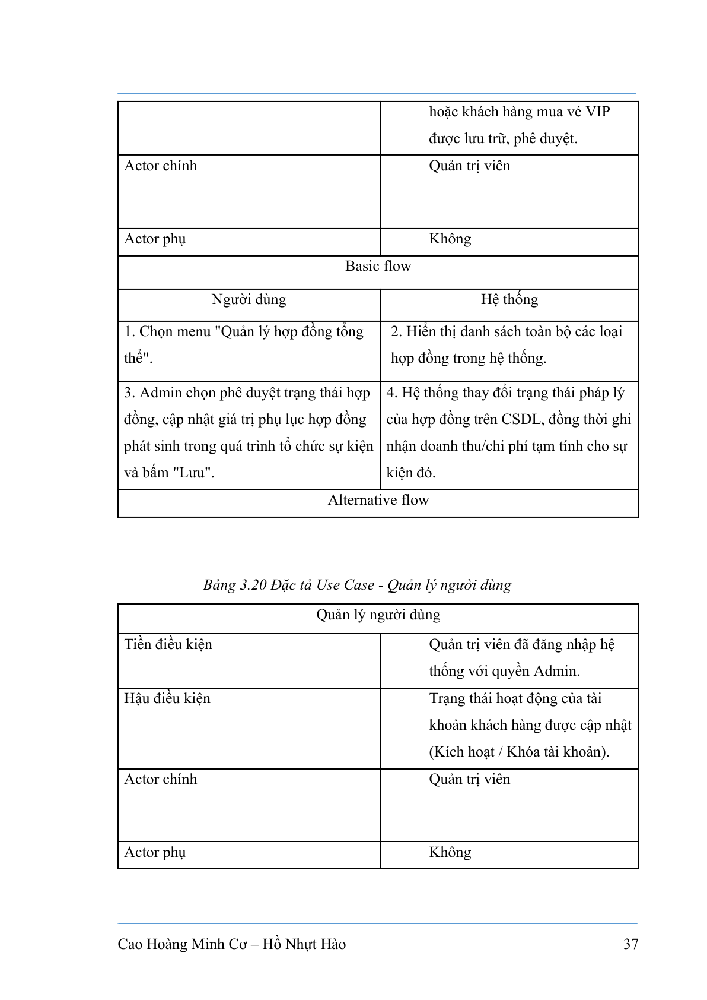

---

### Trang 57:

> Basic flow 
> Người dùng 
> Hệ thống 
> 1. Chọn menu "Quản lý người dùng" từ 
> thanh bên.  
> 2. Hiển thị danh sách dữ liệu tài khoản 
> của toàn bộ Khách hàng đăng ký trên 
> hệ thống.  
> 3. Tìm kiếm tài khoản và thực hiện thao 
> tác xem lịch sử mua vé hoặc thực hiện 
> "Khóa tài khoản" nếu phát hiện dấu 
> hiệu spam, gian lận vé.  
> 4. Hệ thống cập nhật trường trạng thái 
> trong cơ sở dữ liệu MongoDB và ngắt 
> phiên đăng nhập lập tức của tài khoản 
> vi phạm.   
> Alternative flow 
>  
>  
>  
>  
>  
>  
>  
>  
>  
>  
>  
>  
>  
>  
>  
>  
>  
>  
> 
>  38

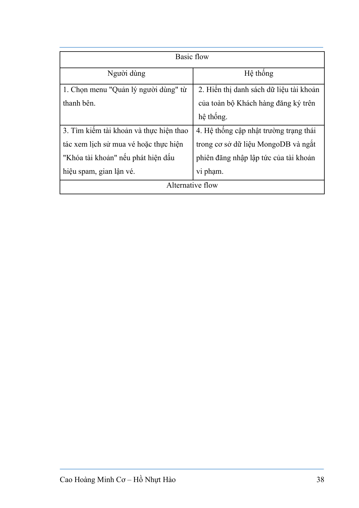

---

### Trang 58:

> Bảng 3.21 Đặc tả Use Case - Thống kê báo cáo 
> Thống kê báo cáo 
> Tiền điều kiện 
> Quản trị viên đã đăng nhập hệ  
> thống với quyền Admin.      
> Hậu điều kiện 
> Các biểu đồ động về doanh thu 
> bán vé, số lượng người tham dự, 
> hiệu suất sử dụng thiết bị được 
> xuất ra màn hình hoặc file báo 
> cáo.      
> Actor chính 
> Quản trị viên   
> Actor phụ 
> Không  
> Basic flow 
> Người dùng 
> Hệ thống 
> 1. Chọn menu mục "Thống kê báo cáo" 
> trên thanh sidebar bên trái.  
> 2. Kiểm tra quyền Admin, tự động 
> kích hoạt hệ thống chạy lệnh 
> Aggregation tổng hợp số liệu cơ sở dữ 
> liệu phát sinh thực tế.  
> 3. Xem xét thông số hoặc tùy chọn nhấn 
> lọc nhanh dữ liệu theo mốc: Tất cả, 7 
> ngày, 30 ngày, 90 ngày hoặc bấm nút 
> "Làm mới".  
> 4. Render hiển thị trực quan các thẻ 
> card chỉ số (Tổng Doanh Tư, Vé Đã 
> Bán, Thành Viên, Sự Kiện...) và vẽ các 
> biểu đồ xu hướng "Doanh Tư & Dự 
> Báo", biểu đồ tròn phân loại sự kiện.  
> Alternative flow 
>  
>  
> 
>  39

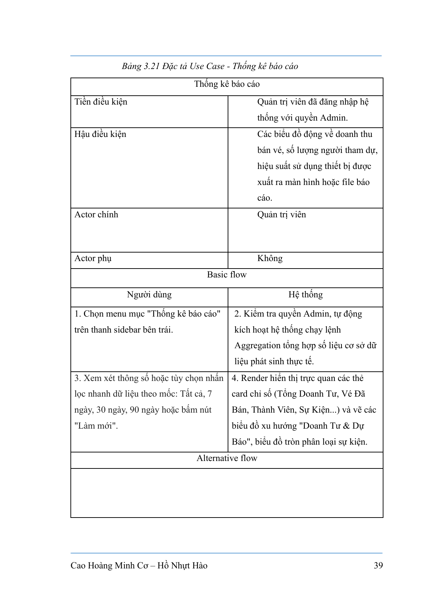

---

### Trang 59:

> Bảng 3.22 Đặc tả Use Case - Duyệt yêu cầu sự kiện 
> Duyệt yêu cầu sự kiện 
> Tiền điều kiện 
> Quản trị viên đã đăng nhập  
> thành công vào tài khoản  
> Admin. .      
> Hậu điều kiện 
> Yêu cầu đề xuất dự án sự kiện 
> được xét duyệt; hệ thống tự 
> động sinh quy trình tác nghiệp 
> điều phối.  
> Actor chính 
> Quản trị viên   
> Actor phụ 
> Không  
> Basic flow 
> Người dùng 
> Hệ thống 
> 1. Chọn mục "Duyệt Yêu Cầu SK" trên 
> thanh menu sidebar.   
> 2. Kiểm tra quyền Admin, hiển thị 
> bảng danh sách yêu cầu dự án sự kiện 
> gồm các trường: Ngày gửi, Khách 
> hàng, Tên dự án, Ngày dự kiến, Địa 
> điểm, Ngân sách, Trạng thái.  
> 3. Xem xét thông số kế hoạch dự án và 
> nhấn chọn nút "Duyệt" tại dòng thao 
> tác.  
> 4. Kiểm tra điều kiện ràng buộc logic, 
> cập nhật trạng thái dự án sang Đã duyệt 
> trong MongoDB, đồng thời tự động 
> gán quyền theo dõi dự án phụ trách cho 
> một Nhân viên nội bộ.   
> Alternative flow 
>  
>  
>  
> 
>  40

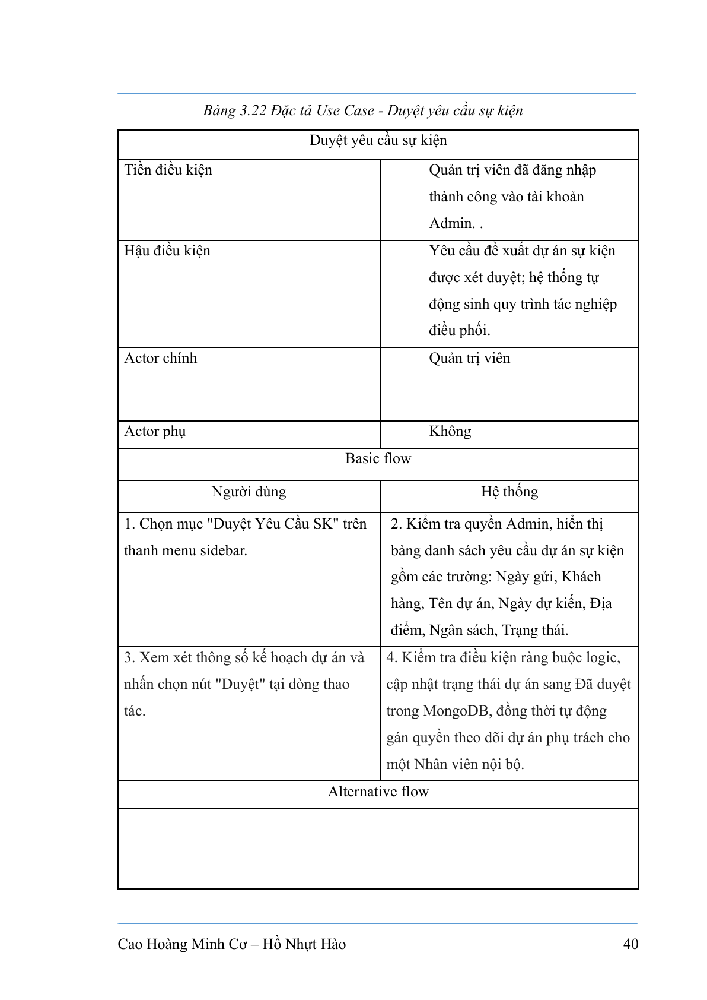

---

## CHƯƠNG 4: THIẾT KẾ KIẾN TRÚC VÀ DỮ LIỆU
*Sequence Diagrams, Cấu trúc thư mục, Đánh giá hệ thống, ERD*

<b>Xem nội dung (26 trang: trang 60 – 85)</b>

### Trang 60:

> CHƯƠNG 4: THIẾT KẾ KIẾN TRÚC VÀ DỮ LIỆU 
> 4.1. Thiết kế Luồng Nghiệp vụ (Sequence Diagrams) 
> -
> Đăng nhập 
>  
> Hình 4.1 Sequence Diagram đăng nhập 
>  
> -
> Đăng xuất 
> 
>  41

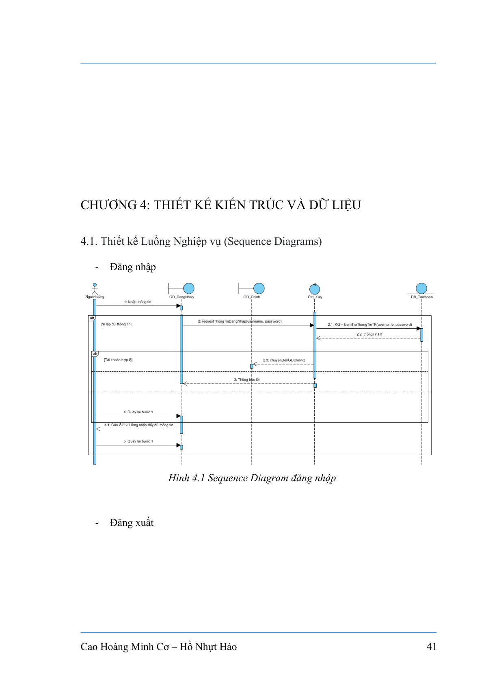

---

### Trang 61:

> Hình 4.2 Sequence Diagram đăng xuất 
>  
>  
>  
> -
> Tìm kiếm sự kiện  
>  
> Hình 4.3 Sequence Diagram tìm kiếm sự kiện 
>  
> -
> Xem chi tiết sự kiện  
> 
>  42

---

### Trang 62:

> Hình 4.4 Sequence Diagram xem chi tiết sự kiện 
>  
> -
> Đăng ký tài khoản  
>  
> 
> 
> Hình 4.5 Sequence Diagram đặt đăng ký tài khoản 
>  
>  
>  
>  
>  
>  
>  
> 
>  43

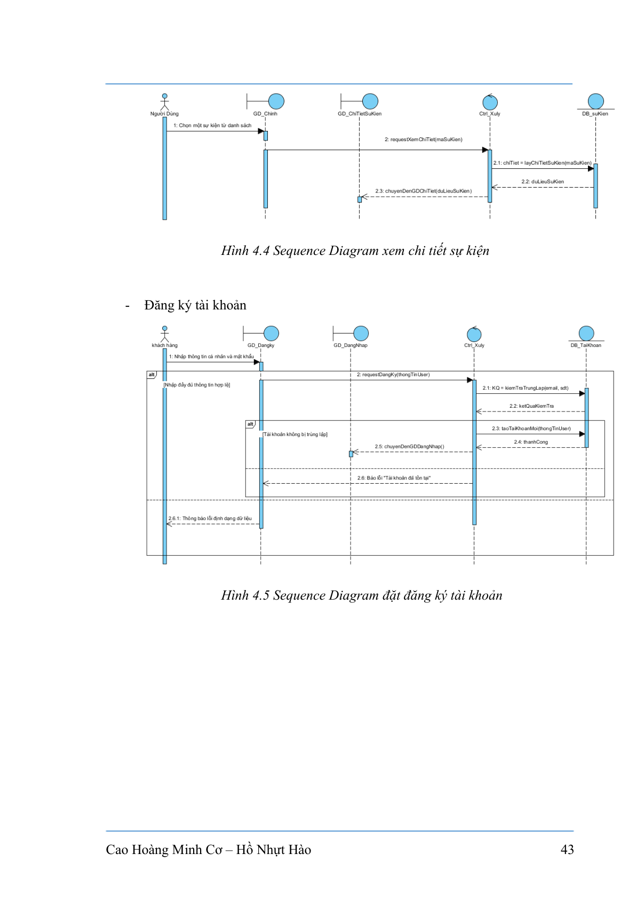

---

### Trang 63:

> -
> Đặt vé 
>  
> Hình 4.6 Sequence Diagram đặt vé  
>  
> -
> Hủy vé  
>  
> 
> 
> 
> Hình 4.7 Sequence Diagram hủy vé 
>  
> 
>  44

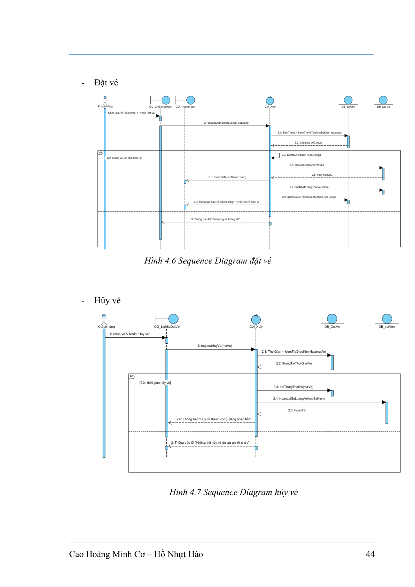

---

### Trang 64:

> -
> Mua thêm vé 
>  
> 
> 
> Hình 4.8 Sequence Diagram mua thêm vé 
>  
> -
> Quản lý tài khoản 
>  
> 
> 
> Hình 4.9 Sequence Diagram đặt vé trực tuyến 
>  
> -
> Quản lý hợp đồng cá nhân  
> 
>  45

---

### Trang 65:

> Hình 4.9 Sequence Diagram quản lý hợp đồng cá nhân 
>  
> -
> Gửi thư mời tham dự sự kiện  
>  
> 
> 
> Hình 4.10 Sequence Diagram gửi thư mời tham gia sự kiện 
> -
> Quản lý sự kiện 
> 
>  46

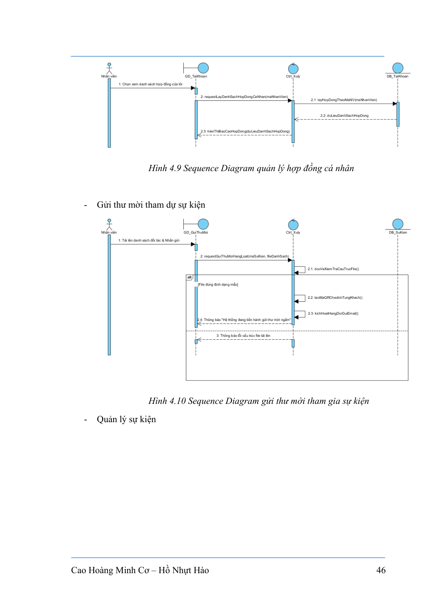

---

### Trang 66:

> Hình 4.11 Sequence Diagram quản lý sự kiện
> 
>  
> -
> Quản lý địa điểm  
>  
> 
> 
> Hình 4.12 Sequence Diagram quản lý địa điểm 
> -
> Quản lý dịch vụ  
> 
>  47

---

### Trang 67:

> Hình 4.13 Sequence Diagram quản lý dịch vụ
>  
> -
> Quản lý thiết bị  
>  
> 
> 
> Hình 4.14 Sequence Diagram quản lý thiết bị 
> -
> Quản lý nhân sự 
>  
> 
> 
> Hình 4.15 Sequence Diagram quản lý nhân sự 
>  
>  
> 
>  48

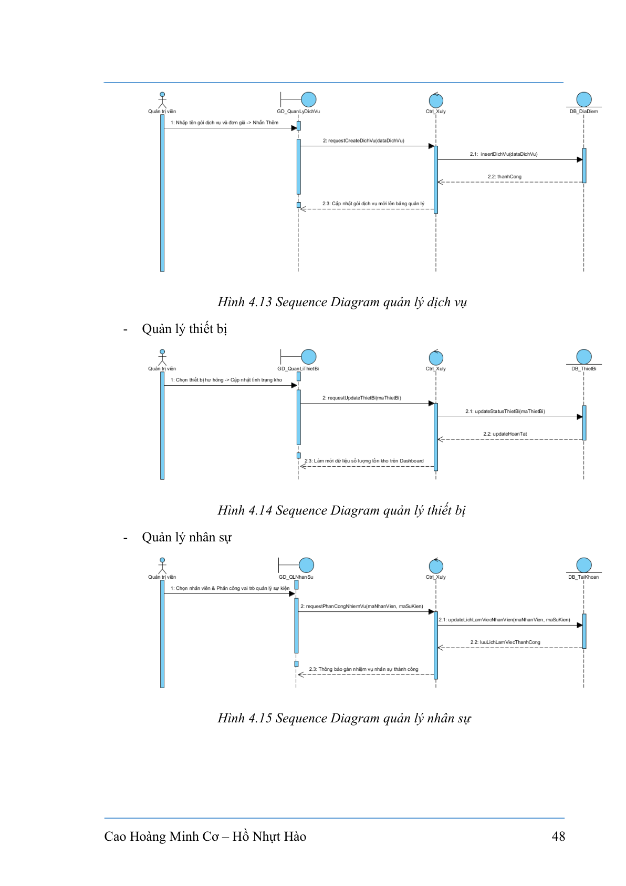

---

### Trang 68:

> -
> Quản lý hợp đồng tổng thể 
>  
> 
> 
> Hình 4.16 Sequence Diagram quản lý hợp đồng tổng thể 
> -
> Quản lý người dùng 
>  
> 
> 
> Hình 4.17 Sequence Diagram quản lý người dùng 
> -
> Thống kê báo cáo 
> 
>  49

---

### Trang 69:

> Hình 4.18 Sequence Diagram quản lý thống kê báo cáo 
> - Quản lý khách hàng toàn hệ thống 
>  
> 
> 
> Hình 4.19 Sequence Diagram quản lý khách hàng hệ thống 
> 4.2 Cấu trúc thư mục dự án 
> c:/Nam4/ThayPhuoc/CK/ 
> ├── event-booking-backend/       # Phân hệ Backend (Node.js & Express API) 
> 
>  50

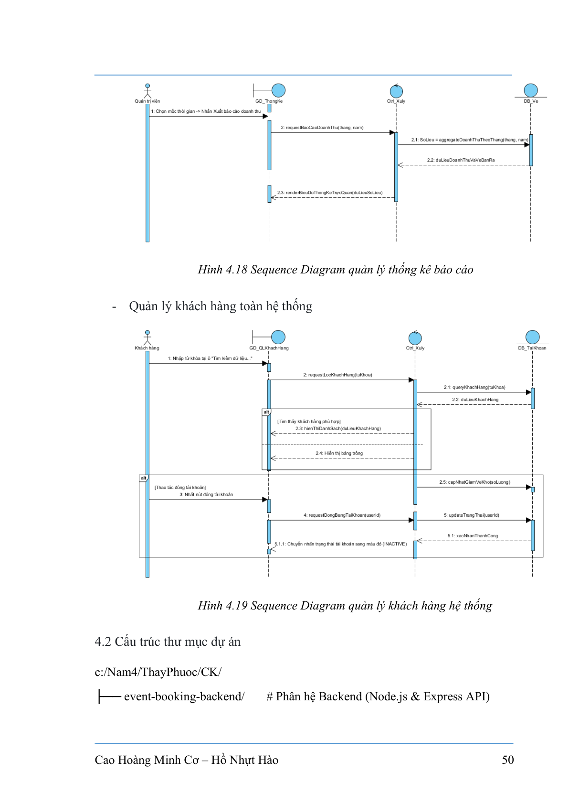

---

### Trang 70:

> │   ├── seed.js                  # Khởi tạo cơ sở dữ liệu mẫu thực tế 
> │   ├── seed-seats.js            # Khởi tạo sơ đồ ghế ngồi thời gian thực 
> │   ├── server.js                
> # Điểm khởi chạy Server (Express + GraphQL + 
> Socket.IO) 
> │   └── src/ 
> │       ├── config/              # Kết nối cơ sở dữ liệu MongoDB 
> │       ├── models/              # Định nghĩa 13 Mongoose Schemas 
> │       ├── services/            # Chứa các nghiệp vụ nền (AI, Email, QR, RabbitMQ) 
> │       └── schema.js            # GraphQL Schema (Resolvers & Types) 
> │ 
> └── event-booking-frontend/      # Phân hệ Frontend (ReactJS & Vite) 
>     └── src/ 
>         ├── features/            # Các tính năng nghiệp vụ cốt lõi 
>         │   ├── auth/            # Xác thực, OTP 
>         │   ├── discovery/       # Lọc, tìm kiếm và xem chi tiết sự kiện 
>         │   ├── ticketing/       # Sơ đồ ghế thời gian thực, thanh toán vé B2C 
>         │   ├── proposal/        # Đề xuất tổ chức sự kiện B2B 
>         │   ├── rsvp/            # Quản lý khách mời gửi thư điện tử 
>         │   └── dashboard/       # Thống kê, AI insights, biểu đồ, CRUD tài nguyên 
>         ├── pages/               # Trang giao diện chính của các Actor 
>         └── components/          # Layout dùng chung (Topbar, Sidebar) 
>  
> 4.3 Đánh giá hệ thống 
> 1.1 Phân hệ chức năng hệ thống chung 
>  
> 
>  51

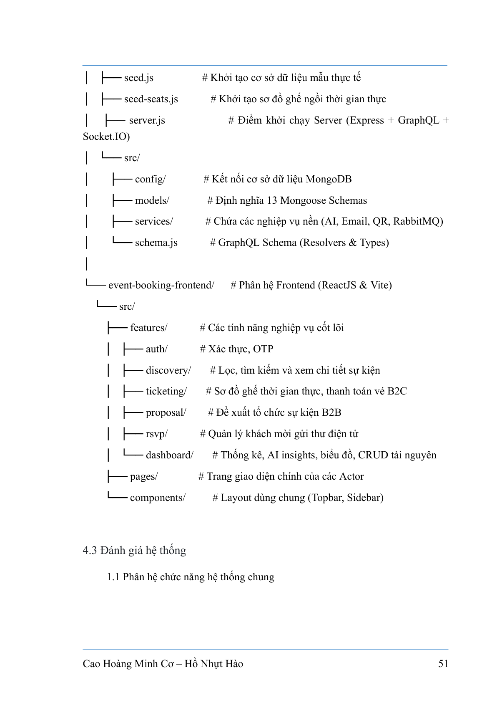

---

### Trang 71:

> Chức năng 
> Tiền điều kiện 
> Mô tả 
> Dữ liệu Test 
> Kết quả mong 
> muốn 
> Đăng nhập 
> Truy cập trang 
> chủ  
> Đăng nhập 
> thành công 
> với tài khoản 
> hợp lệ  
> admin / 123 
> Đăng nhập 
> thành công; hệ 
> thống lưu 
> phiên làm việc 
> (Token) và 
> điều hướng về 
> trang 
> Dashboard.  
>   
>   
> Đăng nhập 
> thất bại do sai 
> mật khẩu  
> admin / 1234 
> Hệ thống từ 
> chối đăng 
> nhập; hiển thị 
> thông báo lỗi 
> "Tài khoản 
> hoặc mật khẩu 
> không chính 
> xác".  
>   
>   
> Đăng nhập 
> thất bại do 
> thiếu thông tin 
> đầu vào  
> …/ 123 
> Hệ thống báo 
> lỗi ngay tại 
> form: "Vui 
> lòng nhập đầy 
> đủ thông tin".  
>   
>   
> Kiểm tra tính 
> năng xóa 
> phiên làm 
> việc  
> Nhấn nút 
> "Đăng xuất" 
> trên thanh điều 
> hướng  
> Hệ thống xóa 
> Token/Session 
> thành công, 
> điều hướng 
> người dùng 
> 
>  52

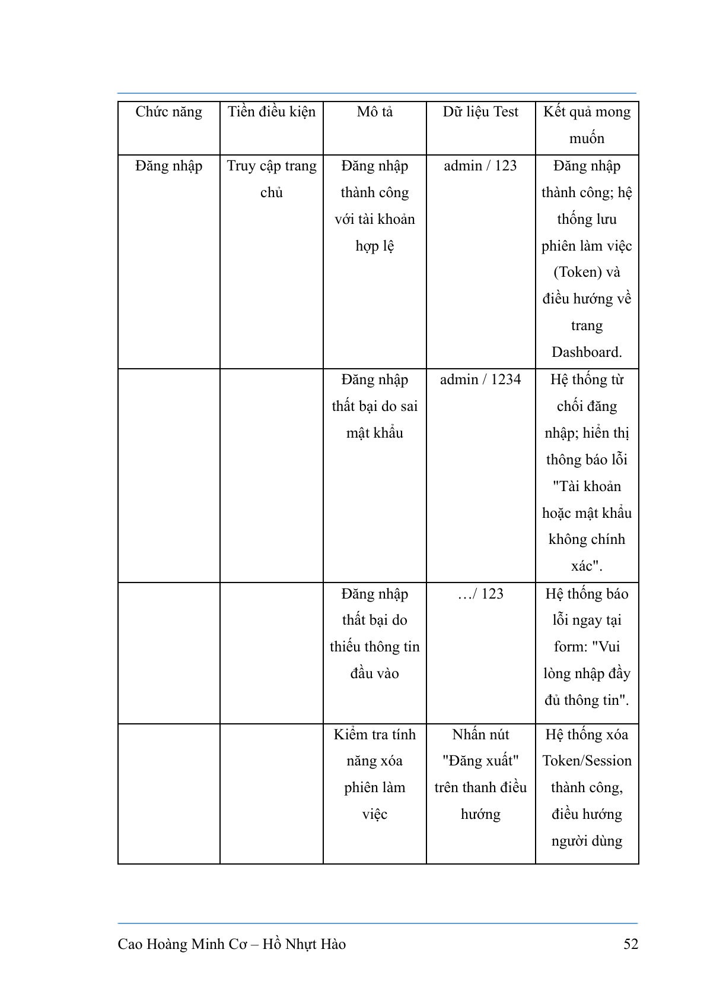

---

### Trang 72:

> quay lại trang 
> chủ công khai.  
> 
>  
> 1.2 Phân hệ chức năng của Khách Hàng 
>  
> Chức năng 
> Tiền điều kiện 
> Mô tả 
> Dữ liệu Test 
> Kết quả mong 
> muốn 
> Tìm kiếm sự 
> kiện  
> Truy cập hệ 
> thống  
> Tra cứu theo 
> tên sự kiện 
> (Khớp chính 
> xác)  
> Từ khóa tìm 
> kiếm = "Siêu 
> Nhạc Hội 
> KOSMIK 
> 2026"  
> Hiển thị đúng 
> bản ghi sự 
> kiện có tên 
> tương ứng; 
> bảng hiển thị 
> đúng số dòng; 
> tổng bản ghi 
> cập nhật.  
>   
>   
> Tra cứu theo 
> từ khóa gần 
> đúng (Không 
> dấu, không 
> phân biệt 
> hoa/thường)   
> Từ khóa tìm 
> kiếm = 
> "vietnam tech 
> summit"  
> Trả về các bản 
> ghi phù hợp 
> gồm 'Vietnam 
> Tech Summit 
> 2026: AI & 
> Future'; tìm 
> kiếm chấp 
> nhận chuỗi 
> không dấu và 
> không phân 
> biệt chữ hoa.   
> 
>  53

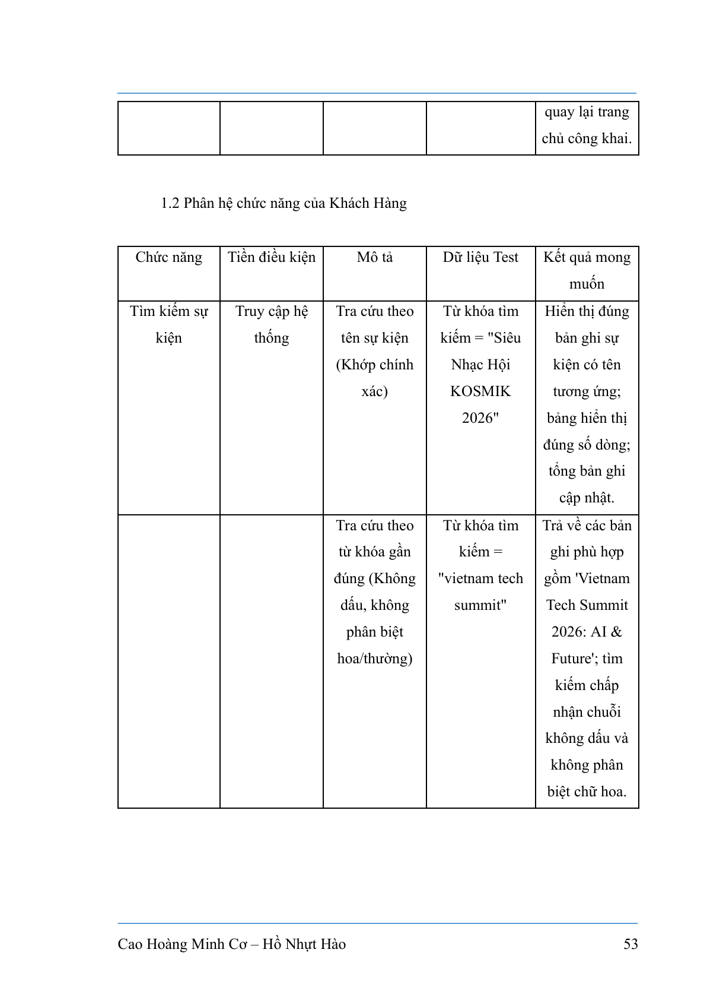

---

### Trang 73:

> Tra cứu để 
> trống tiêu chí  
> Để trống ô tìm 
> kiếm và bấm 
> nút "Tìm"  
> Hệ thống cho 
> phép tra cứu, 
> mặc định tải 
> và hiển thị 
> toàn bộ danh 
> sách các sự 
> kiện hiện có 
> trên nền tảng.  
>  Mua thêm vé  
>  Tài khoản 
> Member đã 
> đăng nhập 
> thành công  
> Đặt mua vé 
> hợp lệ và 
> kiểm tra tính 
> năng tạo mã 
> QR thanh toán 
> động  
> - Chọn Sự 
> kiện: "Siêu 
> Nhạc Hội 
> KOSMIK 
> 2026" 
> - Số lượng: 2 
> - Phương thức: 
> QR Code 
>   
> Hệ thống kiểm 
> tra số lượng 
> vé kho; tạo 
> đơn hàng 
> trạng thái 
> "Pending"; 
> hiển thị mã 
> QR động chứa 
> đúng số tiền 
> chuyển khoản; 
> kích hoạt đồng 
> hồ đếm 
> ngược.   
>  
>  
> Xác thực 
> thanh toán 
> thành công 
> qua kết nối 
> Realtime  
> Hệ thống nhận 
> tín hiệu 
> Webhook 
> chuyển khoản 
> thành công từ 
> ngân hàng  
> Hệ thống tự 
> động nhận tín 
> hiệu 
> (WebSocket); 
> cập nhật trạng 
> thái đơn sang 
> "Paid"; sinh 
> mã vé điện tử 
> 
>  54

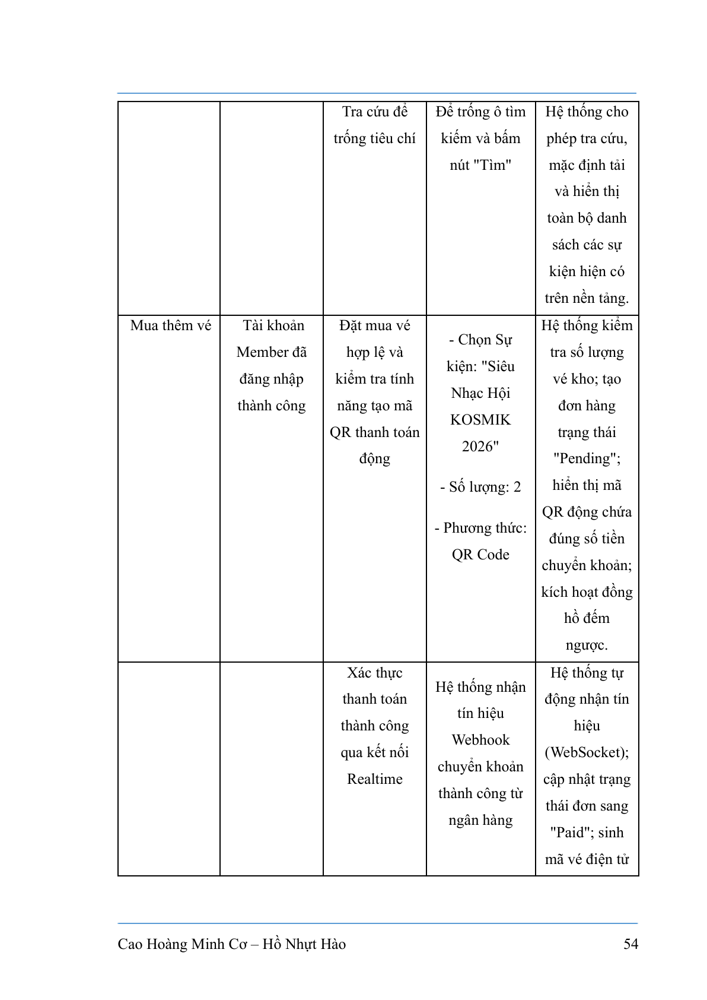

---

### Trang 74:

> chứa QR code 
> hiển thị trong 
> mục "Tủ Vé 
> Quét QR".  
> Tạo dự án sự 
> kiện  
> Tài khoản 
> Member đã 
> đăng nhập 
> thành công  
> Gửi đề xuất 
> kế hoạch tổ 
> chức sự kiện 
> mới  
> - Tên dự án: 
> "Lễ Ra Mắt 
> Sản Phẩm 
> Startup XYZ" 
> - Địa điểm: 
> GEM Center 
> - Ngân sách: 
> 300.000.000đ 
>  
> Bản ghi dự án 
> được lưu 
> thành công 
> vào 
> MongoDB; 
> hiển thị trên 
> bảng tiến trình 
> kèm nhãn 
> trạng thái màu 
> vàng "Chờ 
> duyệt".  
> Quản lý thư 
> mời & RSVP  
> Tài khoản 
> Member đã 
> đăng nhập 
> thành công  
> Thêm khách 
> mời mới và 
> kích hoạt hệ 
> thống gửi mail  
> - Dự án: "Tất 
> cả dự án" 
> - Hành động: 
> Nhấn "+ Thêm 
> khách mời" -> 
> Nhập danh 
> sách email 
>  
> Hệ thống lưu 
> danh sách vào 
> MongoDB; 
> kích hoạt 
> Queue Service 
> gửi mail hàng 
> loạt ngầm; số 
> liệu hiển thị 
> trên các thẻ 
> card "Tổng 
> khách", "Đã 
> gửi" tự động 
> tăng số.  
>  
> 
>  55

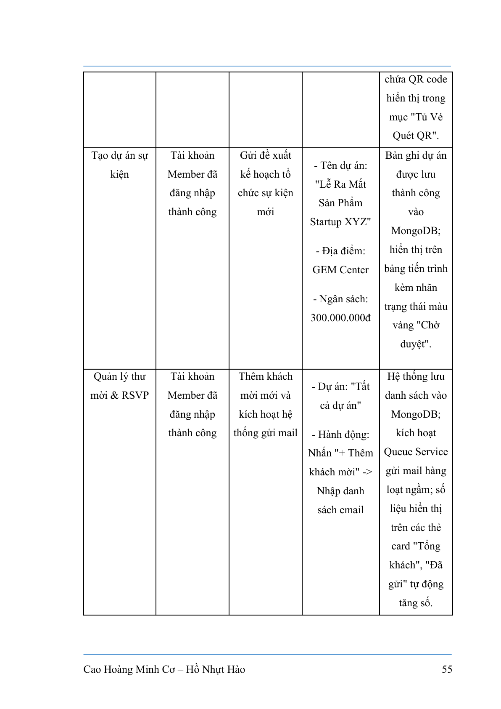

---

### Trang 75:

> 1.3 Phân hệ chức năng của Nhân viên 
>  
> Chức năng 
> Tiền điều kiện 
> Mô tả 
> Dữ liệu Test 
> Kết quả mong 
> muốn 
> Xem hợp 
> đồng cá nhân  
> Nhân viên đã 
> đăng nhập 
> thành công  
> Kiểm tra khả 
> năng hiển thị 
> và thống kê 
> hợp đồng 
> được phân 
> công phụ 
> trách  
> Truy cập menu 
> "Hợp đồng cá 
> nhân"  
> Hiển thị chính 
> xác các thẻ 
> card thống kê: 
> Tổng HĐ: 3, 
> Chờ xử lý: 0, 
> Đã duyệt: 2, 
> Tổng giá trị: 
> 1.550.000.000 
> đ. Render 
> đúng danh 
> sách các hợp 
> đồng.  
>  Xem tất cả 
> hợp đồng  
>  Nhân viên đã 
> đăng nhập 
> thành công  
> Tra cứu danh 
> mục toàn bộ 
> hợp đồng trên 
> hệ thống  
> Truy cập menu 
> "Tất cả hợp 
> đồng"  
> Hệ thống tải 
> toàn bộ danh 
> sách dữ liệu từ 
> MongoDB và 
> hiển thị đầy 
> đủ lên bảng 
> gồm các 
> trường: Tên 
> HĐ, Giá trị, 
> Trạng thái, 
> Ngày tạo.  
> 
>  56

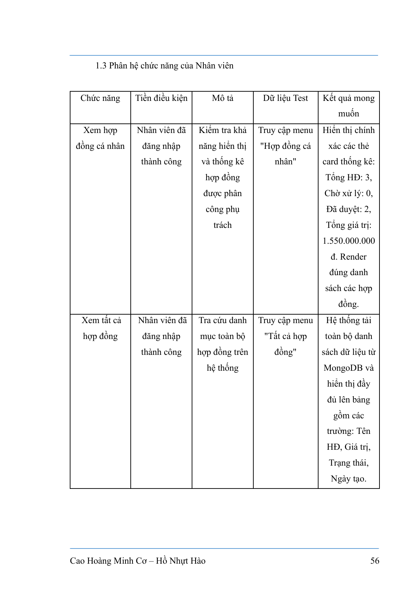

---

### Trang 76:

> QR Scanner 
> soát vé  
> Nhân viên đã 
> đăng nhập 
> thành công  
> Kiểm tra xác 
> thực vé hợp lệ 
> tại cổng sự 
> kiện  
> Sử dụng 
> Camera quét 
> mã QR (hoặc 
> nhập thủ công 
> mã Ticket ID 
> hợp lệ)  
> Hệ thống giải 
> mã chuỗi dữ 
> liệu, kiểm tra 
> đối chiếu 
> trùng khớp; 
> chuyển trạng 
> thái vé sang 
> "Checked-in" 
> và thông báo: 
> "Check-in 
> thành công! 
> Vé hợp lệ".  
>  
>  
> Cảnh báo đối 
> với trường 
> hợp vé không 
> hợp lệ hoặc 
> gian lận  
> Quét mã vé đã 
> được check-in 
> trước đó (hoặc 
> nhập Ticket ID 
> sai cấu trúc)  
> Hệ thống từ 
> chối quyền 
> truy cập; hiển 
> thị thông báo 
> lỗi màu đỏ: 
> "Vé không 
> hợp lệ hoặc đã 
> được check-in 
> trước đó!".  
> 1.4 Phân hệ chức năng của Quản Trị Viên 
>  
> Chức năng 
> Tiền điều kiện 
> Mô tả 
> Dữ liệu Test 
> Kết quả mong 
> muốn 
> 
>  57

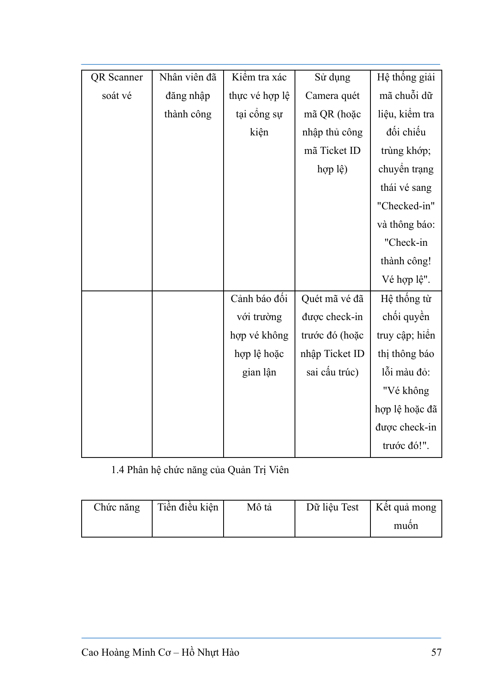

---

### Trang 77:

> Thống kê báo 
> cáo toàn cầu  
> Admin đã 
> đăng nhập 
> thành công  
> Kiểm tra tính 
> đồng bộ dữ 
> liệu thời gian 
> thực trên 
> Dashboard   
> Truy cập menu 
> "Thống kê báo 
> cáo"  
> Hiển thị chính 
> xác các chỉ số 
> tài chính: 
> Tổng Doanh 
> Thu: 
> 700,000,000đ, 
> Thành Viên: 
> 2, Sự Kiện: 
> 10, Hợp 
> Đồng: 6. Vẽ 
> chính xác biểu 
> đồ "Doanh 
> Thu & Dự 
> Báo".  
>  Duyệt yêu 
> cầu sự kiện   
>  Admin đã 
> đăng nhập 
> thành công  
> Phê duyệt dự 
> án sự kiện do 
> khách hàng 
> doanh nghiệp 
> gửi lên  
> Click chọn dự 
> án "Lễ Ra Mắt 
> Sản Phẩm 
> Startup XYZ", 
> ngân sách 
> 300.000.000đ 
> -> Nhấn nút 
> "Duyệt"  
> Trạng thái dự 
> án cập nhật 
> thành Đã 
> duyệt trong 
> MongoDB; hệ 
> thống hiển thị 
> thông báo text 
> trực quan: "Đã 
> duyệt, giao 
> cho nhân viên 
> Phạm Văn 
> Đức phụ 
> trách".   
> 
>  58

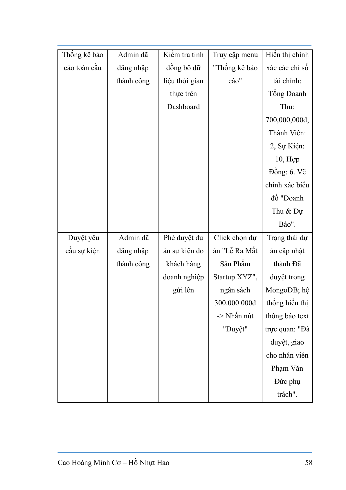

---

### Trang 78:

> Quản lý 
> khách hàng 
> Member  
> Admin đã 
> đăng nhập 
> thành công  
> Tìm kiếm và 
> đóng băng tài 
> khoản người 
> dùng vi phạm 
> quy trình  
> - Từ khóa tìm 
> kiếm: "Trần 
> Nhật Hào" 
>  
> - Thao tác: 
> Nhấn nút 
> "Đóng băng" 
>  
> Hệ thống tự 
> động lọc danh 
> sách realtime 
> (Tổng: 2 bản 
> ghi); sau khi 
> nhấn đóng 
> băng, status 
> tài khoản đổi 
> sang 
> INACTIVE 
> trên cơ sở dữ 
> liệu.  
> Quản lý hợp 
> đồng toàn hệ 
> thống  
> Admin đã 
> đăng nhập 
> thành công  
> Kiểm tra bộ 
> lọc thời gian 
> và cập nhật 
> tiến độ dòng 
> tiền  
> - Bộ lọc: Chọn 
> mốc Từ ngày 
> -> Đến ngày 
> - Thao tác: 
> Nhấn nút 
> "Duyệt" 
> Hệ thống trả 
> về đúng danh 
> sách hợp đồng 
> phát sinh 
> trong khoảng 
> thời gian 
> chọn; cập nhật 
> trường trạng 
> thái hợp đồng 
> tương ứng 
> (Approved, 
> Deposited, 
> Paid).   
> 4.4 Activity Diagram  
> - Đăng nhập 
> 
>  59

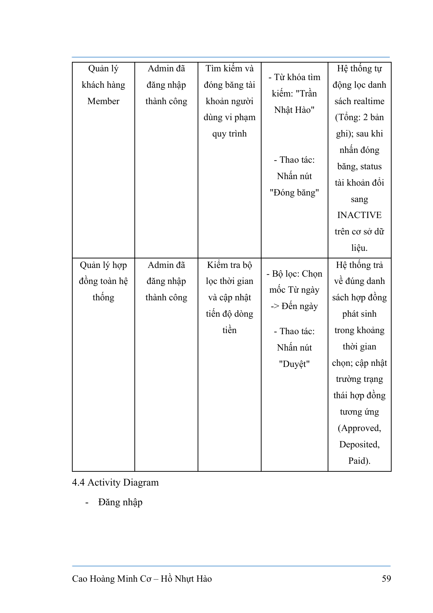

---

### Trang 79:

> - Đăng xuất 
>  
> - Mua thêm vé 
> 
>  60

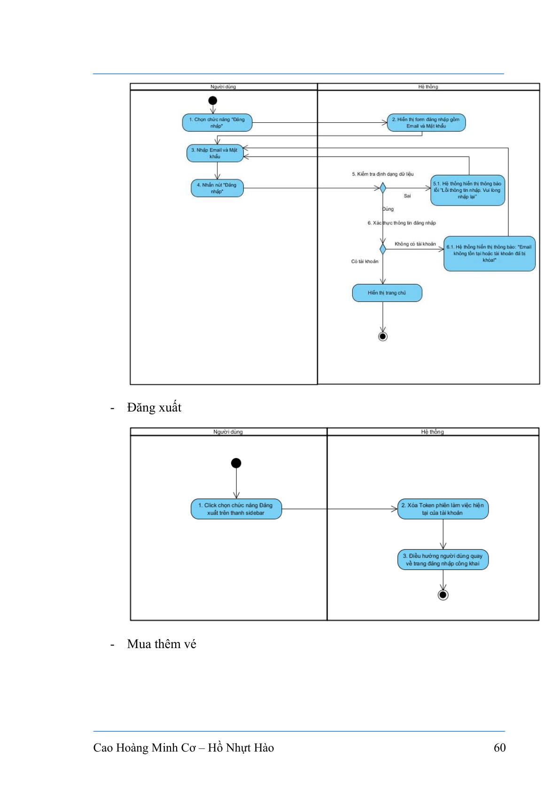

---

### Trang 80:

> - Tạo dự án sự kiện  
>  
> - Gửi thư mời & RSVP  
> 
>  61

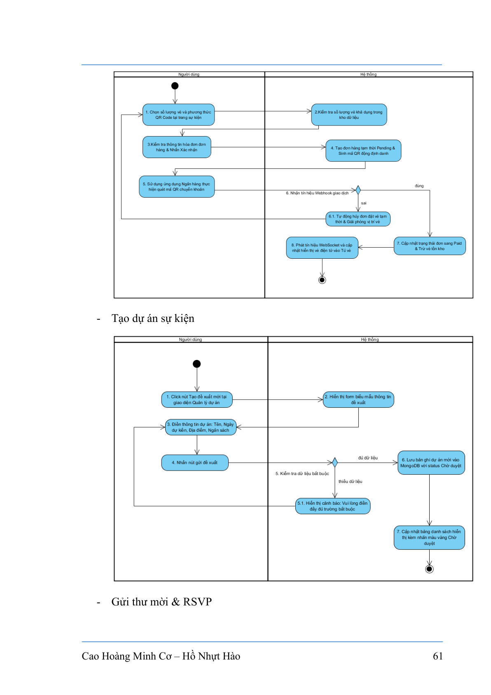

---

### Trang 81:

> - QR Scanner soát vé 
> 
>  62

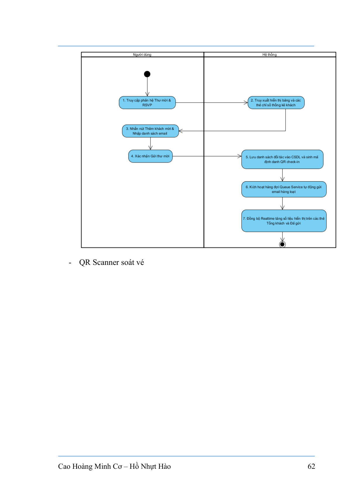

---

### Trang 82:

> - Xem hợp đồng cá nhân   
>  
> - Duyệt yêu cầu sự kiện  
> 
>  63

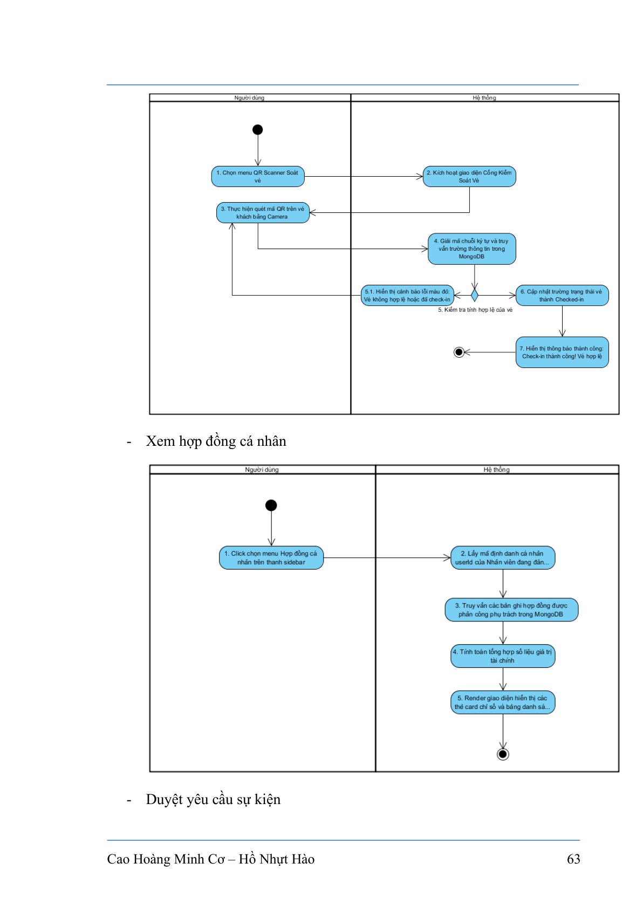

---

### Trang 83:

> - Thống kê báo cáo 
> 
>  64

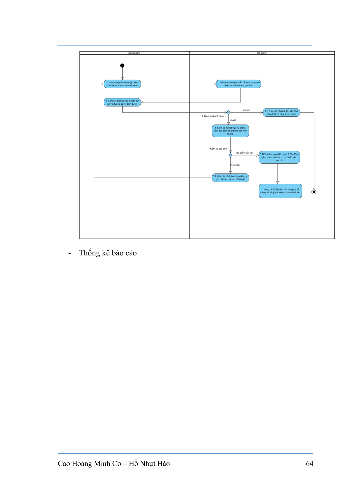

---

### Trang 84:

> - Quản lý khách hàng Member  
> 
>  65

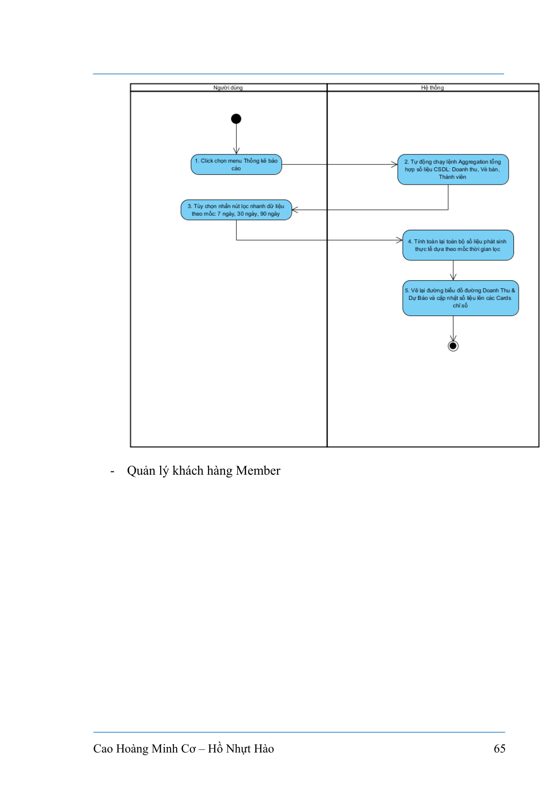

---

### Trang 85:

> 4.5 Domain hệ thống 
> 
>  66

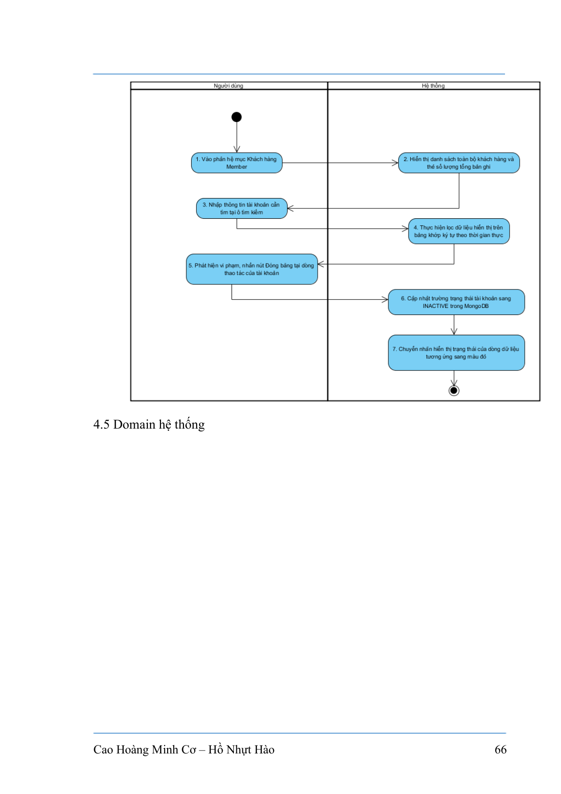

---

## CHƯƠNG 4.3: GIAO DIỆN HỆ THỐNG THỰC TẾ
*Hình ảnh giao diện thực tế của hệ thống Lumina EMS theo từng vai trò*

<b>Xem nội dung (16 trang: trang 86 – 101)</b>

### Trang 86:

> 67

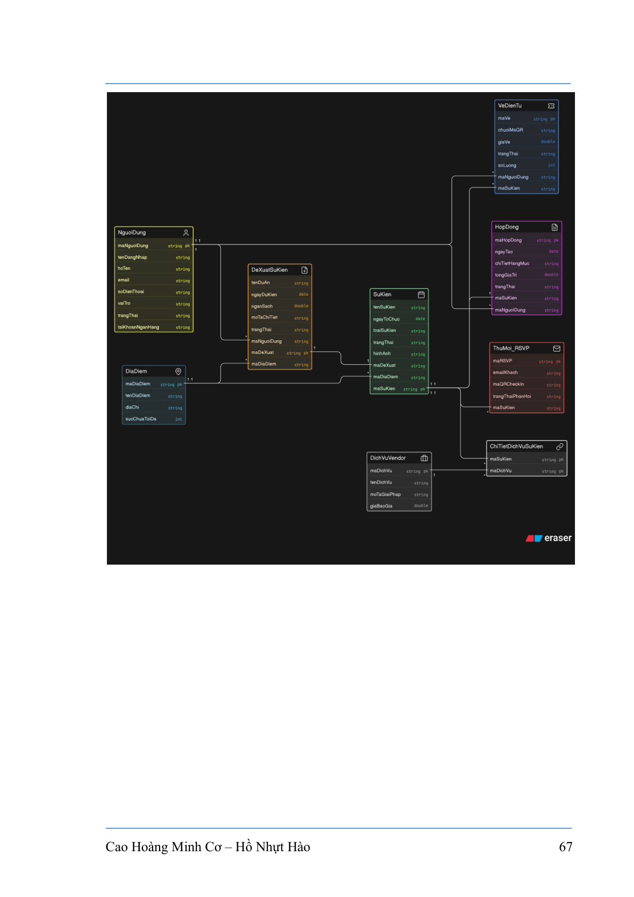

---

### Trang 87:

> 4.6 Giao diện hệ thống 
> Dưới đây là hình ảnh chụp màn hình thực tế và đặc tả chi tiết các phân hệ giao 
> diện chức năng của hệ thống quản lý và tổ chức sự kiện Lumina EMS, được 
> phân rã theo luồng trải nghiệm của từng tác nhân (Actor) tương tác.  
> Giao diện trang chủ 
> Đặc tả chức năng và luồng xử lý: Trang chủ là cổng thông tin đại chúng thiết 
> kế theo xu hướng tối giản, hiện đại, tối ưu hóa khả năng hiển thị danh mục sự 
> kiện công khai (B2C). Giao diện tích hợp thanh tìm kiếm thông minh kết hợp 
> bộ lọc động theo từ khóa, địa điểm và mốc thời gian tổ chức. Hệ thống sử 
> dụng khối banner chuyển động (Carousel) trực quan để quảng bá các sự kiện 
> nổi bật, đi kèm khối hiển thị các chương trình ưu đãi, mã giảm giá kích hoạt 
> thời gian thực và các nút điều hướng tương tác nhanh giúp người dùng vãng 
> lai dễ dàng chuyển tiếp sang luồng đặt vé trực tuyến.  
>  
> Hình 1.1: Giao diện trang chủ hệ thống Lumina EMS (Cổng thông tin Client)  
> 
>  68

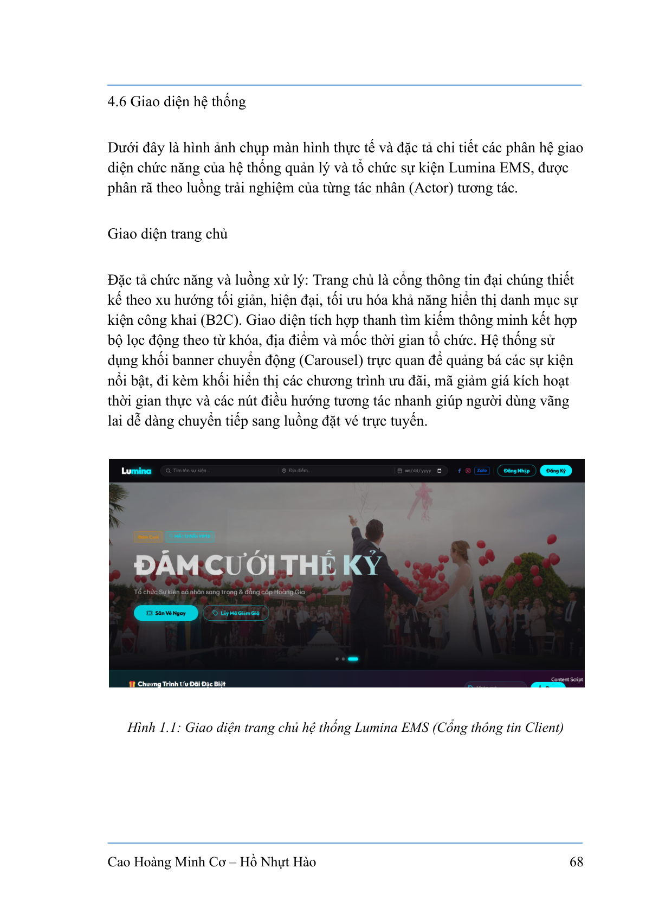

---

### Trang 88:

> Hình 1.2: Giao diện trang chủ hệ thống Lumina EMS (Cổng thông tin Client)  
>  
>  
> Hình 1.3: Giao diện trang chủ hệ thống Lumina EMS (Cổng thông tin Client)  
> 
>  69

---

### Trang 89:

> Hình 1.4: Giao diện trang chủ hệ thống Lumina EMS (Cổng thông tin Client)  
>  
>  
> Hình 1.5: Giao diện trang chủ hệ thống Lumina EMS (Cổng thông tin Client)  
>  
>  
> 
>  70

---

### Trang 90:

> Giao diện đăng ký 
>  
> Hình 1.6: Giao diện đăng ký tài khoản thành viên hệ thống  
>  
> Giao diện đăng nhập 
>  
> Hình 1.7: Giao diện đăng nhập tài khoản thành viên hệ thống  
> 
>  71

---

### Trang 91:

> Tài khoản ADMIN: 
>  
> Hình 2.1: Giao diện thống kê và báo cáo  
>  
> Hình 2.2: Giao diện quản lý sự kiện 
> 
>  72

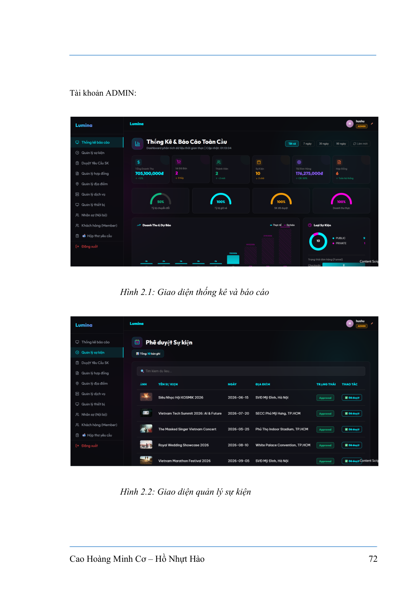

---

### Trang 92:

> Hình 2.3: Giao diện duyệt yêu cầu sự kiện 
>  
> Hình 2.4: Giao diện quản lý hợp đồng 
> 
>  73

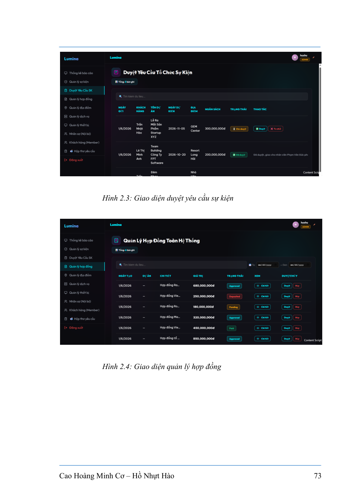

---

### Trang 93:

> Hình 2.5: Giao diện quản lý địa điểm 
>  
> Hình 2.6: Giao diện quản lý dịch vụ 
>  
> 
>  74

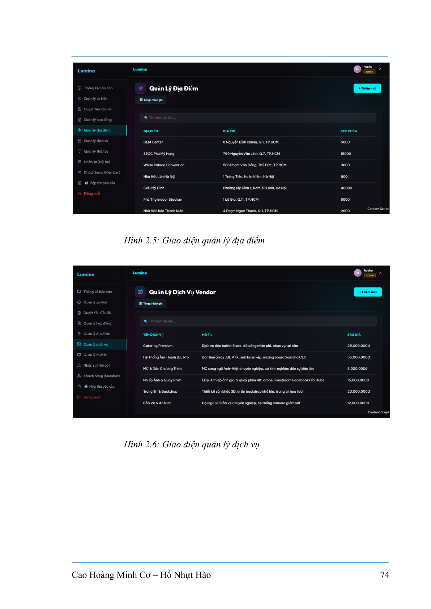

---

### Trang 94:

> Hình 2.7: Giao diện quản lý thiết bị 
>  
> Hình 2.7: Giao diện quản lý nhân sự 
> 
>  75

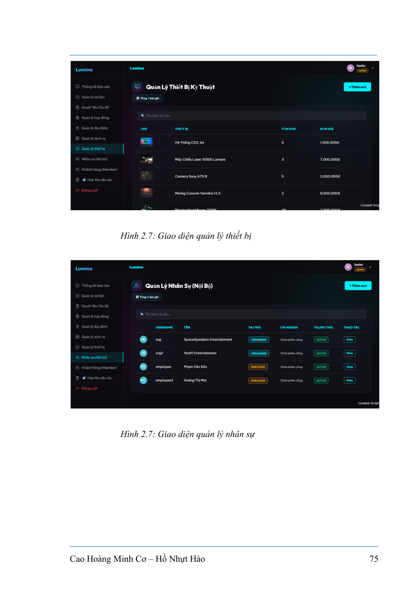

---

### Trang 95:

> Hình 2.8: Giao diện quản lý khách hàng 
>  
> Hình 2.9: Giao diện hộp thư yêu cầu 
> Tài khoản thành viên 
> 
>  76

---

### Trang 96:

> Hình 3.1: Giao diện tủ quét vé QR 
>  
> Hình 3.2: Giao diện quản lý hợp đồng 
> 
>  77

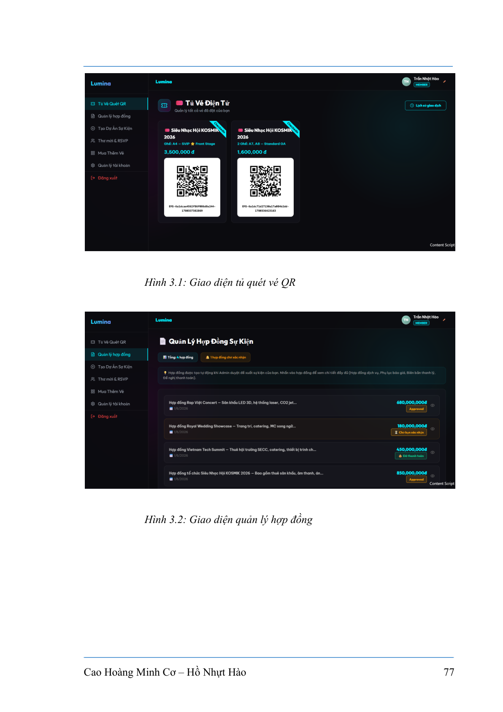

---

### Trang 97:

> Hình 3.3: Giao diện quản lý dự án sự kiện 
>  
> Hình 3.4: Giao diện thư mời & RSVP 
> 
>  78

---

### Trang 98:

> Hình 3.4: Giao diện Quản lý tài khoản 
> Tài khoản nhân viên 
>  
> Hình 4.1: Giao diện hợp đồng cá nhân 
> 
>  79

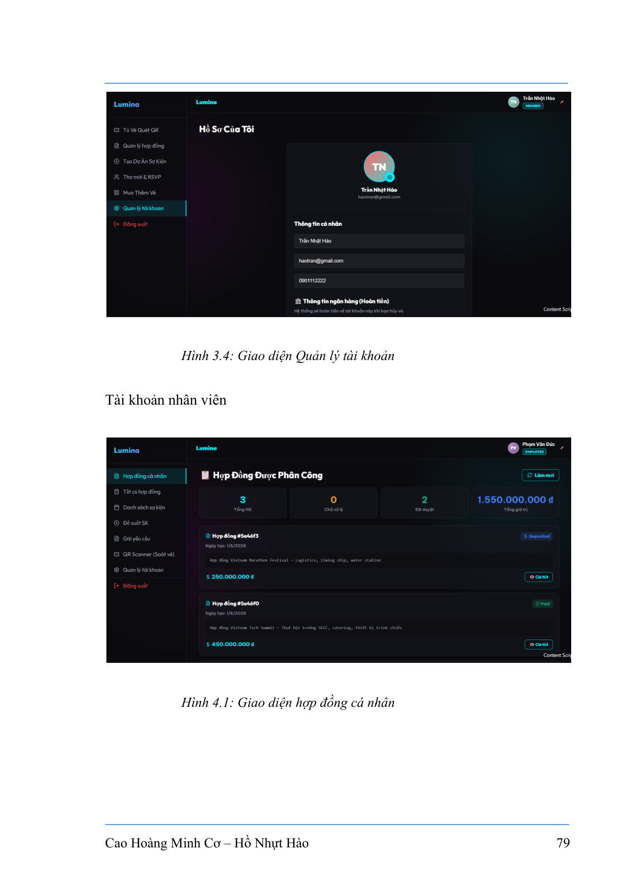

---

### Trang 99:

> Hình 4.2: Giao diện tất cả hợp đồng 
>  
> Hình 4.3: Giao diện danh sách sự kiện 
> 
>  80

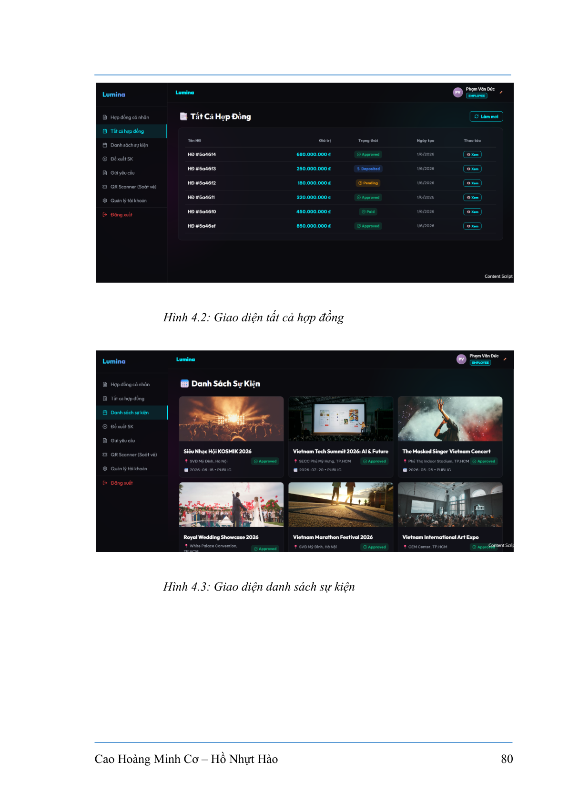

---

### Trang 100:

> Hình 4.4: Giao diện đề xuất sự kiện 
>  
> 
>  81

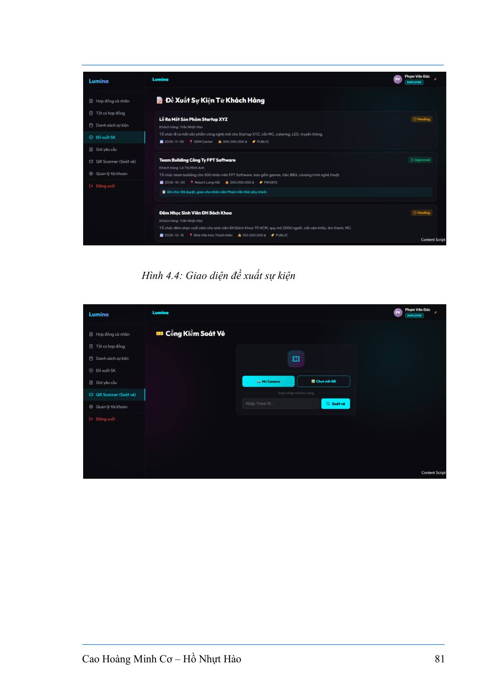

---

### Trang 101:

> Hình 4.5: Giao diện QR Scanner 
>  
> Hình 4.6: Giao diện thông tin cá nhân 
>  
>  
> CHƯƠNG 5: HIỆN THỰC & HƯỚNG DẪN CÀI ĐẶT 
>  
> 5.1. Yêu cầu hệ thống và môi trường 
> Để cài đặt và vận hành hệ thống Lumina EMS tại môi trường cục bộ (local), máy 
> tính cần cài đặt sẵn: 
> ● Node.js: Phiên bản >= 18.x.x (Đã kiểm tra tương thích tốt trên v22.18.0). 
> ● MongoDB: Đang chạy tại cổng mặc định 27017 (Nếu không cài sẵn, hệ 
> thống sẽ tự động kích hoạt MongoDB Memory Server giả lập để chạy thử 
> nghiệm nhanh). 
> 
>  82

---

## CHƯƠNG 5: HIỆN THỰC & HƯỚNG DẪN CÀI ĐẶT
*Yêu cầu hệ thống, cấu hình CSDL mẫu, khởi động dịch vụ*

<b>Xem nội dung (3 trang: trang 101 – 103)</b>

### Trang 101:

> Hình 4.5: Giao diện QR Scanner 
>  
> Hình 4.6: Giao diện thông tin cá nhân 
>  
>  
> CHƯƠNG 5: HIỆN THỰC & HƯỚNG DẪN CÀI ĐẶT 
>  
> 5.1. Yêu cầu hệ thống và môi trường 
> Để cài đặt và vận hành hệ thống Lumina EMS tại môi trường cục bộ (local), máy 
> tính cần cài đặt sẵn: 
> ● Node.js: Phiên bản >= 18.x.x (Đã kiểm tra tương thích tốt trên v22.18.0). 
> ● MongoDB: Đang chạy tại cổng mặc định 27017 (Nếu không cài sẵn, hệ 
> thống sẽ tự động kích hoạt MongoDB Memory Server giả lập để chạy thử 
> nghiệm nhanh). 
> 
>  82

---

### Trang 102:

> ● RabbitMQ: Chạy tại cổng 5672 (Có thể khởi động nhanh qua Docker bằng 
> lệnh docker-compose up -d ở thư mục backend). 
> 5.2. Các bước cấu hình cơ sở dữ liệu mẫu (Seeding) 
> Trước khi khởi động ứng dụng lần đầu tiên, cần nạp dữ liệu mẫu để hệ thống có đầy 
> đủ tài khoản, phân hệ và sơ đồ ghế ngồi phục vụ việc kiểm thử: 
> cd event-booking-backend 
> # 1. Cài đặt các thư viện liên quan của Backend 
> npm install 
> # 2. Khởi tạo dữ liệu người dùng, sự kiện mẫu 
> node seed.js 
> # 3. Khởi tạo sơ đồ ghế ngồi thời gian thực cho các sự kiện 
> node seed-seats.js 
> Danh sách tài khoản kiểm thử mặc định sau khi Seed (Mật khẩu chung: 123): 
> ● Quản trị viên (Admin): Username: admin 
> ● Khách hàng (Member): Username: member 
> ● Người tổ chức (Organizer): Username: org 
> ● Nhân viên soát vé (Employee): Username: employee 
> 5.3. Hướng dẫn khởi động các dịch vụ (Frontend, Backend) 
> Kích hoạt các dịch vụ ở hai terminal riêng biệt: 
> # Terminal 1: Khởi động Backend (Chạy tại Port 4000) 
> cd event-booking-backend 
> npm run dev 
> 
>  83

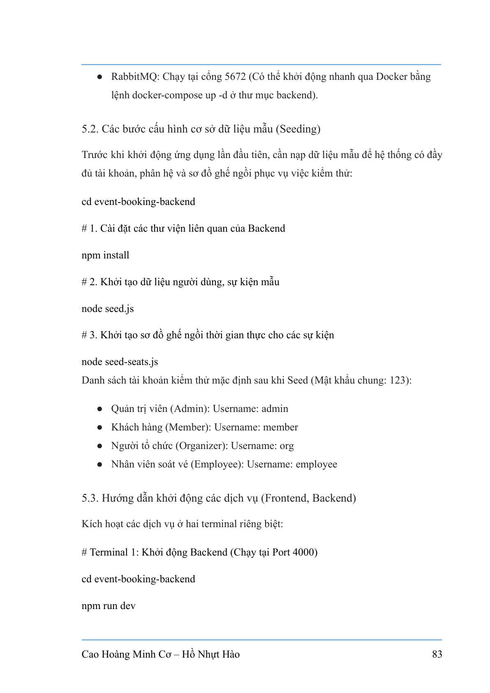

---

### Trang 103:

> # Terminal 2: Khởi động Frontend (Chạy tại Port 5173) 
> cd event-booking-frontend 
> npm install 
> npm run dev 
> Sau 
> khi 
> khởi 
> động 
> thành 
> công, 
> truy 
> cập 
> trình 
> duyệt 
> tại 
> địa 
> chỉ: 
> https://ungloved-vividly-ranging.ngrok-free.dev  để trải nghiệm hệ thống.  
>  
>  
>  
>  
>  
>  
>  
>  
>  
> CHƯƠNG 6: ĐÁNH GIÁ & HƯỚNG PHÁT TRIỂN 
> 6.1. Đánh giá kết quả thực nghiệm và ưu/nhược điểm hệ thống 
> 
>  84

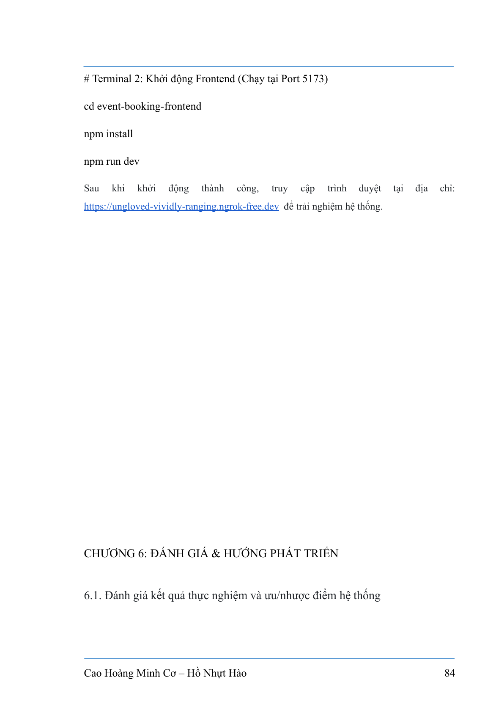

---

## CHƯƠNG 6: ĐÁNH GIÁ & HƯỚNG PHÁT TRIỂN
*Đánh giá kết quả, phân tích SWOT, kế hoạch phát triển tương lai*

<b>Xem nội dung (4 trang: trang 104 – 107)</b>

### Trang 104:

> Sau quá trình nghiên cứu, thiết kế kiến trúc và triển khai thực nghiệm hệ thống quản 
> lý và tổ chức sự kiện Lumina EMS, nhóm nghiên cứu tiến hành tổng kết, đánh giá 
> toàn diện các kết quả đạt được dựa trên các tiêu chí kỹ thuật và nghiệp vụ thực tế. 
> 6.1.1. Ưu điểm nổi bật 
> ● Hợp nhất thành công kiến trúc lai B2B và B2C: Hệ thống đã giải quyết triệt 
> để bài toán phân mảnh dữ liệu thượng nguồn và hạ nguồn bằng cách đồng bộ 
> toàn bộ vòng đời sự kiện trên một nền tảng duy nhất. Quy trình đi từ khâu 
> tiếp nhận đề xuất dự án doanh nghiệp (B2B), ràng buộc vị trí bối cảnh, phê 
> duyệt, tự động hóa hợp đồng cho đến khâu phân phối vé tới tay người tiêu 
> dùng cuối cùng (B2C) được vận hành trên một luồng dữ liệu nhất quán, loại 
> bỏ hoàn toàn các sai số do thao tác thủ công. 
> ● Tối ưu hóa trải nghiệm tương tác thời gian thực (Real-time): Nhờ vào việc 
> ứng dụng giải pháp kiến trúc hướng sự kiện với Socket.IO, tính năng giữ 
> chỗ, chọn ghế và cập nhật sơ đồ khán đài trực quan đạt độ chính xác và đồng 
> bộ cao. Mọi biến động về trạng thái ghế ngồi của một khách hàng ngay lập 
> tức được phát tán (broadcast) đến toàn bộ các máy trạm khác đang kết nối, 
> ngăn chặn tuyệt đối tình trạng xung đột đặt trùng chỗ (Double-booking). 
> ● Khả năng chịu tải và xử lý bất đồng bộ vượt trội: Việc tích hợp hệ thống 
> hàng đợi tin nhắn RabbitMQ (Message Queue) đóng vai trò luồng đệm then 
> chốt, giúp phân tách các tác vụ nặng (như sinh mã QR định danh, gửi email 
> xác nhận RSVP hàng loạt, khởi tạo hóa đơn) chạy ngầm dưới hạ tầng 
> background. Cơ chế này giúp hệ thống Lumina EMS duy trì sự mượt mà tại 
> lớp giao diện (Frontend), giải quyết tốt bài toán nghẽn cổ chai (Bottleneck) 
> khi phát sinh lượng truy cập và giao dịch mua vé tăng đột biến trong các 
> khung giờ cao điểm (Peak-time). 
> ● Nhúng trí tuệ nhân tạo (AI-Driven Insights) vào quản trị: Hệ thống không 
> dừng lại ở mức lưu trữ dữ liệu thô, mà đã tiên phong tích hợp mô hình 
> Google Gemini AI để phân tích hành vi người dùng, báo cáo doanh thu và dự 
> báo xu hướng. Điều này hỗ trợ các nhà quản lý hệ thống đưa ra các khuyến 
> 
>  85

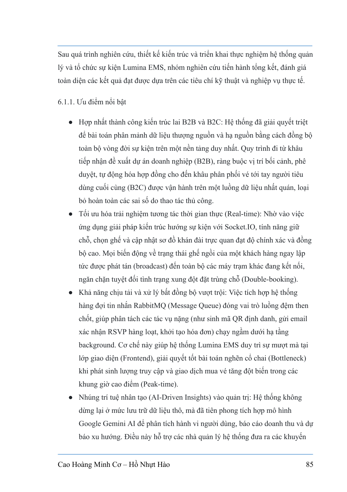

---

### Trang 105:

> nghị vận hành và chiến lược tối ưu hóa giá vé, phân bổ tài nguyên địa điểm 
> một cách khoa học dựa trên dữ liệu thực tế. 
> 6.1.2. Nhược điểm và hạn chế tồn tại 
> ● Hạn chế trong tích hợp hạ tầng thanh toán thực tế: Do giới hạn về mặt pháp 
> lý tài chính trong môi trường thử nghiệm học thuật, hệ thống hiện tại chưa 
> kết nối trực tiếp với các cổng thanh toán trung gian chính thức tại Việt Nam 
> (như MoMo, VNPAY, ZaloPay, ShopeePay) hay quốc tế (Stripe). Cơ chế xử 
> lý dòng tiền hiện tại mới dừng lại ở mức giả lập (Simulation) thông qua các 
> Webhook tiếp nhận tín hiệu mã QR Code động định danh và xác nhận trạng 
> thái giao dịch gián tiếp. 
> ● Thách thức về độ sâu mã hóa bảo mật tài sản số: Mặc dù luồng dữ liệu 
> nghiệp vụ đã được phân tách rõ ràng qua mô hình kiến trúc phân lớp BCE, 
> các tài liệu nhạy cảm liên quan đến giá trị pháp lý và tài chính (như tệp tin 
> đính kèm của Hợp đồng kinh tế giữa nhà tổ chức và Admin) mới chỉ được 
> bảo mật ở mức phân quyền truy cập cơ bản trên cơ sở dữ liệu MongoDB, 
> chưa được triển khai các giải pháp mã hóa sâu ở cấp độ lưu trữ tệp 
> (File-level encryption). 
>  
>  
>  
>  
> 6.2. Phân tích SWOT & Khuyến nghị vận hành (AI Generated Insight) 
> Để có cái nhìn khách quan về vị thế của sản phẩm sau thực nghiệm, phân hệ AI tích 
> hợp trong Lumina EMS đã thực hiện phân tích tự động ma trận SWOT dựa trên các 
> tham số kiểm thử: 
> 
>  86

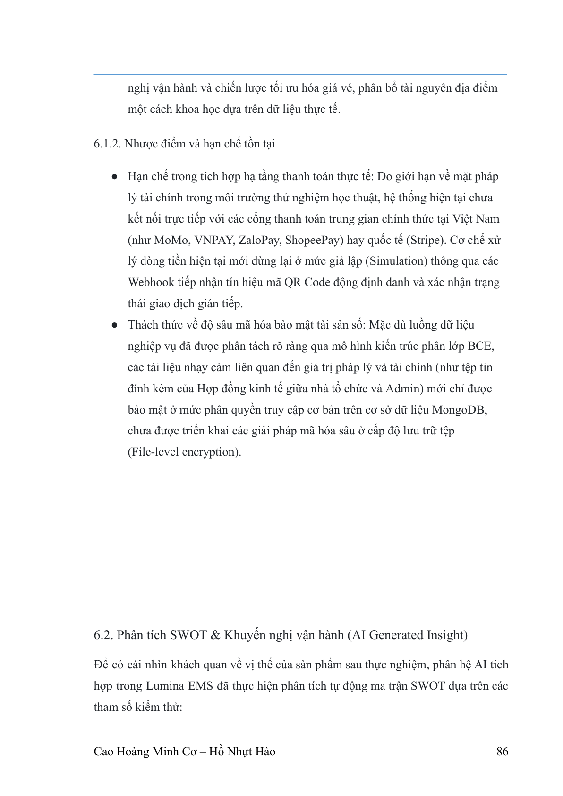

---

### Trang 106:

> ● S - Strengths (Điểm mạnh): Lumina EMS sở hữu lợi thế lớn về mặt kiến trúc 
> phần mềm khi phân tách rõ ràng các tầng xử lý (BCE). Hệ thống có khả năng 
> mở rộng linh hoạt theo chiều ngang (Horizontal Scaling), xử lý luồng tin 
> nhắn đồng thời tốt và giao diện quản trị có tính hoàn thiện, trực quan rất cao. 
> ● W - Weaknesses (Điểm yếu): Sự phụ thuộc vào môi trường thanh toán giả 
> lập làm giảm tính thực tế khép kín của ứng dụng. Cơ chế mã hóa bảo mật các 
> tệp tin văn bản đính kèm cần được nâng cấp để đáp ứng các tiêu chuẩn an 
> toàn thông tin doanh nghiệp. 
> ● O - Opportunities (Cơ hội): Nhu cầu tự động hóa quy trình, loại bỏ thủ công 
> trong khâu tổ chức sự kiện B2B của các doanh nghiệp vừa và nhỏ (SMEs) tại 
> thị trường Việt Nam là cực kỳ lớn. Đây là cơ hội để sản phẩm phát triển 
> thành một mô hình phần mềm dịch vụ (SaaS). 
> ● T - Threats (Thách thức): Nguy cơ đối mặt với các cuộc tấn công từ chối 
> dịch vụ (DDoS) vào hệ thống đặt chỗ trong các sự kiện có độ sốt vé cao. 
> Ngoài ra, vấn nạn sử dụng Bot/Spam để tạo tài khoản ảo và giữ chỗ ảo nhằm 
> phá hoại kho vé là một thách thức lớn về mặt logic phần mềm. 
> Khuyến nghị vận hành kỹ thuật: 
> 
>  87

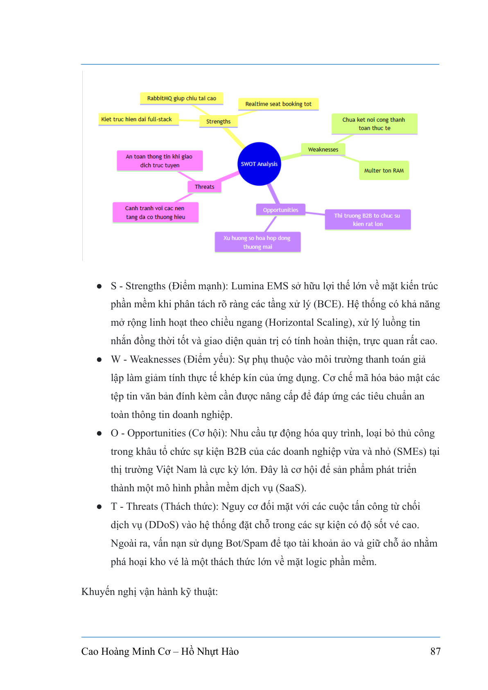

---

### Trang 107:

> 1. Thiết lập cơ chế Rate Limiting: Cần cấu hình các bộ lọc giới hạn tần suất gửi 
> yêu cầu (Request) tại tầng API Gateway để chặn đứng các cuộc tấn công 
> Spam từ Bot trước khi chúng tiếp cận vào tầng xử lý logic của RabbitMQ. 
> 2. Tối ưu hóa thời gian giải phóng vé: AI khuyến nghị cần rút ngắn thời gian 
> đếm ngược của phiên giao dịch đặt vé tạm thời xuống mức tối ưu để giải 
> phóng kho ghế nhanh nhất nếu khách hàng không hoàn tất bước quét mã QR 
> thanh toán. 
> 6.3. Kế hoạch phát triển tương lai 
> Nhằm đưa Lumina EMS trở thành một nền tảng chuyển đổi số toàn diện và mạnh 
> mẽ hơn, nhóm nghiên cứu vạch ra lộ trình công nghệ trong giai đoạn tiếp theo với 3 
> mục tiêu trọng tâm: 
> ● Chuẩn hóa cổng thanh toán số và tự động hóa đối soát: Bước đi đầu tiên 
> trong kế hoạch mở rộng là kết nối trực tiếp với môi trường Sandbox và 
> Production của cổng VNPAY và Stripe. Đồng thời, nhóm sẽ phát triển 
> module Reconciliation Service (Dịch vụ đối soát tự động) chạy ngầm vào 
> cuối ngày, thực hiện quét so khớp biến động số dư tài khoản ngân hàng thực 
> tế với trạng thái đơn hàng trong MongoDB để tự động phát hiện và xử lý các 
> giao dịch sai lệch. 
> ● NFT hóa vé điện tử bằng công nghệ Blockchain: Để giải quyết triệt để vấn 
> nạn đầu cơ vé, thị trường chợ đen (Scalping) và vé giả, Lumina EMS sẽ ứng 
> dụng công nghệ Blockchain để phát hành vé dưới dạng NFT (Non-Fungible 
> Token) thông qua các hợp đồng thông minh (Smart Contract). Cơ chế này 
> giúp minh bạch hóa lịch sử chuyển nhượng vé, cho phép ban tổ chức sự kiện 
> thiết lập mức giá trần khi sang nhượng và tự động thu phí bản quyền trên 
> mỗi giao dịch ở thị trường thứ cấp. 
> ● Render sơ đồ ghế ngồi không gian 3D (WebGL/Three.js): Thay thế sơ đồ 
> chọn ghế dạng 2D phẳng hiện tại bằng mô hình không gian 3D trực quan 
> được xây dựng trên nền tảng công nghệ WebGL và thư viện Three.js. Khách 
> 
>  88

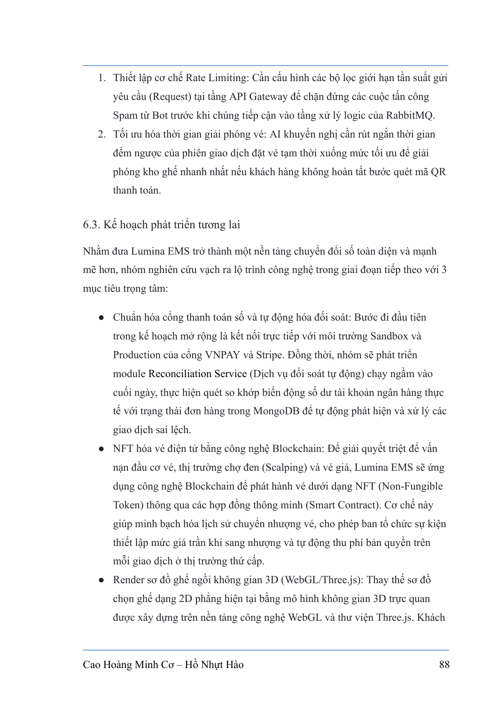

---

## CHƯƠNG 7: GIẢI PHÁP AN TOÀN THÔNG TIN & MỞ RỘNG
*Mã hóa dữ liệu, Rate Limiting, Database Indexing, Horizontal Scaling*

<b>Xem nội dung (4 trang: trang 108 – 111)</b>

### Trang 108:

> hàng trước khi đặt mua vé có thể trải nghiệm góc nhìn thực tế (POV - Point 
> of View) từ chính vị trí ghế ngồi đó hướng về phía sân khấu trung tâm, mang 
> lại trải nghiệm tương tác đỉnh cao và tăng tỷ lệ chuyển đổi đơn hàng. 
>  
>  
>  
>  
>  
>  
>  
>  
>  
> CHƯƠNG 7: GIẢI PHÁP ĐẢM BẢO AN TOÀN THÔNG TIN VÀ KHẢ 
> NĂNG MỞ RỘNG HỆ THỐNG  
> 8.1. Kiến trúc an toàn thông tin và giải pháp phòng thủ hệ thống 
> Đối với một nền tảng lai tích hợp cả luồng ký kết hợp đồng doanh nghiệp (B2B) và 
> phân phối vé lẻ trực tuyến (B2C) như Lumina EMS, an toàn thông tin là yếu tố sống 
> còn để bảo vệ tài sản số và dữ liệu nhạy cảm của người dùng. Hệ thống được thiết 
> kế theo nguyên lý phòng thủ chiều sâu (Defense-in-Depth) qua nhiều lớp mã hóa và 
> kiểm soát chặt chẽ. 
> 8.1.1. Giải pháp mã hóa dữ liệu tầng lưu trữ và tầng truyền tải 
> ● Mã hóa dữ liệu tầng truyền tải (Data-in-Transit Encryption): Toàn bộ luồng 
> giao tiếp giữa lớp giao diện Frontend (ReactJS) và máy chủ Backend 
> (NodeJS) đều bắt buộc phải vận hành trên giao thức bảo mật mã hóa tài 
> 
>  89

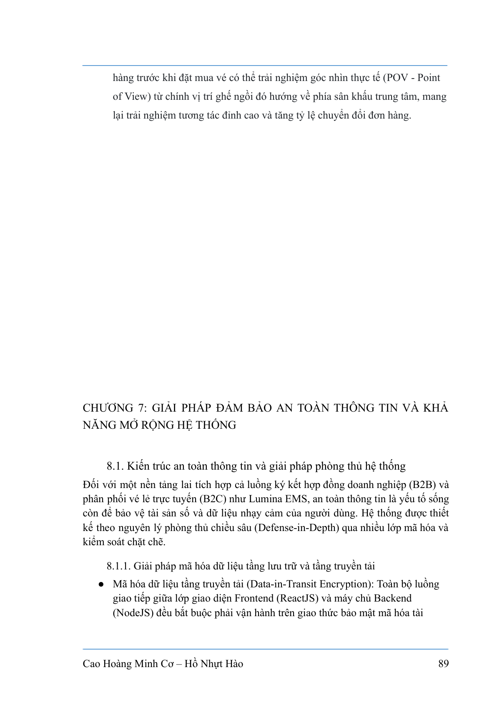

---

### Trang 109:

> nguyên TLS/HTTPS. Cơ chế này ngăn chặn tuyệt đối các cuộc tấn công nghe 
> lén dữ liệu (Man-in-the-Middle - MitM) hay đánh cắp gói tin trên đường 
> truyền mạng công cộng. 
> ● Mã hóa dữ liệu tầng lưu trữ (Data-at-Rest Encryption): Đối với dữ liệu tài 
> khoản và các thông tin tài chính, mật khẩu của người dùng được băm một 
> chiều bằng thuật toán bcrypt kết hợp kỹ thuật thêm muối (Salting) trước khi 
> ghi xuống MongoDB. Phân hệ bảo mật còn tích hợp giải pháp kích hoạt mật 
> mã giao dịch (Passcode/PIN 6 số) và mã hóa bất đối xứng khóa công khai 
> RSA để bảo vệ các tệp tin đính kèm của hợp đồng kinh tế. 
> 8.1.2. Cơ chế kiểm soát truy cập và phòng chống tấn công logic (Rate 
> Limiting) 
> ● Xác thực không trạng thái với JWT: Phiên làm việc của các Actor được quản 
> lý thông qua chuỗi JSON Web Token (JWT) có gán thời gian hết hạn cụ thể. 
> Token được ký bằng khóa bí mật đặt tại biến môi trường của hệ thống, giúp 
> ngăn chặn hành vi giả mạo quyền truy cập hoặc chiếm đoạt phiên làm việc 
> (Session Hijacking). 
> ● Bộ lọc giới hạn tần suất yêu cầu (Rate Limiter Middleware): Để bảo vệ hệ 
> thống trước các cuộc tấn công từ chối dịch vụ (DDoS) hoặc tin tặc sử dụng 
> công cụ tự động (Bot/Spam) gửi request liên tục nhằm chiếm dụng kho vé sự 
> kiện, hệ thống cấu hình bộ lọc express-rate-limit. Riêng phân hệ xác thực tài 
> khoản (/api/auth) và cổng trợ lý AI (/api/customer/voice-booking) được áp 
> dụng các bộ cấu hình giới hạn (authLimiter và voiceLimiter) để tự động khóa 
> địa chỉ IP hoặc tài khoản vi phạm nếu vượt quá tần suất yêu cầu quy định 
> trong 1 phút. 
> 8.2. Giải pháp tối ưu hóa hiệu năng và khả năng mở rộng quy mô 
> (Scalability) 
> Khi Lumina EMS đối mặt với bối cảnh mở bán vé các siêu nhạc hội quy mô lớn, hệ 
> thống phải đảm bảo năng lực xử lý đồng thời cực cao tại cùng một thời điểm mở 
> cổng giao dịch. Nhóm nghiên cứu thiết lập lộ trình tối ưu hóa hiệu năng tổng thể 
> thông qua cấu trúc hạ tầng phần mềm. 
> 8.2.1. Giải pháp tối ưu hóa truy vấn dữ liệu NoSQL (Database Indexing) 
> Mặc dù hệ quản trị cơ sở dữ liệu MongoDB có tốc độ đọc ghi tài liệu linh hoạt rất 
> cao, việc thực hiện các câu lệnh gộp dữ liệu (Aggregation) tính doanh thu hoặc lọc 
> danh sách sự kiện trên tập dữ liệu lớn vẫn có chi phí tài nguyên nặng. Nhóm nghiên 
> cứu đã thực hiện tối ưu hóa bằng các giải pháp: 
> 
>  90

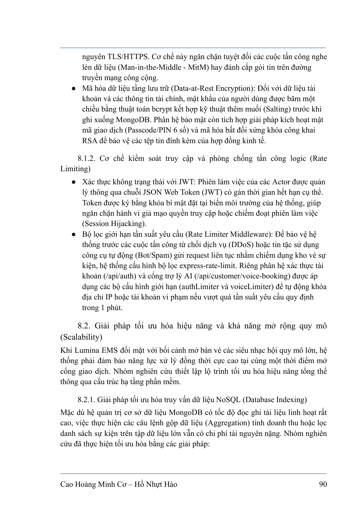

---

### Trang 110:

> ● Single-field Indexing (Chỉ mục đơn): Đánh chỉ mục trên các trường dữ liệu 
> có tần suất tìm kiếm cao như email của người dùng hoặc trangThai của đơn 
> đặt vé. 
> ● Compound Indexing (Chỉ mục hợp phần): Thiết lập chỉ mục kết hợp (Ví dụ: 
> Kết hợp maSuKien và ngayToChuc) tại bộ sưu tập sự kiện. Giải pháp này 
> giúp công cụ tìm kiếm của MongoDB định vị trực tiếp đến Documents cần 
> trích xuất mà không phải duyệt qua toàn bộ cơ sở dữ liệu (Collection Scan), 
> giải phóng tài nguyên CPU cho máy chủ Database. 
> 8.2.2. Chiến lược mở rộng quy mô hệ thống theo chiều ngang (Horizontal 
> Scaling) 
> Để Lumina EMS có khả năng tiến hóa thành một phần mềm dịch vụ (SaaS) phục vụ 
> đa chi nhánh và nhiều đối tác doanh nghiệp lớn cùng lúc, kiến trúc hệ thống định 
> hướng triển khai mở rộng theo hai giải pháp kỹ thuật cốt lõi: 
> ● Phân rã kiến trúc Microservices: Tách biệt hoàn toàn các phân hệ chức năng 
> có tần suất tải cao và biến động lớn (như phân hệ giữ ghế thời gian thực 
> ticketing, phân hệ điều phối hàng đợi thông điệp RabbitMQ) thành các dịch 
> vụ độc lập (Microservices). Mỗi dịch vụ sẽ sở hữu vùng bộ nhớ riêng và vận 
> hành độc lập, giúp lỗi phát sinh tại một phân hệ không làm sụp đổ toàn bộ hệ 
> thống (Fault Isolation). 
> ● Đóng gói container hóa với Docker Compose: Việc đóng gói toàn bộ 
> Frontend, Backend, cơ sở dữ liệu MongoDB và máy chủ điều phối 
> RabbitMQ vào các vùng chứa (Containers) độc lập giúp hệ thống có tính 
> nhất quán môi trường tuyệt đối. Khi lượng truy cập tăng cao, người quản trị 
> có thể dễ dàng tăng số lượng bản sao máy chủ API (Scale-out Backend 
> instances) kết hợp với các bộ cân bằng tải (Load Balancer) để phân phối đều 
> lưu lượng request, đảm bảo hệ thống Lumina EMS luôn duy trì tính sẵn sàng 
> cao ở mọi quy mô vận hành. 
>  
> TÀI LIỆU THAM KHẢO 
> [1] Socket.IO. (2024). Socket.IO v4 documentation.  
> https://socket.io/docs/v4/ 
> [2] Denso Wave. (1994). QR Code — ISO/IEC 18004 Standard. 
> https://www.qrcode.com/en/about/ 
> 
>  91

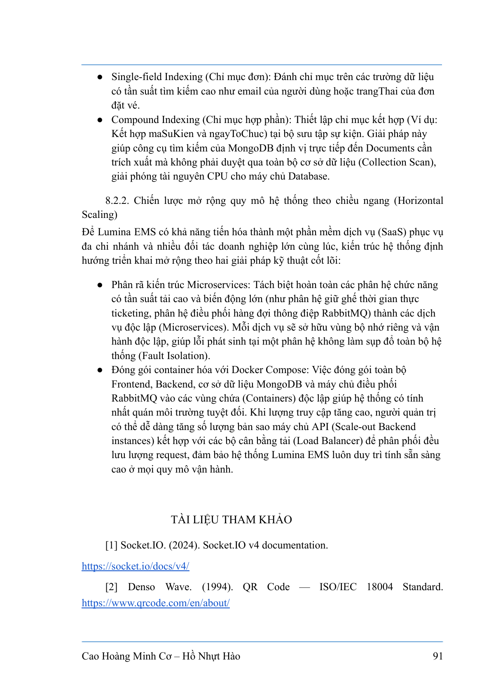

---

### Trang 111:

> [3] 
> RabbitMQ. 
> (2024). 
> RabbitMQ 
> tutorials 
> and 
> API 
> reference. 
> https://www.rabbitmq.com/documentation.html 
> [4] 
> GraphQL 
> Foundation. 
> (2015). 
> GraphQL 
> specification. 
> https://spec.graphql.org/ 
> [5] Apollo GraphQL. (2024). Apollo Server and Client documentation. 
> https://www.apollographql.com/docs/ 
> [6] 
> Google 
> DeepMind. 
> (2023). 
> Gemini 
> AI 
> technical 
> report. 
> https://ai.google.dev/docs 
> [7] NPM. (n.d.). socket.io (Version 4.8.3) [Computer software]. NPM 
> Registry. https://www.npmjs.com/package/socket.io 
> [8] NPM. (n.d.). qrcode (Version 1.5.4) [Computer software]. NPM Registry. 
> https://www.npmjs.com/package/qrcode 
> [9] NPM. (n.d.). amqplib (Version 1.0.3) [Computer software]. NPM Registry. 
> https://www.npmjs.com/package/amqplib 
> [10] NPM. (n.d.). @google/generative-ai (Version 0.24.1) [Computer 
> software]. NPM Registry. https://www.npmjs.com/package/@google/generative-ai 
> [11] Lê, M. T. (2018). Xây dựng website quản lý điều hành khoa. Trường Cao 
> đẳng 
> Công 
> nghệ 
> Thông 
> tin 
> — 
> Đại 
> học 
> Đà 
> Nẵng. 
> https://elib.vku.udn.vn/bitstream/123456789/144/1/20181207151510.pdf 
>  
>  
> [12] Nguyễn, H. T., & Trần, M. C. (2022). Xây dựng hệ thống quản lý và đăng 
> ký sự kiện trực tuyến cho sinh viên. Tạp chí Khoa học và Công nghệ - Đại học Đà 
> Nẵng, 20(4), 45-50.  
> [13] Fatihia, W. M. (2025). Eventhub: A web-based intelligent event 
> management platform to accelerate the digital transformation. Journal of Applied 
> Informatics 
> Research, 
> 1(2), 
> 43-53. 
> https://journal.unesa.ac.id/index.php/jair/article/download/50074/15073/160838 
> 
>  92

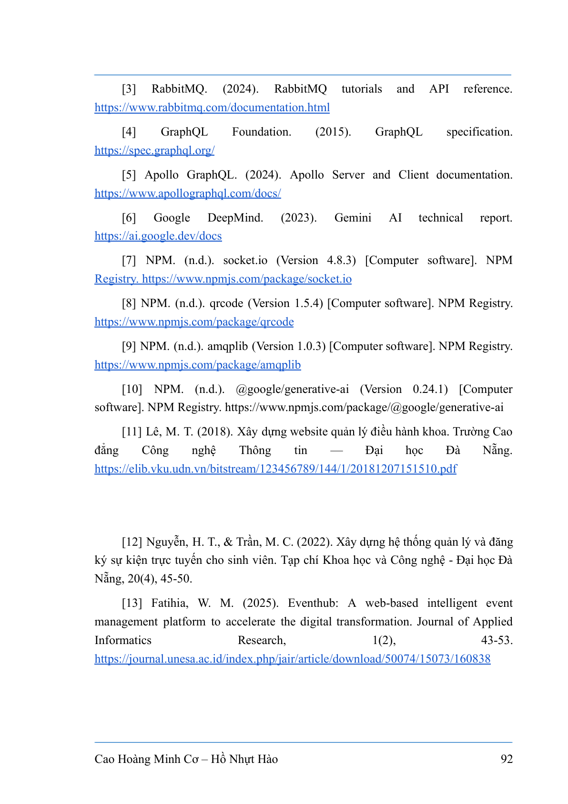

---

## TÀI LIỆU THAM KHẢO
*Danh mục tài liệu tham khảo*

<b>Xem nội dung (1 trang: trang 112 – 112)</b>

### Trang 112:

> [14] Ismail, Syafrinal, Salam, A., & Hajriyanti, R. (2022). Event management 
> system for webinars and survey. International Journal Software Engineering and 
> Computer Science (IJSECS), 2(1), 9-17. https://doi.org/10.35870/ijsecs.v2i1.761 
> [15] Maliu, M., & Marzele, M. (2024). Web-based UTHM event management 
> system. 
> Universiti 
> Tun 
> Hussein 
> Onn 
> Malaysia. 
> https://publisher.uthm.edu.my/periodicals/index.php/aitcs/article/download/16550/6
> 383 
> [16] Waghmare, M., Ekbote, A., Patil, A., & Shirsath, V. (2023). EventMingle 
> management system. Indian Journal of Computer Science, 8(4), 18-27. 
> https://doi.org/10.17010/ijcs/2023/v8/i4/173265 
>  
>  
>  
> 
>  93

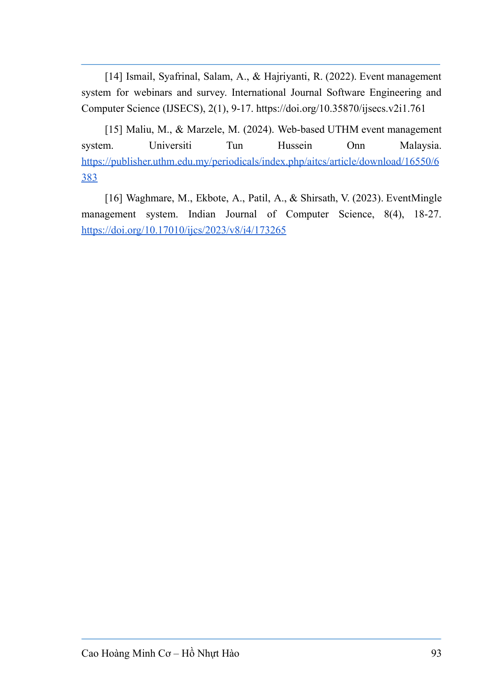

---

> **Bản quyền tài liệu thuộc về:** Sinh viên **Cao Hoàng Minh Cơ & Hồ Nhựt Hào** — Trường Đại học Công nghiệp TP. HCM.  
> **Giáo viên hướng dẫn khoa học:** **TS. Võ Ngọc Tấn Phước** (Bộ môn Hệ thống thông tin).  
> *Nghiêm cấm sao chép, thương mại hóa dưới mọi hình thức.*
