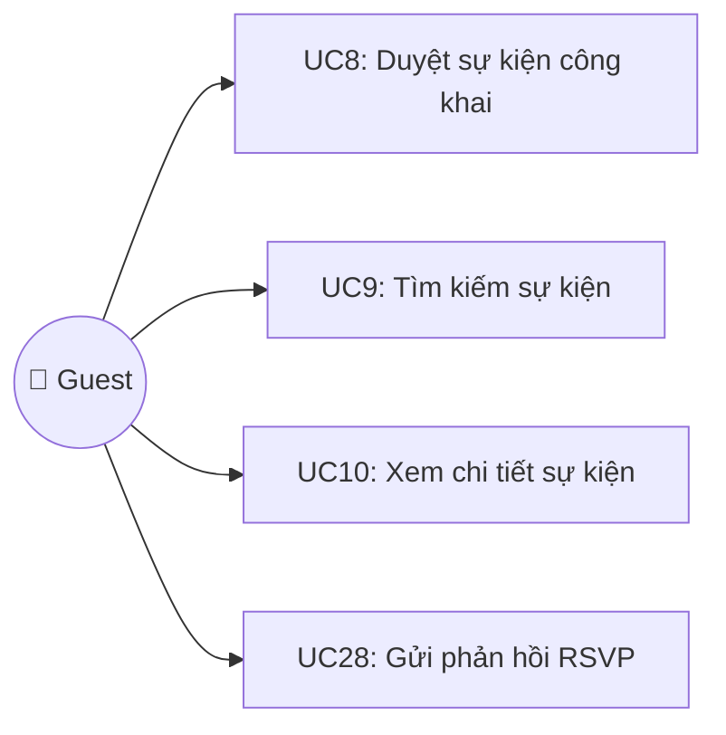
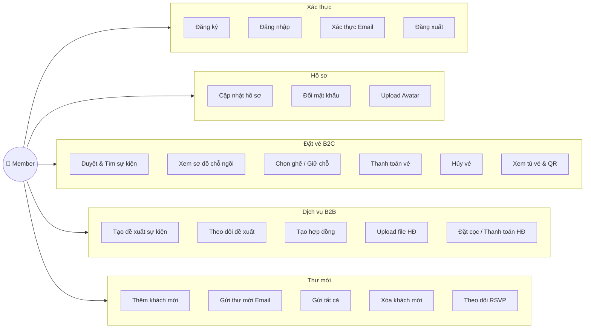
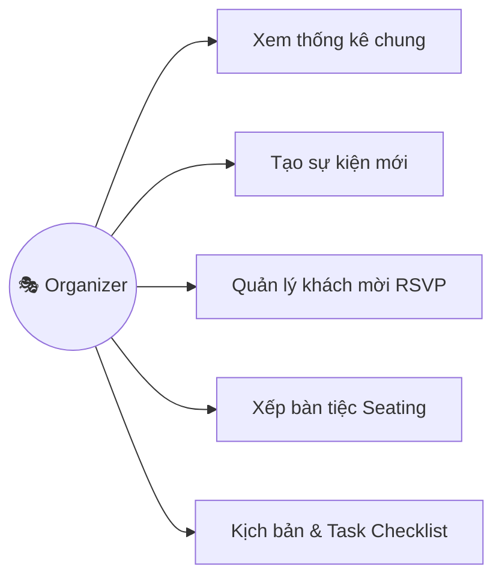
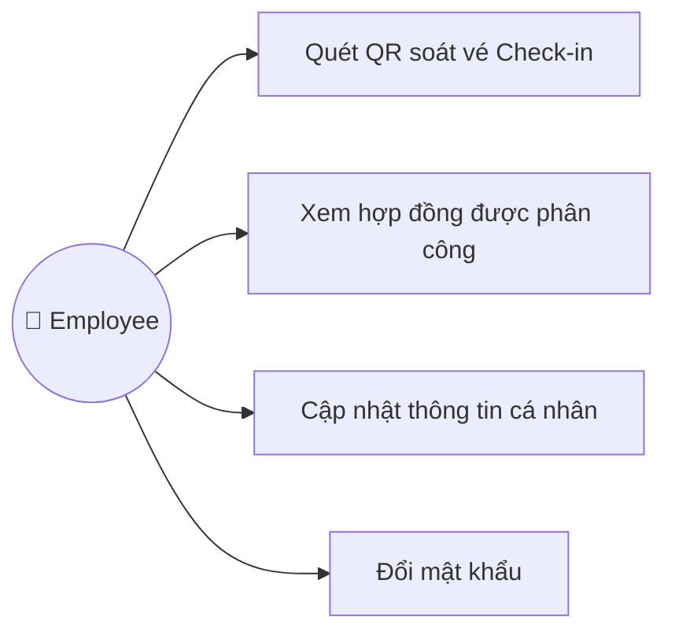
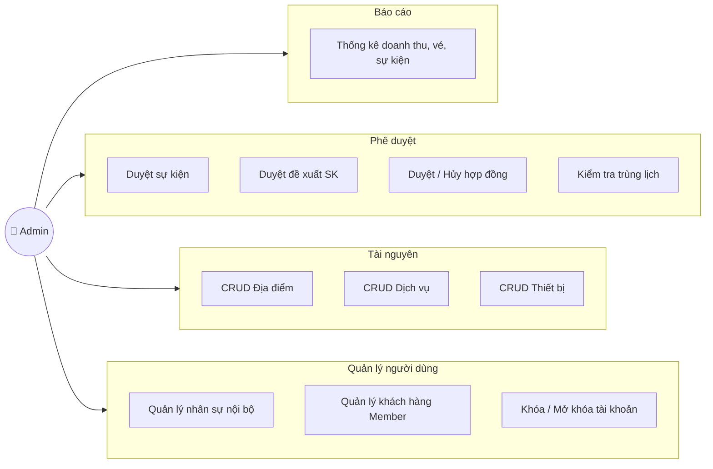
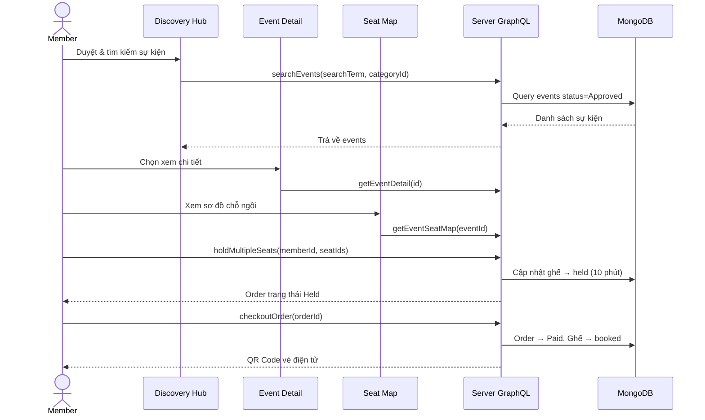
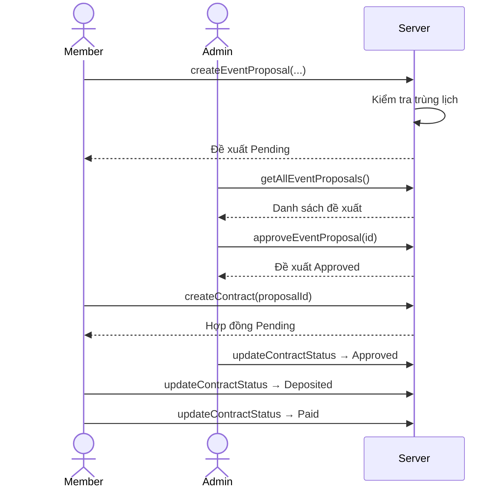
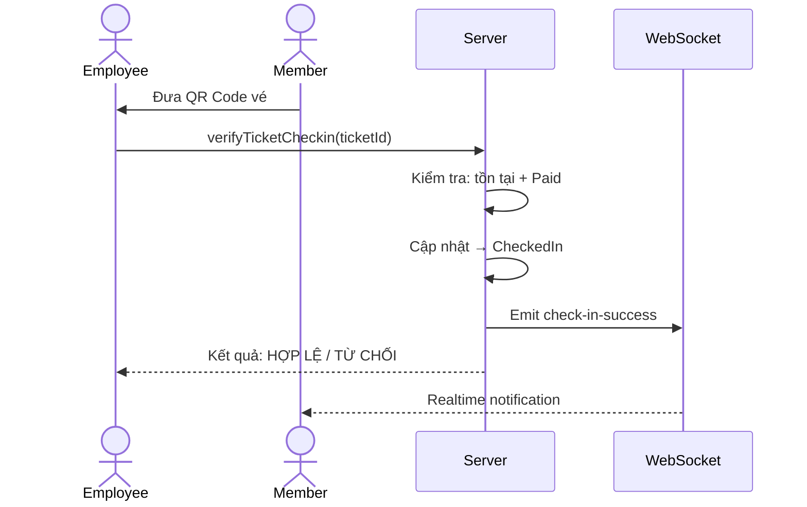

# 🎫 HỆ THỐNG QUẢN LÝ SỰ KIỆN VÀ ĐẶT VÉ (EMS)

## 1. Giới thiệu tổng quan (System Overview)

**Hệ thống Quản lý Sự kiện & Đặt vé (Event Management & Booking Platform - EMS)** là một nền tảng toàn diện (full-stack) được thiết kế chuyên sâu nhằm số hóa và tối ưu hóa quy trình quản lý sự kiện. Hệ thống đáp ứng đồng thời hai mô hình kinh doanh cốt lõi:
- **B2C (Business-to-Consumer):** Cung cấp trải nghiệm mua vé trực tuyến mượt mà cho khách hàng cá nhân. Bao gồm duyệt sự kiện, chọn ghế qua sơ đồ tương tác thực tế (Interactive Seatmap), thanh toán, nhận vé điện tử (QR Code) và quản lý tủ vé cá nhân.
- **B2B (Business-to-Business):** Cung cấp giải pháp cho khách hàng doanh nghiệp hoặc cá nhân có nhu cầu thuê dịch vụ tổ chức sự kiện trọn gói. Bao gồm quy trình tạo đề xuất sự kiện (Proposal), ký kết hợp đồng số, quản lý thanh toán/đặt cọc, đến việc theo dõi tiến độ tổ chức và quản lý danh sách khách mời (RSVP).

**Các tính năng nổi bật của hệ thống:**
1. **Quản lý linh hoạt đa đối tượng:** Phân quyền chặt chẽ với 5 nhóm người dùng (Guest, Member, Organizer, Employee, Admin) với các dashboard chuyên biệt.
2. **Sơ đồ ghế ngồi trực quan:** Tích hợp Seatmap tương tác cho phép chọn/giữ chỗ realtime và khóa ghế để tránh trùng lặp khi đặt vé.
3. **Quản lý hợp đồng & Đề xuất (B2B):** Tự động hóa luồng phê duyệt từ lúc khách hàng gửi yêu cầu đến lúc chốt hợp đồng và tổ chức.
4. **Kiểm soát ra vào thông minh:** Ứng dụng quét mã QR cho phép nhân viên (Employee) check-in nhanh chóng tại sự kiện.
5. **Real-time & Hiệu năng cao:** Sử dụng Socket.IO và RabbitMQ để xử lý luồng dữ liệu thời gian thực (realtime notification, giữ chỗ) và các tác vụ nặng chạy nền.

**Công nghệ sử dụng (Tech Stack):**
- **Frontend:** React.js (Vite), TailwindCSS, UI Components hiện đại.
- **Backend:** Node.js, Express, GraphQL (Apollo Server).
- **Database:** MongoDB (Mongoose) - thiết kế schema phức tạp hỗ trợ nhiều luồng nghiệp vụ.
- **Message Broker & Realtime:** RabbitMQ, Socket.IO.

---

## 2. Các Actor trong hệ thống

| Actor | Mô tả |
|-------|-------|
| **Khách (Guest)** | Người dùng chưa đăng nhập, có thể duyệt sự kiện và RSVP |
| **Member (Khách hàng)** | Người dùng đã đăng ký, mua vé, tạo đề xuất sự kiện, quản lý hợp đồng & thư mời |
| **Organizer (Tổ chức)** | Nhân viên tổ chức sự kiện, quản lý RSVP, sơ đồ chỗ ngồi |
| **Employee (Nhân viên)** | Nhân viên soát vé, quản lý hợp đồng được phân công |
| **Admin (Quản trị)** | Quản trị viên toàn quyền: duyệt sự kiện, hợp đồng, nhân sự, tài nguyên |

---

## 3. Use Case Diagram — Tổng quát hệ thống

```mermaid
flowchart LR
    GUEST(("👤\nGuest"))
    MEMBER(("🧑\nMember"))
    ORGANIZER(("🎭\nOrganizer"))
    EMPLOYEE(("🔧\nEmployee"))
    ADMIN(("👑\nAdmin"))

    subgraph EMS["🎫 HỆ THỐNG QUẢN LÝ SỰ KIỆN - EMS"]
        direction TB

        UC_REG["Đăng ký tài khoản"]
        UC_LOGIN["Đăng nhập"]
        UC_LOGOUT["Đăng xuất"]
        UC_VERIFY["Xác thực Email OTP"]
        UC_PROFILE["Quản lý hồ sơ cá nhân"]

        UC_BROWSE["Duyệt sự kiện"]
        UC_SEARCH["Tìm kiếm sự kiện"]
        UC_DETAIL["Xem chi tiết sự kiện"]
        UC_SEATMAP["Xem sơ đồ chỗ ngồi"]

        UC_HOLD["Chọn ghế & Giữ chỗ"]
        UC_PAY["Thanh toán vé"]
        UC_CANCEL["Hủy vé"]
        UC_MYTICKET["Xem tủ vé & QR Code"]
        UC_RSVP["Gửi phản hồi RSVP"]

        UC_PROPOSAL["Tạo đề xuất sự kiện"]
        UC_TRACK["Theo dõi đề xuất"]
        UC_CONTRACT["Quản lý hợp đồng"]
        UC_DEPOSIT["Đặt cọc / Thanh toán HĐ"]
        UC_INVITE["Quản lý thư mời & RSVP"]

        UC_CREATE_EVT["Tạo sự kiện mới"]
        UC_GUEST_MGR["Quản lý khách mời"]
        UC_SEATING["Xếp bàn tiệc"]
        UC_RUNDOWN["Kịch bản & Task"]

        UC_SCAN["Quét QR soát vé"]
        UC_MY_CONTRACT["Xem HĐ được phân công"]

        UC_STATS["Xem thống kê báo cáo"]
        UC_APPROVE_EVT["Duyệt sự kiện"]
        UC_APPROVE_PROP["Duyệt đề xuất sự kiện"]
        UC_APPROVE_CTR["Duyệt / Hủy hợp đồng"]
        UC_LOC["Quản lý địa điểm"]
        UC_SVC["Quản lý dịch vụ"]
        UC_DEV["Quản lý thiết bị"]
        UC_STAFF["Quản lý nhân sự"]
        UC_MEMBERS["Quản lý khách hàng"]
        UC_LOCK["Khóa / Mở khóa tài khoản"]
    end

    GUEST --> UC_BROWSE
    GUEST --> UC_SEARCH
    GUEST --> UC_DETAIL
    GUEST --> UC_RSVP

    MEMBER --> UC_REG
    MEMBER --> UC_LOGIN
    MEMBER --> UC_LOGOUT
    MEMBER --> UC_VERIFY
    MEMBER --> UC_PROFILE
    MEMBER --> UC_BROWSE
    MEMBER --> UC_SEARCH
    MEMBER --> UC_DETAIL
    MEMBER --> UC_SEATMAP
    MEMBER --> UC_HOLD
    MEMBER --> UC_PAY
    MEMBER --> UC_CANCEL
    MEMBER --> UC_MYTICKET
    MEMBER --> UC_PROPOSAL
    MEMBER --> UC_TRACK
    MEMBER --> UC_CONTRACT
    MEMBER --> UC_DEPOSIT
    MEMBER --> UC_INVITE

    ORGANIZER --> UC_LOGIN
    ORGANIZER --> UC_LOGOUT
    ORGANIZER --> UC_CREATE_EVT
    ORGANIZER --> UC_GUEST_MGR
    ORGANIZER --> UC_SEATING
    ORGANIZER --> UC_RUNDOWN

    EMPLOYEE --> UC_LOGIN
    EMPLOYEE --> UC_LOGOUT
    EMPLOYEE --> UC_PROFILE
    EMPLOYEE --> UC_SCAN
    EMPLOYEE --> UC_MY_CONTRACT

    ADMIN --> UC_LOGIN
    ADMIN --> UC_LOGOUT
    ADMIN --> UC_STATS
    ADMIN --> UC_APPROVE_EVT
    ADMIN --> UC_APPROVE_PROP
    ADMIN --> UC_APPROVE_CTR
    ADMIN --> UC_LOC
    ADMIN --> UC_SVC
    ADMIN --> UC_DEV
    ADMIN --> UC_STAFF
    ADMIN --> UC_MEMBERS
    ADMIN --> UC_LOCK
```



---

## 4. Use Case Diagram — Theo từng Actor

### 4.1. Guest (Khách vãng lai)



### 4.2. Member (Khách hàng đã đăng ký)



### 4.3. Organizer (Người tổ chức)



### 4.4. Employee (Nhân viên)



### 4.5. Admin (Quản trị viên)



---

## 5. Đặc tả Use Case chi tiết

### UC1: Đăng ký tài khoản
| Thuộc tính | Mô tả |
|---|---|
| **Actor** | Guest → Member |
| **Mô tả** | Người dùng tạo tài khoản mới với username, password, email |
| **Tiền điều kiện** | Chưa có tài khoản |
| **Luồng chính** | 1. Nhập thông tin → 2. Xác thực email OTP → 3. Tạo tài khoản thành công |
| **Ngoại lệ** | Username đã tồn tại, Email đã được sử dụng |

### UC2: Đăng nhập
| Thuộc tính | Mô tả |
|---|---|
| **Actor** | Member, Organizer, Employee, Admin |
| **Mô tả** | Xác thực bằng username/password, nhận JWT token |
| **Luồng chính** | 1. Nhập username + password → 2. Hệ thống xác thực → 3. Trả về token + chuyển hướng theo role |
| **Ngoại lệ** | Sai tài khoản hoặc mật khẩu |

### UC8: Duyệt sự kiện công khai
| Thuộc tính | Mô tả |
|---|---|
| **Actor** | Guest, Member |
| **Mô tả** | Xem danh sách sự kiện đã được duyệt trên Discovery Hub |
| **Luồng chính** | 1. Truy cập trang chủ → 2. Xem danh sách sự kiện theo danh mục → 3. Lọc / tìm kiếm |

### UC12: Chọn ghế / Giữ chỗ (Hold Seat)
| Thuộc tính | Mô tả |
|---|---|
| **Actor** | Member |
| **Tiền điều kiện** | Đã đăng nhập, sự kiện có ticketing |
| **Luồng chính** | 1. Chọn sự kiện → 2. Xem sơ đồ zone/ghế → 3. Chọn 1-10 ghế → 4. Hệ thống giữ chỗ 10 phút |
| **Ngoại lệ** | Ghế không khả dụng, vượt quá 10 ghế |
| **Hậu điều kiện** | Order trạng thái "Held", ghế chuyển "held" |

### UC13: Thanh toán vé (Checkout)
| Thuộc tính | Mô tả |
|---|---|
| **Actor** | Member |
| **Tiền điều kiện** | Có order trạng thái "Held" |
| **Luồng chính** | 1. Xem tủ vé → 2. Nhấn "Thanh toán" → 3. Hệ thống tạo QR Code → 4. Ghế chuyển "booked" |
| **Hậu điều kiện** | Order "Paid", QR Code được tạo, realtime notification |

### UC16: Tạo đề xuất sự kiện
| Thuộc tính | Mô tả |
|---|---|
| **Actor** | Member |
| **Mô tả** | Gửi yêu cầu tổ chức sự kiện (B2B) cho Admin duyệt |
| **Luồng chính** | 1. Nhập: tên, mô tả, loại, ngày, địa điểm, ngân sách → 2. Kiểm tra trùng lịch → 3. Gửi cho Admin |
| **Ngoại lệ** | Trùng lịch với sự kiện đã duyệt |

### UC19: Tạo hợp đồng
| Thuộc tính | Mô tả |
|---|---|
| **Actor** | Member |
| **Tiền điều kiện** | Có đề xuất đã được duyệt (tùy chọn) |
| **Luồng chính** | 1. Chọn dự án liên kết → 2. Nhập chi tiết + giá trị → 3. Upload file PDF/DOC → 4. Tạo hợp đồng |

### UC33: Quét QR soát vé
| Thuộc tính | Mô tả |
|---|---|
| **Actor** | Employee |
| **Mô tả** | Xác thực vé bằng mã QR hoặc Ticket ID tại cổng sự kiện |
| **Luồng chính** | 1. Nhập mã vé → 2. Hệ thống kiểm tra trạng thái → 3. Check-in thành công |
| **Ngoại lệ** | Vé không tồn tại, đã sử dụng, chưa thanh toán |

### UC36: Duyệt sự kiện
| Thuộc tính | Mô tả |
|---|---|
| **Actor** | Admin |
| **Mô tả** | Phê duyệt sự kiện do Organizer tạo |
| **Luồng chính** | 1. Xem danh sách sự kiện → 2. Kiểm tra trùng lịch tự động → 3. Duyệt / Từ chối |
| **Ngoại lệ** | Trùng lịch → không cho duyệt |

### UC37: Duyệt đề xuất sự kiện
| Thuộc tính | Mô tả |
|---|---|
| **Actor** | Admin |
| **Luồng chính** | 1. Xem danh sách đề xuất từ Member → 2. Duyệt hoặc Từ chối kèm ghi chú → 3. Realtime notification |

---

## 6. Luồng nghiệp vụ chính

### 6.1. Luồng mua vé B2C



### 6.2. Luồng đề xuất sự kiện B2B



### 6.3. Luồng Check-in tại sự kiện



---

## 7. Ma trận Actor — Use Case

| Use Case | Guest | Member | Organizer | Employee | Admin |
|----------|:-----:|:------:|:---------:|:--------:|:-----:|
| Đăng ký tài khoản | | ✅ | | | |
| Đăng nhập | | ✅ | ✅ | ✅ | ✅ |
| Xác thực Email OTP | | ✅ | | | |
| Cập nhật hồ sơ | | ✅ | | ✅ | |
| Đổi mật khẩu | | ✅ | | ✅ | |
| Upload Avatar | | ✅ | | | |
| Duyệt sự kiện công khai | ✅ | ✅ | | | |
| Tìm kiếm sự kiện | ✅ | ✅ | | | |
| Xem chi tiết sự kiện | ✅ | ✅ | | | |
| Xem sơ đồ chỗ ngồi | | ✅ | | | |
| Chọn ghế / Giữ chỗ | | ✅ | | | |
| Thanh toán vé | | ✅ | | | |
| Hủy vé | | ✅ | | | |
| Xem tủ vé & QR | | ✅ | | | |
| Tạo đề xuất sự kiện | | ✅ | | | |
| Tạo hợp đồng | | ✅ | | | |
| Đặt cọc / Thanh toán HĐ | | ✅ | | | |
| Quản lý thư mời | | ✅ | | | |
| Gửi phản hồi RSVP | ✅ | | | | |
| Tạo sự kiện | | | ✅ | | |
| Quản lý khách mời | | | ✅ | | |
| Xếp bàn tiệc | | | ✅ | | |
| Kịch bản & Task | | | ✅ | | |
| Quét QR soát vé | | | | ✅ | |
| Xem HĐ cá nhân | | | | ✅ | |
| Thống kê báo cáo | | | | | ✅ |
| Duyệt sự kiện | | | | | ✅ |
| Duyệt đề xuất SK | | | | | ✅ |
| Duyệt hợp đồng | | | | | ✅ |
| CRUD Địa điểm | | | | | ✅ |
| CRUD Dịch vụ | | | | | ✅ |
| CRUD Thiết bị | | | | | ✅ |
| Quản lý nhân sự | | | | | ✅ |
| Quản lý khách hàng | | | | | ✅ |
| Khóa/Mở khóa TK | | | | | ✅ |

---

## 8. Cấu trúc dự án

```
event-booking-backend/
├── src/
│   ├── config/          # Cấu hình DB, env
│   ├── models/          # Mongoose schemas (12 models)
│   │   ├── User.js, Event.js, Order.js
│   │   ├── Contract.js, EventProposal.js
│   │   ├── Floorplan.js, Rsvp.js
│   │   ├── Category.js, TicketTier.js
│   │   ├── Location.js, Service.js, Device.js
│   ├── services/        # Business logic
│   │   ├── email.service.js   # Gửi email xác thực
│   │   ├── qr.service.js      # QR Code generation
│   │   ├── rabbitmq.js        # Message queue
│   │   └── ticket.worker.js   # Async ticket processing
│   └── schema.js        # GraphQL schema & resolvers

event-booking-frontend/
├── src/
│   ├── features/
│   │   ├── auth/        # AuthModal (Login/Register)
│   │   ├── discovery/   # DiscoveryHub, InfoModal
│   │   ├── ticketing/   # EventDetail, SeatMapUI
│   │   └── dashboard/   # GenericCRUD component
│   ├── pages/
│   │   ├── AdminPage.jsx
│   │   ├── MemberPage.jsx
│   │   ├── OrganizerPage.jsx
│   │   ├── EmployeePage.jsx
│   │   └── SettingsPage.jsx
│   └── components/      # Sidebar, Topbar
```

---

## 9. Hướng dẫn chạy

```bash
# Backend
cd event-booking-backend
npm install
npm run dev    # Port 4000

# Frontend
cd event-booking-frontend
npm install
npm run dev    # Port 5173
```

---

> **Tác giả:** Sinh viên Năm 4 — Cuối kỳ Thầy Phước
# Baocaocuoiki-GVNguyenTanPhuoc

